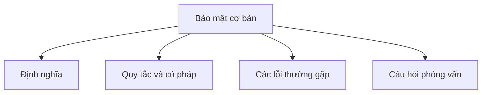

# 36 - Bảo mật cơ bản (Basic Security)

Chủ đề này bám sát đề cương chính trong [outline.md](../outline.md). Mục tiêu là hiểu sâu sắc từng khái niệm để có thể giải thích, nhận biết trong mã nguồn và trả lời các câu hỏi phỏng vấn.

## Thứ tự học tập (Study Order)

- [Các khái niệm Lập trình an toàn cơ bản (Basic Secure Coding Concepts)](theory/01-basic-secure-coding-concepts.md)
- [Các khái niệm Tránh giải tuần tự hóa không an toàn (Avoid Insecure Deserialization Concepts)](theory/02-avoid-insecure-deserialization-concepts.md)
- [Thuật ngữ chính (Key Terms)](terms/01-key-terms.md)

## Danh sách kiểm tra đề cương (Outline Checklist)

- Lập trình an toàn cơ bản (Basic secure coding)
- Hàm băm (Hashing)
- MessageDigest
- SHA-256
- Base64
- Mã hóa/giải mã cơ bản (Basic encryption/decryption)
- KeyStore
- SSL/TLS cơ bản (Basic SSL/TLS)
- Kiểm thực dữ liệu đầu vào (Input validation)
- Tránh SQL Injection (Avoid SQL Injection)
- Tránh giải tuần tự hóa không an toàn (Avoid insecure deserialization)

## Thẻ Anki (Anki Cards)

- [Basic](anki/basic.tsv)
- [Basic Extra](anki/basic-extra.tsv)
- [Cloze](anki/cloze.tsv)
- [Code Question](anki/code-question.tsv)

## Tự kiểm tra (Self-Check)

Trước khi chuyển sang chủ đề tiếp theo, hãy đảm bảo bạn có thể trả lời các câu hỏi sau:
1. Tại sao SHA-256 là hàm một chiều, và đặc tính nào (tính kháng đụng độ (collision resistance)) làm cho hàm băm mã hóa phù hợp cho việc lưu trữ mật khẩu (password storage) và xác thực tính toàn vẹn dữ liệu (data integrity verification)?
   &rarr; Xem [Tại sao Hàm băm mã hóa là một chiều và Kháng đụng độ](theory/01-basic-secure-coding-concepts.md#why-cryptographic-hashing-is-one-way-and-collision-resistant)
2. Tại sao mã hóa Base64 KHÔNG phải là mã hóa bảo mật, và rủi ro bảo mật nào phát sinh khi các lập trình viên nhầm lẫn giữa mã hóa định dạng (encoding) với tính bí mật (confidentiality)?
   &rarr; Xem [Tại sao Base64 là Mã hóa định dạng chứ không phải Mã hóa bảo mật](theory/01-basic-secure-coding-concepts.md#why-base64-is-encoding-not-encryption)
3. Tại sao phải sử dụng `SecureRandom` thay vì `Random` để tạo khóa mã hóa và IV, và làm thế nào một seed PRNG có thể đoán trước được lại phá hỏng tính bảo mật của mã hóa?
   &rarr; Xem [Tại sao SecureRandom được yêu cầu cho các giá trị mã hóa](theory/01-basic-secure-coding-concepts.md#why-securerandom-is-required-for-cryptographic-values)
4. Tại sao việc giải tuần tự hóa đối tượng mặc định của Java lại thực thi các hàm khởi tạo và mã nguồn của lớp tùy ý, và làm thế nào `ObjectInputFilter` giảm thiểu rủi ro Thực thi mã từ xa (Remote Code Execution - RCE)?
   &rarr; Xem [Tại sao Giải tuần tự hóa không an toàn cho phép Thực thi mã từ xa](theory/02-avoid-insecure-deserialization-concepts.md#why-insecure-deserialization-enables-remote-code-execution)
5. Tại sao dữ liệu nhạy cảm (như mật khẩu) nên được lưu trữ trong `char[]` thay vì `String`, và cơ chế bộ nhớ JVM nào làm cho việc lưu giữ `String` trở thành một rủi ro bảo mật?
   &rarr; Xem [Tại sao Mật khẩu không được lưu trữ trong String](theory/01-basic-secure-coding-concepts.md#why-passwords-must-not-be-stored-in-strings)

## Liên kết tham khảo (Reference Links)

- https://docs.oracle.com/javase/tutorial/security/
- https://docs.oracle.com/en/java/javase/21/security/
