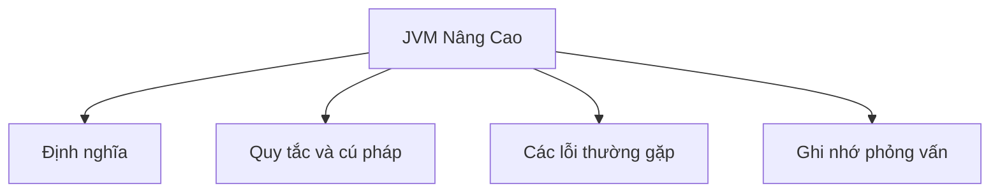

# 37 - JVM Nâng Cao (Advanced JVM)

Chủ đề này bám sát đề cương chính trong [outline.md](../outline.md). Mục tiêu là hiểu sâu sắc từng khái niệm để có thể giải thích, nhận diện trong mã nguồn và trả lời các câu hỏi phỏng vấn.

## Thứ Tự Học Tập (Study Order)

- [Các Khái Niệm Kiến Trúc JVM (JVM Architecture Concepts)](theory/01-jvm-architecture-concepts.md)
- [Các Khái Niệm Trình Thực Thi (Execution Engine Concepts)](theory/02-execution-engine-concepts.md)
- [Các Khái Niệm Vùng Sống Sót (Survivor Concepts)](theory/03-survivor-concepts.md)
- [Các Khái Niệm Bộ Dọn Rác Shenandoah (Shenandoah GC Concepts)](theory/04-shenandoah-concepts.md)
- [Các Khái Niệm Tham Số -XX (XX Concepts)](theory/05-xx-concepts.md)
- [Các Thuật Ngữ Cốt Lõi (Key Terms)](terms/01-key-terms.md)

## Danh Sách Đề Cương (Outline Checklist)

- Kiến trúc JVM (JVM Architecture)
- Phân hệ tải lớp (Class Loader Subsystem)
- Các vùng dữ liệu thời gian chạy (Runtime Data Areas):
- Bộ nhớ Heap (Heap)
- Bộ nhớ Stack (Stack)
- Vùng phương thức (Method Area) / Metaspace
- Thanh ghi PC (PC Register)
- Stack phương thức thuần bản địa (Native Method Stack)
- Trình thực thi (Execution Engine)
- Bộ thông dịch (Interpreter)
- Trình biên dịch JIT (JIT Compiler)
- Bộ dọn rác (Garbage Collector)
- Giao diện phương thức thuần bản địa (Native Interface)
- Các phân thế bộ nhớ Heap (Heap Generation):
- Phân thế trẻ (Young Generation)
- Vùng Eden (Eden)
- Vùng Sống Sót (Survivor)
- Phân thế già (Old Generation)
- Các thuật toán dọn rác (GC Algorithms):
- Bộ dọn rác tuần tự (Serial GC)
- Bộ dọn rác song song (Parallel GC)
- CMS cũ (old CMS)
- Bộ dọn rác G1 (G1 GC)
- Bộ dọn rác ZGC (ZGC)
- Bộ dọn rác Shenandoah
- Trạng thái dừng hoàn toàn (Stop-the-world)
- Dọn rác phân thế trẻ (Minor GC)
- Dọn rác phân thế già (Major GC)
- Dọn rác toàn phần (Full GC)
- Tối ưu hóa JVM cơ bản (Basic JVM Tuning):
- `-Xms`
- `-Xmx`
- `-XX`
- Giám sát hiệu năng cơ bản (Basic Profiling)
- Kết xuất bộ nhớ (Memory Dump)
- Kết xuất luồng (Thread Dump)

## Tự Kiểm Tra (Self-Check)

Trước khi chuyển sang chủ đề tiếp theo, hãy đảm bảo bạn có thể trả lời các câu hỏi sau:
1. Tại sao phân hệ tải lớp JVM lại chia quá trình tải thành ba giai đoạn: Tải (Loading), Liên kết (Linking), và Khởi tạo (Initializing), và việc xác thực lớp (Class Verification) đóng vai trò bảo mật gì?
   &rarr; Xem [Tại Sao Quá Trình Tải Lớp Có Ba Giai Đoạn Riêng Biệt](theory/01-jvm-architecture-concepts.md#why-class-loading-has-three-distinct-phases)
2. Tại sao trình thực thi JVM lại kết hợp giữa biên dịch JIT (JIT Compilation) (với các trình biên dịch C1/C2 (C1/C2 compilers)) và thông dịch (Interpretation), và việc phân tích điểm nóng (Hot-spot Profiling) xác định các ngưỡng biên dịch (Compile Thresholds) như thế nào?
   &rarr; Xem [Tại Sao Biên Dịch JIT Và Thông Dịch Được Kết Hợp](theory/02-execution-engine-concepts.md#why-jit-compilation-and-interpretation-are-combined)
3. Tại sao mô hình dọn rác phân thế (Generational Garbage Collection) lại sử dụng các vùng sống sót bên cạnh Eden, và tiến trình lão hóa đối tượng (Object Aging) giúp ngăn ngừa phân mảnh bộ nhớ Heap (Heap Fragmentation) như thế nào?
   &rarr; Xem [Tại Sao Các Vùng Sống Sót Ngăn Ngừa Phân Mảnh Bộ Nhớ Heap](theory/03-survivor-concepts.md#why-survivor-spaces-prevent-heap-fragmentation)
4. Tại sao bộ dọn rác Shenandoah đạt được thời gian tạm dừng (Pause Times) cực thấp so với G1, và con trỏ Brooks (Brooks Pointers) (hoặc rào cản tải (Load Barriers)) cho phép dồn nén đồng thời (Concurrent Compaction) như thế nào?
   &rarr; Xem [Tại Sao Bộ Dọn Rác Shenandoah Đạt Được Thời Gian Tạm Dừng Cực Thấp](theory/04-shenandoah-concepts.md#why-shenandoah-gc-achieves-ultra-low-pause-times)
5. Tại sao các tham số `-XX` của JVM được phân loại thành các tùy chọn tiêu chuẩn, không tiêu chuẩn (`-X`), và dành cho nhà phát triển/không ổn định (`-XX`), và các tham số tối ưu hóa bộ nhớ Heap (Heap Tuning Flags) ảnh hưởng đến hành vi dọn rác như thế nào?
   &rarr; Xem [Tại Sao Tồn Tại Các Phân Loại Tham Số JVM](theory/05-xx-concepts.md#why-jvm-flag-classifications-exist)

## Thẻ Anki (Anki Cards)

- [Cơ Bản](anki/basic.tsv)
- [Cơ Bản Mở Rộng](anki/basic-extra.tsv)
- [Điền Khuyết (Cloze)](anki/cloze.tsv)
- [Câu Hỏi Code](anki/code-question.tsv)

## Tổng Quan Sơ Đồ Mermaid (Mermaid Overview)

## Đường Dẫn Tham Khảo (Reference Links)

- https://docs.oracle.com/javase/specs/jvms/se21/html/
- https://docs.oracle.com/en/java/javase/21/gctuning/