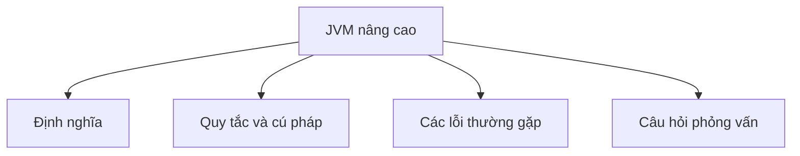

# 37 - JVM nâng cao (Advanced JVM)

Chủ đề này bám sát đề cương chính trong [outline.md](../outline.md). Mục tiêu là hiểu sâu sắc từng khái niệm để có thể giải thích, nhận biết trong mã nguồn và trả lời các câu hỏi phỏng vấn.

## Thứ tự học tập (Study Order)

- [Các khái niệm Kiến trúc JVM (Jvm Architecture Concepts)](theory/01-jvm-architecture-concepts.md)
- [Các khái niệm Động cơ thực thi (Execution Engine Concepts)](theory/02-execution-engine-concepts.md)
- [Các khái niệm Vùng Survivor (Survivor Concepts)](theory/03-survivor-concepts.md)
- [Các khái niệm Shenandoah (Shenandoah Concepts)](theory/04-shenandoah-concepts.md)
- [Các khái niệm Tham số XX (Xx Concepts)](theory/05-xx-concepts.md)
- [Thuật ngữ chính (Key Terms)](terms/01-key-terms.md)

## Danh sách kiểm tra đề cương (Outline Checklist)

- Kiến trúc JVM (JVM architecture)
- Phân hệ nạp lớp (Class Loader Subsystem)
- Vùng dữ liệu thời gian chạy (Runtime Data Areas):
  - Heap
  - Stack
  - Vùng phương thức (Method Area) / Metaspace
  - Thanh ghi PC (PC Register)
  - Stack phương thức bản địa (Native Method Stack)
- Động cơ thực thi (Execution Engine):
  - Trình thông dịch (Interpreter)
  - Trình biên dịch JIT (JIT Compiler)
  - Bộ thu gom rác (Garbage Collector)
- Giao diện bản địa (Native Interface)
- Phân thế hệ của Heap (Heap generation):
  - Thế hệ trẻ (Young Generation)
  - Vùng Eden (Eden)
  - Vùng Survivor (Survivor)
  - Thế hệ già (Old Generation)
- Các thuật toán GC (GC algorithms):
  - Serial GC
  - Parallel GC
  - CMS cũ (old CMS)
  - G1 GC
  - ZGC
  - Shenandoah
- Dừng toàn bộ ứng dụng (Stop-the-world)
- Minor GC
- Major GC
- Full GC
- Tinh chỉnh JVM cơ bản (Basic JVM tuning):
  - -Xms
  - -Xmx
  - -XX
- Phân tích hiệu năng cơ bản (Basic profiling)
- Sao lưu bộ nhớ (Memory dump)
- Sao lưu luồng (Thread dump)

## Tự kiểm tra (Self-Check)

Trước khi chuyển sang chủ đề tiếp theo, hãy đảm bảo bạn có thể trả lời các câu hỏi sau:
1. Tại sao phân hệ nạp lớp (class loading subsystem) của JVM chia việc nạp thành ba giai đoạn (Nạp (Loading), Liên kết (Linking), và Khởi tạo (Initializing)), và xác thực lớp (class verification) đóng vai trò gì trong bảo mật?
   &rarr; Xem [Tại sao Quá trình nạp lớp có ba giai đoạn riêng biệt](theory/01-jvm-architecture-concepts.md#why-class-loading-has-three-distinct-phases)
2. Tại sao Động cơ thực thi (Execution Engine) của JVM kết hợp giữa Biên dịch JIT (JIT Compilation) (với các trình biên dịch C1/C2) và Thông dịch (Interpretation), và cách phân tích điểm nóng (hot-spot profiling) xác định các ngưỡng biên dịch (compile thresholds) như thế nào?
   &rarr; Xem [Tại sao Biên dịch JIT và Thông dịch được kết hợp](theory/02-execution-engine-concepts.md#why-jit-compilation-and-interpretation-are-combined)
3. Tại sao mô hình Thu gom rác phân thế hệ (Generational Garbage Collection) sử dụng các vùng Survivor (S0/S1) bên cạnh Eden, và việc tính tuổi đối tượng ngăn ngừa phân mảnh bộ nhớ heap (heap fragmentation) như thế nào?
   &rarr; Xem [Tại sao các vùng Survivor ngăn ngừa phân mảnh bộ nhớ Heap](theory/03-survivor-concepts.md#why-survivor-spaces-prevent-heap-fragmentation)
4. Tại sao Shenandoah GC đạt được thời gian tạm dừng cực thấp so với G1, và cách Brooks Pointer (hoặc rào cản tải - load barrier) cho phép nén bộ nhớ đồng thời (compaction concurrent) hoạt động như thế nào?
   &rarr; Xem [Tại sao Shenandoah GC đạt được thời gian tạm dừng cực thấp](theory/04-shenandoah-concepts.md#why-shenandoah-gc-achieves-ultra-low-pause-times)
5. Tại sao các cờ JVM `-XX` được phân loại thành các tùy chọn tiêu chuẩn, phi tiêu chuẩn (`-X`), và tùy chọn dành cho nhà phát triển/không ổn định (`-XX`), và các cờ tinh chỉnh heap ảnh hưởng đến hành vi GC như thế nào?
   &rarr; Xem [Tại sao việc phân loại cờ JVM tồn tại](theory/05-xx-concepts.md#why-jvm-flag-classifications-exist)

## Thẻ Anki (Anki Cards)

- [Basic](anki/basic.tsv)
- [Basic Extra](anki/basic-extra.tsv)
- [Cloze](anki/cloze.tsv)
- [Code Question](anki/code-question.tsv)

## Sơ đồ tổng quan (Mermaid Overview)

## Liên kết tham khảo (Reference Links)

- https://docs.oracle.com/javase/specs/jvms/se21/html/
- https://docs.oracle.com/en/java/javase/21/gctuning/
