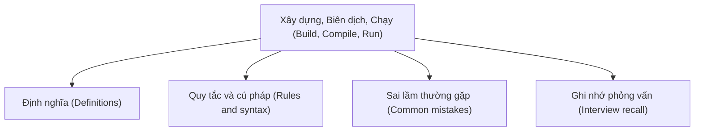

# 38 - Xây dựng, Biên dịch, Chạy (Build, Compile, Run)

Chủ đề này tuân theo đề cương chính trong [outline.md](../outline.md). Mục tiêu là hiểu sâu từng khái niệm để có thể giải thích, nhận biết trong mã nguồn và trả lời các câu hỏi phỏng vấn.

## Thứ Tự Học Tập (Study Order)

- [Khái niệm Javac (Javac Concepts)](theory/01-javac-concepts.md)
- [Khái niệm Cấu trúc Dự án Chuẩn (Standard Project Structure Concepts)](theory/02-standard-project-structure-concepts.md)
- [Thuật ngữ Then chốt (Key Terms)](terms/01-key-terms.md)

## Danh Sách Đề Cương (Outline Checklist)

- javac
- java
- jar
- Tạo tệp JAR (Create JAR file)
- Tệp JAR có thể thực thi (Executable JAR)
- Đường dẫn lớp (Classpath)
- Tệp Manifest (Manifest file)
- Maven cơ bản (Basic Maven)
- Gradle cơ bản (Basic Gradle)
- Quản lý phụ thuộc (Dependency management)
- Cấu trúc dự án chuẩn (Standard project structure)
- Kiểm thử đơn vị cơ bản với JUnit (Basic unit test with JUnit)

## Thẻ Anki (Anki Cards)

- [Cơ bản (Basic)](anki/basic.tsv)
- [Cơ bản Mở rộng (Basic Extra)](anki/basic-extra.tsv)
- [Điền vào chỗ trống (Cloze)](anki/cloze.tsv)
- [Câu hỏi Code (Code Question)](anki/code-question.tsv)

## Sơ Đồ Tổng Quan (Mermaid Overview)

## Tự Kiểm Tra (Self-Check)

Trả lời các câu hỏi sau sau khi nghiên cứu lý thuyết để kiểm tra mức độ hiểu sâu của bạn:

1. **Tại sao chúng ta cần các công cụ tự động hóa bản dựng (build automation tools) như Maven hoặc Gradle** thay vì sử dụng trực tiếp `javac` và `java` cho các dự án quy mô lớn?
2. **Cách thức phân giải đường dẫn lớp (Classpath resolution) hoạt động như thế nào trong thời gian chạy**, và sự khác biệt kỹ thuật giữa `NoClassDefFoundError` và `ClassNotFoundException` là gì?
3. **Mục đích của tệp Manifest (`MANIFEST.MF`) trong một tệp JAR là gì**, và cách nó cấu hình JVM để giúp một tệp JAR có thể thực thi được?
4. **Tại sao việc đặt các tệp tài nguyên ứng dụng (production resource files)** trong `src/main/java/` thay vì `src/main/resources/` dẫn đến các lỗi tìm kiếm trong thời gian chạy (runtime lookup errors)?
5. **Quản lý phụ thuộc (Dependency management) xử lý các phụ thuộc bắc cầu (transitive dependencies) như thế nào**, và cơ chế nào được sử dụng để giải quyết xung đột phiên bản ("Jar Hell")?
6. **Tại sao việc tuân thủ thứ tự đối số `assertEquals(expected, actual)`** trong JUnit lại quan trọng, và hậu quả của việc đảo ngược chúng là gì?

## Liên Kết Tham Khảo (Reference Links)

- https://docs.oracle.com/en/java/javase/21/docs/specs/man/javac.html
- https://docs.oracle.com/en/java/javase/21/docs/specs/man/java.html
