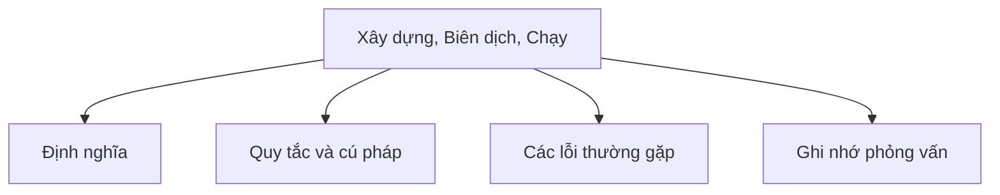

# 38 - Xây Dựng, Biên Dịch, Chạy (Build, Compile, Run)

Chủ đề này bám sát đề cương chính trong [outline.md](../outline.md). Mục tiêu là hiểu sâu từng khái niệm để có thể giải thích, nhận diện trong mã nguồn và trả lời các câu hỏi phỏng vấn.

## Thứ Tự Học Tập (Study Order)

- [Khái Niệm Javac](theory/01-javac-concepts.md)
- [Khái Niệm Cấu Trúc Dự Án Tiêu Chuẩn](theory/02-standard-project-structure-concepts.md)
- [Thuật Ngữ Chính](terms/01-key-terms.md)

## Checklist Đề Cương (Outline Checklist)

- javac
- java
- jar
- Tạo tệp JAR
- Tệp JAR có thể thực thi (Executable JAR)
- Classpath (Đường dẫn lớp)
- Tệp Manifest (MANIFEST.MF)
- Maven cơ bản
- Gradle cơ bản
- Quản lý phụ thuộc (Dependency management)
- Cấu trúc dự án tiêu chuẩn
- Kiểm thử đơn vị cơ bản với JUnit

## Thẻ Anki (Anki Cards)

- [Cơ Bản (Basic)](anki/basic.tsv)
- [Cơ Bản Mở Rộng (Basic Extra)](anki/basic-extra.tsv)
- [Điền Khuyết (Cloze)](anki/cloze.tsv)
- [Câu Hỏi Code (Code Question)](anki/code-question.tsv)

## Tổng Quan Sơ Đồ Mermaid (Mermaid Overview)

## Tự Kiểm Tra (Self-Check)

Hãy trả lời các câu hỏi sau khi nghiên cứu lý thuyết để xác minh độ sâu hiểu biết của bạn:

1. **Tại sao chúng ta cần các công cụ tự động hóa xây dựng (build automation tool) như Maven hoặc Gradle** thay vì sử dụng trực tiếp `javac` và `java` cho các dự án quy mô lớn?
2. **Cơ chế phân giải Classpath hoạt động như thế nào tại thời điểm chạy**, và sự khác biệt về mặt kỹ thuật giữa `NoClassDefFoundError` và `ClassNotFoundException` là gì?
3. **Mục đích của tệp Manifest (`MANIFEST.MF`) trong một tệp JAR là gì**, và nó cấu hình JVM thế nào để giúp tệp JAR có thể thực thi được?
4. **Tại sao việc đặt các tệp tài nguyên (resource file)** trong `src/main/java/` thay vì `src/main/resources/` lại dẫn đến các lỗi tìm kiếm tại thời điểm chạy?
5. **Cơ chế quản lý phụ thuộc xử lý các phụ thuộc bắc cầu (transitive dependency) như thế nào**, và cơ chế nào được sử dụng để phân giải các xung đột phiên bản ("Jar Hell")?
6. **Tại sao việc tuân thủ thứ tự đối số `assertEquals(expected, actual)` lại quan trọng** trong JUnit, và hậu quả của việc đảo ngược chúng là gì?

## Liên Kết Tham Khảo (Reference Links)

- https://docs.oracle.com/en/java/javase/21/docs/specs/man/javac.html
- https://docs.oracle.com/en/java/javase/21/docs/specs/man/java.html
