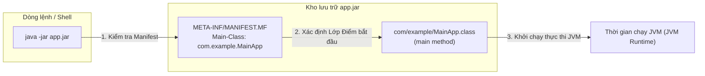
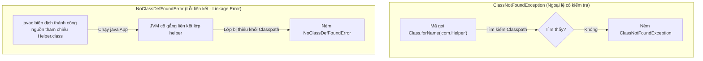
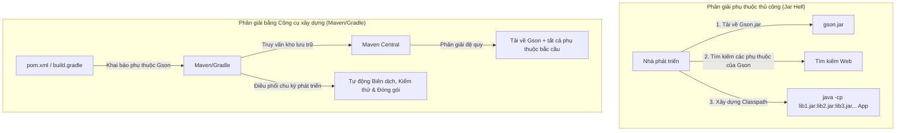

# Xây dựng, Biên dịch, Chạy - Phần 1 (Build, Compile, Run - Part 1)

## Mục Tiêu Học Tập (Learning Goal)

Tài liệu này trình bày một phần trọng tâm của **Xây dựng, Biên dịch, Chạy (Build, Compile, Run)**. Hãy nghiên cứu từng khái niệm như một quy tắc Java thực tế, không chỉ là các từ vựng rời rạc.

## Khái Quát Nội Dung (Outline Coverage)

| Khái niệm (Concept) | Điều cần biết (What to know) |
| --- | --- |
| `javac` | Công cụ Trình biên dịch Java (Java Compiler) dịch mã nguồn (`.java`) thành mã bytecode của JVM (`.class`). |
| `java` | Công cụ Trình khởi chạy ứng dụng Java (Java Application Launcher) khởi chạy JVM và chạy phương thức `main` của lớp. |
| `jar` | Định dạng Kho lưu trữ Java (Java Archive) dựa trên ZIP dùng để đóng gói các lớp, tài nguyên và siêu dữ liệu. |
| `Create JAR file` | Quy trình và các lệnh được sử dụng để đóng gói các tệp thành một kho lưu trữ `.jar` duy nhất. |
| `Executable JAR` | Một tệp JAR được đóng gói chứa một tệp Manifest chỉ định lớp điểm bắt đầu `Main-Class`. |
| `Classpath` | Tham số đường dẫn tìm kiếm cho trình biên dịch và thời gian chạy biết các lớp và tệp JAR do người dùng định nghĩa nằm ở đâu. |
| `Manifest file` | Tệp siêu dữ liệu (`MANIFEST.MF`) chứa các thuộc tính cấu hình dạng khóa-trị (key-value) cho tệp JAR. |
| `Basic Maven` | Một công cụ tự động hóa bản dựng tiêu chuẩn công nghiệp được cấu hình bằng tệp cấu hình khai báo `pom.xml`. |
| `Basic Gradle` | Một công cụ tự động hóa bản dựng linh hoạt sử dụng các tập lệnh cấu hình Groovy/Kotlin DSL. |
| `Dependency management` | Hệ thống phân giải, tải về và tổ chức các thư viện phụ thuộc để ngăn ngừa xung đột classpath. |

## Ghi Chú Chi Tiết (Detailed Notes)

### javac

Trình biên dịch Java (Java Compiler - `javac`) đọc các tệp nguồn `.java` và dịch chúng thành các tệp bytecode độc lập với nền tảng (`.class`).

- **Cú pháp & Flag (Syntax & Flags)**:
  - `javac [options] [sourcefiles]`
  - Flag phổ biến: `-d <directory>` chỉ định thư mục đích cho các tệp `.class` đã biên dịch.
- **Ví dụ có thể chạy được (Runnable Example)**:
  ```bash
  # Compile a single Java file, placing the resulting .class in the current directory
  javac HelloWorld.java

  # Compile specifying destination directory (creates packages subdirectory automatically if needed)
  javac -d bin src/com/example/HelloWorld.java
  ```

- **Sai lầm thường gặp / Chế độ thất bại (Common Mistake / Failure Mode)**:
  - Truyền tên lớp đã biên dịch hoặc tệp class thay vì tệp nguồn, hoặc bỏ qua phần mở rộng `.java`:
    ```bash
    javac HelloWorld     # ERROR: Class names, 'HelloWorld', are only accepted if annotation processing is explicitly requested
    javac HelloWorld.class # WRONG: Cannot compile a class file!
    ```
  - Lỗi biên dịch xảy ra nếu các lớp phụ thuộc bị thiếu trong classpath. Sử dụng flag `-cp` để cung cấp chúng:
    ```bash
    javac -cp libs/gson.jar -d bin src/com/example/MyParser.java
    ```

---

### java

Trình khởi chạy ứng dụng Java (Java Application Launcher - `java`) khởi chạy một Máy ảo Java (JVM), tải lớp được chỉ định và thực thi phương thức `public static void main(String[] args)` của lớp đó.

- **Cú pháp & Flag (Syntax & Flags)**:
  - `java [options] mainclass [args]`
  - `java -cp <classpath> com.example.MainApp`
- **Ví dụ có thể chạy được (Runnable Example)**:
  ```bash
  # Run HelloWorld class (loaded from the current folder)
  java HelloWorld

  # Run fully qualified class name using a specified classpath
  java -cp bin com.example.MainApp

  # Single-file source execution (Java 11+): directly compiles and runs in-memory without generating a .class file
  java HelloWorld.java
  ```

- **Sai lầm thường gặp / Chế độ thất bại (Common Mistake / Failure Mode)**:
  - Chỉ định phần mở rộng `.class` khi chạy:
    ```bash
    java HelloWorld.class
    # ERROR: Could not find or load main class HelloWorld.class
    ```
  - Chỉ định các đường dẫn thư mục thay vì tên lớp đầy đủ theo ký hiệu dấu chấm (fully qualified dot-notation class name):
    ```bash
    java com/example/MainApp
    # ERROR: Could not find or load main class com/example/MainApp
    # Correct form: java -cp bin com.example.MainApp
    ```

---

### jar

Công cụ Kho lưu trữ Java (Java Archive - `jar`) được sử dụng để đóng gói nhiều tệp class, tài nguyên (chẳng hạn như biểu tượng, tệp thuộc tính, hình ảnh) và siêu dữ liệu vào một tệp lưu trữ nén duy nhất (dựa trên định dạng ZIP).

- **Mô hình tư duy (Mental Model)**: Một tệp `.jar` là một tệp ZIP có thư mục/tệp đặc biệt `META-INF/MANIFEST.MF` bên trong. Nó đơn giản hóa việc triển khai và phân phối.
- **Ví dụ có thể chạy được (Runnable Example)**:
  ```bash
  # List contents of an existing JAR file (t: list, f: file)
  jar -tf app.jar

  # Extract contents of a JAR file (x: extract, f: file)
  jar -xf app.jar
  ```

- **Sai lầm thường gặp / Chế độ thất bại (Common Mistake / Failure Mode)**:
  - Cho rằng các tệp `.jar` là các tệp nhị phân đã biên dịch an toàn. Bởi vì chúng chỉ là các tệp ZIP, chúng có thể dễ dàng giải nén hoặc dịch ngược (decompile) bằng các công cụ như CFR hoặc JD-GUI. Các thiết lập nhạy cảm (ví dụ: thông tin đăng nhập) không bao giờ được viết cứng (hardcode) bên trong chúng.

---

### Create JAR file

Đóng gói các tệp đã biên dịch và tài nguyên vào một gói `.jar` bằng lệnh dòng lệnh `jar`.

- **Các Flag Chính (Key Flags)**:
  - `-c` (create): Tạo một kho lưu trữ mới.
  - `-f` (file): Chỉ định tên tệp lưu trữ.
  - `-v` (verbose): Xuất chi tiết các tệp được nén.
  - `-C <dir>` (change directory): Thay đổi thư mục tạm thời để lấy các tệp, bảo toàn các đường dẫn tương đối.
- **Ví dụ có thể chạy được (Runnable Example)**:
  ```bash
  # Packaging all classes in current folder
  jar -cvf myapp.jar *.class

  # Package classes from a 'bin' folder while stripping the 'bin/' prefix from packaged paths
  jar -cvf myapp.jar -C bin/ .
  ```

- **Sai lầm thường gặp / Chế độ thất bại (Common Mistake / Failure Mode)**:
  - Không khớp đường dẫn đóng gói với khai báo gói (package):
    Nếu lớp của bạn được định nghĩa là `package com.example;`, tệp class của nó phải được đóng gói bên trong thư mục `com/example/MyClass.class` trong tệp JAR. Nếu bạn đóng gói nó từ *bên trong* thư mục `com/example` trực tiếp (tức là `MyClass.class` nằm ở gốc của tệp JAR), JVM sẽ không chạy được và báo lỗi `NoClassDefFoundError` hoặc `ClassNotFoundException`.

---

### Executable JAR

Một tệp JAR có thể thực thi (executable JAR) được đóng gói cùng với tệp siêu dữ liệu `META-INF/MANIFEST.MF` để khai báo lớp điểm bắt đầu thông qua thuộc tính `Main-Class`. Nó có thể được chạy trực tiếp bằng cú pháp `java -jar`.

- **Ví dụ có thể chạy được (Runnable Example)**:
  ```bash
  # Run an executable JAR directly
  java -jar myapp.jar

  # Create an executable JAR specifying the entry-point class directly using the 'e' flag
  jar -cfe myapp.jar com.example.MainApp -C bin/ .
  ```

- **Sai lầm thường gặp / Chế độ thất bại (Common Mistake / Failure Mode)**:
  - Cố gắng chạy một tệp JAR không thể thực thi và không định nghĩa `Main-Class` trong manifest:
    ```bash
    java -jar library.jar
    # ERROR: no main manifest attribute, in library.jar
    ```
    Để khắc phục, hãy chạy nó bằng cách thêm tệp JAR vào classpath và chỉ định rõ lớp:
    ```bash
    java -cp library.jar com.example.MainApp
    ```

### Tại sao các Tệp JAR Có Thế Thực Thi Cần MANIFEST.MF (Why Executable JARs Need MANIFEST.MF)

Khi bạn chạy một tệp JAR bằng cách sử dụng lệnh `java -jar app.jar`, Máy ảo Java cần biết lớp nào chứa điểm bắt đầu của ứng dụng (phương thức `public static void main`) để bắt đầu thực thi. Không giống như việc thực thi một lớp tiêu chuẩn nơi bạn truyền tên lớp một cách rõ ràng, `java -jar` ủy thác hoàn toàn việc tìm kiếm này cho siêu dữ liệu bên trong kho lưu trữ JAR. Siêu dữ liệu này được lưu trữ trong tệp `META-INF/MANIFEST.MF`, cụ thể là dưới thuộc tính `Main-Class`. Nếu thuộc tính này bị thiếu, JVM không thể phân giải điểm bắt đầu và hủy bỏ ngay lập tức. Ngoài ra, thuộc tính `Class-Path` trong tệp manifest cho JVM biết nơi tìm các phụ thuộc bên ngoài tương đối với tệp JAR, tránh việc phải chỉ định các lệnh `-cp` dài dòng khi chạy.

#### Mô hình tư duy: Điểm bắt đầu của Tệp JAR Có Thể Thực Thi (Mental Model: Executable JAR Entry Point)


#### Ví dụ có thể chạy được (Runnable Example)
Giả sử bạn có tệp manifest sau đây tên là `custom-manifest.txt` với một dòng trống ở cuối:
```text
Manifest-Version: 1.0
Main-Class: com.example.MainApp
Class-Path: libs/gson-2.10.1.jar

```
Nếu bạn dựng tệp JAR không có manifest này hoặc quên thêm dòng trống ở cuối:
```bash
# Attempting to run without manifest or with a malformed manifest:
java -jar myapp.jar
# Output: no main manifest attribute, in myapp.jar
```

#### Chuỗi Nguyên Nhân - Kết Quả (Cause-Effect Chain)

```text
Lệnh `java -jar app.jar` được thực thi
  → JVM kiểm tra `META-INF/MANIFEST.MF` bên trong kho lưu trữ
  → JVM không tìm thấy tiêu đề `Main-Class` (do thiếu thuộc tính hoặc thiếu dòng trống ở cuối)
  → JVM không biết phương thức `main` của lớp nào để chạy
  → Quá trình khởi động bị hủy bỏ với lỗi `no main manifest attribute`.
```


---

### Classpath

Đường dẫn lớp (Classpath) định nghĩa đường dẫn tìm kiếm mà trình biên dịch (`javac`) và thời gian chạy JVM (`java`) sử dụng để xác định vị trí của các lớp, gói (packages) do người dùng định nghĩa và các thư viện bên thứ ba.

- **Ví dụ có thể chạy được (Runnable Example)**:
  ```bash
  # On Linux/macOS (classpath separator is ':')
  java -cp bin:libs/mysql-connector.jar com.example.MainApp

  # On Windows (classpath separator is ';')
  java -cp bin;libs\mysql-connector.jar com.example.MainApp
  ```

- **Sai lầm thường gặp / Chế độ thất bại (Common Mistake / Failure Mode)**:
  - **Sai ký tự phân tách (Wrong Separator)**: Sử dụng `;` trên Linux/macOS hoặc `:` trên Windows sẽ làm hỏng việc phân giải đường dẫn.
  - **Ghi đè thư mục hiện tại mặc định (Implicit Current Directory Overridden)**: Khi bạn chỉ định `-cp` hoặc `-classpath`, đường dẫn tìm kiếm mặc định `.` (thư mục hiện tại) sẽ tự động bị tắt. Nếu chương trình của bạn dựa vào các lớp trong thư mục hiện tại, bạn phải thêm `.` vào classpath một cách rõ ràng (ví dụ: `-cp .:libs/helper.jar`).

### Tại sao Phân giải Classpath Thất bại: NoClassDefFoundError vs ClassNotFoundException (Why Classpath Resolution Fails: NoClassDefFoundError vs ClassNotFoundException)

JVM phân giải các lớp một cách động trong thời gian chạy khi chúng được tham chiếu bởi mã đang thực thi. Khi JVM cố gắng tải một lớp và thất bại, nó sẽ ném ra một trong hai vấn đề khác nhau: `ClassNotFoundException` hoặc `NoClassDefFoundError`. `ClassNotFoundException` là một ngoại lệ có kiểm tra (checked exception) xảy ra khi một ứng dụng cố gắng tải một lớp động bằng tên chuỗi của nó (ví dụ: sử dụng `Class.forName()`, `ClassLoader.loadClass()`, hoặc `ClassLoader.findSystemClass()`) nhưng lớp đó không thể tìm thấy trên classpath. Mặt khác, `NoClassDefFoundError` là một lỗi thời gian chạy (runtime error - lớp con của `LinkageError`) xảy ra khi trình biên dịch đã biên dịch thành công một tham chiếu lớp, nhưng tại thời điểm chạy, JVM không thể tìm thấy định nghĩa của lớp đó trên classpath khi nó được khởi tạo hoặc truy cập lần đầu tiên. Điều này thường xảy ra vì một thư viện đã có sẵn trong quá trình biên dịch nhưng lại bị thiếu khỏi classpath trong quá trình thực thi, hoặc do quá trình khởi tạo tĩnh (static initialization) bị thất bại.

#### Mô hình tư duy: Sách trên Kệ vs. Tìm kiếm Danh mục (Mental Model: Book on Shelf vs. Catalog Search)
* **`ClassNotFoundException`**: Bạn đến gặp thủ thư (tra cứu động) và hỏi: "Làm ơn tìm cho tôi cuốn sách tên là 'SecretRecipes' theo tên." Thủ thư kiểm tra danh mục sách và trả lời: "Tôi không có cuốn sách nào được đăng ký bằng tên đó." (Ngoại lệ có kiểm tra: mã nguồn của bạn phải xử lý khả năng cuốn sách đó không tồn tại).
* **`NoClassDefFoundError`**: Bạn đọc một cuốn sách công thức nấu ăn (mã đã được biên dịch) ghi là: "Bây giờ thêm 2 muỗng nước sốt bí mật từ lọ màu vàng." Bạn nhìn lên kệ nơi lọ màu vàng đáng lẽ phải ở đó, nhưng nó đã biến mất! Công thức được viết dựa trên giả định rằng lọ nước sốt tồn tại, nhưng thực tế nó không có ở đó khi chạy. (Lỗi nghiêm trọng: quá trình liên kết linkage đã thất bại).



#### Ví dụ có thể chạy được (Runnable Example)
```java
// Example causing ClassNotFoundException
try {
    Class<?> clazz = Class.forName("com.nonexistent.Helper");
} catch (ClassNotFoundException e) {
    e.printStackTrace();
    // Output: java.lang.ClassNotFoundException: com.nonexistent.Helper
}

// Example causing NoClassDefFoundError
// Compiled fine when LibClass was present:
public class Main {
    public static void main(String[] args) {
        LibClass lib = new LibClass(); // Throws NoClassDefFoundError if LibClass.class is deleted/missing at runtime
    }
}
// Output at runtime:
// Exception in thread "main" java.lang.NoClassDefFoundError: LibClass
```

#### Chuỗi Nguyên Nhân - Kết Quả (Cause-Effect Chain)

```text
Trình biên dịch xây dựng tham chiếu lớp thành công
  → Định nghĩa lớp bị bỏ qua trong flag classpath chạy (`-cp`)
  → JVM thực thi lệnh gọi hàm khởi tạo lớp
  → Bộ tải lớp (Class loader) tìm kiếm trên classpath và trả về null
  → Trình liên kết (linker) JVM ném ra `NoClassDefFoundError`.
```


---

### Manifest file

Tệp Manifest (META-INF/MANIFEST.MF) là một tệp văn bản chứa các cấu hình dạng khóa-trị cho tệp JAR.

- **Ví dụ Nội Dung (Example Content)**:
  ```manifest
  Manifest-Version: 1.0
  Created-By: 21.0.1 (Oracle Corporation)
  Main-Class: com.example.MainApp
  Class-Path: libs/gson-2.10.1.jar libs/utils.jar
  
  ```
- **Sai lầm thường gặp / Chế độ thất bại (Common Mistake / Failure Mode)**:
  - **Thiếu dòng trống ở cuối (Missing Trailing Newline)**: Tệp manifest **phải** kết thúc bằng một dòng trống (trailing newline). Nếu không có, trình phân tích cú pháp sẽ bỏ qua dòng cuối cùng, gây ra lỗi khởi động JVM hoặc lỗi thiếu lớp chính (main class).
  - **Giới hạn độ dài dòng (Line Length limit)**: Các dòng không được vượt quá 72 byte. Khai báo dài hơn phải được xuống dòng tiếp theo bắt đầu bằng một khoảng trắng đơn.

---

### Basic Maven

Apache Maven là một công cụ quản lý phụ thuộc và tự động hóa bản dựng theo kiểu khai báo (declarative) tập trung quanh tệp `pom.xml` (Project Object Model).

- **Các Giai Đoạn Chu Kỳ Phát Triển Bản Dựng (Build Lifecycle Phases)**:
  - `clean`: Xóa thư mục đầu ra `target/`.
  - `compile`: Biên dịch mã nguồn thành `target/classes`.
  - `test`: Runs unit tests.
  - `package`: Đóng gói mã đã biên dịch thành tệp JAR/WAR bên trong `target/`.
- **Ví dụ có thể chạy được (Runnable Example)**:
  ```bash
  # Build and package a Maven project
  mvn clean package
  ```

- **Sai lầm thường gặp**: Nhầm lẫn các giai đoạn dựng (build phases). Nếu bạn chạy `mvn package`, nó sẽ tự động thực thi tất cả các giai đoạn trước đó trong chu kỳ mặc định (`validate`, `compile`, `test`). Chạy `mvn test` sẽ không tạo ra gói đóng gói (package) nhưng vẫn sẽ biên dịch mã nguồn.

---

### Basic Gradle

Gradle là một công cụ tự động hóa bản dựng linh hoạt sử dụng các tập lệnh Groovy hoặc Kotlin DSL (`build.gradle` hoặc `build.gradle.kts`) thay vì XML.

- **Ví dụ có thể chạy được (Runnable Example)**:
  ```groovy
  // Example build.gradle
  plugins {
      id 'java'
  }
  group = 'com.example'
  version = '1.0.0'
  repositories {
      mavenCentral()
  }
  dependencies {
      testImplementation 'org.junit.jupiter:junit-jupiter:5.10.0'
  }
  ```
  ```bash
  # Execute clean and build tasks
  gradle clean build
  ```

- **Sai lầm thường gặp**: Bỏ sót `plugins { id 'java' }`. Không có plugin java, Gradle sẽ không đăng ký các tác vụ biên dịch, kiểm thử và đóng gói Java tiêu chuẩn.

---

### Dependency management

Quản lý phụ thuộc (Dependency management) là cơ chế phân giải, lấy về và quản lý các thư viện jar bên ngoài. Cả Maven và Gradle đều tải xuống các phụ thuộc bắc cầu (transitive dependencies - tức phụ thuộc của phụ thuộc) từ các kho lưu trữ từ xa (ví dụ: Maven Central) và lưu vào bộ nhớ cache cục bộ (local cache).

- **Trường hợp nghiên cứu: Jar Hell (Xung đột Phụ thuộc) (Case study: Jar Hell (Dependency Conflicts))**:
  - Nếu thư viện A phụ thuộc vào thư viện C (v1.0), và thư viện B phụ thuộc vào thư viện C (v2.0), điều này tạo ra một xung đột. Classpath của JVM có tính thứ tự, vì vậy nó sẽ tải bất kỳ phiên bản nào của lớp được tìm thấy trước tiên. Điều này có thể kích hoạt các lỗi thời gian chạy như `NoSuchMethodError` hoặc `NoClassDefFoundError`.
  - **Giải pháp (Resolution)**: Cả Maven và Gradle đều cung cấp các cơ chế loại trừ (exclusion).
    ```xml
    <!-- Excluding a transitive dependency in Maven pom.xml -->
    <dependency>
        <groupId>com.example</groupId>
        <artifactId>library-a</artifactId>
        <version>1.0.0</version>
        <exclusions>
            <exclusion>
                <groupId>org.conflict</groupId>
                <artifactId>library-c</artifactId>
            </exclusion>
        </exclusions>
    </dependency>
    ```

### Tại sao các Công cụ Xây dựng (Maven/Gradle) lại Thiết yếu (Why Build Tools (Maven/Gradle) Are Essential)

Khi các dự án Java ngày càng phức tạp, việc quản lý các phụ thuộc, biên dịch tệp, chạy kiểm thử và đóng gói mã nguồn thủ công bằng cách sử dụng các lệnh dòng lệnh thô sẽ rất dễ xảy ra lỗi và không khả thi. Các công cụ tự động hóa bản dựng như Maven và Gradle giải quyết vấn đề này bằng cách điều phối toàn bộ chu kỳ phát triển của một dự án thông qua các cấu hình khai báo hoặc lập trình. Chúng tự động phân giải các phụ thuộc bắc cầu—các thư viện mà các phụ thuộc trực tiếp của bạn yêu cầu—bằng cách tải chúng xuống từ các kho lưu trữ trung tâm như Maven Central và lưu trữ cục bộ. Nếu không có các công cụ xây dựng, bạn sẽ phải tải xuống thủ công từng tệp JAR, tìm kiếm các phụ thuộc của nó một cách đệ quy và xây dựng các chuỗi classpath khổng lồ, dễ gãy. Ngoài ra, các công cụ xây dựng cung cấp các chu kỳ xây dựng được tiêu chuẩn hóa (chẳng hạn như `clean`, `compile`, `test`, và `package`) đảm bảo các bản dựng nhất quán, có thể tái lập trên mọi môi trường phát triển và môi trường chạy thực tế.

#### Mô hình tư duy: Quản lý Phụ thuộc Thủ công vs Tự động (Mental Model: Manual vs Automated Dependency Management)


#### Ví dụ có thể chạy được (Runnable Example)
Một nhà phát triển chỉ định một phụ thuộc duy nhất trong `pom.xml` của Maven:
```xml
<dependency>
    <groupId>org.apache.httpcomponents.client5</groupId>
    <artifactId>httpclient5</artifactId>
    <version>5.2.1</version>
</dependency>
```
Chạy lệnh `mvn dependency:tree` cho thấy Maven tự động phân giải tất cả các phụ thuộc bắc cầu:
```bash
mvn dependency:tree
# Output:
# [INFO] com.example:myapp:jar:1.0.0
# [INFO] \- org.apache.httpcomponents.client5:httpclient5:jar:5.2.1:compile
# [INFO]    +- org.apache.httpcomponents.client5:httpcore5:jar:5.2.1:compile
# [INFO]    \- org.slf4j:slf4j-api:jar:2.0.0:compile
```

#### Chuỗi Nguyên Nhân - Kết Quả (Cause-Effect Chain)

```text
Khai báo phụ thuộc trực tiếp trong `pom.xml`/`build.gradle`
  → Công cụ xây dựng đọc tệp POM/Gradle script
  → Công cụ xây dựng truy vấn kho lưu trữ từ xa để lấy siêu dữ liệu POM của phụ thuộc
  → Công cụ xây dựng phát hiện các phụ thuộc bắc cầu (ví dụ: `httpcore5`, `slf4j-api`)
  → Công cụ xây dựng giải quyết xung đột và tự động cấu trúc classpath chính xác để biên dịch và thực thi.
```


---

## Câu Hỏi Ôn Tập Thường Gặp (Common Review Prompts)

- Khái niệm nào ở đây là quy tắc biên dịch (compile-time)? (javac, cú pháp biên dịch, classpath cho trình biên dịch)
- Khái niệm nào ở đây ảnh hưởng đến hành vi thời gian chạy (runtime)? (java, classpath cho JVM, các thuộc tính manifest, các thư viện jar thời gian chạy)
- Khái niệm nào ở đây dễ là bẫy phỏng vấn? (Sử dụng sai dấu phân tách classpath trên các hệ điều hành khác nhau, bỏ qua dòng trống cuối cùng trong các tệp manifest, chạy `java ClassName.class` thay vì `java ClassName`).
