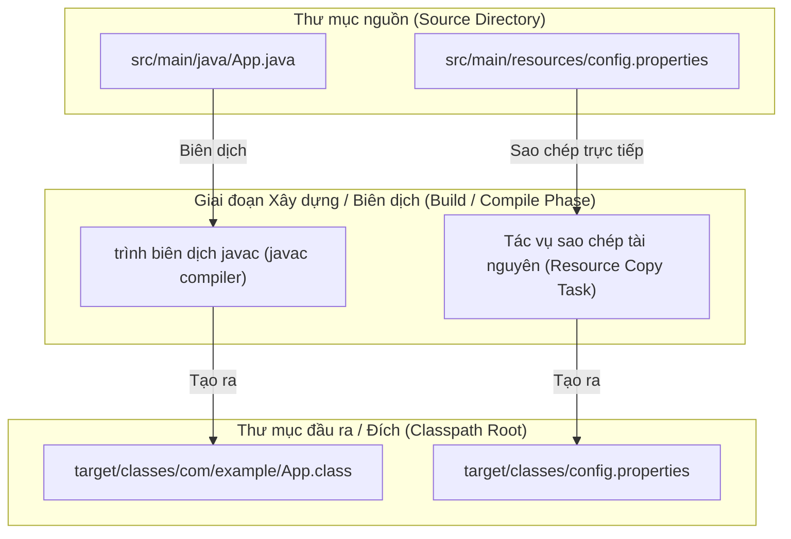
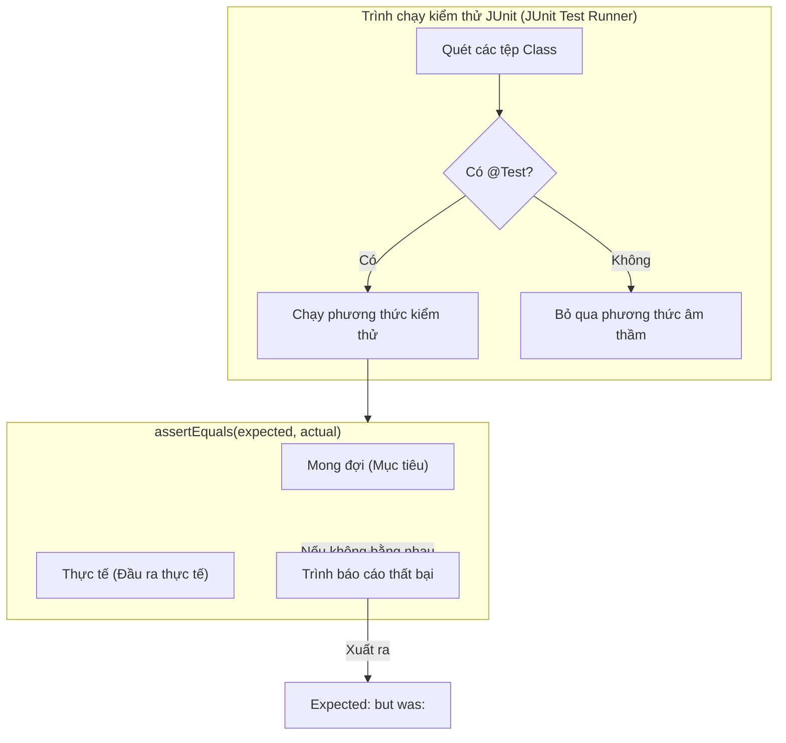

# Xây dựng, Biên dịch, Chạy - Phần 2 (Build, Compile, Run - Part 2)

## Mục Tiêu Học Tập (Learning Goal)

Tài liệu này trình bày các bố cục cấu trúc dự án tiêu chuẩn và kiểm thử đơn vị với JUnit. Hãy nghiên cứu từng khái niệm như một quy tắc Java thực tế.

## Khái Quát Nội Dung (Outline Coverage)

| Khái niệm (Concept) | Điều cần biết (What to know) |
| --- | --- |
| `Standard project structure` | Bố cục thư mục chuẩn để tổ chức mã nguồn, tài nguyên và kiểm thử (được sử dụng bởi Maven, Gradle, v.v.). |
| `Basic unit test with JUnit` | Các khung kiểm thử tiêu chuẩn (standard test frameworks) và thư viện xác nhận (assertion libraries) được sử dụng để xác minh chức năng đơn vị của mã nguồn. |

## Ghi Chú Chi Tiết (Detailed Notes)

### Cấu trúc dự án chuẩn (Standard project structure)

Các dự án Java tuân theo một bố cục thư mục quy ước được định nghĩa bởi các công cụ xây dựng hiện đại (Maven/Gradle). Việc tuân thủ quy ước này cho phép các công cụ tự động hóa việc biên dịch, kiểm thử và đóng gói mà không cần cấu hình classpath thủ công.

- **Bố cục thư mục chuẩn**:
  ```text
  my-app/
  ├── pom.xml                   # Maven project configuration (or build.gradle for Gradle)
  └── src/                      # Root directory for all source code and assets
      ├── main/                 # Production code and assets
      │   ├── java/             # Java source files organized by package structure
      │   │   └── com/
      │   │       └── example/
      │   │           └── App.java
      │   └── resources/        # Configuration, properties, XMLs, static files
      │       └── application.properties
      └── test/                 # Test code and assets
          ├── java/             # Test source files matching production package structure
          │   └── com/
          │       └── example/
          │           └── AppTest.java
          └── resources/        # Test-only resource files
              └── test-data.json
  ```

- **Sai lầm thường gặp / Chế độ thất bại (Common Mistake / Failure Mode)**:
  - Đặt các tệp nguồn Java trực tiếp dưới `src/main/` hoặc `src/` thay vì `src/main/java/`. Các công cụ xây dựng mặc định các tác vụ biên dịch của chúng chỉ tìm kiếm bên trong `src/main/java`. Nếu đặt sai vị trí, các tác vụ trình biên dịch sẽ hoàn thành thành công nhưng không biên dịch được tệp nào, dẫn đến việc thiếu các tệp đầu ra.
  - Thêm các tài nguyên ứng dụng (production resources) vào `src/main/java/` thay vì `src/main/resources/`. Giai đoạn biên dịch chỉ sao chép các tệp tài nguyên từ các thư mục tài nguyên. Việc đặt chúng trong `java/` có nghĩa là chúng có thể không được sao chép vào tệp JAR cuối cùng, dẫn đến lỗi `NullPointerException` hoặc `FileNotFoundException` trong thời gian chạy khi cố gắng tải chúng thông qua `ClassLoader.getResourceAsStream()`.

### Tại sao Cấu trúc Dự án Chuẩn lại Phân biệt Mã nguồn và Tài nguyên (Why Standard Project Structure Separates Source Code and Resources)

Các công cụ xây dựng như Maven và Gradle dựa trên các quy ước để tách biệt mã nguồn có thể thực thi khỏi các tệp tài nguyên tĩnh. Các trình giữ chỗ và các tệp tài nguyên như thuộc tính (properties), XML cấu hình, và dữ liệu mô phỏng kiểm thử được tách biệt vào các thư mục khác nhau (`src/main/resources` và `src/test/resources`) bởi vì chúng được xử lý khác nhau trong quá trình biên dịch và đóng gói. Mã nguồn trong `src/main/java` phải được phân tích cú pháp, biên dịch và chuyển đổi thành các tệp `.class`, trong khi các tài nguyên chỉ đơn giản được sao chép trực tiếp vào thư mục đầu ra của classpath (ví dụ: `target/classes`) mà không có bất kỳ sửa đổi nào. Nếu một tệp tài nguyên vô tình bị đặt vào `src/main/java`, tác vụ biên dịch sẽ bỏ qua nó, dẫn đến việc tệp không được đóng gói bên trong tệp JAR cuối cùng. Điều này gây ra lỗi trong thời gian chạy khi ứng dụng cố gắng tải các tài nguyên này bằng bộ tải lớp (classloader).

#### Mô hình tư duy: Nguyên liệu nấu ăn vs Sách công thức (Mental Model: Cooking Ingredients vs Recipe Books)
* **`src/main/java` (Sách công thức)**: Chúng cần được dịch, in và đóng sách (biên dịch).
* **`src/main/resources` (Nguyên liệu)**: Chúng chỉ cần được giao đến nhà bếp (sao chép đến thư mục đích) nguyên trạng. Nếu bạn đặt nguyên liệu vào máy in (thư mục java), chúng sẽ bị bỏ đi hoặc gây ra sự lộn xộn.



#### Ví dụ có thể chạy được (Runnable Example)
```java
// Cố gắng tải một tệp tài nguyên:
InputStream input = App.class.getClassLoader().getResourceAsStream("config.properties");
if (input == null) {
    System.out.println("Resource not found!"); 
    // Output: Resource not found! (nếu config.properties được đặt trong src/main/java/ thay vì src/main/resources/)
} else {
    System.out.println("Resource loaded successfully.");
    // Output: Resource loaded successfully.
}
```

#### Chuỗi Nguyên Nhân - Kết Quả (Cause-Effect Chain)

```text
Nhà phát triển đặt `config.properties` bên trong `src/main/java/`
  → Tác vụ `compiler:compile` của Maven biên dịch các tệp Java nhưng bỏ qua các tệp không phải Java trong `src/main/java`
  → Thư mục đóng gói đích không chứa `config.properties`
  → Lệnh gọi `getResourceAsStream()` của ClassLoader trả về `null` trong thời gian chạy
  → Ứng dụng ném ra lỗi `NullPointerException` khi truy cập luồng dữ liệu tài nguyên.
```


---


### Kiểm thử đơn vị cơ bản với JUnit (Basic unit test with JUnit)

JUnit (hiện tại là JUnit 5 / Jupiter) là khung làm việc chính để viết các bài kiểm thử đơn vị tự động (automated unit tests) trong hệ sinh thái JVM. Các kiểm thử này xác minh rằng các lớp và phương thức riêng lẻ hoạt động chính xác.

- **Ví dụ Code**:
  ```java
  package com.example;

  import org.junit.jupiter.api.Test;
  import static org.junit.jupiter.api.Assertions.*;

  public class CalculatorTest {

      private final Calculator calculator = new Calculator();

      @Test
      void testAdd_withPositiveNumbers_shouldReturnSum() {
          int result = calculator.add(2, 3);
          
          // Assertion checks: expected value first, actual value second
          assertEquals(5, result, "2 + 3 should be 5");
      }

      @Test
      void testDivide_byZero_shouldThrowArithmeticException() {
          // Asserting exception throwing
          assertThrows(ArithmeticException.class, () -> {
              calculator.divide(10, 0);
          }, "Dividing by zero must throw ArithmeticException");
      }
  }
  ```

- **Sai lầm thường gặp / Chế độ thất bại (Common Mistake / Failure Mode)**:
  - **Quên Annotation `@Test` (Forgetting the @Test Annotation)**: Nếu bạn bỏ qua `@Test` (từ package `org.junit.jupiter.api`), công cụ xây dựng/IDE sẽ hoàn toàn bỏ qua phương thức này, mang lại cho bạn cảm giác an toàn giả tạo rằng tất cả các kiểm thử đều đã vượt qua.
  - **Đảo ngược đối số xác nhận (Reversed Assertion Arguments)**: Viết `assertEquals(actual, expected)` thay vì `assertEquals(expected, actual)`. Nếu kiểm thử thất bại, thông báo lỗi của JUnit sẽ hiển thị: `Expected: [actual_value] but was: [expected_value]`, điều này cực kỳ gây nhầm lẫn.
  - **Quá tải xác nhận (Assertion Overload)**: Đặt hàng chục xác nhận không liên quan trong một phương thức kiểm thử duy nhất. Nếu xác nhận đầu tiên thất bại, các xác nhận tiếp theo sẽ không được thực thi, làm ẩn đi các lỗi khác. Hãy giữ cho các kiểm thử tập trung và chia nhỏ các xác nhận ở nơi thích hợp.

### Tại sao Thứ Tự Xác Nhận và Annotations của JUnit lại Quan Trọng (Why JUnit Assertion Order and Annotations Matter)

Các khung kiểm thử tự động yêu cầu các giao thức nghiêm ngặt để xác định, thực thi và báo cáo kết quả kiểm thử một cách chính xác. Trong JUnit, annotation `@Test` cho trình chạy kiểm thử (test runner) biết rằng một phương thức là một bài kiểm thử đơn vị có thể thực thi chứ không phải là một phương thức bổ trợ (helper method). Nếu không có annotation này, trình chạy kiểm thử sẽ hoàn toàn bỏ qua phương thức đó, nghĩa là các lỗi bỏ sót kiểm thử âm thầm có thể xảy ra mà không bị phát hiện. Hơn nữa, các xác nhận như `assertEquals(expected, actual)` phải tuân theo đúng thứ tự tham số. Khi một kiểm thử thất bại, JUnit sẽ tạo ra một thông báo thất bại so sánh giữa trạng thái mong đợi và trạng thái thực tế. Nếu nhà phát triển đảo ngược các đối số này, báo cáo thất bại sẽ tuyên bố rằng kết quả mong đợi là giá trị thời gian chạy thực tế và ngược lại, gây hiểu lầm cho các nhà phát triển trong quá trình gỡ lỗi và kéo dài thời gian điều tra lỗi.

#### Mô hình tư duy: Xác minh Annotation và Định dạng Xác nhận (Mental Model: Annotation Verification and Assertion Format)


#### Ví dụ có thể chạy được (Runnable Example)
```java
// Thứ tự đúng: expected là 5, actual là 4
assertEquals(5, 4);
// Output in console:
// Expected: 5
// But was:  4

// Thứ tự bị đảo ngược (gây hiểu lầm):
assertEquals(4, 5);
// Output in console:
// Expected: 4
// But was:  5
```

#### Chuỗi Nguyên Nhân - Kết Quả (Cause-Effect Chain)

```text
Nhà phát triển viết xác nhận kiểm thử
  → Nhà phát triển đảo ngược các đối số thành `assertEquals(actualResult, expectedResult)`
  → Xác nhận thất bại
  → JUnit xây dựng thông báo thất bại bằng cách sử dụng các vị trí `assertEquals(firstParam, secondParam)`
  → Nhà phát triển đọc thông báo lỗi sai "Expected: <actualResult> but was: <expectedResult>"
  → Nhà phát triển lãng phí thời gian tìm kiếm ở sai phần của mã nguồn.
```


---

## Câu Hỏi Ôn Tập Thường Gặp (Common Review Prompts)

- Thư mục nào xử lý cấu hình ứng dụng (production configurations) so với dữ liệu giả lập kiểm thử (test mock data)? (`src/main/resources` so với `src/test/resources`)
- Rủi ro khi kiểm thử các chi tiết triển khai riêng tư (private implementation details) là gì? (Nó liên kết chặt chẽ các bài kiểm thử với các chi tiết nội bộ, gây khó khăn cho việc tái cấu trúc mã nguồn. Các bài kiểm thử chỉ nên xác minh các giao diện API công khai và hành vi có thể quan sát được).
- Các công cụ xây dựng tương tác với kết quả kiểm thử JUnit như thế nào? (Các đường ống xây dựng thường chạy các tác vụ `test`; nếu bất kỳ xác nhận kiểm thử nào thất bại, bản dựng sẽ thất bại, ngăn chặn việc triển khai mã nguồn bị lỗi).
