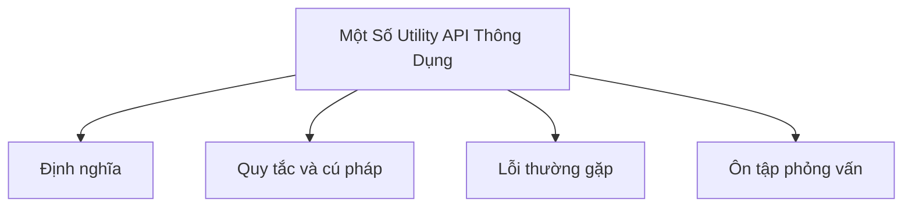

# 39 - Một Số Utility API Thông Dụng (Some Common Utility APIs)

Chủ đề này bám sát đề cương chính trong [outline.md](../outline.md). Mục tiêu là hiểu sâu từng khái niệm đến mức có thể giải thích, nhận ra trong code và trả lời câu hỏi phỏng vấn.

## Thứ Tự Học

- [Các Khái Niệm Về Math](theory/01-math-concepts.md)
- [Các Khái Niệm Về Properties](theory/02-properties-concepts.md)
- [Thuật Ngữ Chính](terms/01-key-terms.md)

## Danh Sách Kiểm Tra Đề Cương

- Math
- Random
- BigInteger
- BigDecimal
- UUID
- Objects
- Optional
- System
- Runtime
- ProcessBuilder
- Properties
- ResourceBundle
- Locale
- Currency
- Formatter
- Scanner

## Thẻ Anki

- [Basic](anki/basic.tsv)
- [Basic Extra](anki/basic-extra.tsv)
- [Cloze](anki/cloze.tsv)
- [Code Question](anki/code-question.tsv)

## Tự Kiểm Tra

Trước khi chuyển sang chủ đề tiếp theo, hãy đảm bảo bạn có thể trả lời các câu hỏi sau:
1. Tại sao `Random` và `Math.random()` không an toàn trong môi trường đa luồng (multithreading), và `ThreadLocalRandom` giải quyết vấn đề này như thế nào?
2. Tại sao `BigDecimal` chính xác hơn `double` cho tính toán tiền tệ, và cơ chế biểu diễn nội tại (Unscaled Value và Scale) là gì?
3. Tại sao thao tác trực tiếp qua `Map.put()` lên đối tượng `Properties` lại nguy hiểm, và `ClassCastException` xảy ra như thế nào khi gọi `store()`?
4. Tại sao `Scanner.nextLine()` bị bỏ qua sau `nextInt()`, và cơ chế buffer/con trỏ phía sau là gì?
5. Sự khác biệt về mục đích và tương tác JVM giữa `System` và `Runtime` là gì?

## Sơ Đồ Tổng Quan (Mermaid)

## Liên Kết Tham Khảo

- https://docs.oracle.com/javase/tutorial/
- https://dev.java/learn/
