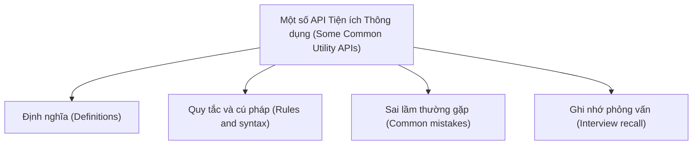

# 39 - Một số API Tiện ích Thông dụng (Some Common Utility APIs)

Chủ đề này tuân theo đề cương chính trong [outline.md](../outline.md). Mục tiêu là hiểu sâu từng khái niệm để có thể giải thích, nhận biết trong mã nguồn và trả lời các câu hỏi phỏng vấn.

## Thứ Tự Học Tập (Study Order)

- [Khái niệm Math (Math Concepts)](theory/01-math-concepts.md)
- [Khái niệm Properties (Properties Concepts)](theory/02-properties-concepts.md)
- [Thuật ngữ Then chốt (Key Terms)](terms/01-key-terms.md)

## Danh Sách Đề Cương (Outline Checklist)

- Math
- Random
- BigInteger
- BigDecimal
- UUID
- Objects
- Optional
- System
- Runtime
- ProcessBuilder
- Properties
- ResourceBundle
- Locale
- Currency
- Formatter
- Scanner

## Thẻ Anki (Anki Cards)

- [Cơ bản (Basic)](anki/basic.tsv)
- [Cơ bản Mở rộng (Basic Extra)](anki/basic-extra.tsv)
- [Điền vào chỗ trống (Cloze)](anki/cloze.tsv)
- [Câu hỏi Code (Code Question)](anki/code-question.tsv)

## Tự Kiểm Tra (Self-Check)

Trước khi chuyển sang chủ đề tiếp theo, hãy xác minh rằng bạn có thể trả lời các câu hỏi sau:
1. Tại sao chúng ta nên sử dụng `BigDecimal` thay vì `double` cho các tính toán tiền tệ? Hãy giải thích dưới góc độ giá trị không tỷ lệ (unscaled value) và tỷ lệ (scale) so với biểu diễn số thực dấu phẩy động IEEE 754.
2. Tại sao việc khởi tạo một `BigDecimal` với một giá trị `double` trực tiếp (ví dụ: `new BigDecimal(0.1)`) lại đưa vào nhiễu dấu phẩy động (floating-point noise), và tại sao `new BigDecimal("0.1")` hoặc `BigDecimal.valueOf(0.1)` lại được ưu tiên hơn?
3. Tại sao `Math.random()` không an toàn về mặt mật mã học, và tại sao nó gặp phải tình trạng tranh chấp luồng (thread contention) trong các ứng dụng đồng thời? Các giải pháp thay thế như `ThreadLocalRandom` hoặc `SecureRandom` là gì?
4. Sự khác biệt cơ bản về mục đích và phong cách tương tác giữa các lớp `System` và `Runtime` trong Java là gì?
5. Tại sao việc tạo một tiến trình bên ngoài bằng cách sử dụng `ProcessBuilder` có thể khiến ứng dụng Java bị treo vô thời hạn, và làm thế cách nào để chúng ta ngăn chặn điều này?
6. Tại sao việc sử dụng các phương thức của `Map` như `put()` trên một thực thể `Properties` lại nguy hiểm, và cách đúng đắn để thiết lập các giá trị thuộc tính là gì?

## Sơ Đồ Tổng Quan (Mermaid Overview)

## Liên Kết Tham Khảo (Reference Links)

- https://docs.oracle.com/en/java/javase/21/docs/api/java.base/java/util/package-summary.html
