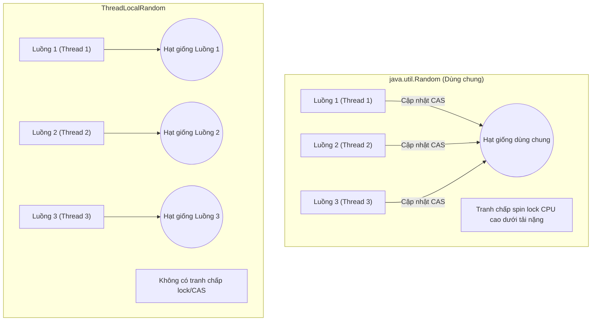
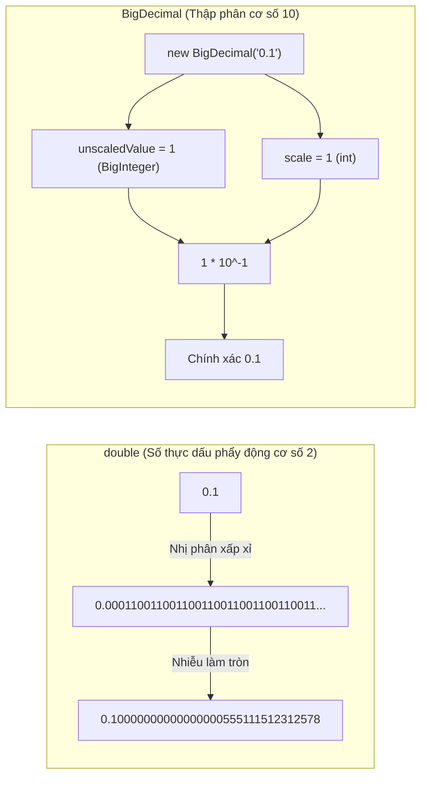

# Một số API Tiện ích Thông dụng - Phần 1 (Some Common Utility APIs - Part 1)

## Mục Tiêu Học Tập (Learning Goal)

Tài liệu này trình bày một phần trọng tâm của **Một số API Tiện ích Thông dụng (Some Common Utility APIs)** bao gồm các API về toán học, độ chính xác tùy ý, hệ thống, và thực thi tiến trình. Hãy nghiên cứu từng khái niệm như một quy tắc Java thực tế.

## Khái Quát Nội Dung (Outline Coverage)

| Khái niệm (Concept) | Điều cần biết (What to know) |
| --- | --- |
| `Math` | Lớp các hàm toán học (`java.lang.Math`) với các thao tác tĩnh (static operations). |
| `Random` | Lớp tạo số giả ngẫu nhiên (`java.util.Random`). |
| `BigInteger` | Các số nguyên bất biến với độ chính xác tùy ý (`java.math.BigInteger`). |
| `BigDecimal` | Các số thập phân bất biến với độ chính xác tùy ý (`java.math.BigDecimal`) cho các tính toán tài chính chính xác. |
| `UUID` | Trình tạo mã định danh duy nhất toàn cầu (`java.util.UUID`). |
| `Objects` | Các tiện ích bổ trợ an toàn với null (`java.util.Objects`) để xác thực và kiểm tra đối tượng. |
| `Optional` | Đối tượng container (`java.util.Optional`) bảo vệ chống lại lỗi `NullPointerException`. |
| `System` | Lớp giao tiếp (`java.lang.System`) tới các thuộc tính JVM, môi trường, luồng dữ liệu (streams) và bộ hẹn giờ hệ thống. |
| `Runtime` | Trình điều khiển trạng thái thực thi JVM (`java.lang.Runtime`). |
| `ProcessBuilder` | Trình quản lý và tạo tiến trình hệ thống. |

---

## Ghi Chú Chi Tiết (Detailed Notes)

### Math

Lớp `java.lang.Math` chứa các phương thức tĩnh để thực hiện các phép toán số học cơ bản như hàm mũ, logarit, căn bậc hai và tính toán lượng giác.

- **Ví dụ có thể chạy được (Runnable Example)**:
  ```java
  double squareRoot = Math.sqrt(25.0); // 5.0
  int absoluteValue = Math.abs(-10);   // 10
  long rounded = Math.round(5.6);     // 6
  ```

- **Sai lầm thường gặp / Chế độ thất bại (Common Mistake / Failure Mode)**:
  - **Lỗ hổng tràn số (Overflow Vulnerability)**: Các phương thức tiêu chuẩn không kiểm tra lỗi tràn số. Ví dụ: `Math.abs(Integer.MIN_VALUE)` trả về `Integer.MIN_VALUE` vì giá trị tuyệt đối của $-2^{31}$ không thể được biểu diễn dưới dạng số bù hai 32-bit có dấu dương.
  - **Giải pháp (Solution)**: Sử dụng các phương thức toán học chính xác (exact arithmetic methods) của Java 8 (ví dụ: `Math.addExact`, `Math.multiplyExact`, `Math.absExact`) vốn sẽ ném ra ngoại lệ `ArithmeticException` khi xảy ra lỗi tràn số:
    ```java
    try {
        int overflowed = Math.addExact(Integer.MAX_VALUE, 1);
    } catch (ArithmeticException e) {
        System.out.println("Overflow detected!");
    }
    ```

---

### Random

Lớp `java.util.Random` tạo các số giả ngẫu nhiên bằng cách sử dụng Trình tạo Đồng dư Tuyến tính (Linear Congruential Generator - LCG).

- **Ví dụ có thể chạy được (Runnable Example)**:
  ```java
  Random rand = new Random();
  int randomInt = rand.nextInt(100);    // 0 (inclusive) to 100 (exclusive)
  double randomDouble = rand.nextDouble(); // 0.0 to 1.0
  ```

- **Sai lầm thường gặp / Chế độ thất bại (Common Mistake / Failure Mode)**:
  - **Rủi ro bảo mật (Security Risk)**: `Random` không an toàn về mặt mật mã học (cryptographically secure) và có thể dự đoán trước được. Không bao giờ sử dụng nó để tạo dữ liệu nhạy cảm về bảo mật (ví dụ: mật khẩu, mã phiên session tokens, khóa mã hóa). Hãy sử dụng `java.security.SecureRandom` để thay thế.
  - **Tranh chấp đa luồng (Multithreading Contention)**: Mặc dù an toàn với luồng (thread-safe), một thực thể `Random` dùng chung sẽ chịu tổn thất hiệu năng do tranh chấp cao dưới môi trường đa luồng. Hãy sử dụng `java.util.concurrent.ThreadLocalRandom.current().nextInt()` cho các môi trường đồng thời.

### Tại sao Random và Math.random() gặp lỗi trong Đồng thời và Bảo mật (Why Random and Math.random() Have Flaws in Concurrency and Security)

`java.util.Random` và `Math.random()` được xây dựng trên thuật toán Trình tạo Đồng dư Tuyến tính (LCG). Thiết kế này tạo ra những hạn chế nghiêm trọng trong cả ứng dụng đa luồng lẫn các ứng dụng nhạy cảm về bảo mật.

#### 1. Tranh chấp đa luồng (Nút thắt an toàn luồng) (Multithreading Contention (The Thread-Safety Bottleneck))
Để đảm bảo an toàn với luồng, `java.util.Random` sử dụng một đối tượng `AtomicLong` nội bộ để lưu trữ hạt giống (seed) của nó. Khi nhiều luồng gọi `nextInt()` hoặc `Math.random()` một cách đồng thời, tất cả chúng đều cố gắng cập nhật hạt giống nguyên tử duy nhất này bằng một vòng lặp So-sánh-và-Tráo-đổi (Compare-And-Swap - CAS). Khi xảy ra tranh chấp cao, các luồng liên tục thất bại trong thao tác CAS và phải xoay vòng chờ (spin), gây lãng phí chu kỳ CPU và làm giảm hiệu năng.
- **Giải pháp (ThreadLocalRandom)**: Java 7 đã giới thiệu `java.util.concurrent.ThreadLocalRandom`. Nó phân bổ một hạt giống riêng biệt cho mỗi luồng, loại bỏ hoàn toàn trạng thái có thể thay đổi dùng chung (shared mutable state) và sự tranh chấp hạt giống.

#### 2. Khả năng dự đoán mật mã học (Lỗ hổng bảo mật) (Cryptographic Predictability (The Security Vulnerability))
LCG là một công thức xác định: $X_{n+1} = (aX_n + c) \pmod m$. Nếu kẻ tấn công thu thập được một chuỗi nhỏ các số được tạo ra, họ có thể dễ dàng tính toán ra hạt giống hiện tại và dự đoán tất cả các đầu ra trong tương lai.
- **Giải pháp (SecureRandom)**: `java.security.SecureRandom` sử dụng trình tạo số giả ngẫu nhiên mạnh về mặt mật mã (CSPRNG) được gieo hạt từ entropy cấp hệ điều hành (chẳng hạn như `/dev/urandom` trên các hệ thống giống Unix). Nó được thiết kế để chống lại việc dự đoán, mặc dù nó chậm hơn do quá trình thu thập entropy.

#### Phép so sánh tương đồng về Đồng thời và Bảo mật (Concurrency and Security Comparison Analogy)
Hãy tưởng tượng một máy bán nước tự động duy nhất trong một văn phòng bận rộn (`Random` dùng chung). Mọi nhân viên phải cập nhật vào một cuốn sổ nhật ký duy nhất trước khi lấy đồ uống. Nếu nhiều người cố gắng viết vào sổ nhật ký cùng một lúc, họ sẽ chen chúc và chặn đường lẫn nhau (tranh chấp). `ThreadLocalRandom` giống như việc cung cấp cho mỗi nhân viên một máy bán nước tự động và sổ nhật ký cá nhân của riêng họ. `SecureRandom` giống như một két sắt ngân hàng sử dụng các sự kiện bên ngoài hỗn loạn (như tiếng ồn khí quyển) để tạo mã kết hợp; nó mở chậm hơn nhiều nhưng không thể đoán được.



#### Chuỗi Nguyên Nhân - Kết Quả của Tranh Chấp Luồng (Cause-Effect Chain of Thread Contention)
```text
Thực thể Random dùng chung → Nhiều luồng yêu cầu số ngẫu nhiên đồng thời → Các luồng thử thực hiện CAS AtomicLong trên cùng hạt giống → Chỉ một luồng thành công → Các luồng còn lại thất bại CAS và xoay vòng chờ (spin) → Sử dụng CPU cao và độ trễ nghiêm trọng
```

#### Ví dụ có thể chạy được (Runnable Example)
```java
import java.util.Random;
import java.util.concurrent.ThreadLocalRandom;
import java.security.SecureRandom;

public class RandomDemo {
    public static void main(String[] args) {
        // Math.random() internally uses a single shared static Random instance
        double randomVal = Math.random(); // 0.0 to 1.0 (Contention in multithreading)
        System.out.println("Math.random(): " + randomVal);

        // ThreadLocalRandom: No contention, but predictable (Do not use for security)
        int localRandom = ThreadLocalRandom.current().nextInt(1, 100);
        System.out.println("ThreadLocalRandom: " + localRandom); // e.g. 42

        // SecureRandom: Cryptographically secure, slower, unpredictable
        SecureRandom secure = new SecureRandom();
        byte[] token = new byte[16];
        secure.nextBytes(token); // Fills array with secure, unpredictable bytes
        System.out.println("Secure token generated successfully.");
    }
}
```

---

### BigInteger

`java.math.BigInteger` đại diện cho các số nguyên có độ chính xác tùy ý. Nó là bất biến (immutable) và hoạt động giống như một số nguyên nguyên thủy nhưng không có bất kỳ giới hạn kích thước bit nào.

- **Ví dụ có thể chạy được (Runnable Example)**:
  ```java
  BigInteger largeVal = new BigInteger("123456789012345678901234567890");
  BigInteger multiplier = BigInteger.valueOf(10);
  BigInteger result = largeVal.multiply(multiplier);
  ```

- **Sai lầm thường gặp / Chế độ thất bại (Common Mistake / Failure Mode)**:
  - **Bỏ qua tính bất biến (Immutability Ignored)**: Các phép toán số học trên `BigInteger` không sửa đổi chính thực thể đó. Thay vào đó, chúng trả về một `BigInteger` mới.
    ```java
    BigInteger val = BigInteger.TEN;
    val.add(BigInteger.ONE); // WRONG: result is discarded!
    val = val.add(BigInteger.ONE); // CORRECT: val is now 11
    ```

---

### BigDecimal

`java.math.BigDecimal` đại diện cho các số thập phân có độ chính xác tùy ý, cung cấp khả năng kiểm soát hoàn toàn đối với tỷ lệ (scale) và làm tròn (rounding).

- **Ví dụ có thể chạy được (Runnable Example)**:
  ```java
  BigDecimal val1 = new BigDecimal("0.1");
  BigDecimal val2 = new BigDecimal("0.2");
  BigDecimal sum = val1.add(val2); // Exactly 0.3
  ```

- **Sai lầm thường gặp / Chế độ thất bại (Common Mistake / Failure Mode)**:
  - **Khởi tạo bằng giá trị Double trực tiếp (Double Literal Initialization)**: Việc khởi tạo qua giá trị `double` trực tiếp sẽ đưa vào nhiễu dấu phẩy động (floating-point noise).
    ```java
    BigDecimal bad = new BigDecimal(0.1); // Value is 0.10000000000000000555111...
    BigDecimal good = new BigDecimal("0.1"); // Value is exactly 0.1
    ```
  - **Phép chia thập phân vô hạn tuần hoàn (Non-Terminating Decimal Division)**: Thực hiện phép chia không có chế độ làm tròn (RoundingMode) khi kết quả là vô hạn (như 1/3) sẽ gây treo chương trình với ngoại lệ `ArithmeticException`.
    ```java
    BigDecimal one = BigDecimal.ONE;
    BigDecimal three = new BigDecimal("3");
    // BigDecimal res = one.divide(three); // WRONG: Throws ArithmeticException
    BigDecimal res = one.divide(three, 2, RoundingMode.HALF_UP); // CORRECT: 0.33
    ```

### Tại sao BigDecimal lại Chính xác: Biểu diễn Giá trị Không tỷ lệ và Tỷ lệ (Why BigDecimal is Precise: Unscaled Value and Scale Representation)

Máy tính biểu diễn các kiểu `double` và `float` bằng định dạng số thực dấu phẩy động IEEE 754 (cơ số 2). Bởi vì các số phân số như `0.1` hoặc `0.2` không có biểu diễn hữu hạn trong hệ nhị phân ($0.1_{10} = 0.0001100110011..._2$), việc lưu trữ chúng ở định dạng độ chính xác kép (double-precision) sẽ đưa vào các lỗi làm tròn nhỏ. Những lỗi này tích lũy qua nhiều phép toán, khiến chúng trở nên nguy hiểm đối với các tính toán tài chính.

#### Cơ chế biểu diễn nội bộ (Internal Representation Mechanics)
`BigDecimal` tránh các vấn đề nhị phân dấu phẩy động bằng cách lưu trữ các số dưới dạng thập phân cơ số 10. Nó sử dụng hai giá trị nội bộ:
1. **Giá trị không tỷ lệ (Unscaled Value)**: Một số nguyên có độ chính xác tùy ý (`BigInteger`) biểu diễn các chữ số của số đó mà không có dấu thập phân.
2. **Tỷ lệ (Scale)**: Một số nguyên 32-bit đại diện cho lũy thừa của 10 dùng để chia giá trị không tỷ lệ.

Giá trị toán học của một `BigDecimal` là:
$$\text{Value} = \text{unscaledValue} \times 10^{-\text{scale}}$$

##### Bảng ví dụ biểu diễn (Example Representation Table)
| Số (Number) | Giá trị không tỷ lệ (Unscaled Value) | Tỷ lệ (Scale) | Công thức toán học (Mathematical Formula) |
|---|---|---|---|
| `123.45` | `12345` | `2` | $12345 \times 10^{-2}$ |
| `0.0007` | `7` | `4` | $7 \times 10^{-4}$ |
| `-50` | `-5` | `-1` | $-5 \times 10^{-(-1)} = -5 \times 10^1$ |

#### Rủi ro khởi tạo Double trực tiếp sớm (Eager Double Literal Initialization Risk)
Khi bạn viết `new BigDecimal(0.1)`, trình biên dịch trước tiên sẽ đánh giá giá trị `double` trực tiếp `0.1`, vốn đã không chính xác trong hệ nhị phân. Hàm khởi tạo `BigDecimal` sau đó sẽ nắm giữ chính xác giá trị không chính xác đó.
Việc sử dụng `new BigDecimal("0.1")` or `BigDecimal.valueOf(0.1)` phân tích cú pháp biểu diễn chuỗi, cho phép `BigDecimal` trích xuất trực tiếp các giá trị cơ số 10 chính xác. Lưu ý rằng `BigDecimal.valueOf(double)` thực hiện gọi phương thức `Double.toString(double)` nội bộ, giúp chuyển đổi giá trị double thành biểu diễn chuỗi chuẩn của nó trước khi phân tích cú pháp.

#### Phép so sánh tương đồng về biểu diễn Tỷ lệ (Scale Representation Analogy)
Hãy nghĩ về `double` giống như việc cố gắng viết $1/3$ dưới dạng thập phân lên một tờ giấy ghi chú. Bạn sẽ viết `0.33333333` nhưng cuối cùng sẽ hết không gian viết, để lại một sai số nhỏ.
`BigDecimal` giống như việc viết phân số dưới dạng một cặp số nguyên: tử số là `1` và mẫu số là `3`. Nó lưu trữ các chữ số chính xác (`unscaledValue`) và ghi nhớ dấu chấm thập phân nằm ở đâu (`scale`), không bao giờ làm mất bất kỳ thông tin nào.



#### Chuỗi Nguyên Nhân - Kết Quả của Nhiễu Giá Trị Double Trực Tiếp (Cause-Effect Chain of Double Literal Noise)
```text
giá trị double trực tiếp 0.1 → Biểu diễn nhị phân có phân số tuần hoàn → Giá trị được làm tròn thành số float IEEE 754 gần nhất → new BigDecimal(double) phân tích cú pháp số float đã làm tròn → BigDecimal kế thừa nhiễu dấu phẩy động
```

#### Ví dụ có thể chạy được (Runnable Example)
```java
import java.math.BigDecimal;
import java.math.RoundingMode;

public class BigDecimalDemo {
    public static void main(String[] args) {
        // Floating point noise accumulation
        double d1 = 0.1;
        double d2 = 0.2;
        System.out.println("double sum: " + (d1 + d2)); // 0.30000000000000004 (not 0.3!)

        // WRONG: Initializing with double literal preserves the noise
        BigDecimal bad = new BigDecimal(0.1);
        System.out.println("new BigDecimal(0.1): " + bad); // 0.10000000000000000555111512312578...

        // CORRECT: Initialize with String for exact value
        BigDecimal good1 = new BigDecimal("0.1");
        BigDecimal good2 = new BigDecimal("0.2");
        System.out.println("BigDecimal sum: " + good1.add(good2)); // 0.3 (exactly!)

        // CORRECT: Using BigDecimal.valueOf(double) internally uses String conversion
        BigDecimal good3 = BigDecimal.valueOf(0.1);
        System.out.println("BigDecimal.valueOf(0.1): " + good3); // 0.1

        // Division with and without RoundingMode
        BigDecimal one = BigDecimal.ONE;
        BigDecimal three = new BigDecimal("3");
        try {
            one.divide(three); // Throws ArithmeticException (infinite decimal expansion 0.333...)
        } catch (ArithmeticException e) {
            System.out.println("Caught expected non-terminating division exception.");
        }
        BigDecimal quotient = one.divide(three, 4, RoundingMode.HALF_UP);
        System.out.println("Quotient with scale 4: " + quotient); // 0.3333
    }
}
```

---

### UUID

`java.util.UUID` đại diện cho một Mã định danh duy nhất toàn cầu 128-bit (Universally Unique Identifier).

- **Ví dụ có thể chạy được (Runnable Example)**:
  ```java
  UUID uniqueId = UUID.randomUUID(); // Cryptographically strong Type 4 UUID
  String uuidStr = uniqueId.toString();
  UUID parsed = UUID.fromString(uuidStr);
  ```

- **Sai lầm thường gặp / Chế độ thất bại (Common Mistake / Failure Mode)**:
  - Phân tích cú pháp đầu vào chưa kiểm tra: `UUID.fromString(input)` ném ra ngoại lệ `IllegalArgumentException` trong thời gian chạy nếu chuỗi không tuân thủ cấu trúc hệ thập lục phân (hex) UUID mong đợi. Luôn bọc trong xác thực hoặc khối try-catch.

---

### Objects

`java.util.Objects` bao gồm các phương thức tiện ích tĩnh để thao tác trên các đối tượng (kiểm tra null, so sánh, băm, v.v.).

- **Ví dụ có thể chạy được (Runnable Example)**:
  ```java
  boolean isSame = Objects.equals(objA, objB); // Null-safe comparison
  int hashValue = Objects.hash(field1, field2); // Null-safe hash code generation
  Objects.requireNonNull(name, "Name cannot be null"); // Inline null check validation
  ```

- **Sai lầm thường gặp / Chế độ thất bại (Common Mistake / Failure Mode)**:
  - Sử dụng `Objects.equals(array1, array2)` để so sánh các giá trị mảng. Nó chỉ kiểm tra tính bằng nhau của tham chiếu (reference equality), trả về `false` cho các mảng giống hệt nhau nhưng có địa chỉ bộ nhớ khác nhau. Hãy sử dụng `Arrays.equals(array1, array2)` để thay thế.

---

### Optional

`java.util.Optional` là một đối tượng container được giới thiệu trong Java 8 để biểu diễn sự tồn tại hoặc vắng mặt của một giá trị khác null, nhằm mục đích loại bỏ lỗi `NullPointerException` (NPE).

- **Ví dụ có thể chạy được (Runnable Example)**:
  ```java
  Optional<String> opt = Optional.ofNullable(getStringThatMayBeNull());
  String val = opt.orElse("Fallback Default");
  
  // Lazy evaluation: fallback supplier only executes if opt is empty
  String lazyVal = opt.orElseGet(() -> computeDefaultValue());
  ```

- **Sai lầm thường gặp / Chế độ thất bại (Common Mistake / Failure Mode)**:
  - **Đánh giá sớm trong `orElse` (Eager Evaluation in orElse)**: Việc truyền một lời gọi phương thức vào `orElse` sẽ khiến phương thức đó chạy *mọi lúc*, bất kể `Optional` là rỗng hay có chứa giá trị.
    ```java
    // WRONG: fetchDefault() runs even if opt has a value!
    String value = opt.orElse(fetchDefault());
    
    // CORRECT: fetchDefault() runs only if opt is empty.
    String value = opt.orElseGet(() -> fetchDefault());
    ```
  - **Lạm dụng Optional (Optional Abuse)**: Không sử dụng `Optional` cho các tham số phương thức/hàm khởi tạo, các trường của lớp (class fields), hoặc bọc các kiểu bộ sưu tập (hãy trả về các bộ sưu tập rỗng thay thế). Nó được thiết kế chủ yếu như một kiểu trả về cho các phương thức cần một cách rõ ràng để chỉ ra "không có kết quả".

---

### System

`java.lang.System` cung cấp quyền truy cập vào các tài nguyên hệ thống, luồng dữ liệu tiêu chuẩn (standard streams), các thuộc tính môi trường, và trình điều khiển dọn rác.

- **Ví dụ có thể chạy được (Runnable Example)**:
  ```java
  long start = System.nanoTime(); // High-precision elapsed time in nanoseconds
  String tempDir = System.getProperty("java.io.tmpdir"); // Get JVM system property
  String path = System.getenv("PATH"); // Get OS environment variable
  ```

- **Sai lầm thường gặp / Chế độ thất bại (Common Mistake / Failure Mode)**:
  - **Sử dụng CurrentTimeMillis làm bộ hẹn giờ (Using CurrentTimeMillis for Timers)**: Việc sử dụng `System.currentTimeMillis()` để đo thời gian thực thi của phương thức là rủi ro vì nó đo thời gian đồng hồ thực (wall-clock time). Nếu NTP đồng bộ hóa hoặc người dùng thay đổi đồng hồ hệ điều hành trong quá trình thực thi, kết quả có thể âm hoặc không chính xác cao. Hãy sử dụng `System.nanoTime()` cho các kiểm tra khoảng thời gian.

---

### Runtime

`java.lang.Runtime` cho phép ứng dụng giao tiếp với môi trường chạy thực tế của JVM (truy vấn bộ nhớ, thêm các shutdown hook, v.v.).

- **Ví dụ có thể chạy được (Runnable Example)**:
  ```java
  Runtime runtime = Runtime.getRuntime();
  long freeMemory = runtime.freeMemory(); // Free memory in JVM heap
  runtime.addShutdownHook(new Thread(() -> {
      System.out.println("Shutting down JVM gracefully...");
  }));
  ```

- **Sai lầm thường gặp**: Cố gắng ép buộc dọn rác bằng `Runtime.getRuntime().gc()`. Đây chỉ đơn thuần là một gợi ý gửi tới JVM; bộ dọn rác có quyền bỏ qua hoàn toàn lời gọi này, và việc gọi nó liên tục sẽ làm giảm hiệu năng.

### System vs. Runtime: Mục Đích và Tương Tác JVM (System vs. Runtime: Purpose and JVM Interaction)

Mặc dù cả `java.lang.System` và `java.lang.Runtime` đều cho phép các nhà phát triển giao tiếp với môi trường mà ứng dụng đang chạy, chúng phục vụ các vai trò thiết kế khác nhau và tương tác với JVM ở các mức độ trừu tượng (Abstraction) khác nhau.

#### Sự khác biệt chính và Ý đồ Thiết kế (Key Differences and Design Intent)
- **`java.lang.System` (Vỏ bọc Tiện ích Tĩnh)**:
  `System` là một lớp `final` chỉ chứa các trường và phương thức tĩnh (`static`). Nó không thể được khởi tạo. Nó hoạt động như một lớp tiện ích cấp cao để truy cập các luồng I/O tiêu chuẩn (`System.in`, `System.out`, `System.err`), thuộc tính hệ thống, biến môi trường, sao chép mảng (`System.arraycopy`), và các bộ đếm thời gian hệ thống cấp thấp (`currentTimeMillis` và `nanoTime`).
- **`java.lang.Runtime` (Điều khiển Thực thể Vòng đời JVM)**:
  `Runtime` đại diện cho một thực thể duy nhất (singleton), đang hoạt động của Máy ảo Java. Nó tuân theo mẫu thiết kế Singleton; bạn có được thực thể hiện tại bằng cách sử dụng `Runtime.getRuntime()`. Bởi vì nó đại diện cho chính tiến trình máy ảo, nó cung cấp các phương thức để kiểm tra mức sử dụng bộ nhớ (`freeMemory()`, `totalMemory()`, `maxMemory()`), đăng ký các shutdown hook, và tạo ra các tiến trình con (sub-processes).

#### Các vỏ bọc ủy quyền (Delegating Wrappers)
Để giúp các hoạt động phổ biến của JVM dễ viết hơn, `System` cung cấp một số phương thức bọc tiện lợi để ủy quyền trực tiếp cho thực thể duy nhất `Runtime`.
- `System.gc()` là một hàm bọc viết tắt cho `Runtime.getRuntime().gc()`.
- `System.exit(status)` là một hàm bọc viết tắt cho `Runtime.getRuntime().exit(status)`.

#### Phép so sánh tương đồng về Tương tác Máy chủ và JVM (Host and JVM Interaction Analogy)
Hãy tưởng tượng JVM như một con tàu du lịch.
`Runtime` giống như Thuyền trưởng và boong điều khiển của con tàu. Chỉ có một thuyền trưởng duy nhất (`Runtime.getRuntime()`), và bạn phải nói chuyện với thuyền trưởng để truy vấn phòng máy (kiểm tra trạng thái bộ nhớ), lên lịch cho các thủ tục khẩn cấp (đăng ký shutdown hook), hoặc ra lệnh cho tàu dừng lại (thoát).
`System` giống như bàn phục vụ khách của tàu. Đó là một địa điểm tĩnh, dễ dàng tiếp cận. Nếu bạn yêu cầu dịch vụ khách dọn dẹp các cabin (`System.gc()`), họ không tự mình làm điều đó; họ chuyển tiếp yêu cầu đến bộ phận của thuyền trưởng. Nó cũng cung cấp các tiện ích chung, như tra cứu lịch trình hàng ngày (các thuộc tính hệ thống) hoặc đọc các thông báo tiêu chuẩn (các luồng hệ thống).

```mermaid
flowchart TD
    App[Ứng dụng của bạn] -->|Gọi Tiện ích Tĩnh| System[Lớp System]
    App -->|Yêu cầu Singleton| Runtime[Lớp Runtime]
    System -->|System.exit() ủy quyền| Runtime
    System -->|System.gc() ủy quyền| Runtime
    Runtime -->|Kiểm soát trực tiếp| JVM[Tiến trình JVM]
    JVM -->|Thông tin môi trường| OS[Hệ điều hành máy chủ]
```

#### Chuỗi Nguyên Nhân - Kết Quả của một Shutdown Hook Graceful của JVM (Cause-Effect Chain of a JVM Graceful Shutdown Hook)
```text
Gọi Runtime.addShutdownHook() → JVM đăng ký luồng hook → Người dùng chấm dứt tiến trình hoặc System.exit() được gọi → JVM bắt đầu chuỗi tắt máy → JVM chạy tất cả các luồng shutdown hook đã đăng ký đồng thời → Tiến trình JVM thoát
```

#### Ví dụ có thể chạy được (Runnable Example)
```java
public class SystemRuntimeDemo {
    public static void main(String[] args) {
        // --- System usage (Static Wrapper) ---
        long start = System.nanoTime();
        String osName = System.getProperty("os.name");
        System.out.println("Running on: " + osName); // Prints OS Name
        
        // --- Runtime usage (JVM Singleton) ---
        Runtime rt = Runtime.getRuntime();
        System.out.println("Available processors: " + rt.availableProcessors());
        System.out.println("Free JVM Memory: " + rt.freeMemory() + " bytes");

        // --- Delegation Demonstration ---
        // Registering a shutdown hook must be done directly on the Runtime instance
        rt.addShutdownHook(new Thread(() -> {
            System.out.println("Graceful shutdown cleanup completed in hook.");
        }));

        // System.gc() simply delegates to Runtime.getRuntime().gc() under the hood
        System.gc(); 

        long duration = System.nanoTime() - start;
        System.out.println("Demo took: " + duration + " ns");
    }
}
```

---

### ProcessBuilder

`ProcessBuilder` được sử dụng để tạo và bắt đầu các tiến trình của hệ điều hành.

- **Ví dụ có thể chạy được (Runnable Example)**:
  ```java
  ProcessBuilder builder = new ProcessBuilder("ls", "-la");
  builder.redirectErrorStream(true); // Combine standard error and stdout
  Process process = builder.start();
  ```

- **Sai lầm thường gặp / Chế độ thất bại (Common Mistake / Failure Mode)**:
  - **Treo tiến trình (Hanging Processes)**: Nếu bạn tạo một tiến trình bên ngoài tạo ra lượng đầu ra đáng kể và bạn không đọc luồng đầu ra của nó, bộ đệm của hệ điều hành sẽ bị đầy. Khi đã đầy, tiến trình được tạo ra sẽ bị chặn vô thời hạn, khiến chương trình Java của bạn bị treo. Hãy chuyển hướng đầu ra (`builder.inheritIO()` hoặc `builder.redirectOutput(file)`) hoặc chủ động đọc từ `process.getInputStream()`.
