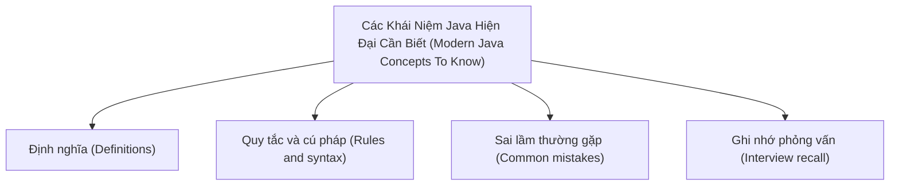

# 40 - Các Khái Niệm Java Hiện Đại Cần Biết (Modern Java Concepts To Know)

Chủ đề này tuân theo đề cương chính trong [outline.md](../outline.md). Mục tiêu là hiểu sâu từng khái niệm để có thể giải thích, nhận biết trong mã nguồn và trả lời các câu hỏi phỏng vấn.

## Thứ Tự Học Tập (Study Order)

- [Khái niệm Var (Var Concepts)](theory/01-var-concepts.md)
- [Khái niệm Sequenced Collections (Sequenced Collections Concepts)](theory/02-sequenced-collections-concepts.md)
- [Thuật ngữ Then chốt (Key Terms)](terms/01-key-terms.md)

## Danh Sách Đề Cương (Outline Checklist)

- var
- Records
- Sealed class (Lớp niêm phong)
- Khớp mẫu cho instanceof (Pattern matching for instanceof)
- Biểu thức switch (Switch expression)
- Khối văn bản (Text blocks)
- Thông báo NullPointerException cải tiến (Enhanced NullPointerException message)
- Luồng ảo (Virtual Threads)
- Lập trình đồng thời cấu trúc cơ bản (Basic Structured Concurrency)
- Khớp mẫu cho switch (Pattern matching for switch)
- Sequenced Collections (Bộ sưu tập có thứ tự)
- Mẫu chuỗi (String templates) từng là tính năng xem trước (preview); hiện tại chúng không nên được sử dụng như một tính năng ổn định.

## Thẻ Anki (Anki Cards)

- [Cơ bản (Basic)](anki/basic.tsv)
- [Cơ bản Mở rộng (Basic Extra)](anki/basic-extra.tsv)
- [Điền vào chỗ trống (Cloze)](anki/cloze.tsv)
- [Câu hỏi Code (Code Question)](anki/code-question.tsv)

## Tự Kiểm Tra (Self-Check)

Trước khi chuyển sang chủ đề tiếp theo, hãy xác minh rằng bạn có thể trả lời các câu hỏi sau:
1. Tại sao `var` thực hiện suy luận kiểu ở thời điểm biên dịch (compile-time type inference) thay vì định kiểu động ở thời điểm chạy (runtime dynamic typing), và bốn vị trí cấm sử dụng `var` nào cho thấy tính năng định kiểu tĩnh vẫn được bảo toàn?
   &rarr; Xem [Tại sao var Là Suy Luận Kiểu Biên Dịch Không Phải Định Kiểu Động (Why var Is Compile-Time Inference Not Dynamic Typing)](theory/01-var-concepts.md#why-var-is-compile-time-inference-not-dynamic-typing)
2. Tại sao Java Records được thiết kế bất biến (immutable), và cách hàm khởi tạo chuẩn (canonical constructor) do trình biên dịch tự động tạo ra thực thi tính final của các trường như thế nào?
   &rarr; Xem [Tại sao Records Thực Thi Tính Bất Biến Qua Mã Nguồn Do Trình Biên Dịch Tạo Ra (Why Records Enforce Immutability Through Compiler-Generated Code)](theory/01-var-concepts.md#why-records-enforce-immutability-through-compiler-generated-code)
3. Tại sao Lớp niêm phong (Sealed Classes) cho phép khớp mẫu đầy đủ (exhaustive pattern matching) trong các biểu thức switch, và bảo đảm an toàn của trình biên dịch mà chúng cung cấp so với các phân cấp lớp mở là gì?
   &rarr; Xem [Tại sao Sealed Classes Cho Phép Khớp Mẫu Đầy Đủ An Toàn (Why Sealed Classes Enable Safe Exhaustive Pattern Matching)](theory/01-var-concepts.md#why-sealed-classes-enable-safe-exhaustive-pattern-matching)
4. Tại sao Khớp mẫu cho Switch (Pattern Matching for Switch) yêu cầu các mẫu bảo vệ (guarded patterns) theo thứ tự từ cụ thể nhất đến tổng quát nhất, và quy tắc ưu tiên (dominance rule) nào ngăn chặn các trường hợp không thể tiếp cận (unreachable cases)?
   &rarr; Xem [Tại sao Khớp Mẫu Cho Switch Yêu Cầu Sắp Xếp Theo Độ Cụ Thể (Why Pattern Matching for Switch Requires Ordering by Specificity)](theory/01-var-concepts.md#why-pattern-matching-for-switch-requires-ordering-by-specificity)
5. Tại sao các Luồng ảo (Virtual Threads) ghim (pin) luồng hệ điều hành vận chuyển (carrier OS thread) của chúng khi bị chặn bên trong khối `synchronized`, và tại sao `ReentrantLock` là giải pháp khắc phục?
   &rarr; Xem [Tại sao Luồng Ảo Ghim Luồng Vận Chuyển Trong Khối Synchronized (Why Virtual Threads Pin Carrier Threads in Synchronized Blocks)](theory/01-var-concepts.md#why-virtual-threads-pin-carrier-threads-in-synchronized-blocks)

## Sơ Đồ Tổng Quan (Mermaid Overview)

## Liên Kết Tham Khảo (Reference Links)

- https://dev.java/learn/
- https://openjdk.org/jeps/0
