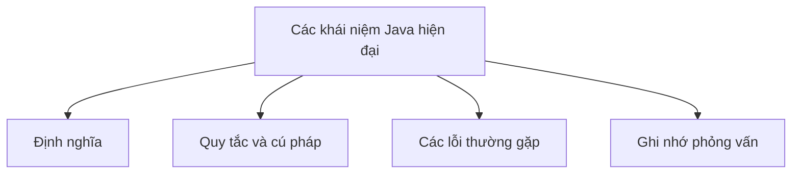

# 40 - Các khái niệm Java hiện đại cần biết (Modern Java Concepts)

Chủ đề này tuân theo đề cương chính trong [outline.md](../outline.md). Mục tiêu là hiểu sâu sắc từng khái niệm để có thể giải thích, nhận diện nó trong mã nguồn và trả lời các câu hỏi phỏng vấn.

## Trình tự học tập

- [Khái niệm var](theory/01-var-concepts.md)
- [Khái niệm Sequenced Collections](theory/02-sequenced-collections-concepts.md)
- [Các thuật ngữ chính](terms/01-key-terms.md)

## Danh sách kiểm tra Đề cương

- var
- Bản ghi (record)
- Lớp kín (sealed class)
- Khớp mẫu cho instanceof (pattern matching for instanceof)
- Biểu thức switch (switch expression)
- Khối văn bản (text block)
- Thông báo lỗi NullPointerException được cải thiện
- Luồng ảo (virtual thread)
- Lập trình đồng thời có cấu trúc cơ bản (structured concurrency)
- Khớp mẫu cho switch (pattern matching for switch)
- Bộ sưu tập có thứ tự (sequenced collection)
- Mẫu chuỗi (string template) từng là tính năng xem trước; hiện tại không nên dùng như một tính năng ổn định

## Thẻ Anki

- [Cơ bản](anki/basic.tsv)
- [Cơ bản bổ sung](anki/basic-extra.tsv)
- [Điền vào chỗ trống](anki/cloze.tsv)
- [Câu hỏi mã nguồn](anki/code-question.tsv)

## Tự kiểm tra (Self-Check)

Trước khi chuyển sang chủ đề tiếp theo, hãy xác nhận bạn có thể trả lời các câu hỏi sau:
1. Tại sao `var` thực hiện suy luận kiểu tại thời điểm biên dịch (compile-time type inference) thay vì định kiểu động (dynamic typing) tại thời điểm chạy (runtime), và bốn vị trí mà `var` bị cấm tiết lộ điều gì về việc giữ nguyên định kiểu tĩnh (static typing)?
   &rarr; Xem [Tại sao var là Suy Luận Tại Thời Điểm Biên Dịch Chứ Không Phải Kiểu Động](theory/01-var-concepts.md#why-var-is-compile-time-inference-not-dynamic-typing)
2. Tại sao các bản ghi Java (record) bất biến (immutable) theo thiết kế, và hàm khởi tạo chuẩn tắc (canonical constructor) do trình biên dịch tự tạo thực thi tính bất biến của trường (field) như thế nào?
   &rarr; Xem [Tại sao Records Đảm Bảo Tính Bất Biến Thông Qua Code Do Trình Biên Dịch Tạo Ra](theory/01-var-concepts.md#why-records-enforce-immutability-through-compiler-generated-code)
3. Tại sao các lớp kín (sealed class) cho phép khớp mẫu toàn diện (exhaustive pattern matching) trong biểu thức switch (switch expression), và sự đảm bảo an toàn của trình biên dịch so với hệ thống phân cấp lớp mở là gì?
   &rarr; Xem [Tại sao Sealed Classes Cho Phép Pattern Matching An Toàn Toàn Diện](theory/01-var-concepts.md#why-sealed-classes-enable-safe-exhaustive-pattern-matching)
4. Tại sao khớp mẫu cho switch (pattern matching for switch) yêu cầu sắp xếp các mẫu được bảo vệ (guarded pattern) từ cụ thể nhất đến tổng quát nhất, và quy tắc thống trị (dominance) nào ngăn chặn các trường hợp (case) không thể tiếp cận?
   &rarr; Xem [Tại sao Pattern Matching for Switch Yêu Cầu Sắp Xếp Theo Độ Cụ Thể](theory/01-var-concepts.md#why-pattern-matching-for-switch-requires-ordering-by-specificity)
5. Tại sao các luồng ảo (virtual thread) ghim (pin) luồng mang (carrier thread) của hệ điều hành khi bị chặn bên trong khối `synchronized`, và tại sao `ReentrantLock` lại là giải pháp?
   &rarr; Xem [Tại sao Virtual Threads Ghim Carrier Threads trong Synchronized Blocks](theory/01-var-concepts.md#why-virtual-threads-pin-carrier-threads-in-synchronized-blocks)

## Tổng quan Mermaid

## Liên kết tham khảo

- https://dev.java/learn/
- https://openjdk.org/jeps/0
