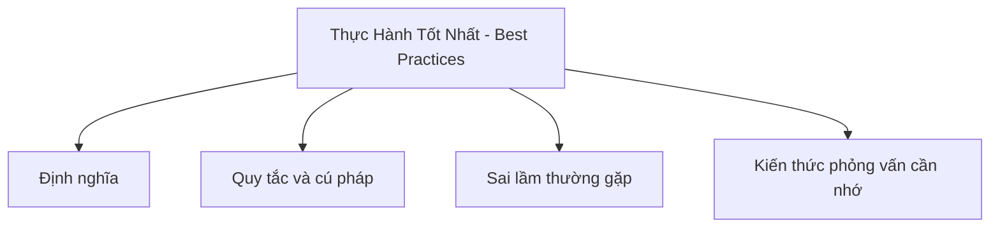

# 41 - Các Thực Hành Tốt Nhất (Best Practices) Trong Java

Chủ đề này bám sát đề cương chính trong [outline.md](../outline.md). Mục tiêu là hiểu sâu sắc từng khái niệm để có thể giải thích, nhận biết trong mã nguồn và trả lời các câu hỏi phỏng vấn.

## Thứ Tự Học Tập

- [Khái niệm Đặt tên biến, hàm và lớp rõ ràng](theory/01-name-variables-functions-and-classes-clearly-concepts.md)
- [Khái niệm Không nuốt ngoại lệ](theory/02-do-not-swallow-exceptions-concepts.md)
- [Thuật Ngữ Khóa](terms/01-key-terms.md)

## Danh Sách Nội Dung

- Đặt tên biến, hàm và lớp rõ ràng
- Viết mã theo quy ước
- Không lạm dụng static
- Không lạm dụng kế thừa
- Ưu tiên liên kết cấu thành hơn kế thừa (Prefer composition over inheritance)
- Ghi đè equals/hashCode chính xác
- Sử dụng StringBuilder khi nối chuỗi nhiều lần
- Sử dụng BigDecimal cho tiền tệ
- Sử dụng try-with-resources
- Không bắt ngoại lệ quá chung chung nếu không cần thiết
- Không nuốt ngoại lệ (swallow exception)
- Sử dụng kiểu giao diện (interface) khi khai báo Collection:
  - List<String> list = new ArrayList<>();
- Tránh sử dụng kiểu thô (raw type)
- Tránh null khi có thể
- Viết mã dễ kiểm thử (testable code)
- Phân tách trách nhiệm của lớp/phương thức
- Tính bất biến (immutability) khi thích hợp

## Thẻ Anki

- [Basic](anki/basic.tsv)
- [Basic Extra](anki/basic-extra.tsv)
- [Cloze](anki/cloze.tsv)
- [Code Question](anki/code-question.tsv)

## Tự Kiểm Tra

Trước khi chuyển sang chủ đề tiếp theo, hãy xác nhận rằng bạn có thể trả lời các câu hỏi sau:
1. Tại sao việc đặt tên mang tính mô tả cho biến, hàm và lớp lại cải thiện khả năng bảo trì mã nguồn, và nó ngăn chặn các phản mẫu đặt tên cụ thể nào (như biến một chữ cái hoặc tên được mã hóa) ?
   &rarr; Xem [Why Descriptive Naming Matters](theory/01-name-variables-functions-and-classes-clearly-concepts.md#why-descriptive-naming-matters)
2. Tại sao việc nuốt ngoại lệ (ví dụ: các khối catch trống) bị coi là một mối nguy hiểm nghiêm trọng đối với việc lập trình an toàn và gỡ lỗi, và cách ghi nhật ký (logging) hoặc lan truyền ngoại lệ giúp bảo toàn ngữ cảnh chẩn đoán như thế nào?
   &rarr; Xem [Why Exception Swallowing Is Dangerous](theory/02-do-not-swallow-exceptions-concepts.md#why-exception-swallowing-is-dangerous)
3. Tại sao Java lại ưu tiên các ngoại lệ được kiểm tra (checked exception) tùy chỉnh cho các điều kiện nghiệp vụ có thể phục hồi, nhưng lại ưu tiên các ngoại lệ không được kiểm tra (unchecked exception) cho các lỗi lập trình không thể phục hồi?
   &rarr; Xem [Why Custom Exceptions Group by Recovery Rationale](theory/02-do-not-swallow-exceptions-concepts.md#why-custom-exceptions-group-by-recovery-rationale)
4. Tại sao các con số ma thuật (magic number) và các giá trị mã cứng (hardcoded value) nên được trích xuất thành các hằng số, và lợi ích tối ưu hóa tại thời điểm biên dịch của việc sử dụng các hằng số `public static final` trong Java là gì?
   &rarr; Xem [Why Constants Prevent Magic Numbers](theory/01-name-variables-functions-and-classes-clearly-concepts.md#why-constants-prevent-magic-numbers)
5. Tại sao mẫu thiết kế mệnh đề bảo vệ "Trả về sớm" (Return Early) hoặc "Thất bại nhanh" (Fail Fast) được ưu tiên hơn các khối lệnh `if-else` lồng nhau sâu, và nó làm giảm tải nhận thức và việc theo dõi ngăn xếp như thế nào?
   &rarr; Xem [Why Guard Clauses Simplify Control Flow](theory/01-name-variables-functions-and-classes-clearly-concepts.md#why-guard-clauses-simplify-control-flow)

## Sơ Đồ Mermaid Tổng Quan

## Liên Kết Tham Khảo

- https://dev.java/learn/
- https://docs.oracle.com/javase/tutorial/
