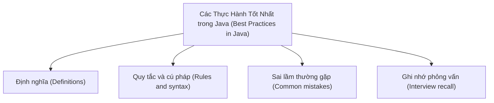

# 41 - Các Thực Hành Tốt Nhất trong Java (Best Practices in Java)

Chủ đề này tuân theo đề cương chính trong [outline.md](../outline.md). Mục tiêu là hiểu sâu từng khái niệm để có thể giải thích, nhận biết trong mã nguồn và trả lời các câu hỏi phỏng vấn.

## Thứ Tự Học Tập (Study Order)

- [Khái niệm Đặt tên Biến, Hàm và Lớp Rõ ràng (Name Variables Functions And Classes Clearly Concepts)](theory/01-name-variables-functions-and-classes-clearly-concepts.md)
- [Khái niệm Không Nuốt Ngoại lệ (Do Not Swallow Exceptions Concepts)](theory/02-do-not-swallow-exceptions-concepts.md)
- [Thuật ngữ Then chốt (Key Terms)](terms/01-key-terms.md)

## Danh Sách Đề Cương (Outline Checklist)

- Đặt tên biến, hàm và lớp một cách rõ ràng
- Viết mã theo đúng quy ước (convention)
- Không lạm dụng static
- Không lạm dụng kế thừa (inheritance)
- Ưu tiên lắp ghép (composition) hơn kế thừa (Prefer composition over inheritance)
- Ghi đè equals/hashCode đúng cách
- Sử dụng StringBuilder khi nối chuỗi nhiều lần
- Sử dụng BigDecimal cho tiền tệ
- Sử dụng try-with-resources
- Không bắt (catch) Exception quá chung chung nếu không cần thiết
- Không nuốt ngoại lệ (do not swallow exceptions)
- Sử dụng kiểu giao diện (interface type) khi khai báo bộ sưu tập:
  `List<String> list = new ArrayList<>();`
- Tránh sử dụng kiểu thô (raw type)
- Tránh sử dụng null khi có thể
- Viết mã nguồn có thể kiểm thử (testable code)
- Phân chia rõ ràng trách nhiệm của lớp/phương thức (Separate class/method responsibilities)
- Sử dụng tính bất biến (immutability) khi thích hợp

## Thẻ Anki (Anki Cards)

- [Cơ bản (Basic)](anki/basic.tsv)
- [Cơ bản Mở rộng (Basic Extra)](anki/basic-extra.tsv)
- [Điền vào chỗ trống (Cloze)](anki/cloze.tsv)
- [Câu hỏi Code (Code Question)](anki/code-question.tsv)

## Tự Kiểm Tra (Self-Check)

Trước khi chuyển sang chủ đề tiếp theo, hãy xác minh rằng bạn có thể trả lời các câu hỏi sau:
1. Tại sao việc đặt tên mang tính mô tả cho các biến, hàm và lớp lại cải thiện khả năng bảo trì của mã nguồn, và nó ngăn chặn những phản khuôn mẫu đặt tên (naming anti-patterns) cụ thể nào (như các biến một ký tự hoặc tên được mã hóa)?
   &rarr; Xem [Tại sao việc đặt tên mô tả lại Quan trọng (Why Descriptive Naming Matters)](theory/01-name-variables-functions-and-classes-clearly-concepts.md#why-descriptive-naming-matters)
2. Tại sao việc nuốt ngoại lệ (ví dụ: các khối catch trống) được coi là một mối nguy hiểm nghiêm trọng đối với việc lập trình an toàn và gỡ lỗi, và cách ghi nhật ký (logging) hoặc lan truyền ngoại lệ giúp bảo toàn ngữ cảnh chẩn đoán như thế nào?
   &rarr; Xem [Tại sao việc Nuốt Ngoại lệ lại Nguy hiểm (Why Exception Swallowing Is Dangerous)](theory/02-do-not-swallow-exceptions-concepts.md#why-exception-swallowing-is-dangerous)
3. Tại sao Java ưu tiên sử dụng các ngoại lệ có kiểm tra tự định nghĩa (custom checked exceptions) cho các điều kiện nghiệp vụ có thể phục hồi nhưng lại dùng ngoại lệ không kiểm tra (unchecked exceptions) cho các lỗi lập trình không thể phục hồi?
   &rarr; Xem [Tại sao Ngoại lệ Tự định nghĩa lại được Nhóm theo Lý do Phục hồi (Why Custom Exceptions Group by Recovery Rationale)](theory/02-do-not-swallow-exceptions-concepts.md#why-custom-exceptions-group-by-recovery-rationale)
4. Tại sao các con số ma thuật (magic numbers) và các giá trị viết cứng (hardcoded values) nên được tách ra thành các hằng số, và lợi ích tối ưu hóa tại thời điểm biên dịch của việc sử dụng các hằng số `public static final` trong Java là gì?
   &rarr; Xem [Tại sao Hằng số Giúp Ngăn chặn Con số Ma thuật (Why Constants Prevent Magic Numbers)](theory/01-name-variables-functions-and-classes-clearly-concepts.md#why-constants-prevent-magic-numbers)
5. Tại sao mô hình mệnh đề bảo vệ "Trả về sớm" (Return Early) hoặc "Thất bại nhanh" (Fail Fast) lại được ưu tiên hơn các khối lệnh `if-else` lồng nhau sâu, và nó giúp giảm tải nhận thức cũng như việc theo dõi dấu vết ngăn xếp (stack tracking) như thế nào?
   &rarr; Xem [Tại sao các Mệnh đề Bảo vệ Giúp Đơn giản hóa Luồng Kiểm soát (Why Guard Clauses Simplify Control Flow)](theory/01-name-variables-functions-and-classes-clearly-concepts.md#why-guard-clauses-simplify-control-flow)

## Sơ Đồ Tổng Quan (Mermaid Overview)

## Liên Kết Tham Khảo (Reference Links)

- https://dev.java/learn/
- https://docs.oracle.com/javase/tutorial/
