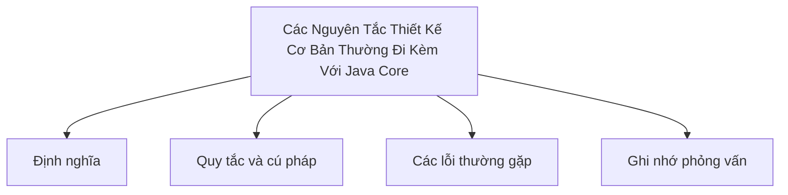

# 42 - Các Nguyên Tắc Thiết Kế Cơ Bản Thường Đi Kèm Với Java Core (Basic Design Principles)

Chủ đề này bám sát đề cương chính trong [outline.md](../outline.md). Mục tiêu là hiểu sâu từng khái niệm để có thể giải thích, nhận diện trong mã nguồn và trả lời các câu hỏi phỏng vấn.

## Thứ Tự Học Tập (Study Order)

- [Khái Niệm SOLID](theory/01-solid-concepts.md)
- [Thuật Ngữ Chính](terms/01-key-terms.md)

## Checklist Đề Cương (Outline Checklist)

- SOLID
- DRY
- KISS
- YAGNI
- Ưu tiên thành phần hơn kế thừa (Composition over inheritance)
- Tính liên kết/phụ thuộc (Coupling)
- Tính gắn kết (Cohesion)
- Tiêm phụ thuộc cơ bản (Dependency Injection)
- Lập trình phòng thủ (Defensive programming)
- Quy tắc viết code sạch cơ bản (Clean Code)

## Thẻ Anki (Anki Cards)

- [Cơ Bản (Basic)](anki/basic.tsv)
- [Cơ Bản Mở Rộng (Basic Extra)](anki/basic-extra.tsv)
- [Điền Khuyết (Cloze)](anki/cloze.tsv)
- [Câu Hỏi Code (Code Question)](anki/code-question.tsv)

## Tổng Quan Sơ Đồ Mermaid (Mermaid Overview)

## Tự Kiểm Tra (Self-Check)

Trước khi chuyển sang chủ đề tiếp theo, hãy xác minh rằng bạn có thể trả lời các câu hỏi sau:
1. Tại sao Nguyên tắc Đơn trách nhiệm (Single Responsibility Principle - SRP) quy định rằng một lớp chỉ nên có "duy nhất một lý do để thay đổi", và tính gắn kết (cohesion) cao làm giảm tính liên kết (coupling) giữa các lớp thế nào?
   &rarr; Xem [Tại Sao Đơn Trách Nhiệm Thúc Đẩy Tính Gắn Kết Cao](theory/01-solid-concepts.md#tai-sao-don-trach-nhiem-thuc-day-tinh-gan-ket-cao)
2. Tại sao Nguyên tắc Đóng/Mở (Open/Closed Principle - OCP) ủng hộ việc mở rộng hành vi mà không cần sửa đổi mã nguồn gốc, và tính đa hình (polymorphism) cũng như các interface cho phép thiết kế này hoạt động thế nào?
   &rarr; Xem [Tại Sao Nguyên Tắc Đóng/Mở Bảo Vệ Mã Nguồn Hiện Có](theory/01-solid-concepts.md#tai-sao-nguyen-tac-dongmo-bao-ve-ma-nguon-hien-co)
3. Tại sao Nguyên tắc Thay thế Liskov (Liskov Substitution Principle - LSP) cấm các lớp con vi phạm các hợp đồng hành vi của các lớp cha (và làm thế nào một tham chiếu kiểu cha đảm bảo tính thay thế được của các kiểu con)?
   &rarr; Xem [Tại Sao Nguyên Tắc Thay Thế Liskov Thực Thi Các Hợp Đồng Hành Vi](theory/01-solid-concepts.md#tai-sao-nguyen-tac-thay-the-liskov-thuc-thi-cac-hop-dong-hanh-vi)
4. Tại sao Nguyên tắc Phân tách Interface (Interface Segregation Principle - ISP) ưu tiên nhiều interface nhỏ, phục vụ riêng cho từng client hơn là một interface duy nhất phình to, và nó ngăn chặn tính liên kết interface phình to (fat interface coupling) như thế nào?
   &rarr; Xem [Tại Sao Phân Tách Interface Ngăn Chặn Liên Kết Interface Phình To](theory/01-solid-concepts.md#tai-sao-phan-tach-interface-ngan-chan-lien-ket-interface-phinh-to)
5. Tại sao Nguyên tắc Đảo ngược Phụ thuộc (Dependency Inversion Principle - DIP) phát biểu rằng các module cấp cao nên phụ thuộc vào các trừu tượng (abstraction) thay vì các triển khai cụ thể (concrete implementation), và Tiêm phụ thuộc (Dependency Injection) hiện thực hóa nguyên tắc này như thế nào?
   &rarr; Xem [Tại Sao Đảo Ngược Phụ Thuộc Giúp Tách Biệt Các Module](theory/01-solid-concepts.md#tai-sao-dao-nguoc-phu-thuoc-giup-tach-biet-cac-module)

## Liên Kết Tham Khảo (Reference Links)

- https://docs.oracle.com/javase/tutorial/java/concepts/
