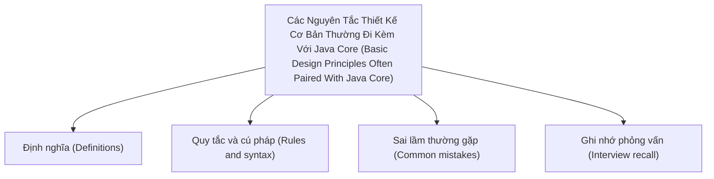

# 42 - Các Nguyên Tắc Thiết Kế Cơ Bản Thường Đi Kèm Với Java Core (Basic Design Principles Often Paired With Java Core)

Chủ đề này tuân theo đề cương chính trong [outline.md](../outline.md). Mục tiêu là hiểu sâu từng khái niệm để có thể giải thích, nhận biết trong mã nguồn và trả lời các câu hỏi phỏng vấn.

## Thứ Tự Học Tập (Study Order)

- [Khái niệm SOLID (Solid Concepts)](theory/01-solid-concepts.md)
- [Thuật ngữ Then chốt (Key Terms)](terms/01-key-terms.md)

## Danh Sách Đề Cương (Outline Checklist)

- SOLID
- DRY (Don't Repeat Yourself)
- KISS (Keep It Simple, Stupid)
- YAGNI (You Aren't Gonna Need It)
- Composition over inheritance (Ưu tiên lắp ghép hơn kế thừa)
- Coupling (Độ liên kết)
- Cohesion (Độ gắn kết)
- Tiêm phụ thuộc cơ bản (Basic Dependency Injection)
- Lập trình phòng ngừa (Defensive programming)
- Viết mã sạch cơ bản (Basic Clean Code)

## Thẻ Anki (Anki Cards)

- [Cơ bản (Basic)](anki/basic.tsv)
- [Cơ bản Mở rộng (Basic Extra)](anki/basic-extra.tsv)
- [Điền vào chỗ trống (Cloze)](anki/cloze.tsv)
- [Câu hỏi Code (Code Question)](anki/code-question.tsv)

## Sơ Đồ Tổng Quan (Mermaid Overview)

## Tự Kiểm Tra (Self-Check)

Trước khi chuyển sang chủ đề tiếp theo, hãy xác minh rằng bạn có thể trả lời các câu hỏi sau:
1. Tại sao Nguyên lý Đơn Trách Nhiệm (Single Responsibility Principle - SRP) quy định rằng một lớp chỉ nên có "một lý do duy nhất để thay đổi", và tính liên kết cao (high cohesion) giúp giảm liên kết lớp (class coupling) như thế nào?
   &rarr; Xem [Tại sao Nguyên lý Đơn Trách Nhiệm Khuyến Khích Tính Liên Kết Cao (Why Single Responsibility Promotes High Cohesion)](theory/01-solid-concepts.md#why-single-responsibility-promotes-high-cohesion)
2. Tại sao Nguyên lý Đóng/Mở (Open/Closed Principle - OCP) chủ trương mở rộng hành vi mà không sửa đổi mã nguồn hiện tại, và tính đa hình (Polymorphism) cũng như giao diện (interfaces) hỗ trợ thiết kế này như thế nào?
   &rarr; Xem [Tại sao Nguyên lý Đóng/Mở Bảo vệ Mã nguồn Hiện tại (Why Open/Closed Principle Protects Existing Code)](theory/01-solid-concepts.md#why-openclosed-principle-protects-existing-code)
3. Tại sao Nguyên lý Thay thế Liskov (Liskov Substitution Principle - LSP) cấm các lớp con vi phạm các giao ước hành vi của lớp cha (và cách tham chiếu lớp cha đảm bảo tính thay thế được của kiểu con)?
   &rarr; Xem [Tại sao Nguyên lý Thay thế Liskov Thực thi các Giao ước Hành vi (Why Liskov Substitution Principle Enforces Behavioral Contracts)](theory/01-solid-concepts.md#why-liskov-substitution-principle-enforces-behavioral-contracts)
4. Tại sao Nguyên lý Phân tách Giao diện (Interface Segregation Principle - ISP) ưu tiên nhiều giao diện nhỏ, đặc thù cho từng máy khách thay vì một giao diện cồng kềnh duy nhất, và nó ngăn chặn sự liên kết giao diện béo (fat interface coupling) như thế nào?
   &rarr; Xem [Tại sao Phân tách Giao diện Ngăn chặn Liên kết Giao diện Béo (Why Interface Segregation Prevents Fat Interface Coupling)](theory/01-solid-concepts.md#why-interface-segregation-prevents-fat-interface-coupling)
5. Tại sao Nguyên lý Đảo ngược Phụ thuộc (Dependency Inversion Principle - DIP) tuyên bố rằng các mô-đun cấp cao nên phụ thuộc vào các trừu tượng (abstractions) thay vì các triển khai cụ thể (concrete implementations), và Tiêm Phụ thuộc (Dependency Injection) hiện thực hóa nguyên lý này như thế nào?
   &rarr; Xem [Tại sao Đảo ngược Phụ thuộc Giúp Tách rời các Mô-đun (Why Dependency Inversion Decouples Modules)](theory/01-solid-concepts.md#why-dependency-inversion-decouples-modules)

## Liên Kết Tham Khảo (Reference Links)

- https://docs.oracle.com/javase/tutorial/java/concepts/
