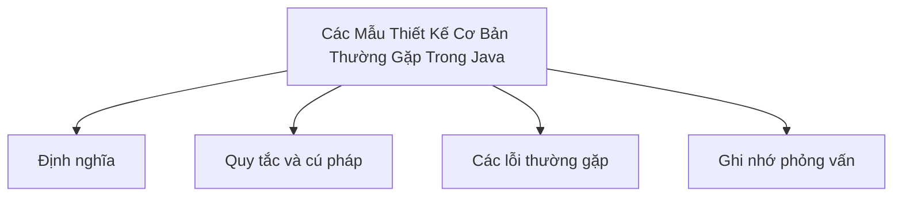

# 43 - Các Mẫu Thiết Kế Cơ Bản Thường Gặp Trong Java (Basic Design Patterns)

Chủ đề này bám sát đề cương chính trong [outline.md](../outline.md). Mục tiêu là hiểu sâu từng khái niệm để có thể giải thích, nhận diện trong mã nguồn và trả lời các câu hỏi phỏng vấn.

## Thứ Tự Học Tập (Study Order)

- [Khái Niệm Singleton](theory/01-singleton-concepts.md)
- [Khái Niệm Observer](theory/02-observer-concepts.md)
- [Thuật Ngữ Chính](terms/01-key-terms.md)

## Checklist Đề Cương (Outline Checklist)

- Singleton
- Factory Method
- Abstract Factory
- Builder
- Prototype
- Adapter
- Decorator
- Facade
- Proxy
- Strategy
- Observer
- Template Method
- Command
- Iterator
- State
- MVC
- DAO
- DTO
- Repository
- Service Layer (Tầng Dịch Vụ)

## Thẻ Anki (Anki Cards)

- [Cơ Bản (Basic)](anki/basic.tsv)
- [Cơ Bản Mở Rộng (Basic Extra)](anki/basic-extra.tsv)
- [Điền Khuyết (Cloze)](anki/cloze.tsv)
- [Câu Hỏi Code (Code Question)](anki/code-question.tsv)

## Tự Kiểm Tra (Self-Check)

Trước khi chuyển sang chủ đề tiếp theo, hãy xác minh rằng bạn có thể trả lời các câu hỏi sau:
1. Tại sao mẫu thiết kế Singleton được sử dụng để giới hạn một lớp chỉ có một thực thể duy nhất, và cơ chế khóa kiểm tra hai lần (double-checked locking - sử dụng `volatile`) đảm bảo việc khởi tạo lười (lazy initialization) an toàn luồng như thế nào?
   &rarr; Xem [Tại Sao Khóa Kiểm Tra Hai Lần Đảm Bảo Singleton An Toàn Luồng](theory/01-singleton-concepts.md#tai-sao-khoa-kiem-tra-hai-lan-dam-bao-singleton-an-toan-luong)
2. Tại sao triển khai Bill Pugh Singleton (sử dụng một lớp helper static nội bộ) được ưa chuộng hơn khởi tạo lười đồng bộ (synchronized lazy instantiation), và việc tải lớp của JVM đảm bảo an toàn luồng thế nào?
   &rarr; Xem [Tại Sao Bill Pugh Singleton Đạt Được Khởi Tạo Lười An Toàn Luồng](theory/01-singleton-concepts.md#tai-sao-bill-pugh-singleton-dat-duoc-khoi-tao-luoi-an-toan-luong)
3. Tại sao mẫu thiết kế Observer định nghĩa một mối quan hệ phụ thuộc một-nhiều giữa các đối tượng, và việc đăng ký/thông báo cho các observer giúp giảm phụ thuộc (decouple) đối tượng chính (subject) khỏi các observer cụ thể thế nào?
   &rarr; Xem [Tại Sao Mẫu Observer Giúp Giảm Phụ Thuộc Giữa Đối Tượng Chính Và Các Observer](theory/02-observer-concepts.md#tai-sao-mau-observer-giup-giam-phu-thuoc-giua-doi-tuong-chinh-va-cac-observer)
4. Tại sao mẫu thiết kế Factory Method được ưa chuộng hơn khởi tạo hàm khởi tạo trực tiếp (sử dụng từ khóa `new`), và nó trì hoãn quyết định khởi tạo cho các lớp con như thế nào?
   &rarr; Xem [Tại Sao Factory Method Trì Hoãn Việc Khởi Tạo Đối Tượng](theory/01-singleton-concepts.md#tai-sao-factory-method-tri-hoan-viec-khoi-tao-doi-tuyen)
5. Tại sao mẫu thiết kế Builder được sử dụng để xây dựng các đối tượng phức tạp, và nó giải quyết phản khuôn mẫu hàm khởi tạo hình kính viễn vọng (telescoping constructor anti-pattern) như thế nào?
   &rarr; Xem [Tại Sao Mẫu Thiết Kế Builder Thay Thế Hàm Khởi Tạo Hình Kính Viễn Vọng](theory/01-singleton-concepts.md#tai-sao-mau-thiet-ke-builder-thay-the-ham-khoi-tao-hinh-kinh-vien-vong)

## Tổng Quan Sơ Đồ Mermaid (Mermaid Overview)

## Liên Kết Tham Khảo (Reference Links)

- https://refactoring.guru/design-patterns
- https://docs.oracle.com/javase/tutorial/java/concepts/
