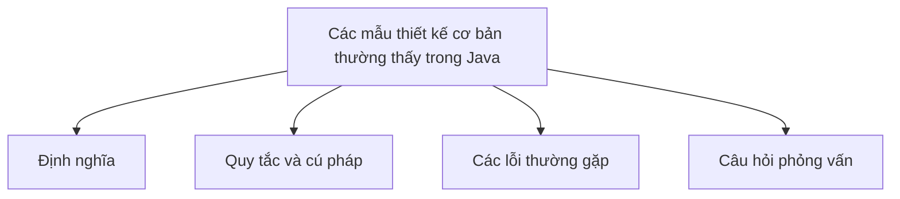

# 43 - Các mẫu thiết kế cơ bản thường thấy trong Java (Basic Design Patterns Commonly Seen in Java)

Chủ đề này bám sát đề cương chính trong [outline.md](../outline.md). Mục tiêu là hiểu sâu sắc từng khái niệm để có thể giải thích, nhận biết trong mã nguồn và trả lời các câu hỏi phỏng vấn.

## Thứ tự học tập (Study Order)

- [Các khái niệm Singleton (Singleton Concepts)](theory/01-singleton-concepts.md)
- [Các khái niệm Observer (Observer Concepts)](theory/02-observer-concepts.md)
- [Thuật ngữ chính (Key Terms)](terms/01-key-terms.md)

## Danh sách kiểm tra đề cương (Outline Checklist)

- Singleton
- Factory Method
- Abstract Factory
- Builder
- Prototype
- Adapter
- Decorator
- Facade
- Proxy
- Strategy
- Observer
- Template Method
- Command
- Iterator
- State
- MVC
- DAO
- DTO
- Repository
- Tầng dịch vụ (Service Layer)

## Thẻ Anki (Anki Cards)

- [Basic](anki/basic.tsv)
- [Basic Extra](anki/basic-extra.tsv)
- [Cloze](anki/cloze.tsv)
- [Code Question](anki/code-question.tsv)

## Tự kiểm tra (Self-Check)

Trước khi chuyển sang chủ đề tiếp theo, hãy đảm bảo bạn có thể trả lời các câu hỏi sau:
1. Tại sao mẫu Singleton được sử dụng để giới hạn một lớp chỉ có một thực thể duy nhất, và làm thế nào cơ chế khóa kiểm tra hai lần (double-checked locking mechanism) (sử dụng từ khóa `volatile`) đảm bảo quá trình khởi tạo lười biếng (lazy initialization) an toàn đa luồng?
   &rarr; Xem [Tại sao Khóa kiểm tra hai lần đảm bảo Singleton an toàn đa luồng](theory/01-singleton-concepts.md#why-double-checked-locking-ensures-thread-safe-singleton)
2. Tại sao triển khai Singleton kiểu Bill Pugh (Bill Pugh Singleton implementation) (sử dụng lớp tiện ích tĩnh nội bộ (inner static helper class)) được ưa chuộng hơn khởi tạo lười biếng được đồng bộ hóa (synchronized lazy instantiation), và cơ chế nạp lớp (class loading) của JVM đảm bảo an toàn đa luồng như thế nào?
   &rarr; Xem [Tại sao Singleton kiểu Bill Pugh đạt được khởi tạo lười biếng an toàn đa luồng](theory/01-singleton-concepts.md#why-bill-pugh-singleton-achieves-thread-safe-lazy-initialization)
3. Tại sao mẫu Observer định nghĩa mối quan hệ phụ thuộc một-nhiều giữa các đối tượng, và việc đăng ký/thông báo cho các observer giúp tách rời (decouple) chủ thể (subject) khỏi các observer cụ thể (concrete observers) như thế nào?
   &rarr; Xem [Tại sao mẫu Observer giúp tách rời chủ thể khỏi các Observer](theory/02-observer-concepts.md#why-the-observer-pattern-decouples-subjects-from-observers)
4. Tại sao mẫu Factory Method được ưa chuộng hơn việc khởi tạo trực tiếp bằng hàm khởi tạo (sử dụng từ khóa `new`), và nó chuyển giao quyết định khởi tạo cho các lớp con như thế nào?
   &rarr; Xem [Tại sao Factory Method chuyển giao quyết định khởi tạo đối tượng](theory/01-singleton-concepts.md#why-factory-method-defers-object-instantiation)
5. Tại sao mẫu Builder được sử dụng để xây dựng các đối tượng phức tạp, và nó giải quyết anti-pattern hàm khởi tạo phình to (telescoping constructor anti-pattern) như thế nào?
   &rarr; Xem [Tại sao mẫu Builder thay thế hàm khởi tạo phình to](theory/01-singleton-concepts.md#why-the-builder-pattern-replaces-telescoping-constructors)

## Sơ đồ tổng quan (Mermaid Overview)

## Liên kết tham khảo (Reference Links)

- https://refactoring.guru/design-patterns
- https://docs.oracle.com/javase/tutorial/java/concepts/
