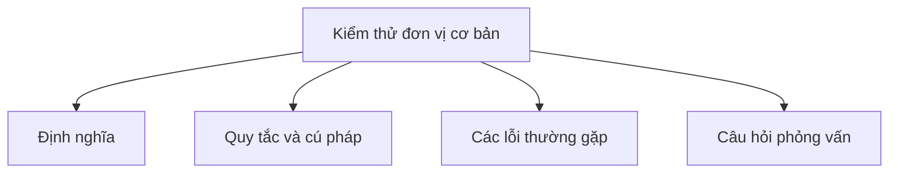

# 44 - Kiểm thử đơn vị cơ bản (Basic Unit Testing)

Chủ đề này bám sát đề cương chính trong [outline.md](../outline.md). Mục tiêu là hiểu sâu sắc từng khái niệm để có thể giải thích, nhận biết trong mã nguồn và trả lời các câu hỏi phỏng vấn.

## Thứ tự học tập (Study Order)

- [Các khái niệm JUnit (Junit Concepts)](theory/01-junit-concepts.md)
- [Các khái niệm Kiểm thử ngoại lệ (Test Exception Concepts)](theory/02-test-exception-concepts.md)
- [Thuật ngữ chính (Key Terms)](terms/01-key-terms.md)

## Danh sách kiểm tra đề cương (Outline Checklist)

- JUnit
- Ca kiểm thử (Test case)
- Khẳng định (Assertion)
- @Test
- @BeforeEach
- @AfterEach
- @BeforeAll
- @AfterAll
- Mockito cơ bản
- Đối tượng giả lập (Mock object)
- Kiểm thử ngoại lệ (Test exception)
- Kiểm thử gián tiếp logic private (Test private logic indirectly)
- Độ bao phủ mã nguồn cơ bản (Basic code coverage)

## Thẻ Anki (Anki Cards)

- [Basic](anki/basic.tsv)
- [Basic Extra](anki/basic-extra.tsv)
- [Cloze](anki/cloze.tsv)
- [Code Question](anki/code-question.tsv)

## Tự kiểm tra (Self-Check)

Trước khi chuyển sang chủ đề tiếp theo, hãy đảm bảo bạn có thể trả lời các câu hỏi sau:
1. Tại sao Mockito lại giả lập (mock) các phụ thuộc thay vì khởi tạo chúng trực tiếp, và vấn đề cô lập kiểm thử (test isolation problem) nào được giải quyết nhờ điều này?
   &rarr; Xem [Tại sao Giả lập giúp cô lập đơn vị được kiểm thử](theory/01-junit-concepts.md#why-mocking-isolates-the-unit-under-test)
2. Tại sao theo mặc định, JUnit 5 tạo một thực thể lớp kiểm thử mới cho mỗi phương thức `@Test`, và `@TestInstance(PER_CLASS)` thay đổi điều này như thế nào?
   &rarr; Xem [Tại sao JUnit tạo một thực thể mới cho mỗi phương thức kiểm thử](theory/01-junit-concepts.md#why-junit-creates-a-new-instance-per-test-method)
3. Tại sao không bao giờ nên kiểm thử trực tiếp các phương thức private thông qua reflection, và khi nào một phương thức private "khó kiểm thử" báo hiệu một vấn đề về thiết kế?
   &rarr; Xem [Tại sao các phương thức Private nên được kiểm thử gián tiếp qua API công khai](theory/02-test-exception-concepts.md#why-private-methods-should-be-tested-indirectly-through-the-public-api)
4. Tại sao `assertThrows` trả về ngoại lệ được ném ra, và lỗi khẳng định cụ thể nào do mẫu try-catch cũ gây ra?
   &rarr; Xem [Tại sao assertThrows an toàn hơn Try-Catch để kiểm thử ngoại lệ](theory/02-test-exception-concepts.md#why-assertthrows-is-safer-than-try-catch-for-exception-testing)
5. Tại sao độ bao phủ mã nguồn (code coverage) 100% không đảm bảo chất lượng kiểm thử, và anti-pattern khẳng định cụ thể nào tạo ra độ bao phủ cao nhưng không có giá trị bắt lỗi?
   &rarr; Xem [Tại sao Độ bao phủ mã nguồn là chỉ số chất lượng cần thiết nhưng chưa đủ](theory/02-test-exception-concepts.md#why-code-coverage-is-a-necessary-but-insufficient-quality-metric)

## Sơ đồ tổng quan (Mermaid Overview)

## Liên kết tham khảo (Reference Links)

- https://junit.org/junit5/docs/current/user-guide/
