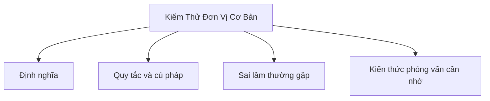

# 44 - Kiểm Thử Đơn Vị Cơ Bản (Basic Unit Testing)

Chủ đề này bám sát đề cương chính trong [outline.md](../outline.md). Mục tiêu là hiểu sâu sắc từng khái niệm để có thể giải thích, nhận biết trong mã nguồn và trả lời các câu hỏi phỏng vấn.

## Thứ Tự Học Tập

- [Khái niệm Junit](theory/01-junit-concepts.md)
- [Khái niệm Kiểm thử ngoại lệ](theory/02-test-exception-concepts.md)
- [Thuật Ngữ Khóa](terms/01-key-terms.md)

## Danh Sách Nội Dung

- JUnit
- Test case (Trường hợp kiểm thử)
- Khẳng định (Assertion)
- @Test
- @BeforeEach
- @AfterEach
- @BeforeAll
- @AfterAll
- Mockito cơ bản
- Đối tượng giả lập (Mock object)
- Kiểm thử ngoại lệ
- Kiểm thử gián tiếp logic private
- Độ bao phủ mã nguồn cơ bản (Basic code coverage)

## Thẻ Anki

- [Basic](anki/basic.tsv)
- [Basic Extra](anki/basic-extra.tsv)
- [Cloze](anki/cloze.tsv)
- [Code Question](anki/code-question.tsv)

## Tự Kiểm Tra

Trước khi chuyển sang chủ đề tiếp theo, hãy xác nhận rằng bạn có thể trả lời các câu hỏi sau:
1. Tại sao Mockito lại giả lập (mock) các phụ thuộc thay vì khởi tạo chúng, và điều này giải quyết vấn đề cô lập kiểm thử (test isolation) nào?
   &rarr; Xem [Why Mocking Isolates the Unit Under Test](theory/01-junit-concepts.md#why-mocking-isolates-the-unit-under-test)
2. Tại sao theo mặc định JUnit 5 tạo một thể hiện lớp kiểm thử mới cho mỗi phương thức `@Test`, và `@TestInstance(PER_CLASS)` thay đổi điều này như thế nào?
   &rarr; Xem [Why JUnit Creates a New Instance Per Test Method](theory/01-junit-concepts.md#why-junit-creates-a-new-instance-per-test-method)
3. Tại sao không nên kiểm thử trực tiếp các phương thức private qua phản chiếu (reflection), và khi nào một phương thức private "khó kiểm thử" lại là dấu hiệu của một vấn đề thiết kế?
   &rarr; Xem [Why Private Methods Should Be Tested Indirectly Through the Public API](theory/02-test-exception-concepts.md#why-private-methods-should-be-tested-indirectly-through-the-public-api)
4. Tại sao `assertThrows` trả về ngoại lệ được ném ra, và lỗi khẳng định cụ thể nào do mẫu try-catch cũ gây ra?
   &rarr; Xem [Why assertThrows Is Safer Than Try-Catch for Exception Testing](theory/02-test-exception-concepts.md#why-assertthrows-is-safer-than-try-catch-for-exception-testing)
5. Tại sao độ bao phủ mã nguồn (code coverage) 100% không đảm bảo chất lượng kiểm thử, và phản mẫu khẳng định cụ thể nào tạo ra độ bao phủ cao nhưng lại không có giá trị phát hiện lỗi?
   &rarr; Xem [Why Code Coverage Is a Necessary but Insufficient Quality Metric](theory/02-test-exception-concepts.md#why-code-coverage-is-a-necessary-but-insufficient-quality-metric)

## Sơ Đồ Mermaid Tổng Quan

## Liên Kết Tham Khảo

- https://junit.org/junit5/docs/current/user-guide/
