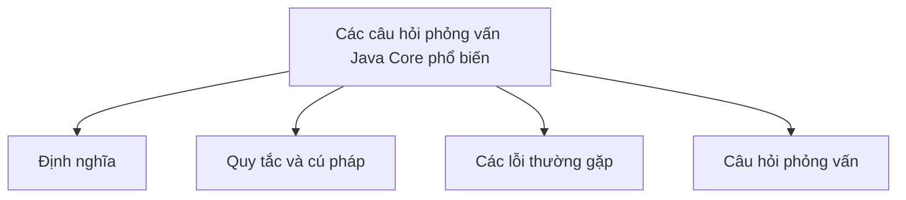

# 45 - Các câu hỏi phỏng vấn Java Core phổ biến (Common Java Core Interview Questions)

Chủ đề này bám sát đề cương chính trong [outline.md](../outline.md). Mục tiêu là hiểu sâu sắc từng khái niệm để có thể giải thích, nhận biết trong mã nguồn và trả lời các câu hỏi phỏng vấn.

## Thứ tự học tập (Study Order)

- [Sự khác biệt giữa các khái niệm JVM, JDK và JRE (How Are Jvm Jdk And Jre Different Concepts)](theory/01-how-are-jvm-jdk-and-jre-different-concepts.md)
- [Cơ chế loại bỏ trùng lặp của HashSet (How Does Hashset Remove Duplicates Concepts)](theory/02-how-does-hashset-remove-duplicates-concepts.md)
- [Sự khác biệt giữa Comparable và Comparator (How Are Comparable And Comparator Different Concepts)](theory/03-how-are-comparable-and-comparator-different-concepts.md)
- [Sự khác biệt giữa map và flatMap (How Are Map And FlatMap Different Concepts)](theory/04-how-are-map-and-flatmap-different-concepts.md)
- [Thuật ngữ chính (Key Terms)](terms/01-key-terms.md)

## Danh sách kiểm tra đề cương (Outline Checklist)

- Sự khác biệt giữa JVM, JDK và JRE?
- Java có truyền tham chiếu (pass references) không?
- Sự khác biệt giữa toán tử == và phương thức .equals()?
- Tại sao String là bất biến (immutable)?
- Sự khác biệt giữa String, StringBuilder và StringBuffer?
- HashMap hoạt động như thế nào?
- Những cải tiến nào của HashMap trong Java 8?
- Sự khác biệt giữa ArrayList và LinkedList?
- Cách HashSet loại bỏ các phần tử trùng lặp?
- Sự khác biệt giữa final, finally và finalize?
- Sự khác biệt giữa ngoại lệ checked (checked exceptions) và unchecked (unchecked exceptions)?
- Sự khác biệt giữa lớp trừu tượng (abstract class) và giao diện (interface)?
- Sự khác biệt giữa nạp chồng (overload) và ghi đè (override)?
- Các phương thức tĩnh (static methods) có thể bị ghi đè không?
- Các hàm khởi tạo (constructors) có được kế thừa không?
- Sự khác biệt giữa từ khóa this và super?
- Sự khác biệt giữa Comparable và Comparator?
- Sự khác biệt giữa fail-fast và fail-safe iterators?
- Sự khác biệt giữa volatile và synchronized?
- Bế tắc (deadlock) là gì?
- Sự khác biệt giữa phương thức start() và run() của Thread?
- Sự khác biệt giữa sleep() và wait()?
- Sự khác biệt giữa notify() và notifyAll()?
- Stream API có lười biếng (lazy) không?
- Sự khác biệt giữa map() và flatMap()?
- Sự khác biệt giữa orElse() và orElseGet()?
- Sự khác biệt giữa HashMap, Hashtable và ConcurrentHashMap?
- Tại sao việc ghi đè equals() bắt buộc phải ghi đè hashCode()?
- Thu gom rác (Garbage Collection) hoạt động như thế nào?
- Sự khác biệt giữa Stack và Heap?

## Tự kiểm tra (Self-Check)

Trước khi chuyển sang chủ đề tiếp theo, hãy đảm bảo bạn có thể trả lời các câu hỏi sau:
1. Tại sao JDK, JRE và JVM phục vụ các mục đích khác nhau trong vòng đời phát triển phần mềm, và sự khác biệt của chúng ở runtime và cấp độ trình biên dịch là gì?
   &rarr; Xem [Tại sao JDK, JRE và JVM khác nhau](theory/01-how-are-jvm-jdk-and-jre-different-concepts.md#why-jdk-jre-and-jvm-differ)
2. Tại sao `HashSet` loại bỏ các phần tử trùng lặp, và nó tận dụng thao tác put của `HashMap` bên dưới để thực thi ràng buộc phần tử duy nhất như thế nào?
   &rarr; Xem [Tại sao HashSet tận dụng HashMap để loại bỏ trùng lặp](theory/02-how-does-hashset-remove-duplicates-concepts.md#why-hashset-leverages-hashmap-to-remove-duplicates)
3. Tại sao `Comparable` và `Comparator` phục vụ các mục đích thiết kế sắp xếp khác nhau, và sự khác biệt giữa thứ tự tự nhiên (natural ordering) so với các quy tắc sắp xếp tùy chỉnh bên ngoài là gì?
   &rarr; Xem [Tại sao Comparable và Comparator khác nhau trong thiết kế sắp xếp](theory/03-how-are-comparable-and-comparator-different-concepts.md#why-comparable-and-comparator-differ-in-sorting-design)
4. Tại sao các thao tác `map` và `flatMap` trong Stream có các chữ ký biến đổi khác nhau, và làm phẳng (flatten) một cấu trúc stream nghĩa là gì?
   &rarr; Xem [Tại sao các thao tác Stream map và flatMap khác nhau](theory/04-how-are-map-and-flatmap-different-concepts.md#why-map-and-flatmap-stream-operations-differ)
5. Tại sao việc xác thực kiểu generic (generic type verification) ở thời điểm biên dịch của Java lại khác với hành vi thực thi ở thời điểm chạy, và những lỗi ép kiểu ở runtime nào có thể xảy ra do sử dụng các kiểu thô (raw types)?
   &rarr; Xem [Tại sao việc xác thực Generic lúc biên dịch khác với thời điểm chạy](theory/04-how-are-map-and-flatmap-different-concepts.md#why-generic-compile-time-verification-differs-from-runtime)

## Thẻ Anki (Anki Cards)

- [Basic](anki/basic.tsv)
- [Basic Extra](anki/basic-extra.tsv)
- [Cloze](anki/cloze.tsv)
- [Code Question](anki/code-question.tsv)

## Sơ đồ tổng quan (Mermaid Overview)

## Liên kết tham khảo (Reference Links)

- https://docs.oracle.com/javase/tutorial/
- https://dev.java/learn/
