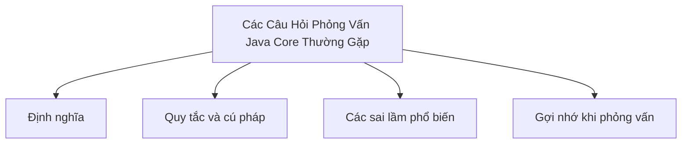

# 45 - Các Câu Hỏi Phỏng Vấn Java Core Thường Gặp (Common Java Core Interview Questions)

Chủ đề này bám sát đề cương chính trong [outline.md](../../outline.md). Mục tiêu là hiểu sâu sắc từng khái niệm để có thể giải thích, nhận diện trong mã nguồn và trả lời tốt các câu hỏi phỏng vấn thực tế.

## Thứ Tự Học Tập (Study Order)

- [Sự Khác Biệt Giữa JVM, JDK Và JRE (How Are Jvm Jdk And Jre Different Concepts)](theory/01-how-are-jvm-jdk-and-jre-different-concepts.md)
- [Cách HashSet Loại Bỏ Các Phần Tử Trùng Lặp (How Does Hashset Remove Duplicates Concepts)](theory/02-how-does-hashset-remove-duplicates-concepts.md)
- [Sự Khác Biệt Giữa Comparable Và Comparator (How Are Comparable And Comparator Different Concepts)](theory/03-how-are-comparable-and-comparator-different-concepts.md)
- [Sự Khác Biệt Giữa map Và flatMap (How Are Map And Flatmap Different Concepts)](theory/04-how-are-map-and-flatmap-different-concepts.md)
- [Các Thuật Ngữ Khóa (Key Terms)](terms/01-key-terms.md)

## Danh Sách Đề Cương (Outline Checklist)

- Sự khác biệt giữa JVM, JDK và JRE là gì?
- Có phải Java truyền tham chiếu (pass references)?
- Sự khác biệt giữa toán tử `==` và phương thức `.equals()` là gì?
- Tại sao String lại bất biến (immutable)?
- Sự khác biệt giữa String, StringBuilder và StringBuffer là gì?
- Lớp HashMap hoạt động như thế nào?
- Những cải tiến nào đã được áp dụng cho HashMap trong Java 8?
- Sự khác biệt giữa ArrayList và LinkedList là gì?
- Cách HashSet loại bỏ các phần tử trùng lặp?
- Sự khác biệt giữa final, finally và finalize là gì?
- Sự khác biệt giữa checked exception và unchecked exception là gì?
- Sự khác biệt giữa abstract class (lớp trừu tượng) và interface (giao diện) là gì?
- Sự khác biệt giữa nạp chồng phương thức (overload) và ghi đè phương thức (override) là gì?
- Các phương thức static có thể bị ghi đè không?
- Các hàm khởi tạo (constructors) có được kế thừa không?
- Sự khác biệt giữa từ khóa `this` và `super` là gì?
- Sự khác biệt giữa Comparable và Comparator là gì?
- Sự khác biệt giữa bộ lặp fail-fast và fail-safe là gì?
- Sự khác biệt giữa volatile và synchronized là gì?
- Hiện tượng bế tắc (deadlock) là gì?
- Sự khác biệt giữa phương thức `start()` và `run()` của lớp Thread là gì?
- Sự khác biệt giữa phương thức `sleep()` và `wait()` là gì?
- Sự khác biệt giữa phương thức `notify()` và `notifyAll()` là gì?
- Stream API có cơ chế lười (lazy evaluation) không?
- Sự khác biệt giữa map và flatMap là gì?
- Sự khác biệt giữa `orElse` và `orElseGet` là gì?
- Sự khác biệt giữa HashMap, Hashtable và ConcurrentHashMap là gì?
- Tại sao khi ghi đè `equals()` thì cũng bắt buộc phải ghi đè `hashCode()`?
- Bộ thu gom rác (Garbage Collection) hoạt động như thế nào?
- Sự khác biệt giữa bộ nhớ Stack và Heap là gì?

## Tự Kiểm Tra (Self-Check)

Trước khi chuyển sang chủ đề tiếp theo, hãy đảm bảo bạn có thể trả lời các câu hỏi sau:
1. Tại sao JDK, JRE và JVM phục vụ các mục đích khác nhau trong vòng đời phát triển phần mềm, và sự khác biệt của chúng ở cấp độ thời gian chạy (runtime) và trình biên dịch là gì?
   &rarr; Xem [Tại sao JDK, JRE và JVM Khác Biệt](theory/01-how-are-jvm-jdk-and-jre-different-concepts.md#why-jdk-jre-and-jvm-differ)
2. Tại sao `HashSet` loại bỏ được các phần tử trùng lặp, và làm thế nào nó tận dụng phương thức `put` của `HashMap` bên dưới để áp dụng ràng buộc duy nhất cho phần tử?
   &rarr; Xem [Tại sao HashSet Tận Dụng HashMap Để Loại Bỏ Trùng Lặp](theory/02-how-does-hashset-remove-duplicates-concepts.md#why-hashset-leverages-hashmap-to-remove-duplicates)
3. Tại sao `Comparable` và `Comparator` phục vụ các mục đích thiết kế sắp xếp khác nhau, và sự khác biệt giữa thứ tự tự nhiên (natural ordering) và các quy tắc sắp xếp tùy chỉnh bên ngoài là gì?
   &rarr; Xem [Tại sao Comparable và Comparator Khác Biệt Trong Thiết Kế Sắp Xếp](theory/03-how-are-comparable-and-comparator-different-concepts.md#why-comparable-and-comparator-differ-in-sorting-design)
4. Tại sao các hoạt động `map` và `flatMap` trong Streams có chữ ký biến đổi khác nhau, và việc làm phẳng (flatten) cấu trúc stream nghĩa là gì?
   &rarr; Xem [Tại sao Hoạt Động Stream map và flatMap Khác Biệt](theory/04-how-are-map-and-flatmap-different-concepts.md#why-map-and-flatmap-stream-operations-differ)
5. Tại sao việc xác minh kiểu generic lúc biên dịch của Java khác với hành vi thực thi lúc chạy, và những lỗi ép kiểu lúc chạy nào có thể xảy ra do sử dụng kiểu thô (raw types)?
   &rarr; Xem [Tại sao Việc Xác Minh Kiểu Generic Lúc Biên Dịch Khác Với Lúc Chạy](theory/04-how-are-map-and-flatmap-different-concepts.md#why-generic-compile-time-verification-differs-from-runtime)

## Thẻ Học Anki (Anki Cards)

- [Basic](anki/basic.tsv)
- [Basic Extra](anki/basic-extra.tsv)
- [Cloze](anki/cloze.tsv)
- [Code Question](anki/code-question.tsv)

## Sơ Đồ Mermaid Tổng Quan (Mermaid Overview)

## Liên Kết Tham Khảo (Reference Links)

- https://docs.oracle.com/javase/tutorial/
- https://dev.java/learn/
