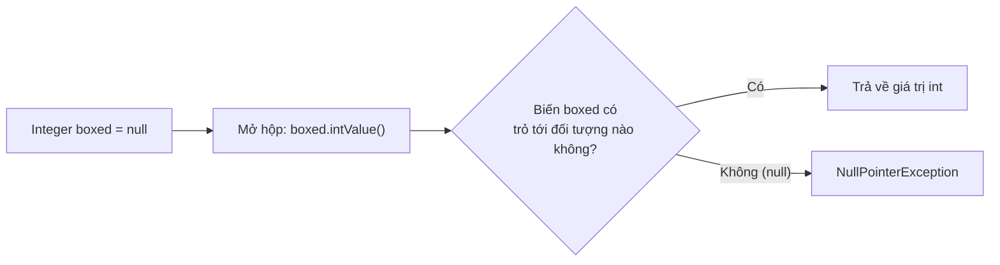
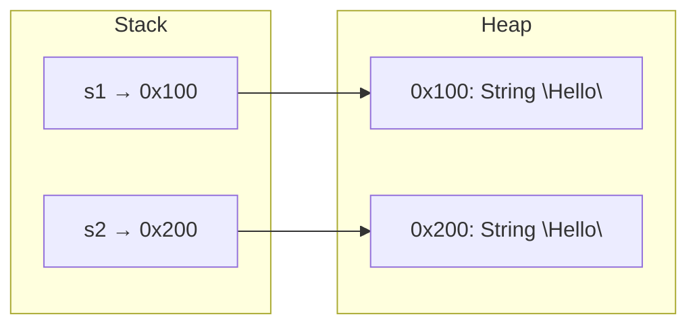
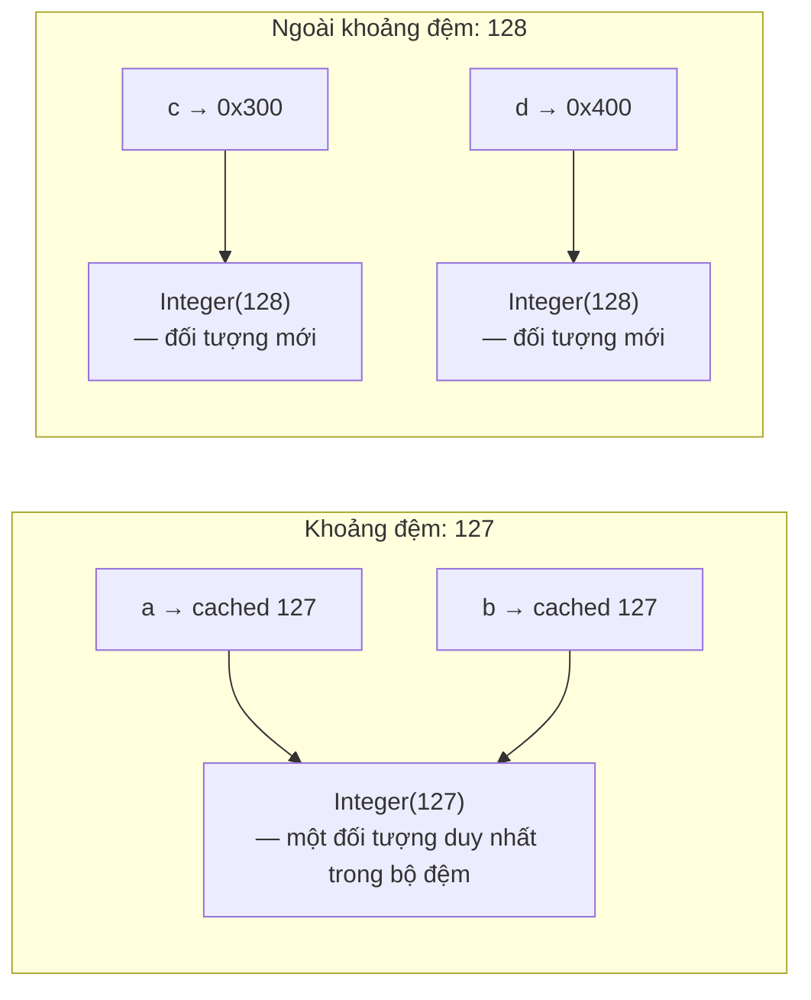

# Lớp Bao Bọc, Đóng Hộp, Null và So Sánh Bằng (Wrapper Classes, Boxing, Null, And Equality)

Lớp bao bọc (wrapper class) là phiên bản đối tượng của các kiểu dữ liệu nguyên thủy (primitive type).

- **`byte`** — Lớp bao bọc tương ứng là `Byte`.
- **`short`** — Lớp bao bọc tương ứng là `Short`.
- **`int`** — Lớp bao bọc tương ứng là `Integer`.
- **`long`** — Lớp bao bọc tương ứng là `Long`.
- **`float`** — Lớp bao bọc tương ứng là `Float`.
- **`double`** — Lớp bao bọc tương ứng là `Double`.
- **`char`** — Lớp bao bọc tương ứng là `Character`.
- **`boolean`** — Lớp bao bọc tương ứng là `Boolean`.

## Tại Sao Lớp Bao Bọc Tồn Tại (Why Wrappers Exist)

Nhiều API trong Java làm việc với các đối tượng (object) chứ không phải kiểu nguyên thủy.

Ví dụ, các bộ sưu tập (collection) không thể lưu trữ trực tiếp kiểu nguyên thủy:

```java
// List<int> numbers; // không hợp lệ
List<Integer> numbers;
```

`Integer` được sử dụng thay thế cho `int`.

## So Sánh Chi Tiết `int` và `Integer` (int vs Integer: Full Comparison)

`int` và `Integer` trông có vẻ giống nhau nhưng lại hoạt động rất khác nhau dưới hạ tầng. Khác biệt cốt lõi là `int` là một kiểu dữ liệu nguyên thủy — một giá trị thô được lưu trữ trực tiếp trên bộ nhớ Stack (Stack) — trong khi `Integer` là một đối tượng sống trên bộ nhớ Heap (Heap) và được truy cập thông qua một tham chiếu (reference). Sự khác biệt này ảnh hưởng đến việc sử dụng bộ nhớ, hiệu suất, các phương thức sẵn có và những nơi mà mỗi kiểu dữ liệu có thể được sử dụng.

Bộ sưu tập Java (Java Collections) (chẳng hạn như `ArrayList`, `HashMap`, `HashSet`) sử dụng kiểu generic (generics), và kiểu generic trong Java chỉ hoạt động với các kiểu tham chiếu (reference type). Tham số kiểu `<T>` phải là một lớp con của `Object`, và các kiểu dữ liệu nguyên thủy như `int` thì không phải là đối tượng. Đó là lý do tại sao `Integer` tồn tại — nó bao bọc kiểu dữ liệu nguyên thủy `int` bên trong một đối tượng để có thể tham gia vào các API generic. Nếu không có các lớp bao bọc, bạn sẽ không thể lưu trữ các con số trong một danh sách `List` hoặc sử dụng chúng làm khóa trong bản đồ `Map`.

> Xem thêm: Ứng dụng của Wrapper Classes trong Generics, được trình bày chi tiết trong [Ch.18 - Generics](../../no18_generics/README.md).

**`int` (Kiểu Nguyên Thủy)** thông thường được lưu trữ trên bộ nhớ Stack. Tốc độ xử lý nhanh do các thao tác được thực hiện trực tiếp trên CPU. Kiểu này không có các phương thức tiện ích, không thể nhận giá trị `null` (luôn luôn có giá trị), và không thể dùng trong các bộ sưu tập như `List<>` hay `Map<>`. Giá trị mặc định của nó là `0`.

**`Integer` (Lớp Bao Bọc)** là một đối tượng được lưu trữ trên bộ nhớ Heap. Tốc độ xử lý chậm hơn vì tốn chi phí tạo đối tượng và dọn rác (GC). Lớp này cung cấp nhiều phương thức tiện ích như `parseInt()`, `valueOf()`, `compareTo()`, v.v. Nó có thể nhận giá trị `null`, hoàn toàn dùng được trong các bộ sưu tập (ví dụ: `List<Integer>`). Giá trị mặc định của nó là `null`.

**Ảnh hưởng hiệu suất:** Phép toán số học trên `int` là một thao tác CPU trực tiếp — cộng, trừ, so sánh diễn ra chỉ trong một lệnh máy duy nhất. Trong khi đó, phép toán số học trên `Integer` yêu cầu JVM cấp phát một đối tượng trên Heap, và sau đó bộ thu gom rác (garbage collector) phải thu hồi vùng nhớ đó. Trong các vòng lặp hẹp xử lý hàng triệu giá trị, sự khác biệt này có thể rất đáng kể.

```java
// int — nhanh, giá trị trực tiếp
int primitiveSum = 0;
for (int i = 0; i < 1_000_000; i++) {
    primitiveSum += i; // cộng trực tiếp trên CPU
}

// Integer — chậm hơn, tạo đối tượng mới
Integer wrapperSum = 0;
for (int i = 0; i < 1_000_000; i++) {
    wrapperSum += i; // mở hộp → cộng → đóng hộp đối tượng Integer mới sau mỗi vòng lặp
}
```

**Khi nào nên dùng từng loại:**

- Sử dụng `int` cho các tính toán cục bộ, biến đếm vòng lặp và code cần tối ưu hiệu suất.
- Sử dụng `Integer` khi bạn cần hỗ trợ giá trị null (ví dụ: một cột trong cơ sở dữ liệu có thể là `NULL`), khi lưu trữ giá trị trong bộ sưu tập (Collection), hoặc khi gọi các API yêu cầu kiểu `Object`.

> Xem thêm: [Kiểu Nguyên Thủy so với Kiểu Tham Chiếu](02-reference-types.md#primitive-vs-reference) để hiểu về mô hình bộ nhớ Stack và Heap.

## Tự Động Đóng Hộp (Autoboxing)

Tự động đóng hộp (autoboxing) là quá trình tự động chuyển đổi từ kiểu nguyên thủy sang lớp bao bọc tương ứng.

```java
Integer number = 10;
```

Java xử lý câu lệnh này tương đương với:

```java
Integer number = Integer.valueOf(10);
```

## Tự Động Mở Hộp (Unboxing)

Tự động mở hộp (unboxing) là quá trình tự động chuyển đổi từ lớp bao bọc sang kiểu nguyên thủy tương ứng.

```java
Integer boxed = 10;
int value = boxed;
```

Java tự động trích xuất giá trị `int` nguyên thủy từ đối tượng `Integer`.

## Giá Trị Null và Mở Hộp (Null And Unboxing)

Các lớp bao bọc có thể nhận giá trị `null`, trong khi các kiểu nguyên thủy thì không.

```java
Integer boxed = null;
int value = boxed; // Ném NullPointerException khi chạy
```

Đoạn code này bị lỗi vì Java cố gắng mở hộp một giá trị `null`.

## Tại Sao Việc Mở Hộp null Lại Ném Ra NullPointerException (Why Unboxing null Throws NullPointerException)

Khi Java mở hộp một đối tượng `Integer` thành kiểu `int`, nó không đơn thuần là "trích xuất" giá trị. Đằng sau hậu trường, trình biên dịch tự động chèn một lời gọi phương thức: `boxed.intValue()`. Điều này có nghĩa là câu lệnh `int value = boxed;` được biên dịch thành đoạn mã tương đương với `int value = boxed.intValue();`. Hiểu được lời gọi phương thức ẩn này là chìa khóa để hiểu tại sao giá trị `null` lại gây ra lỗi sập chương trình.

Nếu biến `boxed` có giá trị là `null`, sẽ không có đối tượng `Integer` nào tồn tại trong bộ nhớ — tham chiếu trỏ tới vùng trống. Việc gọi `.intValue()` trên `null` tương tự như việc gọi bất kỳ phương thức nào trên `null`: Java không thể gửi lời gọi phương thức tới một đối tượng không tồn tại. Điều này kích hoạt ngoại lệ `NullPointerException`.

**Chuỗi nguyên nhân - kết quả:**

`Integer boxed = null` → trình biên dịch chèn `boxed.intValue()` → `boxed` là `null` → không có đối tượng nào tồn tại để gọi `.intValue()` → **NullPointerException**

```java
// Những gì bạn viết:
Integer boxed = null;
int value = boxed; // NullPointerException!

// Những gì trình biên dịch thực tế tạo ra (tương đương):
Integer boxed = null;
int value = boxed.intValue(); // gọi phương thức trên đối tượng null → NPE
```



> Xem thêm: Cơ chế xử lý NullPointerException và các ngoại lệ khác, được trình bày chi tiết trong [Ch.12 - Exception Handling](../../no12_exception_handling/README.md).

**Bẫy thường gặp — tham số phương thức:**

```java
void process(int x) {
    System.out.println(x * 2);
}

Integer input = null;
process(input); // Ngoại lệ NPE xảy ra TẠI ĐÂY, ngay nơi gọi, trong quá trình mở hộp
// kết quả: NullPointerException (không phải bên trong phương thức process(), mà trước khi nó chạy)
```

Ngoại lệ NPE xảy ra **tại nơi gọi phương thức**, chứ không phải bên trong `process()`. Java cố gắng mở hộp `input` thành `int x`, và việc mở hộp bị thất bại trước khi phần thân phương thức kịp thực thi. Điều này khiến lỗi trở nên khó hiểu vì vết vết ngăn xếp (stack trace) trỏ đến dòng gọi `process()`, chứ không trỏ đến bất kỳ dòng code nào bên trong nó.

**Cách phòng tránh:**

```java
// Cách 1: Kiểm tra null trước khi mở hộp
Integer boxed = getValueFromDatabase();
if (boxed != null) {
    int value = boxed;
    process(value);
}

// Cách 2: Cung cấp một giá trị mặc định
int value = (boxed != null) ? boxed : 0;
```

> Điều này liên quan đến cách hoạt động của `null` với các kiểu tham chiếu, được trình bày chi tiết trong phần [null](02-reference-types.md#null).

## Toán Tử `==` Với Kiểu Nguyên Thủy (`==` With Primitives)

Với các kiểu nguyên thủy, toán tử `==` dùng để so sánh các giá trị.

```java
int a = 5;
int b = 5;
System.out.println(a == b); // true
```

## Toán Tử `==` Với Kiểu Tham Chiếu (`==` With References)

Với các kiểu tham chiếu, toán tử `==` so sánh xem hai biến tham chiếu có cùng trỏ tới một đối tượng hay không.

```java
String a = new String("Java");
String b = new String("Java");

System.out.println(a == b); // false
```

Nội dung bên trong hai đối tượng giống nhau, nhưng chúng là các đối tượng khác nhau.

## Phương Thức `.equals()`

Phương thức `.equals()` thường được sử dụng để so sánh nội dung của các đối tượng.

```java
String a = new String("Java");
String b = new String("Java");

System.out.println(a.equals(b)); // true
```

Đối với `String`, phương thức `.equals()` sẽ so sánh từng ký tự trong chuỗi.

## Tại Sao Nên Dùng .equals() Để So Sánh Nội Dung Chuỗi (Why Use .equals() For String Content)

Toán tử `==` chỉ kiểm tra trên **Stack** — nó so sánh các địa chỉ bộ nhớ được lưu trữ trong hai biến tham chiếu. Nó đặt câu hỏi: "Hai biến này có trỏ tới **cùng một đối tượng chính xác** trong bộ nhớ hay không?" Nó không quan tâm đến nội dung bên trong các đối tượng đó. Ngược lại, phương thức `.equals()` sẽ truy cập vào bộ nhớ **Heap** — nó mở cả hai đối tượng và so sánh nội dung thực tế của chúng theo từng ký tự.

Sự khác biệt này vô cùng quan trọng bởi vì hai đối tượng `String` có thể chứa văn bản hoàn toàn giống nhau (`"Hello"`) nhưng lại nằm ở hai địa chỉ bộ nhớ khác nhau trên Heap. Khi bạn dùng `==`, Java so sánh các địa chỉ này và kết luận chúng "không bằng nhau" — mặc dù về mặt ngữ nghĩa thì chúng hoàn toàn giống nhau.



Trong sơ đồ này, `s1` và `s2` lưu giữ các địa chỉ khác nhau (`0x100` và `0x200`). Mặc dù cả hai đối tượng đều chứa `"Hello"`, biểu thức `s1 == s2` vẫn trả về `false` vì các địa chỉ khác nhau. Nhưng `s1.equals(s2)` lại trả về `true` vì phương thức `.equals()` thực hiện so sánh chuỗi ký tự bên trong hai đối tượng đó.

**Tại sao đôi khi `==` vẫn hoạt động (Vùng lưu trữ String):**

Java duy trì một vùng lưu trữ String (String Pool) — một vùng nhớ đệm chứa các chuỗi ký tự dạng tường minh (literal). Khi bạn viết `String s = "Hello"`, Java sẽ kiểm tra String Pool trước. Nếu `"Hello"` đã tồn tại ở đó, Java sẽ tái sử dụng chính đối tượng đó. Điều này có nghĩa là hai chuỗi tường minh có cùng nội dung có thể chia sẻ chung một địa chỉ bộ nhớ, khiến cho phép toán `==` vô tình trả về `true`:

```java
String a = "Hello";
String b = "Hello";
System.out.println(a == b);      // true — cùng một đối tượng trong Pool (sự trùng hợp!)
System.out.println(a.equals(b)); // true — cùng nội dung (luôn đáng tin cậy)
```

Tuy nhiên, việc sử dụng từ khóa `new String(...)` **luôn luôn** tạo ra một đối tượng mới trên Heap, bỏ qua cơ chế String Pool:

```java
String a = new String("Hello");
String b = new String("Hello");
System.out.println(a == b);      // false — các đối tượng khác nhau trên Heap
System.out.println(a.equals(b)); // true  — cùng nội dung
```

**Nguyên nhân - kết quả:** `new String("Hello")` tạo đối tượng mới trên Heap → địa chỉ bộ nhớ mới → toán tử `==` so sánh địa chỉ → địa chỉ khác nhau → trả về `false` — ngay cả khi nội dung giống hệt nhau.

**Quy tắc:** LUÔN LUÔN sử dụng phương thức `.equals()` để so sánh nội dung của chuỗi ký tự (và các đối tượng khác). Toán tử `==` chỉ đáng tin cậy đối với các kiểu nguyên thủy và các trường hợp cố ý kiểm tra đồng nhất tham chiếu.

## So Sánh Chuỗi An Toàn Với Null (Null-Safe String Comparison)

Đoạn code sau có thể ném ra `NullPointerException` nếu biến `text` có giá trị null:

```java
text.equals("Java")
```

Cách viết này sẽ an toàn hơn:

```java
"Java".equals(text)
```

Nếu biến `text` là null, kết quả trả về sẽ là `false` chứ không gây ra lỗi ngoại lệ.

## Cảnh Báo Về So Sánh Bằng Trên Lớp Bao Bọc (Wrapper Equality Warning)

Tránh sử dụng toán tử `==` để so sánh các đối tượng bao bọc trừ khi bạn thực sự muốn so sánh tham chiếu của chúng.

```java
Integer a = 1000;
Integer b = 1000;
System.out.println(a == b); // thường là false
System.out.println(a.equals(b)); // true
```

Hãy dùng phương thức `.equals()` để so sánh giá trị của chúng.

## Bộ Nhớ Đệm Integer (Integer Cache)

Java thực hiện lưu trữ đệm (caching) các đối tượng `Integer` đối với các giá trị nằm trong khoảng từ **-128 đến 127**. Khi bạn sử dụng cơ chế tự động đóng hộp hoặc phương thức `Integer.valueOf()`, Java sẽ kiểm tra xem giá trị đó có nằm trong khoảng này hay không. Nếu có, Java sẽ trả về **cùng một đối tượng có sẵn trong bộ nhớ đệm (cache)** thay vì tạo ra một đối tượng mới. Nếu giá trị nằm ngoài khoảng này, Java sẽ tạo ra một **đối tượng mới** trên Heap.

Cơ chế lưu trữ đệm này tồn tại nhằm mục đích tối ưu hiệu suất — các giá trị số nguyên nhỏ được sử dụng cực kỳ thường xuyên (như biến đếm vòng lặp, chỉ số mảng, mã trạng thái), vì vậy việc tái sử dụng giúp tránh tạo ra hàng triệu đối tượng có vòng đời ngắn, giảm bớt gánh nặng cho bộ thu gom rác.

Hệ quả là toán tử `==` sẽ hoạt động **thiếu nhất quán** đối với các đối tượng `Integer`:

```java
// Giá trị nằm trong khoảng đệm (-128 đến 127): CÙNG một đối tượng trong bộ đệm
Integer a = 127;
Integer b = 127;
System.out.println(a == b);      // true  — cùng đối tượng được lưu trong bộ đệm
System.out.println(a.equals(b)); // true  — cùng giá trị

// Giá trị nằm ngoài khoảng đệm: các đối tượng KHÁC NHAU
Integer c = 128;
Integer d = 128;
System.out.println(c == d);      // false — các đối tượng khác nhau trên Heap!
System.out.println(c.equals(d)); // true  — cùng giá trị
```



**Chuỗi nguyên nhân - kết quả:**

- `Integer a = 127` → `Integer.valueOf(127)` → 127 nằm trong khoảng [-128, 127] → trả về đối tượng có sẵn → `a` trỏ tới đối tượng đệm đó.
- `Integer b = 127` → `Integer.valueOf(127)` → trả về đối tượng đệm tương tự → `b` trỏ tới **cùng một** đối tượng → `a == b` là `true`.
- `Integer c = 128` → `Integer.valueOf(128)` → 128 nằm ngoài khoảng đệm → tạo đối tượng **mới** → `c` trỏ tới đối tượng mới.
- `Integer d = 128` → `Integer.valueOf(128)` → tạo thêm một đối tượng **mới khác** → `d` trỏ tới đối tượng **khác** → `c == d` là `false`.

Điều này khiến cho toán tử `==` khi dùng với `Integer` (và các lớp bao bọc khác) trở nên **không đáng tin cậy** — nó chạy đúng với các giá trị nhỏ nhưng lại âm thầm bị lỗi với các giá trị lớn hơn. Đây là lý do quan trọng vì sao chúng ta **luôn luôn nên dùng `.equals()`** để so sánh giá trị các đối tượng bao bọc.

## Các Lỗi Thường Gặp (Common Mistakes)

- So sánh nội dung chuỗi bằng toán tử `==`.
- Quên rằng các lớp bao bọc có thể nhận giá trị `null`.
- Mở hộp một lớp bao bọc có giá trị null.
- Sử dụng `List<int>` thay vì `List<Integer>`.
- Cho rằng phương thức `.equals()` luôn an toàn với null khi gọi trên một biến có khả năng nhận giá trị null.
