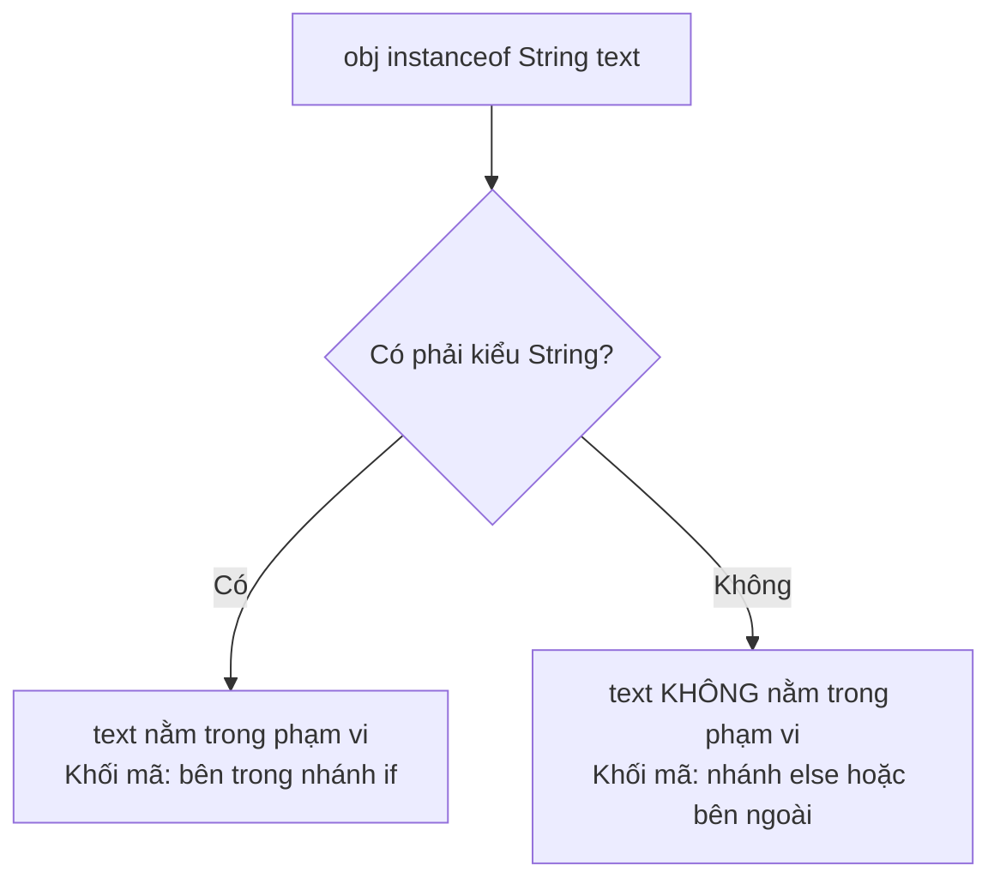

# Toán Tử Từng Bit, Tăng/Giảm, Ba Ngôi, Và instanceof (Bitwise, Increment, Ternary, and instanceof)

Một số toán tử trong Java ít xuất hiện hơn trong mã nguồn của người mới bắt đầu, nhưng chúng lại rất quan trọng khi đọc các chương trình thực tế và các câu hỏi phỏng vấn.

## Phép Tăng và Giảm (Increment and Decrement)

`++` tăng một biến số thêm 1 đơn vị. `--` giảm đi 1 đơn vị.

```java
int count = 3;
count++; // count bây giờ là 4
count--; // count bây giờ là 3
```

Dạng tiền tố (prefix) và hậu tố (postfix) khác nhau khi được sử dụng bên trong một biểu thức lớn hơn.

```java
int x = 5;
int a = x++; // a là 5, x trở thành 6

int y = 5;
int b = ++y; // y trở thành 6, b là 6
```

Hậu tố nghĩa là "sử dụng giá trị cũ, sau đó mới thay đổi biến." Tiền tố nghĩa là "thay đổi biến, sau đó mới sử dụng giá trị mới."

Tránh viết các biểu thức phức tạp như:

```java
int result = i++ + ++i;
```

Chúng hoàn toàn hợp lệ trong Java, nhưng chúng buộc người đọc phải theo dõi các tác dụng phụ (side effect) thay vì tập trung hiểu mục đích của mã nguồn.

## Cách Các Toán Tử Tăng Tiền Tố và Hậu Tố Hoạt Động Bên Dưới

Sự khác biệt giữa toán tử tăng tiền tố (`++i`) và hậu tố (`i++`) nằm ở thứ tự thực thi của việc truy xuất giá trị và sửa đổi biến bên trong ngăn xếp toán hạng (operand stack) của JVM. Trong quá trình thực thi mã bytecode, Java sử dụng các ô biến cục bộ (local variable slot) để lưu trữ các giá trị thực tế và một ngăn xếp toán hạng để đánh giá các biểu thức. Trong phép tăng hậu tố (`i++`), giá trị hiện tại của biến được sao chép và đẩy vào ngăn xếp toán hạng trước, sau đó biến cục bộ mới được tăng lên ngay lập tức. Khi biểu thức được giải quyết, nó sử dụng giá trị cũ được lấy ra từ ngăn xếp toán hạng. Trong phép tăng tiền tố (`++i`), biến cục bộ được tăng lên trước, và sau đó giá trị mới cập nhật mới được đẩy vào ngăn xếp toán hạng, nghĩa là bất kỳ biểu thức bao ngoài nào cũng thấy ngay giá trị mới.

### Mô Hình Tư Duy Ngăn Xếp và Biến Cục Bộ (Stack and Local Variable Mental Model)

Biểu đồ ASCII dưới đây mô tả cách JVM đánh giá `int a = x++` so với `int b = ++y`:

```text
POSTFIX: int a = x++ (x bắt đầu là 5)
┌────────────────────────────────────────┐
│ 1. Đẩy x (5) vào Ngăn xếp toán hạng     │ Stack: [ 5 ]
│ 2. Tăng x trong Ô biến cục bộ           │ Local Var Slot: [ x = 6 ]
│ 3. Lấy giá trị trên Stack (5) gán cho a │ Local Var Slot: [ a = 5 ]
└────────────────────────────────────────┘

PREFIX: int b = ++y (y bắt đầu là 5)
┌────────────────────────────────────────┐
│ 1. Tăng y trong Ô biến cục bộ           │ Local Var Slot: [ y = 6 ]
│ 2. Đẩy y (6) vào Ngăn xếp toán hạng     │ Stack: [ 6 ]
│ 3. Lấy giá trị trên Stack (6) gán cho b │ Local Var Slot: [ b = 6 ]
└────────────────────────────────────────┘
```

### Chuỗi Nguyên Nhân - Kết Quả (Cause-Effect Chain)
Biểu thức `int a = x++` (trong đó `x = 5`) được đánh giá $\rightarrow$ JVM tải giá trị hiện tại là `5` từ ô biến cục bộ và đẩy nó vào ngăn xếp toán hạng $\rightarrow$ JVM tăng giá trị của `x` bên trong ô biến cục bộ lên thành `6` $\rightarrow$ toán tử gán `=` lấy giá trị `5` ra khỏi ngăn xếp và ghi nó vào ô biến cục bộ của `a` $\rightarrow$ biến `a` được lưu trữ là `5` trong khi `x` được lưu trữ là `6`.

### Ví Dụ Mã Nguồn
```java
int x = 5;
int a = x++;
System.out.println("a = " + a + ", x = " + x); // a = 5, x = 6

int y = 5;
int b = ++y;
System.out.println("b = " + b + ", y = " + y); // b = 6, y = 6
```

## Tác Dụng Phụ (Side Effects)

Một tác dụng phụ (side effect) là một sự thay đổi xảy ra trong khi đang đánh giá một biểu thức. Phép toán `i++` có tác dụng phụ vì nó làm thay đổi `i`. Các lời gọi phương thức cũng có thể có tác dụng phụ nếu chúng sửa đổi trạng thái, in kết quả ra màn hình, ghi file hoặc gọi các hệ thống bên ngoài.

Tác dụng phụ rất quan trọng vì các toán tử ngắn mạch (short-circuit) có thể bỏ qua chúng.

```java
int x = 0;
boolean result = true || x++ > 0;
System.out.println(x); // 0
```

Vế bên phải không bao giờ được đánh giá vì biểu thức `true || bất_kỳ_thứ_gì` chắc chắn trả về `true`.

## Toán Tử Ba Ngôi (Ternary Operator)

Toán tử ba ngôi (ternary operator) lựa chọn một trong hai biểu thức:

```java
String label = score >= 60 ? "pass" : "fail";
```

Cấu trúc như sau:

```java
điều_kiện ? giá_trị_nếu_đúng : giá_trị_nếu_sai
```

Hãy sử dụng nó khi cả hai nhánh đều ngắn gọn và đều tạo ra một giá trị trả về. Nên ưu tiên sử dụng `if/else` khi các nhánh chứa nhiều câu lệnh phức tạp hoặc các quy tắc nghiệp vụ rắc rối.

## `instanceof`

Toán tử `instanceof` kiểm tra xem một đối tượng có tương thích với một kiểu dữ liệu cụ thể hay không.

```java
Object value = "Java";

if (value instanceof String) {
    System.out.println("Đây là một chuỗi");
}
```

Java hiện đại hỗ trợ cơ chế khớp mẫu (pattern matching) cho `instanceof`:

```java
if (value instanceof String text) {
    System.out.println(text.toUpperCase());
}
```

Cú pháp này vừa kiểm tra kiểu dữ liệu vừa khai báo một biến với kiểu dữ liệu đã khớp.

Toán tử `instanceof` trả về `false` khi biểu thức bên tay trái là `null`.

```java
String name = null;
System.out.println(name instanceof String); // false
```

## Tại Sao Khớp Mẫu Cho instanceof Lại An Toàn Và Sạch Sẽ Hơn

Trước đây, để thực hiện các thao tác đặc thù theo kiểu dữ liệu trên một tham chiếu đối tượng, chúng ta cần thực hiện quy trình hai bước: đầu tiên kiểm tra kiểu bằng `instanceof`, sau đó ép kiểu tham chiếu đó sang kiểu đích một cách tường minh. Mô hình này rất dài dòng và dễ phát sinh lỗi vì không có mối liên kết nào được trình biên dịch bắt buộc giữa việc kiểm tra kiểu và việc ép kiểu; một lập trình viên có thể kiểm tra một kiểu dữ liệu này nhưng lại vô tình ép kiểu sang một kiểu dữ liệu khác, gây ra lỗi `ClassCastException` khi chạy chương trình (runtime). Java hiện đại (được chuẩn hóa từ Java 16) giải quyết vấn đề này bằng khớp mẫu cho `instanceof`, kết hợp việc kiểm tra, liên kết và ép kiểu thành một thao tác nguyên tử (atomic operation) duy nhất. Nếu việc kiểm tra thành công, Java sẽ tự động ép kiểu đối tượng và gán nó cho một biến mẫu (pattern variable) mới có phạm vi hoạt động bị giới hạn trong nhánh điều kiện nơi mà kiểu dữ liệu đó được đảm bảo.

### Phạm Vi Ràng Buộc Được Bắt Buộc Bởi Trình Biên Dịch (Compiler-Enforced Binding Scope)

Biểu đồ Mermaid này chỉ ra cách liên kết của biến mẫu `text` bị giới hạn trong khối mã nơi trình biên dịch có thể đảm bảo tham chiếu đó thực sự là một `String`:



### Chuỗi Nguyên Nhân - Kết Quả (Cause-Effect Chain)
Tham chiếu `obj` được kiểm tra bằng `obj instanceof String text` $\rightarrow$ Java kiểm tra xem `obj` có khác null và khớp với kiểu `String` hay không $\rightarrow$ nếu đúng, trình biên dịch sẽ tạo ra một biến mẫu `text` kiểu `String` được khởi tạo bằng giá trị đã ép kiểu của `obj` $\rightarrow$ phạm vi hoạt động của `text` là phạm vi dòng chảy (flow-scoped) (chỉ khả dụng ở những nơi kiểu dữ liệu được đảm bảo, ví dụ như trong khối `if`) $\rightarrow$ mọi nỗ lực sử dụng `text` bên ngoài phạm vi này đều thất bại trong quá trình kiểm tra lúc biên dịch, đảm bảo an toàn tuyệt đối.

### Ví Dụ Mã Nguồn
```java
Object obj = "Hello, World!";

// Khớp mẫu điều kiện an toàn
if (obj instanceof String text) {
    // Không cần ép kiểu tường minh String text = (String) obj;
    System.out.println(text.length()); // 13
} else {
    // System.out.println(text); // Lỗi biên dịch: 'text' không nằm trong phạm vi ở đây
}
```

## Toán Tử Từng Bit (Bitwise Operators)

Các toán tử từng bit hoạt động trên biểu diễn nhị phân của các giá trị số nguyên.

Mã Java cho người mới bắt đầu thường ít dùng toán tử từng bit, nhưng chúng xuất hiện nhiều trong các cờ (flag), phân quyền (permission), mã nguồn cấp thấp, hàm băm (hashing), mã nguồn tối ưu hiệu năng và một số thành phần nội bộ của thư viện.

### Phép AND Từng Bit — Tạo Mặt Nạ (Masking)

Phép toán `&` chỉ giữ lại bit `1` khi **cả hai** toán hạng đều có bit `1` ở vị trí tương ứng.

```java
int a = 0b1010;  // 10 trong hệ thập phân
int b = 0b1100;  // 12 trong hệ thập phân
System.out.println(a & b); // 0b1000 = 8

// Công dụng phổ biến: kiểm tra một số là chẵn hay lẻ
int n = 7;
System.out.println(n & 1); // 1 → lẻ (bit có trọng số nhỏ nhất là 1)
n = 8;
System.out.println(n & 1); // 0 → chẵn
```

### Phép OR Từng Bit — Thiết Lập Cờ (Setting Flags)

Phép toán `|` thiết lập bit thành `1` khi **ít nhất một trong hai** toán hạng có bit `1` ở vị trí tương ứng.

```java
int READ  = 0b001; // 1
int WRITE = 0b010; // 2
int EXEC  = 0b100; // 4

int permissions = READ | WRITE; // 0b011 = 3
System.out.println(permissions); // 3

// Kiểm tra xem quyền WRITE đã được thiết lập chưa:
System.out.println((permissions & WRITE) != 0); // true
```

### Phép XOR Từng Bit — Đảo Trạng Thái (Toggle)

Phép toán `^` tạo ra bit `1` khi hai bit ở vị trí tương ứng **khác nhau**.

```java
int toggle = 0b1010;
int mask   = 0b1111;
System.out.println(toggle ^ mask); // 0b0101 = 5

// Phép XOR một số với chính nó luôn bằng 0 — một mẹo phỏng vấn kinh điển:
int x = 42;
System.out.println(x ^ x); // 0
```

### Các Toán Tử Dịch Bit (Shift Operators)

Toán tử dịch trái (`<<`) nhân giá trị với một lũy thừa của 2. Toán tử dịch phải (`>>`) thực hiện phép chia (có dấu).

```java
int n = 1;
System.out.println(n << 3);  // 8  (1 * 2^3)
System.out.println(16 >> 2); // 4  (16 / 2^2)

// Các giá trị âm: >> giữ nguyên bit dấu (dịch số học - arithmetic shift)
System.out.println(-8 >> 1); // -4
// >>> điền các bit 0 vào bên trái mà không quan tâm đến dấu (dịch logic - logical shift)
System.out.println(-8 >>> 1); // 2147483644 (một số dương cực kỳ lớn)
```

### Cách Các Toán Tử Dịch Bit Thao Tác Trên Các Bit

Các toán tử dịch bit (`<<`, `>>`, `>>>`) thao tác trên biểu diễn nhị phân bên dưới của các số nguyên bằng cách di chuyển tất cả các bit sang trái hoặc sang phải theo một số vị trí được chỉ định. Toán tử dịch trái (`<<`) dịch chuyển các bit sang trái và điền các số `0` vào vị trí trống bên phải, tương đương với việc nhân giá trị đó với $2^n$ (với $n$ là số lượng bit dịch chuyển). Toán tử dịch phải có dấu (`>>`) dịch chuyển các bit sang phải và điền vào các vị trí trống bên trái bằng một bản sao của bit dấu ban đầu (Bit có trọng số lớn nhất - Most Significant Bit), giúp bảo toàn dấu của số (còn gọi là dịch số học). Toán tử dịch phải không dấu (`>>>`) dịch chuyển các bit sang phải nhưng luôn điền các số `0` vào các vị trí trống bên trái (còn gọi là dịch logic), điều này sẽ biến các số âm thành các số dương cực kỳ lớn vì bit dấu đã trở thành `0`.

#### Mô Hình Tư Duy Mở Rộng Dấu so với Điền số Không (Sign Extension vs Zero Fill Mental Model)

Biểu đồ ASCII này minh họa cách dịch phải có dấu bảo toàn dấu âm, trong khi dịch phải không dấu bắt buộc tạo ra một giá trị dương bằng cách đệm số `0` (được thể hiện dưới dạng các giá trị 8-bit để đơn giản hóa, mặc dù Java sử dụng kiểu `int` 32-bit):

```text
Giá trị ban đầu (-8):
┌───┬───┬───┬───┬───┬───┬───┬───┐
│ 1 │ 1 │ 1 │ 1 │ 1 │ 0 │ 0 │ 0 │  (Bit dấu là 1)
└───┴───┴───┴───┴───┴───┴───┴───┘

Dịch phải có dấu (>> 1):  --> Bit dấu (1) được sao chép để điền vào khoảng trống bên trái
┌───┐───┬───┬───┬───┬───┬───┬───┐
│ 1 │ 1 │ 1 │ 1 │ 1 │ 1 │ 0 │ 0 │  (Kết quả là -4, dấu được bảo toàn)
└───└───┴───┴───┴───┴───┴───┴───┘

Dịch phải không dấu (>>> 1):  --> Số không (0) bắt buộc phải điền vào khoảng trống bên trái
┌───┐───┬───┬───┬───┬───┬───┬───┐
│ 0 │ 1 │ 1 │ 1 │ 1 │ 1 │ 0 │ 0 │  (Kết quả là 124, bit dấu trở thành 0 -> số dương!)
└───└───┴───┴───┴───┴───┴───┴───┘
```

#### Chuỗi Nguyên Nhân - Kết Quả (Cause-Effect Chain)
Biến `int x = -8` (được biểu diễn dưới dạng bù hai 32-bit là `11111111 11111111 11111111 11111000`) được dịch chuyển bằng phép toán `>>> 1` $\rightarrow$ tất cả các bit di chuyển một vị trí sang phải $\rightarrow$ bit có trọng số lớn nhất được điền bằng số `0` $\rightarrow$ mẫu bit mới là `01111111 11111111 11111111 11111100` $\rightarrow$ vì bit dấu hiện tại là `0`, JVM diễn giải kết quả là số dương, tạo ra giá trị thập phân `2147483644`.

#### Ví Dụ Mã Nguồn
```java
int positive = 16;
System.out.println(positive >> 2);  // 4  (16 / 2^2)
System.out.println(positive << 2);  // 64 (16 * 2^2)

int negative = -8;
System.out.println(negative >> 1);   // -4 (dấu được bảo toàn)
System.out.println(negative >>> 1);  // 2147483644 (bit dấu trở thành 0)
```

Đối với các điều kiện logic thông thường, đừng sử dụng các toán tử từng bit trừ khi bạn thực sự cần hành vi đánh giá không ngắn mạch.

---

## Ví Dụ Thực Tế: `i++` so với `++i` Trong Vòng Lặp For

Một câu hỏi phỏng vấn phổ biến là: "Có quan trọng việc viết `i++` hay `++i` trong vòng lặp for không?"

```java
// Phiên bản A — hậu tố (postfix)
for (int i = 0; i < 3; i++) {
    System.out.println(i);
}
// Đầu ra: 0  1  2

// Phiên bản B — tiền tố (prefix)
for (int i = 0; i < 3; ++i) {
    System.out.println(i);
}
// Đầu ra: 0  1  2   (hoàn toàn giống nhau!)
```

**Trong biểu thức cập nhật của vòng lặp for (`i++` hoặc `++i`), kết quả của biểu thức đó bị bỏ qua.** Cả hai dạng đều chỉ đơn giản là tăng `i` thêm 1 trước khi bắt đầu lần lặp tiếp theo. Sự khác biệt giữa tiền tố và hậu tố chỉ thực sự quan trọng khi **giá trị** của biểu thức tăng/giảm được sử dụng trong một biểu thức lớn hơn.

Những trường hợp mà sự khác biệt CÓ THỂ thấy rõ:

```java
int i = 5;
System.out.println(i++); // in ra 5, sau đó i trở thành 6
System.out.println(i);   // 6

int j = 5;
System.out.println(++j); // j trở thành 6, sau đó in ra 6
System.out.println(j);   // 6
```

Và một ví dụ phức tạp hơn khi kết hợp:

```java
int a = 3;
int b = a++ + ++a;
// Bước 1: a++ → tạo ra giá trị 3, tác dụng phụ: a trở thành 4
// Bước 2: ++a → a trở thành 5, tạo ra giá trị 5
// Bước 3: 3 + 5 = 8
System.out.println(b); // 8
System.out.println(a); // 5
```

**Lời khuyên thực tế**: Hãy sử dụng `i++` hoặc `++i` một cách độc lập. Tránh lồng ghép chúng bên trong các biểu thức lớn hơn — các tác dụng phụ sẽ làm cho mã nguồn trở nên rất khó suy luận.

---

## Lỗi Thường Gặp

### Sai lầm 1 — Giả Định `i++` và `++i` Luôn Luôn Khác Nhau

```java
// Cả hai đều tạo ra cùng một vòng lặp:
for (int i = 0; i < 5; i++) { /* ... */ }
for (int i = 0; i < 5; ++i) { /* ... */ }
// Thân vòng lặp đều thấy cùng một chuỗi giá trị: 0, 1, 2, 3, 4
```

Chúng chỉ khác nhau khi kết quả biểu thức được sử dụng trực tiếp, chứ không khác nhau khi biểu thức chạy độc lập.

### Sai lầm 2 — Đọc Hiểu Sai Phép Hậu Tố Trong Phép Gán

```java
int x = 10;
int y = x++;  // y = 10, x = 11  ← KHÔNG phải cả hai đều bằng 11
System.out.println("x=" + x + " y=" + y); // x=11 y=10
```

### Sai lầm 3 — Toán Tử Ba Ngôi Có Tác Dụng Phụ

```java
int count = 0;
// Nhánh nào chạy phụ thuộc vào điều kiện.
// Cả hai nhánh đều tăng biến count nếu bạn không cẩn thận:
int result = (count > 0) ? count++ : ++count;
System.out.println(count);  // luôn là 1 trong cả hai trường hợp, nhưng result thì khác nhau
System.out.println(result); // bằng 0 nếu count ban đầu là 0 (nhánh hậu tố), sẽ là 1 nếu đi theo nhánh tiền tố
```

Tốt nhất là đưa toàn bộ các tác dụng phụ ra ngoài biểu thức ba ngôi.
