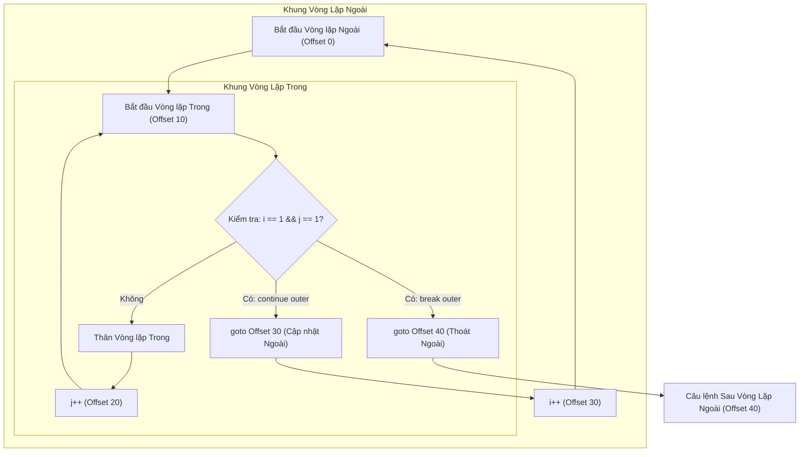
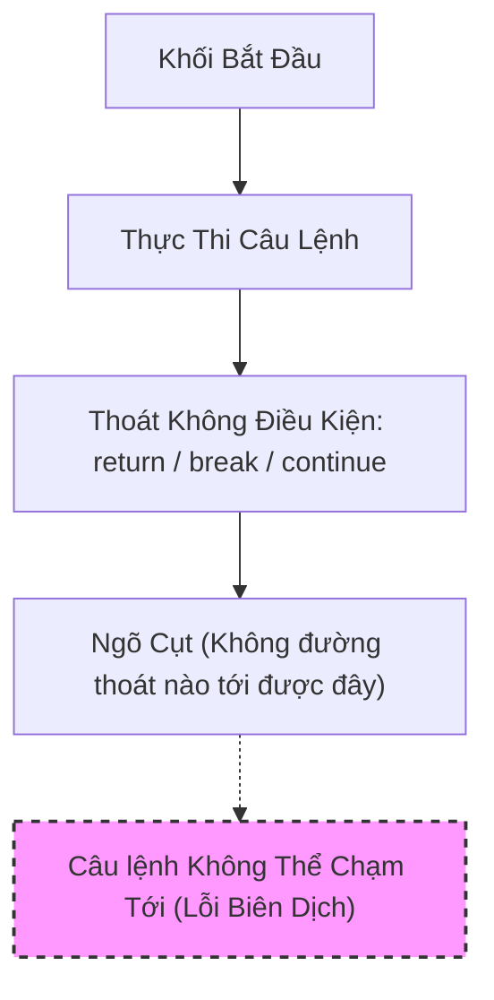

# break, continue, và return

`break`, `continue` và `return` làm thay đổi luồng thực thi thông thường. Chúng là các công cụ thoát sớm (early-exit tool), nhưng phạm vi thoát của chúng là khác nhau.

## Từ Khóa `break`

`break` thoát khỏi vòng lặp hoặc câu lệnh `switch` gần nhất.

```java
for (int i = 0; i < 10; i++) {
    if (i == 3) {
        break;
    }
    System.out.println(i);
}
```

Đoạn code này in ra `0`, `1` và `2`, sau đó thoát khỏi vòng lặp.

Trong câu lệnh `switch` truyền thống, `break` ngăn chặn hiện tượng trôi qua các nhánh (fall-through).

## Từ Khóa `continue`

`continue` bỏ qua phần còn lại của lần lặp (iteration) hiện tại và chuyển sang lần lặp tiếp theo.

```java
for (int i = 0; i < 5; i++) {
    if (i == 2) {
        continue;
    }
    System.out.println(i);
}
```

Đoạn code này in ra `0`, `1`, `3` và `4`.

Trong vòng lặp `for`, `continue` vẫn sẽ nhảy tới bước cập nhật biến đếm trước khi kiểm tra lại điều kiện.

## Từ Khóa `return`

`return` thoát khỏi phương thức hiện tại.

```java
int max(int a, int b) {
    if (a >= b) {
        return a;
    }

    return b;
}
```

Trong một phương thức không có kiểu trả về void (non-void method), `return` phải cung cấp một giá trị tương thích với kiểu trả về của phương thức. Trong phương thức `void`, `return;` thoát ra mà không cần trả về giá trị.

## So Sánh Ba Từ Khóa

- **`break`** — break: Cung cấp các quy tắc và cơ chế hoạt động cụ thể trong Java.
- **`continue`** — continue: Cung cấp các quy tắc và cơ chế hoạt động cụ thể trong Java.
- **`return`** — return: Cung cấp các quy tắc và cơ chế hoạt động cụ thể trong Java.

## Thoát Sớm Và Khả Năng Đọc Mã Nguồn (Early Exit And Readability)

Việc thoát sớm có thể làm cho mã nguồn rõ ràng hơn khi loại bỏ các khối lồng nhau (nesting) không cần thiết.

```java
void process(User user) {
    if (user == null) {
        return;
    }

    if (!user.isActive()) {
        return;
    }

    sendMessage(user);
}
```

Đoạn code này sử dụng các điều kiện bảo vệ (guard clause). Hành động chính chỉ xuất hiện sau khi các trường hợp không hợp lệ đã được xử lý.

Thoát sớm cũng có thể làm giảm khả năng đọc nếu chúng nằm rải rác một cách khó dự đoán trong một phương thức dài. Hãy sử dụng chúng để làm rõ luồng xử lý, chứ không phải để che giấu nó.

## Các Vòng Lặp Lồng Nhau (Nested Loops)

Bên trong các vòng lặp lồng nhau, từ khóa `break` thông thường chỉ thoát khỏi vòng lặp gần nhất chứa nó.

```java
for (int row = 0; row < 3; row++) {
    for (int col = 0; col < 3; col++) {
        if (row == col) {
            break;
        }
    }
}
```

Nếu bạn cần thoát khỏi một vòng lặp bên ngoài, bạn có thể sử dụng một biến cờ hiệu (flag), tách thành phương thức khác rồi dùng `return`, hoặc sử dụng `break` có nhãn (labeled break).

## Bên Dưới Hệ Thống: Cách JVM Xử Lý Labeled break Và continue (Under the Hood)

Các câu lệnh `break` và `continue` tiêu chuẩn trong Java hoạt động ngầm định trên cấu trúc vòng lặp hoặc switch trong cùng. Khi quản lý các vòng lặp lồng nhau phức tạp, lập trình viên sử dụng các câu lệnh có nhãn (ví dụ: `labelName:`) để chỉ định vòng lặp bên ngoài nào cần nhắm tới. Trong mã bytecode của Java, các nhãn không tồn tại dưới dạng ký hiệu có tên; chúng hoàn toàn bị loại bỏ sau khi biên dịch. Trình biên dịch Java (`javac`) xử lý nhãn bằng cách tính toán các khoảng lệch bytecode (bytecode offset) cho các lệnh cập nhật của vòng lặp đích (đối với `continue`) hoặc câu lệnh ngay sau vòng lặp đó (đối với `break`). Trình biên dịch sau đó thay thế câu lệnh có nhãn bằng một lệnh `goto` trực tiếp nhắm đến khoảng lệch bytecode cụ thể đó, bỏ qua các quy tắc lồng nhau mặc định.



### Phân Tích Biên Dịch Bytecode

Xét cấu trúc vòng lặp lồng nhau có break có nhãn sau:

```java
public void search() {
    outer:
    for (int i = 0; i < 3; i++) {
        for (int j = 0; j < 3; j++) {
            if (i == 1 && j == 1) {
                break outer; // Nhảy hoàn toàn ra ngoài vòng lặp outer
            }
        }
    }
}
// Bên dưới hệ thống, javac dịch đoạn này thành các offset bytecode sau:
// 0: iconst_0
// 1: istore_1          // i = 0
// 2: iload_1
// 3: iconst_3
// 4: if_icmpge 28      // Nếu i >= 3, nhảy đến 28 (kết thúc vòng lặp outer)
// 7: iconst_0
// 8: istore_2          // j = 0
// 9: iload_2
// 10: iconst_3
// 11: if_icmpge 22     // Nếu j >= 3, nhảy đến 22 (kết thúc vòng lặp inner)
// 14: iload_1
// 15: iconst_1
// 16: if_icmpne 19     // Kiểm tra i == 1 và j == 1
// 19: goto 28          // break outer: Nhảy trực tiếp đến điểm thoát vòng lặp outer (offset 28)
// 22: iinc 1, 1        // i++ (cập nhật vòng lặp outer)
// 25: goto 2           // Lặp lại kiểm tra vòng lặp outer
// 28: return           // Thoát phương thức
```

### Chuỗi Nguyên Nhân - Kết Quả

Trình biên dịch phân tích cú pháp lệnh điều khiển có nhãn (`break outer`) $\rightarrow$ Trình biên dịch ánh xạ nhãn ký hiệu với offset bytecode thoát của vòng lặp đích (offset 28) $\rightarrow$ Trình biên dịch đưa ra lệnh `goto 28` trực tiếp $\rightarrow$ JVM nhảy trực tiếp đến vị trí đích lúc chạy $\rightarrow$ Tất cả các vòng lặp trung gian đều thoát ra một cách sạch sẽ mà không cần biến cờ hiệu hay kiểm tra logic điều kiện.

---

## Các Sai Lầm Thường Gặp (Common Mistakes)

### Sai Lầm 1 — Các câu lệnh không thể chạm tới (unreachable statement)

Việc viết code ngay sau câu lệnh `break`, `continue` hoặc `return` trong cùng một khối sẽ gây ra lỗi tại thời điểm biên dịch.

```java
for (int i = 0; i < 5; i++) {
    if (i == 2) {
        continue;
        // LỖI: Lỗi biên dịch: câu lệnh không thể chạm tới (unreachable statement)
        System.out.println("Skipping 2"); 
    }
}
```

**Cách khắc phục**: Đảm bảo không có câu lệnh nào đứng sau các từ khóa thoát sớm trong cùng một khối.

## Tại Sao Java Cấm Các Câu Lệnh Không Thể Chạm Tới Và Trình Biên Dịch Phát Hiện Chúng Như Thế Nào

Java không cho phép các câu lệnh tồn tại nếu chúng không thể được thực thi dưới bất kỳ điều kiện chạy nào. Để thực thi điều này, trình biên dịch Java thực hiện phân tích tĩnh (static analysis) để xây dựng một Đồ thị Luồng Điều khiển (Control Flow Graph - CFG) của mã nguồn và áp dụng các quy tắc "hoàn thành xác định" (definite completion, chi tiết tại JLS 14.21). Nếu một khối lệnh kết thúc bằng một lệnh nhảy không điều kiện (chẳng hạn như `return`, `break`, `continue`, hoặc một ngoại lệ được ném ra), trình biên dịch sẽ đánh giá các câu lệnh tiếp theo trong khối đó là không có cạnh điều khiển đi vào (incoming control edge). Thay vì cảnh báo lập trình viên hay biên dịch mã bytecode chết (dead bytecode), trình biên dịch sẽ ném ra lỗi thời điểm biên dịch để ngăn chặn các lỗi logic tiềm ẩn, giảm thiểu kích thước bytecode và bắt buộc thiết kế luồng rõ ràng.



### Ví Dụ Code: Lỗi Biên Dịch Code Không Thể Chạm Tới

Trong đoạn code dưới đây, một khi `return` được thực thi, câu lệnh phía sau nó sẽ bị coi là không thể chạm tới một cách tĩnh.

```java
public int processScore(int score) {
    if (score < 0) {
        return 0;
        // Dòng sau đây sẽ gây ra lỗi biên dịch!
        // System.out.println("Invalid score reset"); // Lỗi biên dịch: unreachable statement (câu lệnh không thể chạm tới)
    }
    return score;
}
```

### Chuỗi Nguyên Nhân - Kết Quả

Lập trình viên viết câu lệnh ngay sau một câu lệnh chuyển điều khiển kết thúc khối $\rightarrow$ Trình biên dịch xây dựng Đồ thị Luồng Điều khiển (CFG) $\rightarrow$ Xác minh tĩnh rằng không có đường thực thi nào có thể rẽ nhánh đến câu lệnh đó $\rightarrow$ Kiểm tra hoàn thành xác định cho câu lệnh thất bại $\rightarrow$ Trình biên dịch đưa ra lỗi biên dịch "unreachable statement" và dừng quá trình biên dịch.

### Sai Lầm 2 — Nhầm Lẫn Giữa break Vòng Lặp Và break Trong Switch

Một câu lệnh `break` bên trong một khối `switch` lồng trong một vòng lặp chỉ thoát khỏi cấu trúc `switch`, chứ KHÔNG thoát khỏi vòng lặp.

```java
// LỖI: Ý định là thoát khỏi vòng lặp khi status là 200, nhưng chỉ thoát khỏi switch
while (true) {
    int status = getResponseCode();
    switch (status) {
        case 200:
            break; // Thoát khỏi khối switch, vòng lặp tiếp tục vô hạn!
        case 500:
            System.out.println("Error");
            break;
    }
}

// SỬA LỖI: Sử dụng nhãn, cờ hiệu hoặc return để thoát khỏi vòng lặp
outerLoop:
while (true) {
    int status = getResponseCode();
    switch (status) {
        case 200:
            break outerLoop; // Thoát khỏi vòng lặp while có nhãn 'outerLoop'
        case 500:
            System.out.println("Error");
            break;
    }
}
```

### Sai Lầm 3 — `continue` Gây Ra Vòng Lặp Vô Hạn Trong Vòng Lặp `while`

Trong vòng lặp `for`, `continue` nhảy đến biểu thức cập nhật (ví dụ: `i++`). Trong vòng lặp `while` hoặc `do-while`, `continue` nhảy trực tiếp đến bước kiểm tra điều kiện, bỏ qua bất kỳ câu lệnh cập nhật nào được đặt phía dưới nó.

```java
int i = 0;
// LỖI: Vòng lặp vô hạn vì i++ bị bỏ qua khi i == 1
while (i < 5) {
    if (i == 1) {
        continue; 
    }
    System.out.println(i);
    i++;
}

// SỬA LỖI: Thực hiện cập nhật trước continue hoặc sử dụng vòng lặp for
int i = 0;
while (i < 5) {
    if (i == 1) {
        i++;
        continue; 
    }
    System.out.println(i);
    i++;
}
```

---

## Ví Dụ Thực Tế — Theo Dõi Luồng Điều Khiển Có Nhãn Với Vòng Lặp Lồng Nhau

Các câu lệnh có nhãn cho phép điều khiển chi tiết (fine-grained control) khi quản lý các vòng lặp lồng nhau. Nhãn đứng trước vòng lặp đích (ví dụ: `labelName:`).

### Ví Dụ Thực Tế Theo Dõi Labeled `continue`

```java
outer:
for (int i = 1; i <= 3; i++) {
    for (int j = 1; j <= 3; j++) {
        if (i == 2 && j == 2) {
            continue outer;
        }
        System.out.println("i=" + i + ", j=" + j);
    }
}
```

**Từng bước theo dõi thực thi:**
1. **`i = 1`**: Vòng lặp ngoài bắt đầu.
- **`j = 1`** — j = 1: Cung cấp các quy tắc và cơ chế hoạt động cụ thể trong Java.
- **`j = 2`** — j = 2: Cung cấp các quy tắc và cơ chế hoạt động cụ thể trong Java.
- **`j = 3`** — j = 3: Cung cấp các quy tắc và cơ chế hoạt động cụ thể trong Java.
2. **`i = 2`**: Vòng lặp ngoài cập nhật lên 2.
- **`j = 1`** — j = 1: Cung cấp các quy tắc và cơ chế hoạt động cụ thể trong Java.
- **`j = 2`** — j = 2: Cung cấp các quy tắc và cơ chế hoạt động cụ thể trong Java.
     - `continue outer` được thực thi.
     - Thực thi nhảy ngay lập tức đến bước cập nhật của vòng lặp ngoài (`i++`).
     - Lần lặp trong cho `j=3` bị bỏ qua hoàn toàn.
3. **`i = 3`**: Vòng lặp ngoài cập nhật lên 3.
- **`j = 1`** — j = 1: Cung cấp các quy tắc và cơ chế hoạt động cụ thể trong Java.
- **`j = 2`** — j = 2: Cung cấp các quy tắc và cơ chế hoạt động cụ thể trong Java.
- **`j = 3`** — j = 3: Cung cấp các quy tắc và cơ chế hoạt động cụ thể trong Java.

**Đầu ra:**
```text
i=1, j=1
i=1, j=2
i=1, j=3
i=2, j=1
i=3, j=1
i=3, j=2
i=3, j=3
```

---

### Ví Dụ Thực Tế Theo Dõi Labeled `break`

```java
outer:
for (int i = 1; i <= 3; i++) {
    for (int j = 1; j <= 3; j++) {
        if (i == 2 && j == 2) {
            break outer;
        }
        System.out.println("i=" + i + ", j=" + j);
    }
}
```

**Từng bước theo dõi thực thi:**
1. **`i = 1`**: Vòng lặp ngoài bắt đầu.
- **`j = 1`** — j = 1: Cung cấp các quy tắc và cơ chế hoạt động cụ thể trong Java.
- **`j = 2`** — j = 2: Cung cấp các quy tắc và cơ chế hoạt động cụ thể trong Java.
- **`j = 3`** — j = 3: Cung cấp các quy tắc và cơ chế hoạt động cụ thể trong Java.
2. **`i = 2`**: Vòng lặp ngoài cập nhật lên 2.
- **`j = 1`** — j = 1: Cung cấp các quy tắc và cơ chế hoạt động cụ thể trong Java.
- **`j = 2`** — j = 2: Cung cấp các quy tắc và cơ chế hoạt động cụ thể trong Java.
     - `break outer` được thực thi.
     - Thực thi thoát hoàn toàn ra ngoài vòng lặp có nhãn `outer`.
     - Chương trình tiếp tục tại câu lệnh ngay sau khối vòng lặp ngoài.

**Đầu ra:**
```text
i=1, j=1
i=1, j=2
i=1, j=3
i=2, j=1
```

## Liên Kết Tham Khảo (Reference Links)

- https://docs.oracle.com/javase/specs/jls/se21/html/jls-14.html#jls-14.7 (Labeled Statements in the Java Language Specification)
- https://docs.oracle.com/javase/specs/jls/se21/html/jls-14.html#jls-14.15 (The break Statement in the Java Language Specification)
- https://docs.oracle.com/javase/specs/jls/se21/html/jls-14.html#jls-14.16 (The continue Statement in the Java Language Specification)
- https://docs.oracle.com/javase/specs/jls/se21/html/jls-14.html#jls-14.21 (Unreachable Statements in the Java Language Specification)
- https://docs.oracle.com/javase/tutorial/java/nutsandbolts/branch.html (Oracle Java Branching Statements Tutorial)
