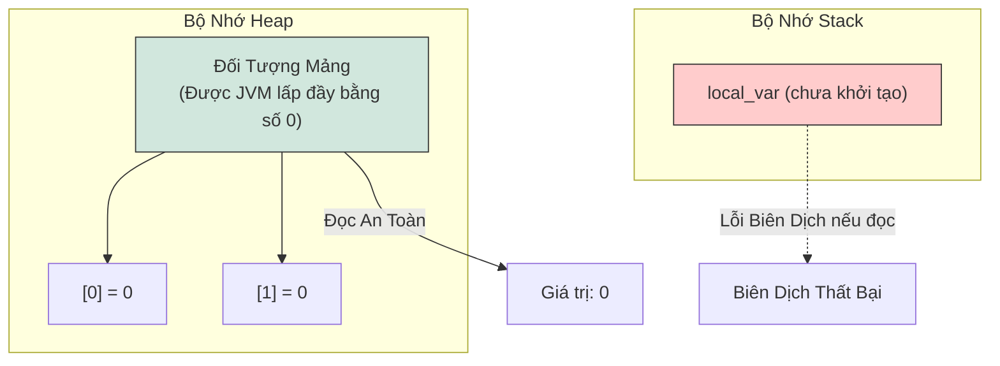
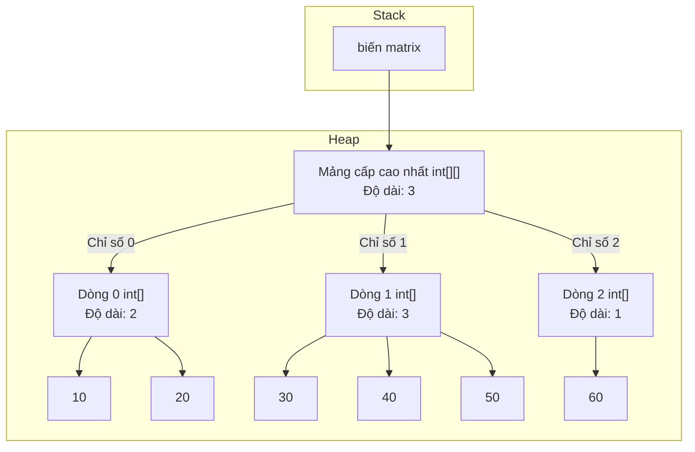
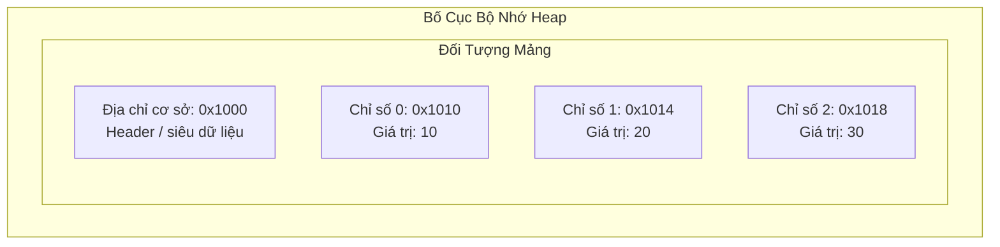

# Kiến Thức Cơ Bản Về Mảng (Array Basics)

Mảng (array) trong Java là một đối tượng chứa (container object) lưu trữ một số lượng giá trị cố định có cùng một kiểu dữ liệu. Độ dài của mảng được xác định khi mảng được tạo ra, và sau khi tạo, độ dài này cố định không thay đổi.

---

## Khai Báo Và Khởi Tạo (Declaration and Initialization)

Một mảng phải được khai báo, cấp phát và khởi tạo (tùy chọn) trước khi có thể sử dụng.

### Cú Pháp Khai Báo
Có hai cú pháp để khai báo một biến mảng:
1. **Kiểu dữ liệu trước (Khuyên dùng):** Đặt dấu ngoặc vuông `[]` ngay sau kiểu dữ liệu.
   ```java
   int[] numbers;
   ```
2. **Tên biến trước (Phong cách C/C++):** Đặt dấu ngoặc vuông `[]` sau tên biến.
   ```java
   int scores[];
   ```
   *Lưu ý:* Cú pháp kiểu dữ liệu trước được ưa chuộng hơn vì nó phân tách rõ ràng thông tin kiểu dữ liệu (`int[]` nghĩa là "mảng số nguyên") ra khỏi tên biến.

### Cấp Phát Và Giá Trị Mặc Định
Mảng là đối tượng, điều đó có nghĩa là chúng được tạo ra trong bộ nhớ **Heap** bằng cách sử dụng từ khóa `new`. Bạn phải chỉ định kích thước (độ dài) của mảng khi cấp phát:

```java
numbers = new int[5]; // Cấp phát không gian cho 5 số nguyên
```

Khi một mảng được cấp phát, JVM sẽ tự động khởi tạo tất cả các phần tử của nó về giá trị mặc định:

| Kiểu dữ liệu | Giá trị mặc định |
| :--- | :--- |
| `byte`, `short`, `int`, `long` | `0` |
| `float`, `double` | `0.0` |
| `char` | `\u0000` (ký tự null) |
| `boolean` | `false` |
| Kiểu tham chiếu (Đối tượng, Chuỗi) | `null` |

### Tại Sao Các Phần Tử Của Mảng Tự Động Khởi Tạo Về Giá Trị 0

Khác với các biến cục bộ nằm trên stack và bắt buộc phải được khởi tạo rõ ràng, các phần tử của mảng được cấp phát trên heap sẽ tự động được khởi tạo về giá trị 0 bởi JVM khi tạo ra. Khi JVM cấp phát bộ nhớ trên heap cho một mảng mới, nó sẽ lấp đầy khối bộ nhớ được cấp phát bằng các số 0 trước khi trả về tham chiếu mảng cho chương trình. Sự khởi tạo tự động này là một tính năng an toàn cơ bản của ngôn ngữ Java để đảm bảo tính an toàn kiểu dữ liệu (type safety) và ngăn chặn các lỗ hổng bảo mật. Nếu Java cho phép truy cập vào bộ nhớ heap chưa được khởi tạo, một chương trình có khả năng đọc phải dữ liệu nhị phân còn sót lại từ các đối tượng đã được giải phóng trước đó, dẫn đến hành vi không xác định (undefined behavior) hoặc rò rỉ bảo mật. Bằng cách đảm bảo rằng mọi vị trí trong mảng đều chứa một giá trị mặc định có thể dự đoán trước, Java ngăn chặn việc đọc dữ liệu rác (garbage read) và duy trì các cam kết nghiêm ngặt về an toàn bộ nhớ.



**Ví Dụ Code Có Thể Chạy:**
```java
public class ArrayZeroInitDemo {
    public static void main(String[] args) {
        int[] rawArray = new int[3];
        System.out.println(rawArray[0]); // Output: 0
        System.out.println(rawArray[1]); // Output: 0
    }
}
```

**Chuỗi Nguyên Nhân - Kết Quả:**
`Cấp phát mảng trên heap` &rarr; `JVM lấp đầy khối bộ nhớ liên tục bằng các số 0` &rarr; `Các phần tử nhận giá trị mặc định cụ thể cho từng kiểu` &rarr; `Các thao tác đọc trả về giá trị mặc định có thể dự đoán thay vì dữ liệu rác của bộ nhớ thô` &rarr; `Đảm bảo an toàn và bảo mật bộ nhớ nghiêm ngặt`

### Ví Dụ Có Thể Chạy: Khai Báo, Cấp Phát Và Giá Trị Mặc Định
```java
public class ArrayInitExample {
    public static void main(String[] args) {
        // Khai báo và cấp phát
        int[] intArray = new int[3];
        boolean[] boolArray = new boolean[2];
        String[] strArray = new String[2];Outputs:

        // In các giá trị mặc định
        System.out.println("int default: " + intArray[0]); // Output: 0
        System.out.println("boolean default: " + boolArray[0]); // Output: false
        System.out.println("String default: " + strArray[0]); // Output: null

        // Khởi tạo tường minh
        intArray[0] = 42;
        intArray[1] = 84;
        intArray[2] = 126;
        
        System.out.println("Modified int array: " + java.util.Arrays.toString(intArray)); // Output: [42, 84, 126]
    }
}
```

---

## Các Tùy Chọn Khởi Tạo

Bạn có thể khởi tạo mảng bằng ba cách chính sau:

### 1. Cấp Phát Với Giá Trị Mặc Định
```java
int[] arr = new int[3]; // Các phần tử là {0, 0, 0}
arr[0] = 10;
arr[1] = 20;
```

### 2. Trình Khởi Tạo Mảng (Cú Pháp Rút Gọn)
Được sử dụng khi các giá trị đã được biết trước tại thời điểm khai báo:
```java
int[] arr = {10, 20, 30}; // Kích thước tự động được suy luận là 3
```
> [!WARNING]
> Cú pháp rút gọn này chỉ hợp lệ trong câu lệnh khai báo biến. Bạn không thể sử dụng nó để gán lại giá trị:
> ```java
> int[] arr;
> // arr = {10, 20, 30}; // Lỗi Biên Dịch!
> arr = new int[]{10, 20, 30}; // Gán lại giá trị hợp lệ
> ```

### 3. Cú Pháp Mảng Vô Danh (Anonymous Array)
Được sử dụng để khai báo, cấp phát và khởi tạo một mảng trực tiếp khi cần (thường là khi truyền một mảng vào phương thức):
```java
printScores(new int[]{90, 85, 95});
```

---

## Mảng Một Chiều Và Cách Duyệt (One-Dimensional Arrays and Traversing)

Các phần tử của mảng 1 chiều được truy cập bằng các vị trí chỉ số (index) từ `0` đến `length - 1`. Kích thước của mảng là thuộc tính chỉ đọc (read-only) và được truy cập thông qua thuộc tính `length`:

```java
int size = arr.length; // Thuộc tính (không có dấu ngoặc đơn)
```

### Các Phương Pháp Duyệt Mảng

#### 1. Vòng Lặp `for` Tiêu Chuẩn
Cho phép sửa đổi các phần tử, duyệt ngược hoặc di chuyển qua các chỉ số.
```java
for (int i = 0; i < arr.length; i++) {
    arr[i] = arr[i] * 2; // Có thể sửa đổi giá trị
}
```

#### 2. Vòng Lặp `for` Cải Tiến (Enhanced for/foreach)
Truy cập tuần tự chỉ đọc từ đầu đến cuối. Bạn **không thể** sử dụng nó để sửa đổi các phần tử của mảng kiểu nguyên thủy, và bạn cũng không thể truy cập vào chỉ số của phần tử.
```java
for (int val : arr) {
    System.out.println(val); // Không thể sửa đổi phần tử hoặc lấy chỉ số hiện tại
}
```

##### Ví Dụ Có Thể Chạy: Bản Chất Chỉ Đọc Của Vòng Lặp `for` Cải Tiến
```java
public class EnhancedForExample {
    public static void main(String[] args) {
        int[] numbers = {1, 2, 3, 4, 5};

        // 1. Cố gắng sửa đổi các phần tử kiểu nguyên thủy trong vòng lặp for cải tiến
        for (int num : numbers) {
            num = num * 10; // Sửa đổi biến cục bộ num, KHÔNG phải ô nhớ trong mảng!
        }
        System.out.println("After enhanced for loop: " + java.util.Arrays.toString(numbers));
        // Output: [1, 2, 3, 4, 5] (Không thay đổi!)

        // 2. Sửa đổi đúng cách sử dụng vòng lặp for tiêu chuẩn
        for (int i = 0; i < numbers.length; i++) {
            numbers[i] = numbers[i] * 10;
        }
        System.out.println("After standard for loop: " + java.util.Arrays.toString(numbers));
        // Output: [10, 20, 30, 40, 50]
    }
}
```

### Lỗi Chỉ Số Mảng Vượt Quá Phạm Vi (ArrayIndexOutOfBoundsException)
Ngoại lệ `ArrayIndexOutOfBoundsException` là một ngoại lệ lúc chạy (runtime exception) được ném ra để chỉ ra rằng một mảng đã bị truy cập bằng một chỉ số không hợp lệ. Chỉ số đó có thể là số âm hoặc lớn hơn hoặc bằng kích thước của mảng.

##### Ví Dụ Có Thể Chạy: Kích Hoạt Ngoại Lệ ArrayIndexOutOfBoundsException
```java
public class AioobeExample {
    public static void main(String[] args) {
        int[] numbers = {10, 20, 30};

        // Các chỉ số hợp lệ: 0, 1, 2
        System.out.println("Valid access at index 1: " + numbers[1]); // Prints 20

        try {
            // Truy cập không hợp lệ (chỉ số >= độ dài)
            int val = numbers[3];
        } catch (ArrayIndexOutOfBoundsException e) {
            System.out.println("Exception caught: " + e.toString());
            // Expected Output: Exception caught: java.lang.ArrayIndexOutOfBoundsException: Index 3 out of bounds for length 3
        }

        try {
            // Truy cập không hợp lệ (chỉ số âm)
            int val = numbers[-1];
        } catch (ArrayIndexOutOfBoundsException e) {
            System.out.println("Exception caught: " + e.toString());
            // Expected Output: Exception caught: java.lang.ArrayIndexOutOfBoundsException: Index -1 out of bounds for length 3
        }
    }
}
```
> [!IMPORTANT]
> Vì các chỉ số mảng trong Java được tính toán bằng số nguyên có dấu 32-bit, chỉ số tối đa là `Integer.MAX_VALUE - 8` (giá trị chính xác phụ thuộc vào các ràng buộc của JVM/heap). Việc cố gắng sử dụng trực tiếp một giá trị `long` làm chỉ số mảng sẽ gây ra lỗi tại thời điểm biên dịch.

---

## Mảng Đa Chiều (Mảng Của Các Mảng) (Multidimensional Arrays)

Java không có các mảng đa chiều liên tục thực sự trong bộ nhớ. Thay vào đó, một mảng đa chiều bản chất là một **mảng của các mảng**.

### Mảng Hai Chiều (2D Array)
Một mảng 2D có thể được hình dung như một lưới gồm các dòng và các cột.

```java
int[][] matrix = new int[3][4]; // 3 dòng, 4 cột
```

Bạn có thể khởi tạo một mảng 2D trực tiếp:
```java
int[][] matrix = {
    {1, 2, 3},
    {4, 5, 6},
    {7, 8, 9}
};
```

### Mảng Răng Cưa (Ragged/Jagged Array)
Vì mảng đa chiều là mảng của các mảng, mỗi dòng có thể trỏ đến một mảng có độ dài khác nhau.

```java
int[][] ragged = new int[3][]; // Cấp phát 3 dòng, các cột chưa được cấp phát (null)
ragged[0] = new int[2];        // Dòng 0 có 2 cột
ragged[1] = new int[4];        // Dòng 1 có 4 cột
ragged[2] = new int[1];        // Dòng 2 có 1 cột
```

### Tại Sao Mảng Đa Chiều Là Mảng Của Các Mảng

Java không hỗ trợ các mảng liên tục đa chiều thực sự trong bộ nhớ; thay vào đó, nó triển khai chúng dưới dạng các mảng một chiều lồng nhau, thường được gọi là "mảng của các mảng" (arrays of arrays). Trong mô hình này, mảng cấp cao nhất không trực tiếp chứa các giá trị nguyên thủy hay đối tượng thực tế, mà lưu trữ các địa chỉ tham chiếu trỏ đến các đối tượng mảng độc lập khác. Kiến trúc này mang lại sự linh hoạt cao, cho phép tạo ra các mảng răng cưa (jagged/ragged array) nơi mỗi mảng con có thể có độ dài khác nhau. Mỗi mảng con được coi là một đối tượng độc lập hoàn toàn trên heap, có nghĩa là chúng không cần được cấp phát liên tục với nhau trong bộ nhớ. Bằng cách áp dụng thiết kế thống nhất này, JVM đơn giản hóa biểu diễn bộ nhớ nội bộ của nó vì chỉ cần hỗ trợ các mảng một chiều của kiểu dữ liệu nguyên thủy và các mảng một chiều chứa tham chiếu đối tượng.



**Ví Dụ Code Có Thể Chạy:**
```java
public class JaggedArrayMemoryDemo {
    public static void main(String[] args) {
        int[][] matrix = new int[3][];
        matrix[0] = new int[]{10, 20};
        matrix[1] = new int[]{30, 40, 50};
        matrix[2] = new int[]{60};
        
        System.out.println("Top-level array size: " + matrix.length); // Output: 3
        System.out.println("Row 0 array size: " + matrix[0].length);   // Output: 2
        System.out.println("Row 1 array size: " + matrix[1].length);   // Output: 3
    }
}
```

**Chuỗi Nguyên Nhân - Kết Quả:**
`Khai báo mảng đa chiều` &rarr; `Cấp phát mảng tham chiếu cấp cao nhất trên heap` &rarr; `Các chiều bên trong được cấp phát dưới dạng đối tượng mảng riêng biệt` &rarr; `Tham chiếu đến các mảng con được lưu trong mảng cấp cao nhất` &rarr; `Đạt được cấu trúc mảng răng cưa với độ dài các dòng độc lập`

### Duyệt Mảng 2 Chiều
```java
for (int i = 0; i < matrix.length; i++) { // matrix.length trả về số lượng dòng
    for (int j = 0; j < matrix[i].length; j++) { // matrix[i].length trả về số lượng cột của dòng i
        System.out.print(matrix[i][j] + " ");
    }
}
```

### Ví Dụ Có Thể Chạy: Truy Cập Và Sửa Đổi Mảng Răng Cưa
```java
public class JaggedArrayExample {
    public static void main(String[] args) {
        // Cấp phát mảng răng cưa (3 dòng, cột thay đổi)
        int[][] jagged = new int[3][];
        jagged[0] = new int[] {1, 2};
        jagged[1] = new int[] {3, 4, 5};
        jagged[2] = new int[] {6};

        // Duyệt và in cấu trúc mảng răng cưa
        for (int i = 0; i < jagged.length; i++) {
            System.out.print("Row " + i + " (length " + jagged[i].length + "): ");
            for (int j = 0; j < jagged[i].length; j++) {
                System.out.print(jagged[i][j] + " ");
            }
            System.out.println();
        }
        // Output:
        // Row 0 (length 2): 1 2 
        // Row 1 (length 3): 3 4 5 
        // Row 2 (length 1): 6 
    }
}
```

---

## Mảng Các Đối Tượng (Array of Objects)

Mảng các đối tượng lưu trữ các **tham chiếu** trỏ đến đối tượng, chứ không chứa bản thân các đối tượng đó.

```java
String[] names = new String[3]; // Cấp phát 3 tham chiếu trên heap, tất cả được khởi tạo là null
// names[0].toLowerCase();      // Ném ra ngoại lệ NullPointerException!

names[0] = new String("Alice");
names[1] = "Bob";
names[2] = "Charlie";
```

### So Sánh Bố Cục Bộ Nhớ
*   **Mảng kiểu nguyên thủy (`int[]`):** Đối tượng mảng trên heap chứa trực tiếp các giá trị thô (`10`, `20`, v.v.) bên trong khối bộ nhớ liên tục.
*   **Mảng đối tượng (`String[]`):** Đối tượng mảng trên heap chứa các địa chỉ bộ nhớ (con trỏ) trỏ đến các đối tượng thực tế được lưu trữ ở những nơi khác trên heap.

---

## Các Thao Tác Tiện Ích: In Và Nhân Bản (Cloning)

### In Mảng
Gọi `System.out.println(arr)` trên một mảng sẽ in ra biểu diễn dưới dạng mã băm tên lớp của nó (ví dụ: `[I@1a2b3c4d`). Để in nội dung có thể đọc được:
*   **Mảng 1 chiều:** Sử dụng `Arrays.toString(arr)`
*   **Mảng 2 chiều:** Sử dụng `Arrays.deepToString(matrix)`

```java
int[] arr = {1, 2, 3};
System.out.println(Arrays.toString(arr)); // Output: [1, 2, 3]

int[][] matrix = { {1, 2}, {3, 4}};
System.out.println(Arrays.deepToString(matrix)); // Output: [[1, 2], [3, 4]]
```

### Nhân Bản Mảng (Cloning)
Gọi phương thức `clone()` trên một mảng 1 chiều sẽ tạo ra một bản sao của mảng đó:
```java
int[] copy = arr.clone();
```
*   **Đối với mảng kiểu nguyên thủy:** Thực hiện sao chép sâu (deep copy) các phần tử (các mảng trở nên độc lập).
*   **Đối với mảng đối tượng/đa chiều:** Thực hiện **sao chép nông (shallow copy)**. Nó chỉ sao chép các tham chiếu, có nghĩa là các thay đổi đối với các đối tượng bên trong mảng được sao chép sẽ hiển thị ở mảng gốc.

---

## Truyền Mảng Vào Phương Thức

Trong Java, các đối số được truyền dưới dạng tham trị (pass-by-value). Khi truyền một mảng vào phương thức, bạn đang truyền **giá trị của tham chiếu** (con trỏ bộ nhớ):
*   Việc gán lại (reassign) biến mảng bên trong phương thức **không** ảnh hưởng đến tham chiếu của phía gọi.
*   Việc sửa đổi phần tử bên trong mảng **có** ảnh hưởng đến mảng của phía gọi vì cả hai đều trỏ tới cùng một đối tượng trên heap.

```java
void modifyArray(int[] arr) {
    arr[0] = 99; // Phía gọi sẽ nhìn thấy thay đổi này!
    arr = new int[]{5, 6, 7}; // Phía gọi sẽ KHÔNG nhìn thấy việc gán lại này!
}
```

### Ví Dụ Có Thể Chạy: Truyền Tham Chiếu Mảng Vào Phương Thức
```java
public class PassArrayExample {
    public static void main(String[] args) {
        int[] original = {1, 2, 3};

        // 1. Sửa đổi phần tử bên trong phương thức
        modifyElements(original);
        System.out.println("After modifyElements: " + java.util.Arrays.toString(original));
        // Output: [99, 2, 3] (Mảng gốc đã bị sửa đổi!)

        // 2. Gán lại tham chiếu mảng bên trong phương thức
        tryReassignment(original);
        System.out.println("After tryReassignment: " + java.util.Arrays.toString(original));
        // Output: [99, 2, 3] (Tham chiếu mảng gốc không đổi!)
    }

    static void modifyElements(int[] arr) {
        arr[0] = 99; // Sửa đổi đối tượng được lưu trên heap
    }

    static void tryReassignment(int[] arr) {
        arr = new int[]{100, 200, 300}; // Gán lại bản sao cục bộ của tham chiếu đối số
    }
}
```

---

## Các Sai Lầm Thường Gặp (Common Mistakes)

### 1. Nhầm Lẫn Thuộc Tính `length` Của Mảng Với Phương Thức `length()` Của Chuỗi
Mảng cung cấp kích thước thông qua một trường chỉ đọc tên là `length`, trong khi `String` cung cấp nó qua một lời gọi phương thức `length()`.
```java
int[] arr = new int[5];
int size = arr.length; // Đúng!
// int size = arr.length(); // Lỗi biên dịch!

String str = "Hello";
int len = str.length(); // Đúng!
// int len = str.length; // Lỗi biên dịch!
```

### 2. Lỗi Lệch Một Đơn Vị (Off-by-One Error)
Vì chỉ số mảng bắt đầu từ số 0, phần tử cuối cùng nằm ở vị trí `arr.length - 1`. Sai lầm phổ biến là sử dụng `<=` trong điều kiện vòng lặp:
```java
int[] arr = {10, 20, 30};
for (int i = 0; i <= arr.length; i++) { // Ném ra lỗi AIOOBE khi i = 3
    System.out.println(arr[i]);
}
```

### 3. Cố Gắng Sửa Đổi Các Phần Tử Nguyên Thủy Thông Qua Vòng Lặp For Cải Tiến
Việc gán một giá trị mới cho biến lặp trong vòng lặp `for` cải tiến chỉ sửa đổi một bản sao tạm thời trên stack, làm cho phần tử thực sự của mảng vẫn giữ nguyên không đổi.

### 4. In Trực Tiếp Mảng
Truyền trực tiếp một mảng vào `System.out.println(arr)` sẽ in ra `[I@hashcode` (đối với `int[]`), chứ không phải nội dung các phần tử. Luôn sử dụng `Arrays.toString()` hoặc `Arrays.deepToString()`.

---

### Tại Sao Mảng Có Kích Thước Cố Định Và Bố Cục Bộ Nhớ Liên Tục

Trong Java, một mảng được cấp phát dưới dạng một khối bộ nhớ liên tục trên heap, có nghĩa là tất cả các phần tử của nó được lưu trữ vật lý liền kề nhau. Khi một mảng được tạo thực thể, JVM phải yêu cầu một khối bộ nhớ có kích thước cụ thể không đổi từ hệ điều hành hoặc trình cấp phát heap. Vì JVM biết khoảng lệch bộ nhớ chính xác cho mỗi phần tử dựa trên chỉ số và kiểu dữ liệu của nó, nó có thể truy cập bất kỳ phần tử nào trong thời gian hằng số $O(1)$ mà không cần phải duyệt qua các phần tử trước đó. Việc cho phép một mảng thay đổi kích thước động sẽ yêu cầu khối bộ nhớ đó phải mở rộng, điều này là bất khả thi nếu các địa chỉ bộ nhớ lân cận đã bị chiếm dụng bởi các đối tượng khác trên heap. Do đó, để đảm bảo an toàn bộ nhớ, hiệu suất nhanh và thực thi có thể dự đoán trước, mảng được thiết kế để có kích thước hoàn toàn cố định tại thời điểm cấp phát.



**Ví Dụ Code Có Thể Chạy:**
```java
public class ArrayMemoryLayoutDemo {
    public static void main(String[] args) {
        int[] numbers = new int[3];
        numbers[0] = 10;
        numbers[1] = 20;
        numbers[2] = 30;
        System.out.println("Value at index 1: " + numbers[1]); // Output: 20
    }
}
```

**Chuỗi Nguyên Nhân - Kết Quả:**
`Yêu cầu cấp phát Heap` &rarr; `Khối bộ nhớ liên tục được dành riêng` &rarr; `Công thức tính toán chỉ số (Base + Index * Size) được sử dụng` &rarr; `Tính toán ra địa chỉ vật lý trực tiếp` &rarr; `Đạt được thời gian truy cập hằng số O(1)`

### Khi Nào Nên Sử Dụng Mảng So Với ArrayList
Mặc dù mảng có hiệu suất rất cao, `ArrayList` là một lớp bọc động (dynamic wrapper class) được xây dựng trên nền tảng của một mảng bên dưới (backing array).

| Tính năng | Mảng (`T[]`) | `ArrayList<T>` |
| :--- | :--- | :--- |
| **Khả năng thay đổi kích thước** | Kích thước cố định khi cấp phát | Thay đổi kích thước động (tự động tăng thêm 50% khi đầy) |
| **Hỗ trợ kiểu dữ liệu** | Kiểu nguyên thủy và Đối tượng | Chỉ chứa tham chiếu đối tượng (kiểu nguyên thủy phải tự động đóng gói sang wrapper) |
| **Hiệu năng** | Truy cập nhanh hơn, không có chi phí lớp bọc, tốn ít bộ nhớ hơn | Chậm hơn một chút do việc bao bọc đối tượng và chi phí thay đổi kích thước động |
| **Generics** | Đồng biến (covariant - không an toàn kiểu dữ liệu với generics) | Bất biến (invariant - tích hợp hoàn chỉnh với hệ thống kiểu generics của Java) |

#### Cơ Chế Thay Đổi Kích Thước Động Của `ArrayList`
Khi một `ArrayList` vượt quá dung lượng của nó, nó sẽ thực hiện các bước nội bộ sau:
1. Cấp phát một mảng mới có kích thước bằng $1,5$ lần kích thước hiện tại.
2. Sao chép toàn bộ các phần tử từ mảng cũ sang mảng mới bằng `System.arraycopy()`.
3. Loại bỏ mảng cũ.

```java
import java.util.ArrayList;

public class ArrayVsArrayListExample {
    public static void main(String[] args) {
        // Sử dụng mảng khi kích thước cố định và được biết trước (ví dụ: tọa độ, màu RGB)
        int[] rgb = {255, 128, 0};

        // Sử dụng ArrayList khi kích thước động và các phần tử được thêm/xóa thường xuyên
        ArrayList<String> namesList = new ArrayList<>();
        namesList.add("Alice");
        namesList.add("Bob");
        namesList.add("Charlie"); // Tự động tăng dung lượng
        
        System.out.println("ArrayList content: " + namesList);
    }
}
```

---

## Liên Kết Tham Khảo (Reference Links)

- https://docs.oracle.com/javase/specs/jls/se21/html/jls-10.html (Arrays in Java Language Specification)
- https://docs.oracle.com/javase/tutorial/java/nutsandbolts/arrays.html (Official Java Arrays Tutorial)
