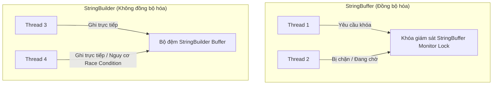

# StringBuilder và StringBuffer

Khi thực hiện các thao tác thường xuyên trên chuỗi (chẳng hạn như bên trong các vòng lặp), tính chất bất biến (immutable) của lớp `String` sẽ dẫn đến chi phí bộ nhớ (memory overhead) rất lớn vì mỗi lần sửa đổi đều tạo ra một đối tượng mới trên Heap. Để giải quyết vấn đề này, Java cung cấp các chuỗi ký tự có thể thay đổi được (mutable character sequences): `StringBuilder` và `StringBuffer`.

---

## Ví Dụ Thực Tế: Tại Sao Việc Nối Chuỗi Trong Vòng Lặp Có Độ Phức Tạp $O(n^2)$

### Vấn Đề: Phép Nối Chuỗi Cơ Bản (Naive Concatenation)

Hãy xem xét một vòng lặp xây dựng một chuỗi gồm $n$ số:

```java
// KHÔNG NÊN LÀM THẾ NÀY trong mã nguồn thực tế
String s = "";
for (int i = 0; i < n; i++) {
    s += i; // Hoặc s = s + i;
}
```

Bên dưới, trình biên dịch dịch câu lệnh `s += i` thành:
```java
s = new StringBuilder().append(s).append(i).toString();
```

Trong mỗi lần lặp:
1. Một đối tượng `StringBuilder` mới được khởi tạo.
2. Toàn bộ nội dung của chuỗi hiện tại `s` được sao chép từng ký tự một vào đối tượng builder mới này.
3. Số nguyên/ký tự mới được thêm vào sau cùng (append).
4. Phương thức `toString()` được gọi, nó sẽ sao chép mảng ký tự của builder để xây dựng một đối tượng `String` mới.

Nếu vòng lặp chạy $n$ lần và mỗi lần lặp lại thêm vào một chuỗi nhỏ, độ dài của chuỗi `s` sẽ tăng tuyến tính. Ở lần lặp thứ $k$, JVM sao chép $k$ ký tự.
Tổng số ký tự được sao chép qua tất cả các lần lặp là:
$$\text{Tổng số bản sao} = 1 + 2 + 3 + \dots + n = \frac{n(n + 1)}{2} = O(n^2)$$

Điều này dẫn đến:
- **Độ phức tạp thời gian bậc hai ($O(n^2)$):** Thời gian thực thi tăng theo cấp số nhân (bậc hai) so với $n$.
- **Rác bộ nhớ / Áp lực GC (Memory Churn / GC Pressure):** $n$ đối tượng `StringBuilder` tạm thời và $n$ đối tượng `String` tạm thời được cấp phát rồi bị loại bỏ, gây ra các khoảng dừng thu gom rác (garbage collection) thường xuyên.

### Giải Pháp: `StringBuilder`

Bằng cách khởi tạo một đối tượng `StringBuilder` duy nhất bên ngoài vòng lặp, chúng ta tránh được việc tạo ra các đối tượng tạm thời và việc sao chép mảng dư thừa:

```java
StringBuilder sb = new StringBuilder();
for (int i = 0; i < n; i++) {
    sb.append(i);
}
String s = sb.toString();
```

Tại đây:
1. Chỉ có **một** đối tượng `StringBuilder` duy nhất được cấp phát.
2. Phương thức `append()` sửa đổi trực tiếp bộ đệm `byte[]`/`char[]` nội bộ ngay tại chỗ (in-place).
3. Việc sao chép mảng chỉ xảy ra khi bộ đệm hết dung lượng. Nhờ chiến lược nhân đôi dung lượng (`(dung_lượng_cũ * 2) + 2`), việc thay đổi kích thước mảng diễn ra theo cơ số logarit ($O(\log n)$ lần).
4. Độ phức tạp khấu hao (amortized complexity) của mỗi phương thức `append()` là $O(1)$.
5. Tổng độ phức tạp thời gian cho toàn bộ vòng lặp là **$O(n)$**.
6. Chỉ có **một** đối tượng `String` cuối cùng được tạo ra khi gọi `.toString()` ở cuối vòng lặp.

---

## Bộ Đệm Nội Bộ và Dung Lượng (Internal Buffer and Capacity)

Cả `StringBuilder` và `StringBuffer` đều kế thừa từ một lớp cha trừu tượng package-private gọi là `AbstractStringBuilder`.
- Chúng quản lý một bộ đệm mảng byte/char có thể thay đổi được để lưu trữ các ký tự.
- **Length (Độ dài):** Số lượng ký tự thực tế đang được lưu trữ trong bộ đệm.
- **Capacity (Dung lượng):** Tổng kích thước của mảng bộ đệm được cấp phát. Theo mặc định, một builder mới có dung lượng ban đầu là **16 ký tự** cộng với độ dài của chuỗi được sử dụng để khởi tạo nó.

### Thuật Toán Thay Đổi Kích Thước (Resizing Algorithm)
Khi bạn thêm nội dung vượt quá dung lượng hiện tại, JVM sẽ cấp phát một mảng lớn hơn và sao chép các nội dung cũ sang. Công thức mở rộng dung lượng là:
$$\text{Dung lượng mới} = (\text{Dung lượng cũ} \times 2) + 2$$
Nếu dung lượng mới này vẫn không đủ, JVM sẽ thiết lập dung lượng bằng đúng độ dài của nội dung mới cần lưu trữ.

---

## So Sánh Chi Tiết Các Đặc Tính

| Đặc tính | `String` | `StringBuilder` (Java 5+) | `StringBuffer` (Java 1.0) |
| :--- | :--- | :--- | :--- |
| **Tính Thay Đổi Được** | Bất biến (Immutable) | Thay đổi được (Mutable) | Thay đổi được (Mutable) |
| **An Toàn Đa Luồng** | **An toàn** (do tính bất biến) | **Không an toàn** | **An toàn** (Đồng bộ hóa - Synchronized) |
| **Hiệu Năng** | Chậm nhất (khi thao tác chuỗi) | **Nhanh nhất** | Chậm (do chi phí khóa đồng bộ hóa) |
| **Vùng Lưu Trữ** | Heap & String Pool | Heap | Heap |

---

## An Toàn Đa Luồng và Tranh Chấp Khóa (Thread Safety and Lock Contention)

- **`StringBuffer`:** Tất cả các phương thức thay đổi (như `append()`, `insert()`, `delete()`) đều được đánh dấu bằng từ khóa `synchronized`. Điều này đảm bảo rằng tại một thời điểm chỉ có một luồng (thread) có thể sửa đổi bộ đệm. Tuy nhiên, sự đồng bộ hóa này đi kèm với chi phí hiệu năng:
  - Ngay cả trong chương trình đơn luồng, việc yêu cầu và giải phóng các khóa giám sát (monitor lock) vẫn tạo ra chi phí đồng bộ hóa luồng.
  - Trong môi trường đa luồng, nếu nhiều luồng cố gắng ghi vào cùng một đối tượng `StringBuffer` đồng thời, nó sẽ gây ra hiện tượng **tranh chấp khóa (lock contention)**, chặn đứng các luồng và làm giảm hiệu năng.
- **`StringBuilder`:** Loại bỏ hoàn toàn các từ khóa `synchronized`. Nó không an toàn đa luồng. Nếu nhiều luồng ghi vào một thực thể `StringBuilder` duy nhất cùng một lúc, kết quả sẽ là dữ liệu bị sai lệch hoặc ném ra các ngoại lệ vượt quá chỉ mục mảng. Tuy nhiên, đối với các biến cục bộ bên trong một phương thức, `StringBuilder` luôn là lựa chọn được ưu tiên vì các biến cục bộ được giới hạn trong luồng (thread-confined).

### Đi Sâu: Chi Phí Đồng Bộ Hóa và Cơ Chế Tranh Chấp Khóa

Sự chênh lệch hiệu năng giữa `StringBuilder` và `StringBuffer` hoàn toàn xuất phát từ chi phí runtime của việc đồng bộ hóa luồng. Trong `StringBuffer`, mọi phương thức thay đổi trạng thái đều được khai báo với từ khóa `synchronized`, yêu cầu luồng đang thực thi phải giành được khóa giám sát (monitor lock) của đối tượng trước khi thực hiện và giải phóng khóa đó sau khi hoàn thành. Quá trình này liên quan đến các bước kiểm tra ở cấp độ JVM và hệ điều hành, gây ra độ trễ ngay cả trong môi trường hoàn toàn đơn luồng. Khi nhiều luồng truy cập đồng thời vào một thực thể `StringBuffer` duy nhất, chúng sẽ gặp hiện tượng tranh chấp khóa, khiến các luồng bị chặn và phải chuyển đổi ngữ cảnh (context-switch), làm giảm nghiêm trọng băng thông ứng dụng (application throughput). Do `StringBuilder` hoàn toàn không đồng bộ hóa, nó tránh được tất cả các chi phí tranh chấp khóa và thực hiện các thao tác trực tiếp trên bộ đệm nội bộ của nó, khiến nó trở thành lựa chọn vượt trội cho các tác vụ đơn luồng và các biến cục bộ giới hạn trong một luồng đơn.

> Xem thêm: Các khái niệm cơ bản về An toàn luồng (Thread Safety) và Race Condition, được trình bày chi tiết trong [Ch.28 - Multithreading](../../no28_multithreading/theory/04-thread-safety-concepts.md).

#### Mô Hình So Sánh Tranh Chấp Luồng



#### Ví Dụ Mã Nguồn Minh Họa Sự Đồng Thời Không An Toàn

```java
// Ghi đồng thời không an toàn vào StringBuilder
StringBuilder sb = new StringBuilder();
Runnable task = () -> {
    for (int i = 0; i < 1000; i++) {
        sb.append("A");
    }
};

Thread thread1 = new Thread(task);
Thread thread2 = new Thread(task);
thread1.start();
thread2.start();
try {
    thread1.join();
    thread2.join();
} catch (InterruptedException e) {
    e.printStackTrace();
}

// Có thể ném ra lỗi ArrayIndexOutOfBoundsException or in ra độ dài nhỏ hơn 2000!
System.out.println("Expected: 2000, Actual Length: " + sb.length()); 
```

#### Chuỗi Nguyên Nhân - Kết Quả Của Việc Sử Dụng StringBuilder Đồng Thời Không An Toàn
Ghi đồng thời vào `StringBuilder` $\rightarrow$ Nhiều luồng đọc cùng một chỉ số ghi nội bộ tại cùng một thời điểm $\rightarrow$ Các luồng ghi các ký tự vào cùng một vị trí chỉ số $\rightarrow$ Dữ liệu ghi của một luồng bị ghi đè bởi luồng khác $\rightarrow$ Bộ đếm kích thước nội bộ được tăng lên không nhất quán $\rightarrow$ Dẫn đến vượt quá giới hạn mảng hoặc ném ra ngoại lệ `ArrayIndexOutOfBoundsException`.

---

## Các Phương Thức API Quan Trọng

### 1. `append()`
Thêm biểu diễn chuỗi của bất kỳ kiểu dữ liệu nào vào cuối chuỗi hiện tại. Hỗ trợ cơ chế chuỗi phương thức (method chaining).
```java
StringBuilder sb = new StringBuilder("Base");
sb.append("-").append(12.34).append(true); // "Base-12.34true"
```

### 2. `insert(int offset, Object obj)`
Chèn các ký tự tại vị trí chỉ mục (index) được chỉ định.
```java
StringBuilder sb = new StringBuilder("Jva");
sb.insert(1, "a"); // sb bây giờ là "Java"
```
- Ném ra ngoại lệ `StringIndexOutOfBoundsException` nếu `offset < 0` hoặc `offset > length()`.

### 3. `delete(int start, int end)` và `deleteCharAt(int index)`
- `delete()`: Loại bỏ các ký tự từ vị trí `start` (bao gồm) đến `end` (không bao gồm).
- `deleteCharAt()`: Loại bỏ một ký tự duy nhất tại vị trí chỉ định.
```java
StringBuilder sb = new StringBuilder("012345");
sb.delete(2, 4); // Loại bỏ các chỉ mục 2 và 3 -> sb bây giờ là "0145"
```

### 4. `replace(int start, int end, String str)`
Thay thế các ký tự từ vị trí `start` đến `end` bằng chuỗi `str`.
```java
StringBuilder sb = new StringBuilder("Hello World");
sb.replace(6, 11, "Java"); // sb bây giờ là "Hello Java"
```

### 5. `reverse()`
Đảo ngược chuỗi ký tự.
```java
StringBuilder sb = new StringBuilder("live");
sb.reverse(); // sb bây giờ là "evil"
```

### 6. `setLength(int newLength)`
Thiết lập độ dài của chuỗi ký tự:
- Nếu `newLength` nhỏ hơn độ dài hiện tại, chuỗi ký tự sẽ bị cắt ngắn đi.
- Nếu `newLength` lớn hơn, bộ đệm sẽ được đệm thêm bằng các ký tự rỗng (`\u0000`).
```java
StringBuilder sb = new StringBuilder("Java");
sb.setLength(2); // sb bây giờ là "Ja"
```

### 7. `ensureCapacity(int minimumCapacity)`
Bắt buộc bộ đệm phải cấp phát không gian cho ít nhất `minimumCapacity` ký tự, giúp ngăn chặn nhiều lần thay đổi kích thước mảng nếu bạn biết trước kích thước nội dung cuối cùng.

---

## Lỗi Thường Gặp

### 1. Khởi Tạo Lại `StringBuilder` Bên Trong Vòng Lặp
Tạo một đối tượng `StringBuilder` mới bên trong vòng lặp làm mất đi mục đích tối ưu hóa của nó. Mã nguồn vẫn chịu ảnh hưởng bởi việc sao chép mảng với độ phức tạp $O(n^2)$ và chi phí thu gom rác cao.
```java
// SAI: StringBuilder vẫn được tạo mới trong mỗi lần lặp!
String s = "";
for (int i = 0; i < 1000; i++) {
    StringBuilder sb = new StringBuilder();
    sb.append(s).append(i);
    s = sb.toString();
}

// ĐÚNG: Khởi tạo một StringBuilder duy nhất bên ngoài vòng lặp
StringBuilder sb = new StringBuilder();
for (int i = 0; i < 1000; i++) {
    sb.append(i);
}
String s = sb.toString();
```

### 2. Sử Dụng `append()` Với Phép Nối Chuỗi
Viết `sb.append(a + b)` thay vì `sb.append(a).append(b)`. Cách viết trước thực hiện một phép nối chuỗi *trước khi* chuyển kết quả cho phương thức `append()`, tạo ra một đối tượng `String` tạm thời và lãng phí bộ nhớ.
```java
String first = "John";
String last = "Doe";
StringBuilder sb = new StringBuilder();

// SAI: Tạo ra một chuỗi tạm thời "John Doe"
sb.append(first + " " + last);

// ĐÚNG: Sử dụng chuỗi phương thức giúp tránh cấp phát đối tượng tạm thời
sb.append(first).append(" ").append(last);
```

### 3. Chia Sẻ `StringBuilder` Đồng Thời Giữa Các Luồng
`StringBuilder` KHÔNG an toàn đa luồng. Nếu nhiều luồng cùng gọi `append()` vào một `StringBuilder` được chia sẻ đồng thời, các ký tự có thể ghi đè lên nhau hoặc ném ra ngoại lệ `ArrayIndexOutOfBoundsException`.
Nếu yêu cầu tính an toàn luồng, hãy sử dụng `StringBuffer` (hoặc quản lý đồng bộ hóa bên ngoài/sử dụng bộ đệm cục bộ của luồng - thread-local buffers).
```java
// KHÔNG AN TOÀN: Nhiều luồng sửa đổi cùng một builder
StringBuilder sharedBuilder = new StringBuilder();
Runnable r = () -> {
    for (int i = 0; i < 100; i++) {
        sharedBuilder.append("A"); // Xảy ra lỗi Race condition!
    }
};
```

### 4. Bỏ Qua Dung Lượng Khởi Tạo Ban Đầu
Nếu bạn biết chắc chắn rằng chuỗi kết quả cuối cùng sẽ rất lớn (ví dụ: 100.000 ký tự), việc khởi tạo một `StringBuilder` với dung lượng mặc định là 16 sẽ buộc JVM phải thay đổi kích thước mảng bộ đệm rất nhiều lần.
Hãy luôn chỉ định dung lượng ban đầu ước tính nếu biết trước:
```java
// Thay đổi kích thước nhiều lần: 16 -> 34 -> 70 -> 142 -> ...
StringBuilder sb1 = new StringBuilder(); 

// Thay đổi kích thước 0 lần:
StringBuilder sb2 = new StringBuilder(100_000); 
```

---

## Liên Kết Tham Chiếu

- https://docs.oracle.com/en/java/javase/21/docs/api/java.base/java/lang/StringBuilder.html (Tham khảo lớp StringBuilder từ Oracle Java API)
- https://docs.oracle.com/en/java/javase/21/docs/api/java.base/java/lang/StringBuffer.html (Tham khảo lớp StringBuffer từ Oracle Java API)
- https://docs.oracle.com/javase/specs/jls/se21/html/jls-17.html (Đặc tả Ngôn ngữ Java: Luồng và Khóa - Threads and Locks)
