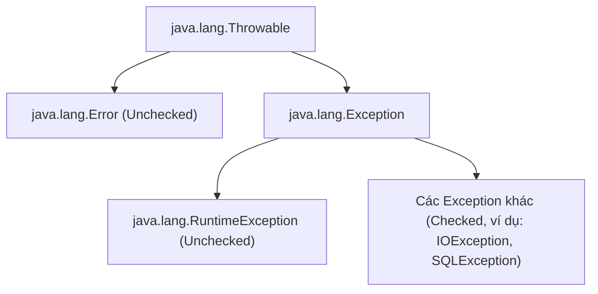

# Xử Lý Ngoại Lệ - Phần 1

## Mục Tiêu Học Tập

File này bao gồm một phần tập trung của **Xử Lý Ngoại Lệ (Exception Handling)**. Hãy học từng khái niệm như một quy tắc Java thực tế, không phải từ vựng biệt lập.

## Phạm Vi Đề Cương

- **`Ngoại lệ là gì?`** — Ngoại lệ là gì?: Cung cấp các quy tắc và cơ chế hoạt động cụ thể trong Java.
- **`Error vs Exception`** — Error vs Exception: Cung cấp các quy tắc và cơ chế hoạt động cụ thể trong Java.
- **`Checked exception`** — Checked exception: Cung cấp các quy tắc và cơ chế hoạt động cụ thể trong Java.
- **`Unchecked exception`** — Unchecked exception: Cung cấp các quy tắc và cơ chế hoạt động cụ thể trong Java.
- **`Runtime exception`** — Runtime exception: Cung cấp các quy tắc và cơ chế hoạt động cụ thể trong Java.
- **`try`** — try: Cung cấp các quy tắc và cơ chế hoạt động cụ thể trong Java.
- **`catch`** — catch: Cung cấp các quy tắc và cơ chế hoạt động cụ thể trong Java.
- **`multiple catch`** — multiple catch: Cung cấp các quy tắc và cơ chế hoạt động cụ thể trong Java.

## Ghi Chú Chi Tiết

### Ngoại lệ là gì?

Ngoại lệ (exception) đại diện cho một điều kiện bất thường mà chương trình có thể bắt hoặc lan truyền.

Quan trọng vì hành vi ngoại lệ quyết định liệu lỗi được xử lý cục bộ, lan truyền, hay được phép dừng chương trình. Nhầm lẫn thường gặp là xử lý mọi ngoại lệ như nhau thay vì phân biệt điều kiện có thể phục hồi với lỗi lập trình.

Kiểm tra thực tế:

- Định nghĩa `Ngoại lệ là gì?` trong một câu.
- Nhận diện `Ngoại lệ là gì?` trong code, lệnh, tài liệu, hoặc câu hỏi phỏng vấn.
- Giải thích một bug, giới hạn, hoặc đánh đổi liên quan đến `Ngoại lệ là gì?`.

Ví dụ nhỏ hoặc mô hình tư duy:

- Khi đọc code, hỏi: `Ngoại lệ là gì?` thay đổi, cho phép, từ chối, hay làm rõ điều gì?

#### Ví Dụ Code Chạy Được: Ném và Bắt Ngoại Lệ
Dưới đây là ví dụ cơ bản về việc ném một `Exception` tiêu chuẩn và bắt nó cục bộ.

```java
public class ExceptionDemo {
    public static void main(String[] args) {
        try {
            System.out.println("Before exception throw");
            throw new Exception("Something went wrong");
            // System.out.println("Unreachable"); // Compile error: unreachable statement
        } catch (Exception e) {
            System.out.println("Caught exception: " + e.getMessage());
        }
        System.out.println("Execution continues normally.");
    }
}
```

### Error vs Exception

Ngoại lệ đại diện cho một điều kiện bất thường mà chương trình có thể bắt hoặc lan truyền.

Quan trọng vì hành vi ngoại lệ quyết định liệu lỗi được xử lý cục bộ, lan truyền, hay được phép dừng chương trình. Nhầm lẫn thường gặp là xử lý mọi ngoại lệ như nhau thay vì phân biệt điều kiện có thể phục hồi với lỗi lập trình.

Kiểm tra thực tế:

- Định nghĩa `Error vs Exception` trong một câu.
- Nhận diện `Error vs Exception` trong code, lệnh, tài liệu, hoặc câu hỏi phỏng vấn.
- Giải thích một bug, giới hạn, hoặc đánh đổi liên quan đến `Error vs Exception`.

Ví dụ nhỏ hoặc mô hình tư duy:

- Khi đọc code, hỏi: `Error vs Exception` thay đổi, cho phép, từ chối, hay làm rõ điều gì?

#### Ví Dụ Code Chạy Được: Phục Hồi từ Exception vs Sập vì Error
Error (như `StackOverflowError` hoặc `OutOfMemoryError`) biểu thị các vấn đề nghiêm trọng mà ứng dụng bình thường không nên cố bắt. Exception (như `IOException` hoặc `NullPointerException`) là những điều kiện mà ứng dụng bình thường có thể muốn bắt.

```java
public class ThrowableHierarchyDemo {
    // 1. Error: Stack Overflow do đệ quy vô hạn (thảm họa cấp JVM)
    public static void causeStackOverflow() {
        causeStackOverflow();
    }

    // 2. Exception: Chia cho 0 (vấn đề cấp chương trình có thể phục hồi)
    public static void causeException() {
        int result = 10 / 0;
    }

    public static void main(String[] args) {
        // Phục hồi từ Exception
        try {
            causeException();
        } catch (ArithmeticException e) {
            System.out.println("Recovered from exception: " + e.getMessage());
        }

        // Gặp phải Error (Tránh bắt Error trong code production!)
        try {
            causeStackOverflow();
        } catch (StackOverflowError err) {
            System.err.println("Caught StackOverflowError (Highly discouraged to catch Errors): " + err);
        }
    }
}
```

#### Sơ Đồ Phân Cấp Class


### Checked exception (Ngoại lệ bắt buộc xử lý)

Ngoại lệ bắt buộc xử lý (checked exception) phải được xử lý hoặc khai báo theo quy tắc trình biên dịch.

Quan trọng vì hành vi ngoại lệ quyết định liệu lỗi được xử lý cục bộ, lan truyền, hay được phép dừng chương trình. Nhầm lẫn thường gặp là xử lý mọi ngoại lệ như nhau thay vì phân biệt điều kiện có thể phục hồi với lỗi lập trình.

Kiểm tra thực tế:

- Định nghĩa `Checked exception` trong một câu.
- Nhận diện `Checked exception` trong code, lệnh, tài liệu, hoặc câu hỏi phỏng vấn.
- Giải thích một bug, giới hạn, hoặc đánh đổi liên quan đến `Checked exception`.

Ví dụ nhỏ hoặc mô hình tư duy:

- Khi đọc code, hỏi: `Checked exception` thay đổi, cho phép, từ chối, hay làm rõ điều gì?

#### Ví Dụ Code Chạy Được: Xử Lý Checked Exception
Checked exception đại diện cho các điều kiện nằm ngoài tầm kiểm soát của chương trình (ví dụ: vấn đề hệ thống file hoặc mạng). Trình biên dịch bắt buộc bạn phải bắt chúng bằng `try-catch` hoặc khai báo trong chữ ký phương thức bằng `throws`.

```java
import java.io.FileReader;
import java.io.FileNotFoundException;

public class CheckedExceptionDemo {
    // Tùy chọn 1: Khai báo checked exception bằng 'throws'
    public static void readFileWithThrows() throws FileNotFoundException {
        FileReader fr = new FileReader("non_existent_file.txt");
    }

    // Tùy chọn 2: Xử lý checked exception bằng 'try-catch'
    public static void readFileWithTryCatch() {
        try {
            FileReader fr = new FileReader("non_existent_file.txt");
        } catch (FileNotFoundException e) {
            System.out.println("Handled checked exception: File not found!");
        }
    }

    public static void main(String[] args) {
        readFileWithTryCatch();
    }
}
```

### Unchecked exception (Ngoại lệ không bắt buộc xử lý)

Ngoại lệ không bắt buộc xử lý (unchecked exception) không yêu cầu phải bắt hoặc khai báo.

Quan trọng vì hành vi ngoại lệ quyết định liệu lỗi được xử lý cục bộ, lan truyền, hay được phép dừng chương trình. Nhầm lẫn thường gặp là xử lý mọi ngoại lệ như nhau thay vì phân biệt điều kiện có thể phục hồi với lỗi lập trình.

Kiểm tra thực tế:

- Định nghĩa `Unchecked exception` trong một câu.
- Nhận diện `Unchecked exception` trong code, lệnh, tài liệu, hoặc câu hỏi phỏng vấn.
- Giải thích một bug, giới hạn, hoặc đánh đổi liên quan đến `Unchecked exception`.

Ví dụ nhỏ hoặc mô hình tư duy:

- Khi đọc code, hỏi: `Unchecked exception` thay đổi, cho phép, từ chối, hay làm rõ điều gì?

#### Ví Dụ Code Chạy Được: Unchecked Exception (RuntimeException)
Unchecked exception đại diện cho lỗi lập trình (ví dụ: lỗi logic, sử dụng API không đúng). Trình biên dịch không bắt buộc bạn xử lý hoặc khai báo chúng.

```java
public class UncheckedExceptionDemo {
    public static void main(String[] args) {
        String text = null;
        
        // Dòng này ném NullPointerException lúc runtime.
        // Biên dịch thành công mà không cần try-catch hay throws.
        try {
            int length = text.length();
        } catch (NullPointerException e) {
            System.out.println("Caught unchecked NullPointerException: " + e.getMessage());
        }
    }
}
```

### Runtime exception (Ngoại lệ thời gian chạy)

Ngoại lệ đại diện cho một điều kiện bất thường mà chương trình có thể bắt hoặc lan truyền.

Quan trọng vì hành vi ngoại lệ quyết định liệu lỗi được xử lý cục bộ, lan truyền, hay được phép dừng chương trình. Nhầm lẫn thường gặp là xử lý mọi ngoại lệ như nhau thay vì phân biệt điều kiện có thể phục hồi với lỗi lập trình.

Kiểm tra thực tế:

- Định nghĩa `Runtime exception` trong một câu.
- Nhận diện `Runtime exception` trong code, lệnh, tài liệu, hoặc câu hỏi phỏng vấn.
- Giải thích một bug, giới hạn, hoặc đánh đổi liên quan đến `Runtime exception`.

Ví dụ nhỏ hoặc mô hình tư duy:

- Khi đọc code, hỏi: `Runtime exception` thay đổi, cho phép, từ chối, hay làm rõ điều gì?

#### Ví Dụ Code Chạy Được: Runtime Exception (Các lớp con của RuntimeException)
`RuntimeException` là lớp cha của những ngoại lệ có thể được ném trong quá trình hoạt động bình thường của JVM.

```java
public class RuntimeExceptionDemo {
    public static void main(String[] args) {
        // ArithmeticException là lớp con của RuntimeException
        try {
            int result = 50 / 0;
        } catch (ArithmeticException e) {
            System.out.println("Caught RuntimeException subclass (ArithmeticException): " + e.getMessage());
        }
    }
}
```

### try

`try` đánh dấu khối mà bạn muốn xử lý, dọn dẹp sau, hoặc lan truyền các ngoại lệ của nó.

Dùng nó để dự đoán quy tắc Java chính xác, dạng được phép, và chế độ lỗi. Xem lại với một ví dụ nhỏ thay vì chỉ ghi nhớ nhãn.

Kiểm tra thực tế:

- Định nghĩa `try` trong một câu.
- Nhận diện `try` trong code, lệnh, tài liệu, hoặc câu hỏi phỏng vấn.
- Giải thích một bug, giới hạn, hoặc đánh đổi liên quan đến `try`.

Ví dụ nhỏ hoặc mô hình tư duy:

- `try { ... } catch (IOException ex) { ... }` xử lý một đường dẫn lỗi cụ thể.

#### Ví Dụ Code Chạy Được: Phạm Vi Khối Try
Khối `try` không thể tồn tại một mình. Nó phải được theo sau bởi ít nhất một khối `catch`, khối `finally`, hoặc cả hai. Biến khai báo bên trong khối `try` chỉ tồn tại trong phạm vi đó và không thể truy cập bên ngoài.

```java
public class TryScopeDemo {
    public static void main(String[] args) {
        try {
            int x = 10;
            System.out.println("x in try: " + x);
        } catch (Exception e) {
            // System.out.println(x); // Compile error: x is out of scope here
        }
        // System.out.println(x); // Compile error: x is out of scope here
    }
}
```

### catch

`catch` xử lý một kiểu ngoại lệ khớp được ném ra từ khối `try`.

Dùng nó để dự đoán quy tắc Java chính xác, dạng được phép, và chế độ lỗi. Xem lại với một ví dụ nhỏ thay vì chỉ ghi nhớ nhãn.

Kiểm tra thực tế:

- Định nghĩa `catch` trong một câu.
- Nhận diện `catch` trong code, lệnh, tài liệu, hoặc câu hỏi phỏng vấn.
- Giải thích một bug, giới hạn, hoặc đánh đổi liên quan đến `catch`.

Ví dụ nhỏ hoặc mô hình tư duy:

- `try { ... } catch (IOException ex) { ... }` xử lý một đường dẫn lỗi cụ thể.

#### Ví Dụ Code Chạy Được: Bắt Ngoại Lệ Cụ Thể
Khi ngoại lệ được ném trong khối `try`, Java khớp kiểu ngoại lệ với kiểu tham số của khối `catch`.

```java
public class CatchDemo {
    public static void main(String[] args) {
        try {
            String str = "abc";
            int num = Integer.parseInt(str); // Ném NumberFormatException
        } catch (NumberFormatException e) {
            System.out.println("Caught NumberFormatException: " + e.getMessage());
        }
    }
}
```

### multiple catch (Nhiều khối catch)

`multiple catch` (nhiều khối catch) cho phép các kiểu ngoại lệ khác nhau được xử lý bởi các trình xử lý khác nhau, sắp xếp từ cụ thể đến rộng.

Dùng nó để dự đoán quy tắc Java chính xác, dạng được phép, và chế độ lỗi. Xem lại với một ví dụ nhỏ thay vì chỉ ghi nhớ nhãn.

Kiểm tra thực tế:

- Định nghĩa `multiple catch` trong một câu.
- Nhận diện `multiple catch` trong code, lệnh, tài liệu, hoặc câu hỏi phỏng vấn.
- Giải thích một bug, giới hạn, hoặc đánh đổi liên quan đến `multiple catch`.

Ví dụ nhỏ hoặc mô hình tư duy:

- `try { ... } catch (IOException ex) { ... }` xử lý một đường dẫn lỗi cụ thể.

#### Ví Dụ Code Chạy Được: Nhiều Khối Catch vs Multi-Catch (Union Catch)
Java cho phép định nghĩa nhiều khối `catch` cho một khối `try`, hoặc bắt nhiều kiểu ngoại lệ trong một khối `catch` duy nhất bằng toán tử pipe (`|`).

```java
public class MultipleCatchDemo {
    public static void main(String[] args) {
        // Tình huống 1: Nhiều khối catch (sắp xếp từ cụ thể đến tổng quát)
        try {
            int[] arr = new int[3];
            arr[5] = 10; // ArrayIndexOutOfBoundsException
        } catch (ArrayIndexOutOfBoundsException e) {
            System.out.println("Caught specific index out of bounds exception");
        } catch (RuntimeException e) {
            System.out.println("Caught general RuntimeException");
        }

        // Tình huống 2: Multi-catch (Union catch block)
        try {
            String str = null;
            str.length(); // NullPointerException
        } catch (NullPointerException | ArithmeticException e) {
            // Lưu ý: 'e' là final ngầm định trong khối multi-catch
            // e = new NullPointerException(); // Compile error: cannot assign a value to final variable e
            System.out.println("Caught NullPointerException or ArithmeticException: " + e.getClass().getSimpleName());
        }
    }
}
```

## Lỗi Thường Gặp

### 1. Bắt Exception Cha Trước Exception Con
Vì việc khớp ngoại lệ được giải quyết theo thứ tự từ trên xuống dưới, bắt kiểu ngoại lệ rộng hơn (như `Exception`) trước kiểu cụ thể hơn (như `IOException`) sẽ gây lỗi biên dịch.
```java
// COMPILE ERROR: exception java.io.IOException has already been caught
try {
    throw new java.io.IOException("File missing");
} catch (Exception e) {
    System.out.println("Caught Exception");
} catch (java.io.IOException e) { // Compile Error!
    System.out.println("Caught IOException");
}
```

### 2. Bắt Checked Exception Không Thể Được Ném Trong Khối Try
Nếu bạn viết khối catch cho một **checked exception** cụ thể, nhưng code trong khối `try` tương ứng không có khả năng ném ngoại lệ đó, trình biên dịch sẽ báo lỗi. (Lưu ý: Quy tắc này không áp dụng cho unchecked exception hoặc exception rộng như `Exception` hay `Throwable`).
```java
// COMPILE ERROR: exception java.io.IOException is never thrown in body of corresponding try statement
try {
    int x = 10 / 2;
} catch (java.io.IOException e) { // Compile Error!
    System.out.println("Caught IOException");
}
```

### 3. Gán Lại Biến Exception Trong Khối Multi-Catch
Biến ngoại lệ `e` trong khối multi-catch (ví dụ: `catch (ArithmeticException | NullPointerException e)`) là `final` ngầm định. Mọi cố gắng gán lại sẽ gây lỗi biên dịch.
```java
try {
    int x = 10 / 0;
} catch (ArithmeticException | NullPointerException e) {
    // e = new ArithmeticException("new message"); // Compile Error!
}
```

## Câu Hỏi Ôn Tập Thường Gặp

- Khái niệm nào ở đây là quy tắc biên dịch?
- Khái niệm nào ảnh hưởng đến hành vi runtime?
- Khái niệm nào có thể là bẫy phỏng vấn?

---

## Tại Sao Java Có Checked và Unchecked Exception

Các nhà thiết kế Java đã có sự phân biệt triết học có chủ đích khi phân loại ngoại lệ. **Checked exception** đại diện cho lỗi trong tài nguyên bên ngoài hoặc các điều kiện hoàn toàn nằm ngoài tầm kiểm soát của chương trình — I/O hệ thống file, kết nối mạng, truy cập cơ sở dữ liệu. Những lỗi này là dự kiến, có thể xảy ra và có thể phục hồi: file có thể không tồn tại, mạng có thể không khả dụng. Trình biên dịch bắt buộc xử lý vì nhà thiết kế cho rằng người gọi phải được thông báo rõ ràng về các chế độ lỗi này và phải đưa ra quyết định về chúng.

**Unchecked exception** (`RuntimeException` và các lớp con của nó) đại diện cho lỗi lập trình — truy cập null, lỗi chỉ số mảng, chia cho 0, đối số không hợp lệ. Những lỗi này được gây ra bởi sai sót trong code, không phải bởi điều kiện bên ngoài. Vì chúng có thể xảy ra về mặt lý thuyết ở bất kỳ đâu trong bất kỳ code nào, việc bắt buộc trình biên dịch bắt `try-catch` cho mọi unchecked exception sẽ làm code Java trở nên cực kỳ dài dòng và khó đọc. Quyết định thiết kế là: lập trình viên được kỳ vọng sửa bug, không phải bắt chúng.

Sự phân biệt ánh xạ vào câu hỏi: "Đây có phải là chế độ lỗi mà người gọi có thể hợp lý kỳ vọng xử lý tại điểm gọi không?" Với `FileNotFoundException` — có, người gọi có thể xử lý file thiếu. Với `NullPointerException` — không, phản ứng đúng là sửa truy cập null trong code, không phải bắt nó.

### Mô Hình Tư Duy: Phân chia Checked vs Unchecked
```
Lỗi Môi Trường Bên Ngoài (Checked — trình biên dịch bắt buộc xử lý):
  FileNotFoundException → mạng: IOException → cơ sở dữ liệu: SQLException
  Người gọi PHẢI quyết định: bắt ở đây, hoặc khai báo throws để lan truyền lên

Lỗi Lập Trình (Unchecked — trình biên dịch KHÔNG bắt buộc xử lý):
  NullPointerException → ArrayIndexOutOfBoundsException → NumberFormatException
  Lập trình viên nên SỬA bug, không phải bắt nó
  Có thể xảy ra về lý thuyết trong bất kỳ phương thức nào → bắt ở khắp nơi = code không thể đọc
```

### Ví Dụ Code: Checked vs Unchecked trong chữ ký phương thức
```java
import java.io.*;

// CHECKED — trình biên dịch bắt buộc người gọi xử lý hoặc khai báo throws
public void readFile(String path) throws FileNotFoundException {
    FileReader fr = new FileReader(path);  // trình biên dịch bắt buộc phải xử lý
}

// UNCHECKED — không có yêu cầu trình biên dịch khai báo hoặc xử lý
public int divide(int a, int b) {
    return a / b;  // ArithmeticException nếu b=0 — trình biên dịch không quan tâm
}

// Người gọi readFile PHẢI xử lý
try {
    readFile("config.txt");       // phải bắt FileNotFoundException
} catch (FileNotFoundException e) {
    System.out.println("Config missing: " + e.getMessage());
}

// Người gọi divide không có yêu cầu trình biên dịch
int result = divide(10, 0);  // ném ArithmeticException lúc runtime — hãy sửa code
```

### Chuỗi Nguyên Nhân-Kết Quả
I/O file thất bại &rarr; `FileNotFoundException` được ném (checked) &rarr; Trình biên dịch phát hiện checked exception chưa được bắt &rarr; Lỗi biên dịch trừ khi thêm try-catch hoặc khai báo throws &rarr; Người gọi bị buộc đưa ra quyết định có ý thức về lỗi &rarr; Chương trình xử lý hoặc lan truyền — không bao giờ im lặng bỏ qua. Lỗi lập trình: truy cập null &rarr; `NullPointerException` được ném (unchecked) &rarr; Trình biên dịch không áp đặt yêu cầu &rarr; Ngoại lệ lan truyền lên call stack &rarr; Chương trình crash với stack trace &rarr; Developer sửa kiểm tra null trong code.

---

## Tại Sao Bắt Kiểu Ngoại Lệ Rộng Là Nguy Hiểm

Khi bạn bắt `Exception` hoặc `Throwable` một cách rộng rãi, bạn bắt không chỉ các ngoại lệ mà bạn mong đợi, mà còn mọi ngoại lệ khác có thể được ném — bao gồm `InterruptedException`, `OutOfMemoryError`, `StackOverflowError`, `ThreadDeath`, và các ngoại lệ trong tương lai được thêm vào khi tái cấu trúc. Điều này gây ra ba vấn đề nghiêm trọng.

Thứ nhất, **che khuất ngoại lệ (exception masking)**: một ngoại lệ không mong đợi bị bắt và xử lý như thể nó là ngoại lệ mong đợi, ẩn lỗi thực sự. Code bắt `Exception` và ghi log "file not found" có thể đang che khuất timeout cơ sở dữ liệu, bug null pointer, hoặc vấn đề mạng — tất cả đều bị phân loại sai lặng lẽ là "file not found."

Thứ hai, **nuốt error (swallowed errors)**: nếu các lớp con của `Error` được bắt qua `Throwable`, các thảm họa cấp JVM như `OutOfMemoryError` bị hấp thụ im lặng, khiến ứng dụng ở trạng thái không xác định.

Thứ ba, **mất thông tin kiểu ngoại lệ**: các khối catch thường phản ứng khác nhau tùy thuộc vào kiểu ngoại lệ. Một catch rộng với một phản ứng duy nhất buộc tất cả ngoại lệ vào một hành vi, ngăn phản ứng đúng và cụ thể theo kiểu.

### Mô Hình Tư Duy: Phạm vi catch Hẹp vs Rộng
```
[Hẹp — đúng]
try { readFile("data.csv"); }
catch (FileNotFoundException e) {
    // Chỉ xử lý file-not-found
    // Tất cả ngoại lệ khác lan truyền đến trình xử lý đúng
}

[Rộng — nguy hiểm]
try { readFile("data.csv"); }
catch (Exception e) {
    // Bắt FileNotFoundException ← có chủ đích
    // Cũng bắt NullPointerException ← che khuất bug!
    // Cũng bắt OutOfMemoryError (qua Throwable) ← nguy hiểm!
    // Cũng bắt SQLException ← không liên quan, cần hành vi khác
    log("Error: " + e.getMessage()); // một phản ứng cho tất cả — sai!
}
```

### Ví Dụ Code: Che khuất bug qua bắt ngoại lệ rộng
```java
public void processFile(String path) {
    try {
        FileReader fr = new FileReader(path);    // Có thể ném FileNotFoundException
        String content = null;
        content.length();                         // Bug NullPointerException trong code!
    } catch (Exception e) {
        // BUG BỊ CHE KHUẤT: Cả hai ngoại lệ đều bị bắt ở đây như thể chúng giống nhau
        System.out.println("File error: " + e.getMessage());
        // Developer nghĩ file bị thiếu — thực ra có NPE trong code
    }
}

// ĐÚNG:
public void processFileCorrect(String path) throws FileNotFoundException {
    FileReader fr = new FileReader(path);    // Trình biên dịch bắt buộc xử lý
    String content = null;
    content.length();                         // NullPointerException lan truyền — bug rõ ràng!
}
```

### Chuỗi Nguyên Nhân-Kết Quả
Bắt `Exception` rộng rãi &rarr; `NullPointerException` được ném trong try &rarr; Bị bắt bởi `catch (Exception e)` rộng &rarr; Ứng dụng ghi log "file error" &rarr; Bug bị phân loại sai là lỗi mong đợi &rarr; Developer điều tra đường dẫn file, không phải truy cập null &rarr; Bug thực sự bị ẩn trong nhiều ngày hoặc tuần. Bắt hẹp (`FileNotFoundException`) &rarr; `NullPointerException` không bị bắt ở đây &rarr; Lan truyền lên call stack &rarr; Crash với stack trace rõ ràng &rarr; Developer nhìn thấy truy cập null ngay lập tức.
