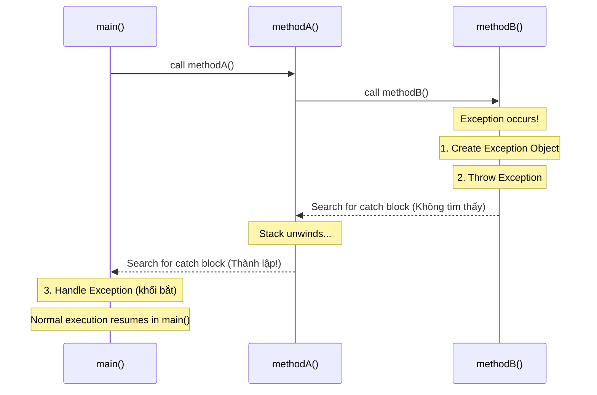
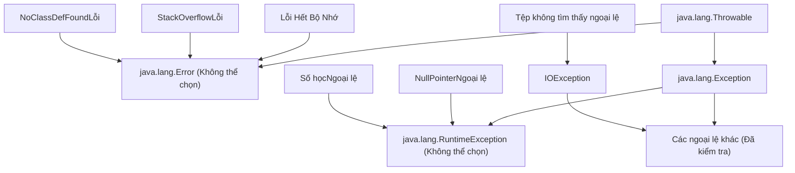

# Xử lý ngoại lệ - Phần 1 (Exception Handling - Part 1)

## Mục tiêu học tập (Learning Goal)

Tệp này bao gồm một phần tập trung vào **Xử lý ngoại lệ**. Nghiên cứu từng khái niệm như một quy tắc Java thực tế chứ không phải như một từ vựng riêng biệt.

## Đề cương Bảo hiểm (Outline Coverage)

| Ý tưởng | Những điều cần biết |
| --- | --- |
| `What is an exception?` | Một sự kiện bất thường trong quá trình thực hiện chương trình làm gián đoạn luồng (Thread) lệnh thông thường và có thể bị phát hiện hoặc truyền bá. |
| `Error vs Exception` | Lỗi thể hiện các lỗi nghiêm trọng ở cấp độ JVM mà các ứng dụng không nên phát hiện, trong khi Ngoại lệ là các điều kiện ở cấp độ chương trình có thể phục hồi được. |
| `Checked exception` | Các ngoại lệ được kiểm tra tại thời điểm biên dịch; trình biên dịch buộc nhà phát triển xử lý hoặc khai báo chúng bằng cách sử dụng try-catch hoặc ném. |
| `Unchecked exception` | Các ngoại lệ không được kiểm tra tại thời điểm biên dịch (các lớp con của RuntimeException); chúng đại diện cho các lỗi lập trình. |
| `Runtime exception` | Lớp cha của tất cả các ngoại lệ không được kiểm tra, thể hiện lỗi hoặc lỗi logic trong mã. |
| `try` | thử đánh dấu khối có ngoại lệ mà bạn muốn xử lý, dọn dẹp sau hoặc truyền bá. |
| `catch` | Catch xử lý một loại ngoại lệ phù hợp được ném ra từ khối try. |
| `multiple catch` | nhiều lần bắt cho phép các loại ngoại lệ khác nhau được xử lý bởi các trình xử lý khác nhau, được sắp xếp từ cụ thể đến rộng. |

## Ghi chú chi tiết (Detailed Notes)

### Ngoại lệ là gì? (What is an exception?)

Ngoại lệ (ngoại lệ) là một sự kiện xảy ra trong quá trình thực thi chương trình, làm gián đoạn luồng lệnh thông thường. Khi xảy ra lỗi trong một phương thức (Method), phương thức đó sẽ tạo một đối tượng—**đối tượng ngoại lệ**—và chuyển nó cho hệ thống thời gian chạy (Runtime) (JVM). Đối tượng này chứa thông tin về lỗi, bao gồm loại lỗi và trạng thái của chương trình khi xảy ra lỗi. Việc tạo một đối tượng ngoại lệ và chuyển nó vào hệ thống thời gian chạy được gọi là **ném một ngoại lệ**.

Hiểu các ngoại lệ là rất quan trọng vì chúng tách biệt mã xử lý lỗi khỏi logic chương trình thông thường. Thay vì làm ô nhiễm mọi phương thức bằng các kiểm tra có điều kiện lồng nhau để phát hiện lỗi, Java sử dụng các ngoại lệ để truyền lỗi lên ngăn xếp cuộc gọi cho đến khi tìm thấy trình xử lý thích hợp. Một sự nhầm lẫn phổ biến là coi các trường hợp ngoại lệ là sự cố nghiêm trọng; trên thực tế, chúng là các tín hiệu có cấu trúc được thiết kế để giúp các chương trình xuống cấp một cách nhẹ nhàng hoặc phục hồi sau các điều kiện thời gian chạy không mong muốn.

#### Cơ chế kỹ thuật: Stack Unwinding (Technical Mechanism: Stack Unwinding)
Khi một ngoại lệ được ném ra, JVM sẽ tìm kiếm trong ngăn xếp lệnh gọi một phương thức chứa trình xử lý ngoại lệ tương thích (khối `catch` khớp với loại ngoại lệ). Việc tìm kiếm này bắt đầu từ phương thức xảy ra lỗi và tiến hành ngược lại qua ngăn xếp cuộc gọi (chuỗi các lệnh gọi phương thức) theo thứ tự ngược lại của lệnh gọi. Quá trình tìm kiếm và duyệt ngược qua ngăn xếp này được gọi là **giải phóng ngăn xếp**. Nếu JVM tìm thấy trình xử lý phù hợp, nó sẽ chuyển đối tượng ngoại lệ tới trình xử lý đó. Nếu không tìm thấy trình xử lý nào sau khi tìm kiếm toàn bộ ngăn xếp (bao gồm phương thức `main`), trình xử lý ngoại lệ mặc định của JVM sẽ tiếp quản, in dấu vết ngăn xếp và chấm dứt luồng.

#### Mô hình tư duy: Độ lệch luồng điều khiển (Control Flow) (Mental Model: The Control Flow Deviation)


#### Ví dụ về mã có thể chạy được: Vòng đời (Lifetime) ngoại lệ (Runnable Code Example: Exception Life Cycle)
Dưới đây là một ví dụ có thể chạy được minh họa cách ném một ngoại lệ, cách thực thi thông thường bị gián đoạn và cách điều khiển chuyển đến khối bắt phù hợp.

```java
public class ExceptionLifeCycleDemo {
    public static void performDivision() {
        System.out.println("  [performDivision] About to divide by zero...");
        int result = 10 / 0; // Throws ArithmeticException
        System.out.println("  [performDivision] This line will never execute!");
    }

    public static void main(String[] args) {
        System.out.println("[main] Starting program");
        try {
            System.out.println("[main] Entering try block");
            performDivision();
            System.out.println("[main] Leaving try block (will not print)");
        } catch (ArithmeticException e) {
            System.out.println("[main] Caught exception: " + e.getClass().getSimpleName() + " - " + e.getMessage());
        }
        System.out.println("[main] Program continues normally after try-catch");
    }
}
/*
Expected Output:
[main] Starting program
[main] Entering try block
  [performDivision] About to divide by zero...
[main] Caught exception: ArithmeticException - / by zero
[main] Program continues normally after try-catch
*/
```

#### Chuỗi nhân quả (Cause-Effect Chain)
Lỗi trong mã (ví dụ: chia cho 0) → JVM phát hiện thao tác không hợp lệ → Đối tượng ngoại lệ ( `ArithmeticException` ) được tạo và điền với dấu vết ngăn xếp → Đường dẫn thực thi hiện tại bị tạm dừng → JVM quay trở lại qua ngăn xếp cuộc gọi → Khớp khối bắt trong `main` → Điều khiển được chuyển sang khối bắt → Chương trình tránh gặp sự cố và tiếp tục luồng bình thường.

---

### Lỗi so với ngoại lệ (Error vs Exception)

Lớp gốc của tất cả các lớp liên quan đến ngoại lệ trong Java là `java.lang.Throwable` . Bên dưới `Throwable` , hệ thống phân cấp chia thành hai nhánh chính, riêng biệt: `java.lang.Error` và `java.lang.Exception` .

#### Định nghĩa chi tiết (Detailed Definitions)

*   **Lỗi ( `java.lang.Error` )**: Thể hiện các lỗi thời gian chạy nghiêm trọng, thảm khốc xảy ra bên ngoài ứng dụng. Đây thường là tình trạng cạn kiệt tài nguyên ở cấp độ JVM, hạn chế về phần cứng hoặc lỗi tải thư viện. Trong điều kiện bình thường, ứng dụng **không được cố gắng bắt Lỗi** hoặc cố gắng khôi phục từ lỗi đó. Khi xảy ra `Error`, bản thân JVM thường không ổn định và việc cố gắng tiếp tục thực thi có thể dẫn đến trạng thái hỏng hoặc lỗi im lặng.
*   **Ngoại lệ ( `java.lang.Exception` )**: Thể hiện các điều kiện đặc biệt mà một ứng dụng được viết tốt nên lường trước và xử lý. Đây là các lỗi logic, không có sẵn tài nguyên (như thiếu tệp hoặc cơ sở dữ liệu ngoại tuyến) hoặc đầu vào không hợp lệ. Các ngoại lệ có nghĩa là được phát hiện, ghi lại và khôi phục, cho phép ứng dụng tiếp tục chạy hoặc tắt sạch.

#### Sự khác biệt chính: Lỗi và Ngoại lệ (Key Differences: Error vs Exception)
| Tính năng | Lỗi ( `java.lang.Error` ) | Ngoại lệ ( `java.lang.Exception` ) |
| :--- | :--- | :--- |
| **Nguồn gốc** | JVM, tài nguyên hệ thống hoặc trình liên kết trình biên dịch không khớp. | Logic mã ứng dụng, dữ liệu đầu vào hoặc tài nguyên bên ngoài. |
| **Khả năng phục hồi** | Không thể phục hồi. Chương trình nên được phép gặp sự cố. | Có thể phục hồi. Ứng dụng có thể xử lý, dự phòng hoặc thử lại. |
| **Đã thực thi trình biên dịch** | Đã bỏ chọn. Trình biên dịch không bao giờ yêu cầu bắt hoặc khai báo. | Có thể được chọn (bắt buộc) hoặc không được chọn (các lớp con của RuntimeException). |
| **Ví dụ phổ biến** |  `OutOfMemoryError` ,  `StackOverflowError` ,  `NoClassDefFoundError` . |  `NullPointerException` ,  `IOException` ,  `FileNotFoundException` . |

#### Tìm hiểu sâu: Giải thích các lỗi thường gặp (Deep-Dive: Common Errors Explained)
1.  ** `OutOfMemoryError` **:
    *   *Nguyên nhân*: JVM hết dung lượng vùng nhớ Heap (Heap) Java và Trình thu gom rác (Garbage Collection) (GC) không thể lấy lại đủ bộ nhớ để phân bổ một đối tượng mới.
    *   *Tại sao việc bắt nó lại không tốt*: Nếu bộ nhớ đã cạn kiệt hoàn toàn, mã bên trong khối bắt (ví dụ: ghi nhật ký, dọn dẹp) cũng sẽ không phân bổ được bộ nhớ, dẫn đến lỗi phân bổ theo tầng.
2.  ** `StackOverflowError` **:
    *   *Lý do*: Việc phân bổ khung ngăn xếp cuộc gọi vượt quá giới hạn kích thước ngăn xếp đã định cấu hình, thường là do đệ quy sâu hoặc vô hạn.
    *   *Tại sao việc bắt nó lại không tốt*: Chuỗi đã hết dung lượng ngăn xếp. Việc cố gắng thực thi một khối bắt hoặc bất kỳ phương thức tiếp theo nào đều yêu cầu đẩy một khung ngăn xếp mới, điều này ngay lập tức gây ra tình trạng tràn ngăn xếp khác.
3.  ** `NoClassDefFoundError` **:
    *   *Lý do*: ClassLoader của JVM cố tải định nghĩa của một lớp trong thời gian chạy nhưng không thể tìm thấy tệp `.class` tương ứng, mặc dù lớp đó đã có mặt trong quá trình biên dịch. Điều này thường chỉ ra các vấn đề về cấu hình đường dẫn lớp hoặc thiếu JAR phụ thuộc thời gian chạy.

#### Tìm hiểu sâu: Giải thích các ngoại lệ phổ biến (Deep-Dive: Common Exceptions Explained)
Các ngoại lệ Java được chia thành hai loại tùy thuộc vào thời điểm chúng được kiểm tra (tại thời điểm biên dịch hoặc thời gian chạy).
*   **Ngoại lệ đã kiểm tra**: Kế thừa (Inheritance) trực tiếp từ `Exception` nhưng *không* `RuntimeException` . Chúng thể hiện các lỗi có thể dự đoán được trong các tài nguyên bên ngoài (ví dụ: `IOException` , `SQLException` ).
*   **Ngoại lệ không được chọn**: Kế thừa từ `RuntimeException` . Chúng biểu thị lỗi lập trình hoặc trạng thái không hợp lệ (ví dụ: `NullPointerException` , `IndexOutOfBoundsException` ).

#### Mô hình tinh thần: Hệ thống phân cấp có thể ném được (Mental Model: The Throwable Hierarchy)


#### Ví dụ về mã có thể chạy được: Sapping Tài nguyên (Lỗi) so với Xử lý logic nghiệp vụ (Ngoại lệ) (Runnable Code Example: Sapping Resources (Error) vs Handling Business Logic (Exception))
Dưới đây là chương trình thể hiện tính chất phá hoại của `StackOverflowError` so với `ArithmeticException` . Lưu ý rằng mặc dù chúng tôi lấy `StackOverflowError` ở đây nhằm mục đích trình diễn nhưng điều này **rất không được khuyến khích** trong mã sản xuất.

```java
public class ThrowableHierarchyDemo {
    // 1. Error: Stack Overflow via infinite recursion
    public static void recursiveCall(int depth) {
        // Will exhaust stack space and throw StackOverflowError
        recursiveCall(depth + 1);
    }

    // 2. Exception: Division by zero (recoverable arithmetic issue)
    public static int divideNumbers(int a, int b) {
        return a / b;
    }

    public static void main(String[] args) {
        // Recovering from Exception: Normal application flow
        try {
            int result = divideNumbers(10, 0);
        } catch (ArithmeticException e) {
            System.out.println("[Exception] Recovered from division error: " + e.getMessage());
        }

        // JVM Disaster: Caught only to show it happened
        try {
            recursiveCall(1);
        } catch (StackOverflowError err) {
            System.err.println("[Error] Stack overflow occurred! JVM stack frames exhausted.");
        }
    }
}
/*
Expected Output:
[Exception] Recovered from division error: / by zero
[Error] Stack overflow occurred! JVM stack frames exhausted.
*/
```

#### Chuỗi nhân quả (Cause-Effect Chain)
Cuộc gọi đệ quy sâu → Ngăn xếp cuộc gọi phân bổ khung ngăn xếp mới cho mỗi cuộc gọi → Vượt quá giới hạn ngăn xếp của luồng → JVM ném `StackOverflowError` → Luồng hiện tại tạm dừng ngay lập tức → Tài nguyên quá cạn để xử lý thông thường → Chấm dứt luồng (JVM có thể thoát nếu đó là luồng chính).

---

### Đã kiểm tra ngoại lệ (Checked exception)

**ngoại lệ được kiểm tra** là ngoại lệ được trình biên dịch kiểm tra tại thời điểm biên dịch. Java yêu cầu bạn phải thừa nhận và xử lý các ngoại lệ này một cách rõ ràng trước khi mã của bạn được biên dịch.

#### Cơ chế kỹ thuật: Yêu cầu bắt hoặc chỉ định của trình biên dịch (Technical Mechanism: The Compiler's Catch-or-Specify Requirement)
Khi một phương thức chứa mã có thể đưa ra một ngoại lệ đã kiểm tra (ví dụ: gọi một phương thức khai báo `throws IOException` ), trình biên dịch sẽ thực thi **Yêu cầu bắt hoặc chỉ định**. Bạn phải làm một trong hai việc:
1.  **Bắt**: Gói (Package) mã rủi ro vào khối `try` và bắt ngoại lệ trong khối `catch` tương ứng.
2.  **Chỉ định**: Khai báo rằng chính phương thức đó sẽ ném ngoại lệ đã kiểm tra bằng cách thêm `throws ExceptionType` vào chữ ký phương thức, chuyển trách nhiệm xử lý ngoại lệ đó cho người gọi.

Các trường hợp ngoại lệ được kiểm tra biểu thị các sự cố với tài nguyên bên ngoài (hệ thống tệp, mạng, cơ sở dữ liệu) nằm ngoài tầm kiểm soát của ứng dụng nhưng có khả năng dự đoán cao. Ví dụ: khi đọc một tệp, trình biên dịch biết tệp đó có thể không tồn tại. Bằng cách buộc nhà phát triển phải xử lý trước khả năng này, Java cố gắng làm cho mã sản xuất trở nên mạnh mẽ trước các lỗi môi trường.

#### Các ngoại lệ được kiểm tra phổ biến đã được phân tích (Common Checked Exceptions Analyzed)
*   ** `IOException` / `FileNotFoundException` **:
    *   *Kích hoạt*: Đường dẫn tệp không hợp lệ, đĩa đầy hoặc luồng mạng chấm dứt đột ngột trong quá trình đọc/ghi.
    *   *Tại sao được chọn*: I/O bên ngoài nổi tiếng là không ổn định. Java buộc bạn phải xác định một kế hoạch dự phòng (ví dụ: yêu cầu người dùng một đường dẫn khác, ghi lại lỗi hoặc hoàn toàn không thành công) thay vì để ứng dụng gặp sự cố bất ngờ.
*   ** `ClassNotFoundException` **:
    *   *Kích hoạt*: Mã cố gắng tải động một lớp bằng cách sử dụng tên chuỗi của nó (ví dụ: `Class.forName("com.mysql.jdbc.Driver")` ), nhưng trình nạp lớp (Class Loading) không thể tìm thấy lớp trong đường dẫn lớp hiện tại.
    *   *Tại sao được chọn*: Tải động dễ mắc lỗi chính tả trong thời gian chạy hoặc thiếu JAR thư viện. Java buộc nhà phát triển phải xử lý lỗi cấu hình này.

#### Ví dụ về mã có thể chạy được: Xử lý các ngoại lệ đã kiểm tra (Runnable Code Example: Handling Checked Exceptions)
```java
import java.io.FileReader;
import java.io.FileNotFoundException;

public class CheckedExceptionDemo {
    // Option 1: Specify the checked exception in the method signature
    public static void openFile(String path) throws FileNotFoundException {
        // If file does not exist, FileReader constructor throws FileNotFoundException (checked)
        FileReader fr = new FileReader(path);
    }

    // Option 2: Catch the checked exception in a try-catch block
    public static void readConfiguration() {
        try {
            openFile("config.json");
        } catch (FileNotFoundException e) {
            System.out.println("[Handled] Configuration file config.json not found. Loading default settings.");
        }
    }

    public static void main(String[] args) {
        readConfiguration();
    }
}
/*
Expected Output:
[Handled] Configuration file config.json not found. Loading default settings.
*/
```

#### Chuỗi nhân quả (Cause-Effect Chain)
Mã cố gắng khởi tạo `FileReader` bằng đường dẫn tệp không tồn tại → Trình xây dựng kiểm tra sự tồn tại của tệp → Tệp bị thiếu → Trình xây dựng ném `FileNotFoundException` → Trình biên dịch kiểm tra xem mã gọi có xử lý hay khai báo ngoại lệ → Nếu ​​không được xử lý/khai báo: xảy ra lỗi thời gian biên dịch (Compile time) → Nếu ​​được xử lý: quá trình thực thi chương trình bình thường sẽ tiếp tục trong khối bắt.

---

### Ngoại lệ không được kiểm tra (Unchecked exception)

**Ngoại lệ không được kiểm tra** (còn được gọi là ngoại lệ thời gian chạy) là một ngoại lệ **không** được trình biên dịch kiểm tra. Trình biên dịch không yêu cầu bạn bắt hoặc khai báo các ngoại lệ không được kiểm tra trong chữ ký phương thức.

#### Cơ chế kỹ thuật: Lỗi trong thời gian chạy (Technical Mechanism: Runtime Failures)
Các trường hợp ngoại lệ không được kiểm tra thể hiện **lỗi lập trình**—những lỗi do nhà phát triển tạo ra mà lẽ ra có thể tránh được bằng cách viết mã tốt hơn. Các ví dụ bao gồm truy cập các phần tử vượt quá giới hạn mảng, hủy tham chiếu con trỏ null hoặc thực hiện phép chia không hợp lệ. Bởi vì về mặt lý thuyết, những lỗi này có thể xảy ra trong hầu hết mọi lệnh gọi phương thức, việc buộc nhà phát triển phải khai báo chúng ở mọi nơi sẽ dẫn đến việc tạo ra quá nhiều mã soạn sẵn. Các ngoại lệ không được kiểm tra sẽ bỏ qua việc kiểm tra thời gian biên dịch và truyền bá ngăn xếp trong thời gian chạy cho đến khi chúng bị bắt hoặc chấm dứt luồng.

#### Các ngoại lệ không được kiểm tra phổ biến được phân tích (Common Unchecked Exceptions Analyzed)
1.  ** `NullPointerException` (NPE)**:
    *   *Kích hoạt*: Cố gắng gọi một phương thức phiên bản, truy cập một trường phiên bản hoặc sửa đổi một phần tử mảng trên biến tham chiếu trỏ đến `null` .
    *   *Phòng ngừa*: Sử dụng kiểm tra null rõ ràng ( `if (obj != null)` ) hoặc lớp `Optional` của Java thay vì bắt NPE.
2.  ** `ArrayIndexOutOfBoundsException` **:
    *   *Kích hoạt*: Truy cập một mảng có chỉ mục âm hoặc lớn hơn hoặc bằng độ dài của mảng.
    *   *Ngăn ngừa*: Xác minh các chỉ mục dựa trên `array.length` trước khi truy cập các phần tử.
3.  ** `ArithmeticException` **:
    *   *Kích hoạt*: Một điều kiện số học đặc biệt xảy ra (ví dụ: chia một số nguyên cho 0).
    *   *Phòng ngừa*: Đảm bảo mẫu số không bằng 0 trước khi thực hiện phép chia số nguyên.
4.  ** `ClassCastException` **:
    *   *Kích hoạt*: Cố gắng truyền một đối tượng sang một lớp con mà nó không phải là một phiên bản của nó (ví dụ: truyền một `String` tới một `Integer` ).
    *   *Phòng ngừa*: Sử dụng tính năng kiểm tra `instanceof` (hoặc khớp mẫu) trước khi truyền.
5.  ** `IllegalArgumentException` / `NumberFormatException` **:
    *   *Kích hoạt*: Truyền một đối số (Argument) không hợp lệ hoặc không phù hợp cho một phương thức hoặc cố gắng chuyển đổi một chuỗi có định dạng không hợp lệ thành kiểu số.
    *   *Phòng ngừa*: Xác thực các đối số hoặc sử dụng thư viện xác thực trợ giúp (như `Objects.requireNonNull` ).

#### Ví dụ về mã có thể chạy được: Các ngoại lệ không được kiểm tra đang hoạt động (Runnable Code Example: Unchecked Exceptions in Action)
```java
public class UncheckedExceptionDemo {
    public static void main(String[] args) {
        String data = null;

        // Code compiles perfectly without try-catch or throws
        try {
            int length = data.length(); // Throws NullPointerException
        } catch (NullPointerException e) {
            System.out.println("[Unchecked] Caught NullPointerException! (Variable was null)");
        }

        try {
            int number = Integer.parseInt("invalid_number"); // Throws NumberFormatException
        } catch (NumberFormatException e) {
            System.out.println("[Unchecked] Caught NumberFormatException! (String could not be parsed)");
        }
    }
}
/*
Expected Output:
[Unchecked] Caught NullPointerException! (Variable was null)
[Unchecked] Caught NumberFormatException! (String could not be parsed)
*/
```

#### Chuỗi nhân quả (Cause-Effect Chain)
Mã gọi `.length()` trên tham chiếu trỏ đến null → JVM cố gắng hủy đăng ký địa chỉ bộ nhớ → JVM phát hiện tham chiếu null → JVM ném `NullPointerException` → Ngăn xếp cuộc gọi giải phóng đang tìm kiếm khối bắt → Tìm thấy kết quả trùng khớp trong `main` → Bắt ngoại lệ và in thông báo.

---

### Ngoại lệ thời gian chạy (Runtime exception)

`java.lang.RuntimeException` là lớp cha của tất cả các ngoại lệ không được kiểm tra trong Java. Bản thân nó là một lớp con của `java.lang.Exception` .

#### Cơ chế kỹ thuật: Kế thừa hành vi thời gian chạy (Technical Mechanism: Inheriting Runtime Behavior)
Các quy tắc ngôn ngữ Java xác định rằng mọi lớp ngoại lệ là lớp con của `RuntimeException` đều không được chọn. Ngược lại, bất kỳ lớp ngoại lệ nào kế thừa từ `Exception` nhưng *không phải* là lớp con của `RuntimeException` đều là ngoại lệ được kiểm tra.

Khi thiết kế ngoại lệ tùy chỉnh:
*   Mở rộng `RuntimeException` nếu lỗi thể hiện **lỗi lập trình** hoặc **vi phạm logic nghiệp vụ** mà khó có khả năng phục hồi (ví dụ: `InvalidUserCredentialsException` ).
*   Mở rộng `Exception` nếu lỗi thể hiện **lỗi bên ngoài hợp pháp** mà mã cuộc gọi có thể và nên khôi phục (ví dụ: `PaymentGatewayOfflineException` ).

#### Mô hình tinh thần: Đường dẫn kế thừa được kiểm tra và không được kiểm tra (Mental Model: Checked vs Unchecked Inheritance Path)
```
java.lang.Throwable
   │
   ├── java.lang.Error (Unchecked)
   │
   └── java.lang.Exception
         │
         ├── java.lang.RuntimeException (Unchecked - and all its subclasses)
         │     ├── NullPointerException
         │     ├── ArithmeticException
         │     └── IllegalArgumentException
         │
         └── [Checked Exceptions] (Inherit Exception but NOT RuntimeException)
               ├── IOException
               ├── SQLException
               └── ClassNotFoundException
```

#### Ví dụ về mã có thể chạy được: Ngoại lệ thời gian chạy tùy chỉnh (Runnable Code Example: Custom Runtime Exception)
```java
class InvalidAgeException extends RuntimeException {
    public InvalidAgeException(String message) {
        super(message);
    }
}

public class RuntimeExceptionDemo {
    public static void registerUser(int age) {
        if (age < 18) {
            // Throwing an unchecked custom exception
            throw new InvalidAgeException("User must be at least 18 years old.");
        }
        System.out.println("Registration successful for age: " + age);
    }

    public static void main(String[] args) {
        try {
            registerUser(15);
        } catch (InvalidAgeException e) {
            System.out.println("[RuntimeException] Registration failed: " + e.getMessage());
        }
    }
}
/*
Expected Output:
[RuntimeException] Registration failed: User must be at least 18 years old.
*/
```

---

### thử (try)

Khối `try` được sử dụng để bao quanh một khối mã có thể đưa ra một hoặc nhiều ngoại lệ.

#### Cơ chế kỹ thuật: Phạm vi (Scope) và luồng kiểm soát (Technical Mechanism: Scope and Control Flow)
Khối `try` không thể đứng một mình. Theo sau nó phải là một hoặc nhiều khối `catch`, khối `finally` hoặc cả hai.
*   **Phạm vi**: Các biến được khai báo bên trong khối `try` là biến cục bộ của khối đó. Không thể truy cập chúng trong các khối `catch` hoặc `finally` hoặc bất kỳ nơi nào khác trong phương thức.
*   **Luồng thực thi**: Nếu một ngoại lệ xảy ra bên trong khối `try` thì việc thực thi khối đó sẽ bị tạm dừng ngay lập tức và điều khiển sẽ chuyển trực tiếp đến khối `catch` phù hợp. Nếu không có ngoại lệ nào xảy ra, khối `try` sẽ hoàn thành bình thường, mọi khối `catch` trùng khớp sẽ bị bỏ qua và chương trình sẽ thực thi khối `finally` (nếu có) trước khi tiếp tục.

#### Ví dụ về mã có thể chạy được: Thử phạm vi khối (Runnable Code Example: Try Block Scope)
```java
public class TryScopeDemo {
    public static void main(String[] args) {
        try {
            int computedValue = 42; // Declared within try block scope
            System.out.println("[Scope] computedValue inside try: " + computedValue);
        } catch (Exception e) {
            // System.out.println(computedValue); // COMPILE ERROR: computedValue is out of scope here!
        }
        // System.out.println(computedValue); // COMPILE ERROR: computedValue is out of scope here!
    }
}
/*
Expected Output:
[Scope] computedValue inside try: 42
*/
```

---

### nắm lấy (catch)

Khối `catch` là trình xử lý ngoại lệ chứa mã để xử lý một loại ngoại lệ cụ thể được tạo ra từ khối `try` trước đó.

#### Cơ chế kỹ thuật: So khớp kiểu và ràng buộc ngoại lệ (Technical Mechanism: Type Matching and Exception Binding)
Khi một ngoại lệ được đưa vào bên trong khối `try`, JVM sẽ tìm kiếm các khối `catch` tiếp theo theo thứ tự từ trên xuống dưới.
*   **Khớp loại**: JVM kiểm tra xem đối tượng ngoại lệ được ném có phải là phiên bản của lớp tham số (Parameter) được khai báo trong khối `catch` hay không (ví dụ: `catch (IOException e)` khớp với `IOException` và tất cả các lớp con của nó như `FileNotFoundException` ).
*   **Liên kết ngoại lệ**: Sau khi tìm thấy kết quả khớp, đối tượng ngoại lệ sẽ được liên kết với biến tham số (thường có tên `e` ) và mã bên trong khối `catch` sẽ thực thi. Chỉ **một** khối bắt sẽ thực thi mỗi lần ném ngoại lệ.

#### Ví dụ về mã có thể chạy được: Bắt loại ngoại lệ cụ thể (Runnable Code Example: Catching Specific Exception Type)
```java
public class CatchDemo {
    public static void main(String[] args) {
        try {
            String value = "123a";
            int number = Integer.parseInt(value); // Throws NumberFormatException
        } catch (NumberFormatException e) {
            System.out.println("[Catch] Caught NumberFormatException: Failed to parse input string.");
        }
    }
}
/*
Expected Output:
[Catch] Caught NumberFormatException: Failed to parse input string.
*/
```

---

### đánh bắt nhiều lần (multiple catch)

Java cho phép bạn chỉ định **nhiều khối bắt** cho một khối `try` để xử lý các ngoại lệ khác nhau một cách khác nhau.

#### Cơ chế kỹ thuật: Cụ thể cho việc đặt hàng rộng rãi (Technical Mechanism: Specific to Broad Ordering)
Bởi vì JVM khớp các khối bắt theo thứ tự tuần tự từ trên xuống dưới, **các lớp ngoại lệ cụ thể hơn (các lớp con) phải được khai báo trước các lớp ngoại lệ tổng quát hơn (siêu lớp)**. Nếu bạn đặt trình xử lý lớp cha (ví dụ: `catch (Exception e)` ) trước trình xử lý lớp con (ví dụ: `catch (IOException e)` ), trình xử lý lớp con sẽ không thể truy cập được và trình biên dịch sẽ đưa ra lỗi biên dịch.

#### Khối bắt liên minh (Đa bắt) (Union Catch Block (Multi-Catch))
Kể từ Java 7, nếu nhiều ngoại lệ yêu cầu logic xử lý giống hệt nhau, bạn có thể kết hợp chúng thành một khối `catch` bằng cách sử dụng toán tử pipe ( `|` ):
```java
catch (NullPointerException | ArithmeticException e) { ... }
```
*Quy tắc bắt nhiều*:
*   Các ngoại lệ được kết hợp với `|` không thể có mối quan hệ cha-con (ví dụ: `catch (IOException | FileNotFoundException e)` là lỗi trình biên dịch vì `FileNotFoundException` đã được đề cập bởi `IOException` ).
*   Biến ngoại lệ `e` trong khối multi-catch hoàn toàn là `final` . Bạn không thể gán giá trị mới cho nó trong khối bắt.

#### Ví dụ về mã có thể chạy được: Nhiều lần bắt và nhiều lần bắt (Runnable Code Example: Multiple Catch and Multi-Catch)
```java
public class MultipleCatchDemo {
    public static void main(String[] args) {
        // Scenario 1: Multiple catch blocks (ordered specific to general)
        try {
            int[] numbers = new int[3];
            numbers[5] = 42; // Throws ArrayIndexOutOfBoundsException
        } catch (ArrayIndexOutOfBoundsException e) {
            System.out.println("[Multiple] Caught specific: Index out of bounds!");
        } catch (RuntimeException e) {
            System.out.println("[Multiple] Caught general: RuntimeException");
        }

        // Scenario 2: Multi-catch (Union catch block)
        try {
            String text = null;
            text.trim(); // Throws NullPointerException
        } catch (NullPointerException | ArithmeticException e) {
            System.out.println("[Multi-Catch] Caught exception of type: " + e.getClass().getSimpleName());
            // e = new NullPointerException(); // COMPILE ERROR: variable e is implicitly final!
        }
    }
}
/*
Expected Output:
[Multiple] Caught specific: Index out of bounds!
[Multi-Catch] Caught exception of type: NullPointerException
*/
```

---

## Những lỗi thường gặp (Common Mistakes)

### 1. Bắt ngoại lệ siêu lớp trước ngoại lệ lớp con (1. Catching a Superclass Exception Before a Subclass Exception)
Vì việc so khớp ngoại lệ được giải quyết theo thứ tự từ trên xuống dưới nên việc nắm bắt loại ngoại lệ rộng hơn (như `Exception` ) trước loại ngoại lệ cụ thể hơn (như `IOException` ) sẽ dẫn đến lỗi thời gian biên dịch.
```java
// COMPILE ERROR: exception java.io.IOException has already been caught
try {
    throw new java.io.IOException("File missing");
} catch (Exception e) {
    System.out.println("Caught Exception");
} catch (java.io.IOException e) { // Compile Error!
    System.out.println("Caught IOException");
}
```

### 2. Bắt các ngoại lệ đã kiểm tra không thể ném vào khối thử (2. Catching Checked Exceptions That Cannot Be Thrown in Try Block)
Nếu bạn viết một khối bắt cho một ngoại lệ **đã chọn** cụ thể, nhưng mã trong khối `try` tương ứng không có khả năng ném ngoại lệ đó thì trình biên dịch sẽ bị lỗi. (Lưu ý: Quy tắc này không áp dụng cho các ngoại lệ không được kiểm tra hoặc ngoại lệ rộng như `Exception` hoặc `Throwable` ).
```java
// COMPILE ERROR: exception java.io.IOException is never thrown in body of corresponding try statement
try {
    int x = 10 / 2;
} catch (java.io.IOException e) { // Compile Error!
    System.out.println("Caught IOException");
}
```

### 3. Gán lại biến ngoại lệ trong khối Multi-Catch (3. Reassigning the Exception Variable in Multi-Catch Blocks)
Biến ngoại lệ `e` trong khối nhiều lần bắt (ví dụ: `catch (ArithmeticException | NullPointerException e)` ) hoàn toàn là `final` . Bất kỳ nỗ lực nào để gán lại nó đều dẫn đến lỗi biên dịch.
```java
try {
    int x = 10 / 0;
} catch (ArithmeticException | NullPointerException e) {
    // e = new ArithmeticException("new message"); // Compile Error!
}
```

## Lời nhắc đánh giá chung (Common Review Prompts)

- Những khái niệm nào ở đây là quy tắc thời gian biên dịch?
- Những khái niệm nào ở đây ảnh hưởng đến hành vi thời gian chạy?
- Những khái niệm nào ở đây có thể là bẫy phỏng vấn?

---

## Tại sao Java có các ngoại lệ được kiểm tra và không được kiểm tra (Why Java Has Checked and Unchecked Exceptions)

Các nhà thiết kế của Java đã cố tình phân biệt về mặt triết học khi phân loại các ngoại lệ. **Các trường hợp ngoại lệ đã được kiểm tra** biểu thị các lỗi trong các tài nguyên hoặc điều kiện bên ngoài hoàn toàn nằm ngoài tầm kiểm soát của chương trình — I/O hệ thống tệp, kết nối mạng, truy cập cơ sở dữ liệu. Những lỗi này có thể xảy ra, có thể xảy ra và có thể phục hồi: tệp có thể không tồn tại, mạng có thể không khả dụng. Trình biên dịch thực thi việc xử lý vì người thiết kế tin rằng người gọi phải được thông báo rõ ràng về các chế độ lỗi này và phải đưa ra quyết định về chúng.

**Các trường hợp ngoại lệ không được kiểm tra** ( `RuntimeException` và các lớp con của nó) thể hiện các lỗi lập trình — tham chiếu null, lỗi chỉ mục mảng, chia cho 0, đối số không hợp lệ. Những điều này là do lỗi trong chính mã chứ không phải do các điều kiện bên ngoài. Vì về mặt lý thuyết, chúng có thể xuất hiện ở bất kỳ đâu trong bất kỳ mã nào, nên việc yêu cầu trình biên dịch thực thi `try-catch` cho mọi ngoại lệ không được kiểm tra sẽ khiến mã Java trở nên dài dòng đến mức không thể đọc được. Quyết định thiết kế là: người lập trình phải sửa lỗi chứ không phải bắt chúng.

Sự khác biệt liên quan đến câu hỏi: "Chế độ lỗi này có phải là thứ mà người gọi có thể xử lý một cách hợp lý tại địa điểm cuộc gọi không?" Đối với `FileNotFoundException` — có, người gọi có thể xử lý tệp bị thiếu. Đối với `NullPointerException` - không, phản hồi đúng là sửa lỗi vô hiệu hóa null trong mã chứ không phải để bắt nó.

### Mô hình tinh thần: Phân chia có kiểm soát và không được kiểm soát (Mental Model: Checked vs Unchecked split)
```
External Environment Failures (Checked — compiler enforces handling):
  FileNotFoundException → network: IOException → database: SQLException
  Caller MUST decide: catch it here, or declare throws to propagate it upward

Programming Bugs (Unchecked — compiler does NOT enforce handling):
  NullPointerException → ArrayIndexOutOfBoundsException → NumberFormatException
  Programmer should FIX the bug, not catch it
  Theoretically possible in any method → forcing catch everywhere = unreadable code
```

### Ví dụ về mã: Đã chọn và không được chọn trong chữ ký phương thức (Code Example: Checked vs Unchecked in method signatures)
```java
import java.io.*;

// CHECKED — compiler enforces caller to handle or declare throws
public void readFile(String path) throws FileNotFoundException {
    FileReader fr = new FileReader(path);  // compiler mandates this is handled
}

// UNCHECKED — no compiler requirement to declare or handle
public int divide(int a, int b) {
    return a / b;  // ArithmeticException if b=0 — compiler doesn't care
}

// Caller of readFile MUST handle
try {
    readFile("config.txt");       // must catch FileNotFoundException
} catch (FileNotFoundException e) {
    System.out.println("Config missing: " + e.getMessage());
}

// Caller of divide has no compiler requirement
int result = divide(10, 0);  // throws ArithmeticException at runtime — fix the code
```

### Chuỗi nhân quả (Cause-Effect Chain)
Tệp I/O không thành công → `FileNotFoundException` bị ném (đã chọn) → Trình biên dịch phát hiện ngoại lệ đã được kiểm tra chưa được kiểm tra → Lỗi biên dịch trừ khi thử bắt hoặc ném khai báo được thêm vào → Người gọi buộc phải đưa ra quyết định có ý thức về lỗi → Xử lý hoặc truyền bá chương trình — không bao giờ âm thầm bỏ qua. Lỗi lập trình: vô hiệu hóa null → `NullPointerException` bị ném (không được chọn) → Trình biên dịch không áp đặt yêu cầu nào → Ngoại lệ truyền lên ngăn xếp cuộc gọi → Chương trình gặp sự cố với dấu vết ngăn xếp → Nhà phát triển sửa mã kiểm tra rỗng.

---

## Tại sao việc nắm bắt các loại ngoại lệ rộng lại nguy hiểm (Why Catching Broad Exception Types Is Dangerous)

Khi bạn nắm bắt được `Exception` hoặc `Throwable` một cách rộng rãi, bạn không chỉ nắm bắt được các ngoại lệ mà bạn mong đợi mà còn nắm bắt được mọi ngoại lệ khác có thể được đưa ra — bao gồm `InterruptedException` , `OutOfMemoryError` , `StackOverflowError` , `ThreadDeath` và các ngoại lệ trong tương lai được thêm bằng cách tái cấu trúc. Điều này giới thiệu ba vấn đề nghiêm trọng.

Đầu tiên, **che giấu ngoại lệ**: một ngoại lệ không lường trước được sẽ bị phát hiện và xử lý như thể đó là ngoại lệ được mong đợi, che giấu lỗi thực sự. Mã bắt `Exception` và ghi nhật ký "không tìm thấy tệp" có thể đang che giấu thời gian chờ của cơ sở dữ liệu, lỗi con trỏ null hoặc sự cố mạng — tất cả đều bị phân loại sai một cách âm thầm là "không tìm thấy tệp".

Thứ hai, **lỗi nuốt**: nếu các lớp con `Error` bị phát hiện thông qua `Throwable` , các thảm họa cấp JVM như `OutOfMemoryError` sẽ được âm thầm hấp thụ, khiến ứng dụng ở trạng thái không xác định.

Thứ ba, **mất thông tin về loại ngoại lệ**: các khối bắt thường phản ứng khác nhau tùy thuộc vào loại ngoại lệ. Việc đánh bắt rộng rãi với một phản hồi duy nhất sẽ buộc tất cả các trường hợp ngoại lệ vào một hành vi, ngăn chặn phản hồi chính xác, dành riêng cho từng loại.

### Mô hình tư duy: Phạm vi đánh bắt hẹp và rộng (Mental Model: Narrow vs Broad catch scope)
```
[Narrow — correct]
try { readFile("data.csv"); }
catch (FileNotFoundException e) {
    // Handles ONLY file-not-found
    // All other exceptions propagate to their proper handlers
}

[Broad — dangerous]
try { readFile("data.csv"); }
catch (Exception e) {
    // Catches FileNotFoundException ← intended
    // Also catches NullPointerException ← bug masking!
    // Also catches OutOfMemoryError (via Throwable) ← dangerous!
    // Also catches SQLException ← unrelated, different behavior needed
    log("Error: " + e.getMessage()); // one response for all — wrong!
}
```

### Ví dụ về mã: Che lỗi thông qua tính năng bắt ngoại lệ rộng (Code Example: Bug masking via broad exception catch)
```java
public void processFile(String path) {
    try {
        FileReader fr = new FileReader(path);    // May throw FileNotFoundException
        String content = null;
        content.length();                         // NullPointerException bug in code!
    } catch (Exception e) {
        // BUG MASKED: Both exceptions caught here as if they were the same
        System.out.println("File error: " + e.getMessage());
        // Developer thinks file is missing — actually there's a NPE in the code
    }
}

// CORRECT:
public void processFileCorrect(String path) throws FileNotFoundException {
    FileReader fr = new FileReader(path);    // Compiler enforces handling
    String content = null;
    content.length();                         // NullPointerException propagates — visible bug!
}
```

### Chuỗi nhân quả (Cause-Effect Chain)
Bắt `Exception` rộng rãi → `NullPointerException` được ném vào bên trong thử → Bị bắt theo phạm vi rộng `catch (Exception e)` → Nhật ký ứng dụng "lỗi tệp" → Lỗi bị phân loại sai là lỗi dự kiến ​​→ Nhà phát triển điều tra đường dẫn tệp, không phải lỗi vô hiệu → Lỗi thực sự bị ẩn trong nhiều ngày hoặc nhiều tuần. Bắt trong phạm vi hẹp ( `FileNotFoundException` ) → `NullPointerException` không bị bắt ở đây → Tuyên truyền ngăn xếp cuộc gọi → Sự cố với dấu vết ngăn xếp rõ ràng → Nhà phát triển ngay lập tức nhìn thấy sự vô hiệu hóa null.
