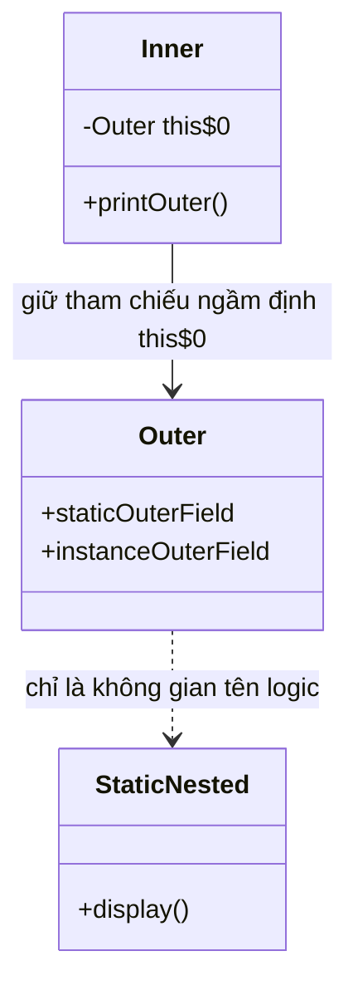
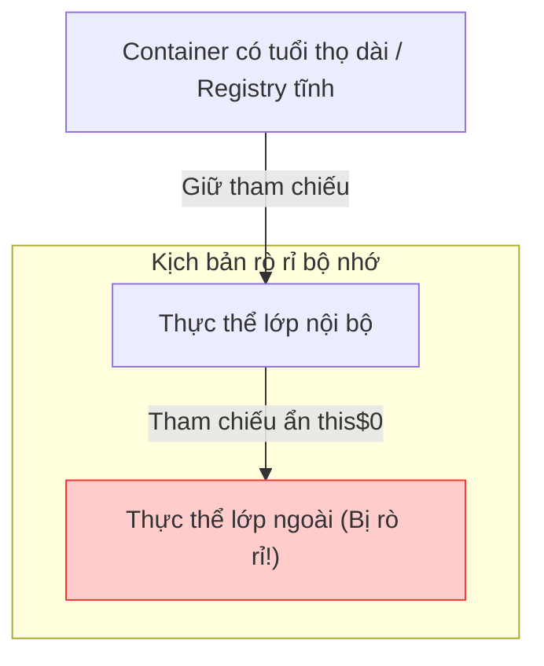
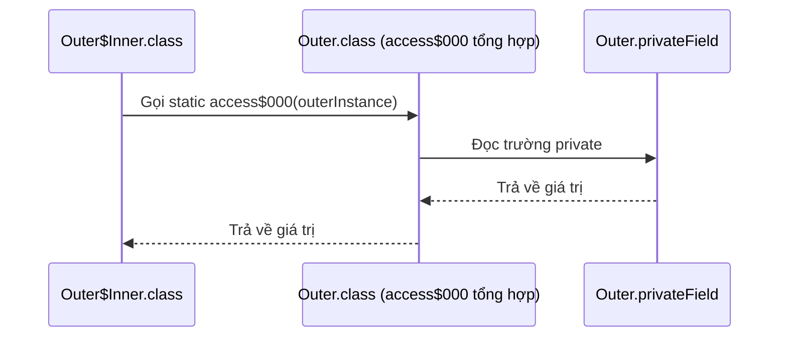

# Lớp nội bộ và Lớp lồng nhau - Phần 1 (Inner Class and Nested Class - Part 1)

## Đề cương chi tiết

---

## Ghi chú chi tiết

### Lớp lồng nhau (Nested class)

Một **lớp lồng nhau (nested class)** là bất kỳ lớp nào được định nghĩa bên trong thân của một lớp bao bọc bên ngoài khác. Trong Java, các lớp lồng nhau được chia thành hai danh mục chính:
1. **Lớp lồng nhau tĩnh (static nested class)**: Được khai báo với từ khóa bổ trợ `static`. Chúng không có quyền truy cập vào thực thể của lớp bao bọc.
2. **Lớp nội bộ (inner class)** (Lớp lồng nhau phi tĩnh - non-static nested class): Được khai báo không có từ khóa bổ trợ `static`. Chúng được liên kết với một thực thể của lớp ngoài.

```text
               Lớp lồng nhau (Nested Class)
                       /          \
                      /            \
        Lớp lồng nhau tĩnh        Lớp nội bộ (Phi tĩnh)
     (Static Nested Class)        (Inner Class)
                                     /    \
                                    /      \
                      Lớp nội bộ cục bộ    Lớp nội bộ vô danh
                    (Local Inner Class)    (Anonymous Inner Class)
```

---

### Lớp lồng nhau tĩnh (Static nested class)

Một **lớp lồng nhau tĩnh (static nested class)** hoạt động giống như một lớp cấp cao đã được lồng vào bên trong một lớp khác để thuận tiện cho việc đóng gói. Nó không có tham chiếu ngầm định đến một thực thể của lớp ngoài.

#### Quy tắc truy cập
- **Có thể truy cập**: Tất cả các thành viên tĩnh (biến và phương thức) của lớp ngoài, bao gồm cả các thành viên `private`.
- **Không thể truy cập**: Các thành viên thực thể (trường hoặc phương thức) của lớp ngoài một cách trực tiếp. Nó phải tạo một thực thể của lớp ngoài để truy cập chúng.
- **Thành viên tĩnh**: Các lớp lồng nhau tĩnh có thể định nghĩa các biến tĩnh, phương thức tĩnh, và các thành viên phi tĩnh.

#### Cú pháp khởi tạo
Vì nó không yêu cầu một thực thể lớp ngoài, bạn có thể khởi tạo nó bằng cách sử dụng tên lớp ngoài:
```java
Outer.StaticNested nestedInstance = new Outer.StaticNested();
```

#### Ví dụ mã nguồn
```java
public class Outer {
    private static String staticOuterField = "Private Static Outer Field";
    private String instanceOuterField = "Private Instance Outer Field";

    public static class StaticNested {
        public void display() {
            // Can access static members directly (even private)
            System.out.println("Accessing: " + staticOuterField);

            // Cannot access instanceOuterField directly:
            // System.out.println(instanceOuterField); // Compile error!

            // Must instantiate Outer to access instance members
            Outer outer = new Outer();
            System.out.println("Accessing via instance: " + outer.instanceOuterField);
        }
    }
}
```

---

### Lớp nội bộ (Inner class)

Một **lớp nội bộ (inner class)** là một lớp lồng nhau phi tĩnh. Mỗi thực thể của một lớp nội bộ được liên kết ngầm định với một thực thể cụ thể của lớp ngoài.

#### Quy tắc truy cập
- **Có thể truy cập**: Tất cả các thành viên của lớp ngoài (thực thể và tĩnh), bao gồm cả các thành viên `private`.
- **Không thể định nghĩa**: Trước Java 16, các lớp nội bộ không thể định nghĩa các thành viên tĩnh (ngoại trừ các biến hằng số static final). Từ Java 16 trở đi, các lớp nội bộ có thể khai báo các thành viên tĩnh.
- **Tham chiếu ngầm định**: Giữ một tham chiếu ẩn đến thực thể lớp ngoài (`Outer.this`), điều này ngăn không cho thực thể lớp ngoài bị thu gom rác chừng nào thực thể lớp nội bộ còn tồn tại.

#### Cú pháp khởi tạo
Bạn phải có một thực thể của lớp ngoài để khởi tạo một lớp nội bộ:
```java
Outer outer = new Outer();
Outer.Inner inner = outer.new Inner();
```

#### Ví dụ mã nguồn
```java
public class Outer {
    private String outerField = "Outer Instance Field";

    public class Inner {
        public void printOuter() {
            // Direct access to the enclosing instance's field
            System.out.println("Enclosing field: " + outerField);
            // Explicit reference syntax:
            System.out.println("Enclosing field (explicit): " + Outer.this.outerField);
        }
    }
}
```

## Tại sao lớp lồng nhau tĩnh và lớp nội bộ phi tĩnh khác nhau về khởi tạo và bộ nhớ

Các lớp lồng nhau tĩnh độc lập với bất kỳ thực thể lớp ngoài nào, hoạt động giống như một thành viên tĩnh của lớp ngoài. Khi JVM tải lớp ngoài, nó có thể tải lớp lồng nhau tĩnh một cách độc lập, và việc khởi tạo nó không yêu cầu một thực thể của lớp ngoài. Ngược lại, một lớp nội bộ phi tĩnh được liên kết trực tiếp với trạng thái thực thể của lớp ngoài bao bọc nó. Do sự liên kết này, mỗi thực thể của một lớp nội bộ chứa một trường ẩn ngầm định lưu trữ tham chiếu đến thực thể ngoài bao bọc nó, làm tăng dung lượng bộ nhớ của mỗi thực thể lớp nội bộ bằng kích thước của một con trỏ tham chiếu (thường là 4 hoặc 8 byte). Do đó, chúng phải được khởi tạo thông qua một thực thể ngoài đang hoạt động, thiết lập mối quan hệ đối tượng cha-con trong bộ nhớ.

### Sơ đồ bộ nhớ và Mô hình khởi tạo


### So sánh khởi tạo và bộ nhớ
```java
public class MemoryFootprintDemo {
    static class StaticHelper {
        int value;
    }
    class InnerHelper {
        int value;
    }
    public static void main(String[] args) {
        // Static nested class is instantiated independently
        MemoryFootprintDemo.StaticHelper sh = new MemoryFootprintDemo.StaticHelper();
        
        // Non-static inner class requires an enclosing instance
        MemoryFootprintDemo outer = new MemoryFootprintDemo();
        MemoryFootprintDemo.InnerHelper ih = outer.new InnerHelper();
        
        System.out.println("Initialized sh and ih successfully."); // Output: Initialized sh and ih successfully.
    }
}
```

### Chuỗi nguyên nhân - kết quả
Khai báo lớp nội bộ thiếu từ khóa `static` &rarr; trình biên dịch tạo trường final ẩn `this$0` tham chiếu đến thực thể lớp bao bọc &rarr; thực thể lớp nội bộ không thể tồn tại nếu không có thực thể lớp ngoài &rarr; cú pháp khởi tạo yêu cầu `outerInstance.new Inner()` &rarr; các thực thể lớp nội bộ chiếm dụng bộ nhớ lớn hơn do chi phí của con trỏ tham chiếu.

---

## Tại sao các lớp nội bộ phi tĩnh có thể gây ra rò rỉ bộ nhớ (Memory Leak)

Bởi vì các thực thể lớp nội bộ phi tĩnh duy trì một tham chiếu ẩn (trường `this$0` do trình biên dịch tạo ra) đến thực thể lớp ngoài bao bọc chúng, vòng đời của đối tượng ngoài bị ràng buộc với đối tượng trong. Nếu một đối tượng có tuổi thọ dài (như một luồng nền, bộ sưu tập tĩnh, hoặc trình lắng nghe giao diện đồ họa UI) giữ một tham chiếu đến một thực thể lớp nội bộ, thực thể lớp ngoài bao bọc nó không thể bị thu gom rác (garbage collection). Điều này xảy ra ngay cả khi thực thể lớp ngoài không còn được tham chiếu ở bất kỳ nơi nào khác trong mã nguồn ứng dụng. Sự liên kết ẩn này là nguồn gốc phổ biến của rò rỉ bộ nhớ trong lập trình Android (ví dụ: các Handler giữ tham chiếu đến các Activity) và phát triển giao diện người dùng trên máy tính. Việc chuyển đổi lớp nội bộ thành một lớp lồng nhau tĩnh sẽ phá vỡ chuỗi tham chiếu ngầm định này, cho phép thực thể lớp ngoài được bộ thu gom rác thu hồi khi các tham chiếu trực tiếp của nó được xóa sạch.

### Chuỗi tham chiếu gây rò rỉ bộ nhớ


### Ví dụ mã nguồn: Rò rỉ từ Registry có tuổi thọ dài
```java
import java.util.ArrayList;
import java.util.List;

public class LeakDemo {
    // Long-lived registry that persists throughout the application lifecycle
    public static final List<Object> registry = new ArrayList<>();

    public void doWork() {
        // An instance of LeakDemo is created, and it spawns an inner class instance
        registry.add(new LeakyInner()); 
    }

    public class LeakyInner {
        public void execute() {
            System.out.println("Executing task.");
        }
    }

    public static void main(String[] args) {
        LeakDemo demo = new LeakDemo();
        demo.doWork();
        // The demo object reference is cleared in main:
        demo = null; 
        // However, the LeakDemo instance remains in heap because:
        // registry -> LeakyInner -> LeakDemo (via implicit reference)
        System.out.println("LeakDemo instance is leaked in memory!"); // Output: LeakDemo instance is leaked in memory!
    }
}
```

### Chuỗi nguyên nhân - kết quả
Tham chiếu tuổi thọ dài giữ thực thể lớp nội bộ &rarr; thực thể lớp nội bộ giữ tham chiếu ẩn `this$0` &rarr; thực thể lớp ngoài bao bọc vẫn có thể tiếp cận được trong đồ thị tiếp cận gốc GC root &rarr; bộ thu gom rác không thể thu hồi bộ nhớ thực thể lớp ngoài &rarr; rò rỉ bộ nhớ / lỗi cạn kiệt bộ nhớ (OutOfMemoryError).

---

### Lớp nội bộ cục bộ (Local inner class)

Một **lớp nội bộ cục bộ (local inner class)** được định nghĩa bên trong một khối mã, thường là bên trong thân phương thức. Phạm vi hoạt động của nó bị giới hạn hoàn toàn trong khối đó.

#### Quy tắc truy cập
- **Phạm vi**: Cục bộ trong khối. Không thể khai báo với các từ khóa bổ trợ truy cập (`public`, `protected`, `private`) hoặc `static`.
- **Có thể truy cập**: Các thành viên của lớp ngoài, cộng với các biến cục bộ của khối bao bọc **chỉ khi** chúng là `final` hoặc **hiệu dụng final (effectively final)** (các biến có giá trị không bao giờ thay đổi sau khi khởi tạo).
- **Sửa đổi**: Không thể sửa đổi các biến cục bộ của phương thức ngoài bên trong lớp cục bộ.

#### Cú pháp khởi tạo
Bạn chỉ có thể khởi tạo một lớp cục bộ bên trong phương thức bao bọc, sau khi lớp đó đã được định nghĩa.

#### Ví dụ mã nguồn
```java
public class Outer {
    private String outerField = "Outer Field";

    public void processData(final String inputParam) {
        String localVal = "Local Temp Value"; // Effectively final
        String nonFinalVal = "Initial Value";
        nonFinalVal = "Changed Value"; // Not effectively final anymore

        class LocalInner {
            public void run() {
                System.out.println(outerField);  // Accesses outer instance field
                System.out.println(inputParam);  // Accesses final parameter
                System.out.println(localVal);    // Accesses effectively final local variable
                // System.out.println(nonFinalVal); // Compile error! Not effectively final
            }
        }

        LocalInner inner = new LocalInner();
        inner.run();
    }
}
```

## Tại sao các lớp cục bộ và lớp nội bộ vô danh chỉ truy cập các biến final hoặc hiệu dụng final

Các lớp cục bộ và vô danh được khai báo bên trong một phương thức có thể truy cập các biến cục bộ của phương thức đó, nhưng các biến này phải là `final` hoặc hiệu dụng final. Nguyên nhân nằm ở sự không khớp giữa vòng đời của các biến cục bộ phương thức và các thực thể lớp. Các biến cục bộ sống trên Stack và bị hủy ngay khi phương thức bao bọc hoàn tất thực thi, trong khi các thực thể lớp cục bộ/vô danh được cấp phát trên Heap và có thể tồn tại lâu sau khi phương thức trả về (ví dụ: làm các hàm gọi lại callback hoặc chạy trong một luồng khác). Để giải quyết sự không khớp này, trình biên dịch sao chép các giá trị của các biến cục bộ được truy cập và lưu trữ chúng dưới dạng các trường thực thể ẩn bên trong thực thể lớp nội bộ. Nếu phương thức ngoài hoặc lớp nội bộ có thể sửa đổi các biến này, trường được sao chép và biến cục bộ gốc sẽ mất đồng bộ, dẫn đến hành vi không thể dự đoán; việc ép buộc các biến phải là final đảm bảo tính nhất quán về ngữ nghĩa.

### Vòng đời Stack/Heap và Việc chụp lại biến (Variable Capture)
```text
Thực thi phương thức (Khung Stack)           Bộ nhớ Heap
┌─────────────────────────────┐             ┌──────────────────────────────────────────────┐
│ void process() {            │             │ Thực thể AnonymousClass$1                    │
│   int x = 10;               │             ├──────────────────────────────────────────────┤
│   Runnable r = new R() {    │────────────>│ - final int val$x = 10                       │
│     // truy cập x           │             │   (Bản sao ẩn của biến cục bộ x)             │
│   };                        │             └──────────────────────────────────────────────┘
│ }                           │
└─────────────────────────────┘
[Khung Stack bị lấy ra (x bị hủy)] ----> (AnonymousClass$1 vẫn hoạt động trên heap, sử dụng val$x)
```

### Ví dụ mã nguồn: Việc chụp lại biến và sự không khớp
```java
public class VariableCaptureDemo {
    public Runnable createCallback() {
        int count = 42; // Effectively final local variable
        
        Runnable r = new Runnable() {
            @Override
            public void run() {
                // accesses copy of count
                System.out.println("Captured count value: " + count); 
            }
        };
        
        // If we did 'count = 99;' here, it would trigger a compile error.
        return r;
    }

    public static void main(String[] args) {
        VariableCaptureDemo demo = new VariableCaptureDemo();
        Runnable callback = demo.createCallback();
        callback.run(); // Output: Captured count value: 42
    }
}
```

### Chuỗi nguyên nhân - kết quả
Thực thi phương thức hoàn tất &rarr; khung Stack của biến cục bộ bị lấy ra và các biến bị hủy &rarr; đối tượng lớp nội bộ sống sót trên heap &rarr; lớp nội bộ dựa vào các trường sao chép do trình biên dịch tạo ra (`val$varName`) &rarr; biến phải là final hoặc hiệu dụng final để đảm bảo tính nhất quán của bản sao giữa stack và heap.

---

### Lớp nội bộ vô danh (Anonymous inner class)

Một **lớp nội bộ vô danh (anonymous inner class)** là một lớp cục bộ không có tên. Nó được khai báo và khởi tạo cùng một lúc bằng cách sử dụng toán tử `new`. Nó phải mở rộng một lớp hiện có hoặc triển khai một giao diện.

#### Quy tắc truy cập
- **Cấu trúc**: Không thể định nghĩa hàm khởi tạo (không có tên), nhưng có thể sử dụng các khối khởi tạo thực thể `{ ... }`.
- **Biến**: Áp dụng cùng một quy tắc final/hiệu dụng final như lớp cục bộ đối với các biến cục bộ của phương thức được truy cập.
- **Sử dụng**: Được sử dụng để ghi đè nhanh chóng, một lần hành vi của lớp hoặc triển khai giao diện.

#### Cú pháp khởi tạo
```java
InterfaceName obj = new InterfaceName() {
    @Override
    public void method() {
        // Implementation
    }
};
```

#### Ví dụ mã nguồn
```java
public class Button {
    interface ClickListener {
        void onClick();
    }

    public void setListener(ClickListener listener) {
        listener.onClick();
    }
}

class Test {
    public void setup() {
        Button btn = new Button();
        
        // Implementing ClickListener using Anonymous Inner Class
        btn.setListener(new Button.ClickListener() {
            private int clickCount = 0; // Can define instance fields

            @Override
            public void onClick() {
                clickCount++;
                System.out.println("Clicked! Count: " + clickCount);
            }
        });
    }
}
```

---

### Bảng tóm tắt quy tắc truy cập

**Lồng nhau tĩnh (Static Nested)** là kiểu Lồng nhau. Nó Không thể truy cập thực thể ngoài, Không áp dụng việc truy cập biến cục bộ phương thức. Cú pháp khởi tạo là `new Outer.StaticNested()`. Có thể định nghĩa thành viên tĩnh.

**Lớp nội bộ (Inner Class)** là kiểu Nội bộ. Nó Có thể truy cập thực thể ngoài, Không áp dụng việc truy cập biến cục bộ phương thức. Cú pháp khởi tạo là `outerInstance.new Inner()`. Có thể định nghĩa thành viên tĩnh từ Java 16+ (Không áp dụng trước Java 16 ngoại trừ các biến hằng số).

**Lớp cục bộ (Local Class)** là kiểu Nội bộ. Nó Có thể truy cập thực thể ngoài, Có thể truy cập biến cục bộ phương thức (nếu là final/hiệu dụng final). Cú pháp khởi tạo là Chỉ bên trong thân phương thức. Có thể định nghĩa thành viên tĩnh từ Java 16+ (Không áp dụng trước Java 16 ngoại trừ các biến hằng số).

**Lớp vô danh (Anonymous Class)** là kiểu Nội bộ. Nó Có thể truy cập thực thể ngoài, Có thể truy cập biến cục bộ phương thức (nếu là final/hiệu dụng final). Cú pháp khởi tạo là Khai báo & tạo trực tiếp. Có thể định nghĩa thành viên tĩnh từ Java 16+ (Không áp dụng trước Java 16 ngoại trừ các biến hằng số).

---

## Tại sao JVM tạo các trình truy cập tổng hợp (Synthetic Accessor) cho việc truy cập private lồng nhau

Mặc dù trình biên dịch Java cho phép các lớp lồng nhau và lớp ngoài của chúng truy cập các trường và phương thức `private` của nhau, Máy ảo Java (JVM) không hỗ trợ tự nhiên các lớp lồng nhau. Ở cấp độ bytecode, các lớp lồng nhau và lớp bao bọc biên dịch thành các tệp lớp hoàn toàn riêng biệt (ví dụ: `Outer.class` và `Outer$Inner.class`). Bởi vì JVM thực thi nghiêm ngặt các quy tắc kiểm soát truy cập dựa trên ranh giới lớp, nó sẽ từ chối truy cập trực tiếp đến các thành viên private của lớp khác. Để thu hẹp khoảng cách này, trình biên dịch Java tự động tạo các phương thức trợ giúp tĩnh có phạm vi package-private được gọi là **các phương thức truy cập tổng hợp (synthetic accessor method)** (được đặt tên kiểu `access$000`, `access$100`) bên trong lớp đích chứa thành viên private. Các trình truy cập này đóng vai trò là các phương thức cầu nối đọc hoặc ghi trường private thay mặt cho lớp lồng nhau, tạo ra một chút chi phí gọi hàm nhỏ và mở rộng quyền truy cập lên cấp độ package-private, điều mà các công cụ như phản chiếu reflection có thể khai thác.

### Quy trình gọi của synthetic accessor


### Ví dụ mã nguồn: Cầu nối do trình biên dịch tạo ra
```java
public class OuterClass {
    private String secret = "Top Secret Info";

    public class InnerClass {
        public void revealSecret() {
            // Compiler rewrites this to: System.out.println(OuterClass.access$000(OuterClass.this));
            System.out.println(secret); 
        }
    }

    // Automatically generated by the compiler under the hood:
    /*
    static String access$000(OuterClass outer) {
        return outer.secret;
    }
    */

    public static void main(String[] args) {
        OuterClass outer = new OuterClass();
        OuterClass.InnerClass inner = outer.new InnerClass();
        inner.revealSecret(); // Output: Top Secret Info
    }
}
```

### Chuỗi nguyên nhân - kết quả
Lớp lồng nhau truy cập thành viên private của lớp bao bọc &rarr; JVM thực thi nghiêm ngặt ranh giới private ở cấp độ tệp lớp &rarr; trình biên dịch tạo trình truy cập tổng hợp static `access$000` có phạm vi package-private trong lớp đích &rarr; lớp lồng nhau gọi phương thức tổng hợp để đọc/ghi giá trị &rarr; khả năng hiển thị private bị suy yếu thành package-private ở cấp độ bytecode.

---

### Các trường hợp sử dụng của lớp nội bộ

1. **Nhóm logic (Logical Grouping)**: Nếu lớp B chỉ hữu ích cho lớp A, B có thể được lồng vào bên trong A để giữ cho các gói sạch sẽ.
2. **Nâng cao tính đóng gói (Enhanced Encapsulation)**: Lớp nội bộ có thể truy cập các thành viên private của lớp ngoài. Nếu B cần thao tác trên các trường private của A mà không tiết lộ chúng với phần còn lại của ứng dụng (ví dụ: `java.util.HashMap.KeyIterator`), B nên là một lớp nội bộ của A.
3. **Quản lý không gian tên (Namespace Management)**: Ngăn chặn việc làm lộn xộn không gian tên cấp cao bằng các lớp nhỏ, chuyên dụng chỉ được sử dụng ở một nơi duy nhất.

---

## Các lỗi thường gặp

### 1. Khởi tạo trực tiếp lớp nội bộ không qua thực thể ngoài
Một lỗi phổ biến là cố gắng khởi tạo một lớp nội bộ phi tĩnh như thể nó là một lớp lồng nhau tĩnh.
```java
// WRONG:
Outer.Inner inner = new Outer.Inner(); // Compile error!

// CORRECT:
Outer outer = new Outer();
Outer.Inner inner = outer.new Inner();
```

### 2. Truy cập các thành viên thực thể từ lớp lồng nhau tĩnh
Các lớp lồng nhau tĩnh không thể truy cập trực tiếp các trường phi tĩnh bên ngoài vì chúng không có tham chiếu đến đối tượng bên ngoài.
```java
public class Outer {
    int x = 10;
    static class StaticNested {
        void run() {
            // System.out.println(x); // Compile error!
            System.out.println(new Outer().x); // Correct
        }
    }
}
```

### 3. Sửa đổi các biến cục bộ của phương thức (Vi phạm hiệu dụng final)
Cố gắng sửa đổi một biến cục bộ bên trong một lớp cục bộ hoặc lớp vô danh, hoặc sửa đổi nó sau đó trong phương thức bao bọc, sẽ kích hoạt lỗi biên dịch.
```java
public void doSomething() {
    int counter = 0;
    Runnable r = new Runnable() {
        @Override
        public void run() {
            // counter++; // Compile error: local variables referenced from an inner class must be final or effectively final
        }
    };
}
```

### 4. Hiện tượng che bóng (Shadowing) và bẫy tham chiếu this
Bên trong một lớp nội bộ hoặc lớp vô danh, `this` tham chiếu đến chính lớp nội bộ đó, chứ không phải lớp ngoài. Để tham chiếu đến thực thể lớp ngoài, hãy sử dụng `Outer.this`.
```java
public class Outer {
    String name = "Outer";

    public class Inner {
        String name = "Inner";
        
        public void print() {
            System.out.println(this.name);       // Prints "Inner"
            System.out.println(Outer.this.name); // Prints "Outer"
        }
    }
}
```

---

## Ví Dụ Thực Tế: Lớp vô danh so với Lambda cho Runnable/Comparator

Java 8 đã giới thiệu các biểu thức lambda như một sự thay thế sạch sẽ cho các lớp vô danh. Tuy nhiên, chúng không hoàn toàn giống hệt nhau.

### 1. Giao diện chức năng so với các lớp/nhiều phương thức
- **Lambdas** *chỉ* có thể được sử dụng cho Giao diện chức năng (Functional Interface - giao diện chỉ có một phương thức trừu tượng duy nhất, hay SAM).
- **Lớp vô danh** có thể triển khai các giao diện có nhiều phương thức, triển khai các giao diện không có phương thức (giao diện đánh dấu marker interface), hoặc mở rộng các lớp cụ thể/trừu tượng.

```java
// Anonymous Class extending an abstract class
abstract class Worker { abstract void work(); }
Worker w = new Worker() {
    void work() { System.out.println("Working..."); }
}; // Cannot use lambda here because Worker is a class, not an interface!
```

### 2. Phạm vi của this và hiện tượng che bóng biến
- **Lớp vô danh**: Giới thiệu một phạm vi scope mới. `this` tham chiếu đến chính thực thể lớp vô danh. Nó cũng có thể khai báo các trường cục bộ che bóng các trường ngoài.
- **Lambda**: Phạm vi từ vựng (lexical scope). `this` tham chiếu đến thực thể lớp ngoài bao bọc nơi lambda được định nghĩa. Nó không giới thiệu một cấp phạm vi mới; việc khai báo một biến trùng tên với biến cục bộ trong phương thức bao bọc sẽ gây ra lỗi biên dịch.

```java
public class ScopeTest {
    private String name = "Outer";

    public void runTest() {
        // 1. Anonymous Class
        Runnable r1 = new Runnable() {
            private String name = "Anonymous";
            @Override
            public void run() {
                System.out.println(this.name); // Prints "Anonymous"
            }
        };

        // 2. Lambda
        Runnable r2 = () -> {
            // String name = "Lambda"; // Compile Error: Variable 'name' is already defined in scope
            System.out.println(this.name); // Prints "Outer" (lexical 'this')
        };
        
        r1.run();
        r2.run();
    }
}
```

### 3. Biên dịch và hiệu năng (Sự khác biệt ở mức bytecode)
- **Lớp vô danh**: Biên dịch thành một tệp `.class` vật lý riêng biệt (ví dụ: `Outer$1.class`). Điều này yêu cầu JVM tải một lớp riêng biệt tại thời điểm chạy, làm tăng chi phí khởi động và dung lượng bộ nhớ.
- **Lambda**: Sử dụng opcode `invokedynamic` (indy) được giới thiệu từ Java 7. Thay vì tạo tệp lớp tại thời điểm biên dịch, trình biên dịch tạo ra một phương thức bootstrap. JVM lúc chạy sử dụng `LambdaMetafactory` để tạo động điểm gọi, tránh chi phí nạp lớp classloader và cho phép tối ưu hóa nội tuyến ở cấp độ JVM.

---

## Tại sao các lớp vô danh biên dịch thành các tệp lớp riêng biệt so với Lambda

Mỗi khai báo lớp nội bộ vô danh đều biên dịch thành tệp `.class` vật lý của riêng nó trên đĩa, được đặt tên theo lớp bao bọc bên ngoài theo sau bởi dấu `$` và một số nguyên tự động tăng (ví dụ: `Outer$1.class`). Điều này xảy ra vì các lớp vô danh là các lớp Java hoàn chỉnh có thể định nghĩa các trường thực thể tùy chỉnh, ghi đè nhiều phương thức và nắm giữ trạng thái. Việc tải các tệp lớp bổ sung này lúc chạy gây ra I/O đĩa, tiêu tốn bộ nhớ metaspace, và làm chậm quá trình khởi động JVM do chi phí xác thực lớp và nạp lớp. Ngược lại, lambda (được giới thiệu trong Java 8) không tạo ra các tệp `.class` riêng biệt tại thời điểm biên dịch. Thay vào đó, trình biên dịch Java phát ra mã opcode `invokedynamic` (indy), hướng dẫn JVM tạo động một điểm gọi (call site) trong lần thực thi đầu tiên bằng cách sử dụng `LambdaMetafactory`, điều này giúp giảm đáng kể chi phí khởi động và cho phép các tối ưu hóa thời gian chạy như nội tuyến.

### Mô hình biên dịch của hai phương pháp
```text
Biên dịch lớp vô danh:
[Outer.java] ---> Biên dịch ---> [Outer.class], [Outer$1.class] (I/O đĩa, chi phí Metaspace)

Biên dịch Lambda:
[Outer.java] ---> Biên dịch ---> [Outer.class] (chứa chỉ thị invokedynamic)
                                      |
                                      v (Thời điểm chạy)
                                [LambdaMetafactory] ---> Điểm gọi động được tạo trong bộ nhớ
```

### Ví dụ mã nguồn: Ngữ cảnh so sánh ở mức Bytecode
```java
public class LambdaVSAnonymous {
    public static void main(String[] args) {
        // Anonymous Inner Class: generates LambdaVSAnonymous$1.class
        Runnable r1 = new Runnable() {
            @Override
            public void run() {
                System.out.println("Running anonymous class.");
            }
        };

        // Lambda: compiled into invokedynamic call site (no new class file generated)
        Runnable r2 = () -> System.out.println("Running lambda.");

        r1.run(); // Output: Running anonymous class.
        r2.run(); // Output: Running lambda.
    }
}
```

### Chuỗi nguyên nhân - kết quả
Lớp nội bộ vô danh được biên dịch &rarr; trình biên dịch ghi tệp `Outer$1.class` vật lý riêng biệt &rarr; bộ nạp lớp JVM classloader thực hiện nạp lớp, xác thực và cấp phát Metaspace cho mỗi tệp &rarr; mức sử dụng bộ nhớ và độ trễ khởi động cao hơn so với thế hệ lambda sử dụng `invokedynamic`.

> Xem thêm: Chi tiết về Lambda Expression và cách tiếp cận lập trình hàm hiện đại thay thế cho lớp nội bộ vô danh, được trình bày chi tiết trong [Ch.21 - Lambda Expression](../../no21_lambda_expression/README.md).

---

## Liên kết tham khảo
- [Oracle Java Tutorials: Nested Classes](https://docs.oracle.com/javase/tutorial/java/javaOO/nested.html)
- [Oracle Java Tutorials: Inner Class Classes](https://docs.oracle.com/javase/tutorial/java/javaOO/innerclasses.html)
- [Oracle Java Tutorials: Local Classes](https://docs.oracle.com/javase/tutorial/java/javaOO/localclasses.html)
- [Oracle Java Tutorials: Anonymous Classes](https://docs.oracle.com/javase/tutorial/java/javaOO/anonymousclasses.html)
- [JLS §8.1.3: Inner Classes and Enclosing Instances](https://docs.oracle.com/javase/specs/jls/se21/html/jls-8.html#jls-8.1.3)
- [JLS §15.9.5.1: Anonymous Constructors](https://docs.oracle.com/javase/specs/jls/se21/html/jls-15.html#jls-15.9.5.1)
- [JVMS §4.7.6: The InnerClasses Attribute](https://docs.oracle.com/javase/specs/jvms/se21/html/jvms-4.html#jvms-4.7.6)
- [JVMS §6.5.invokedynamic: Instruction Reference](https://docs.oracle.com/javase/specs/jvms/se21/html/jvms-6.html#jvms-6.5.invokedynamic)
