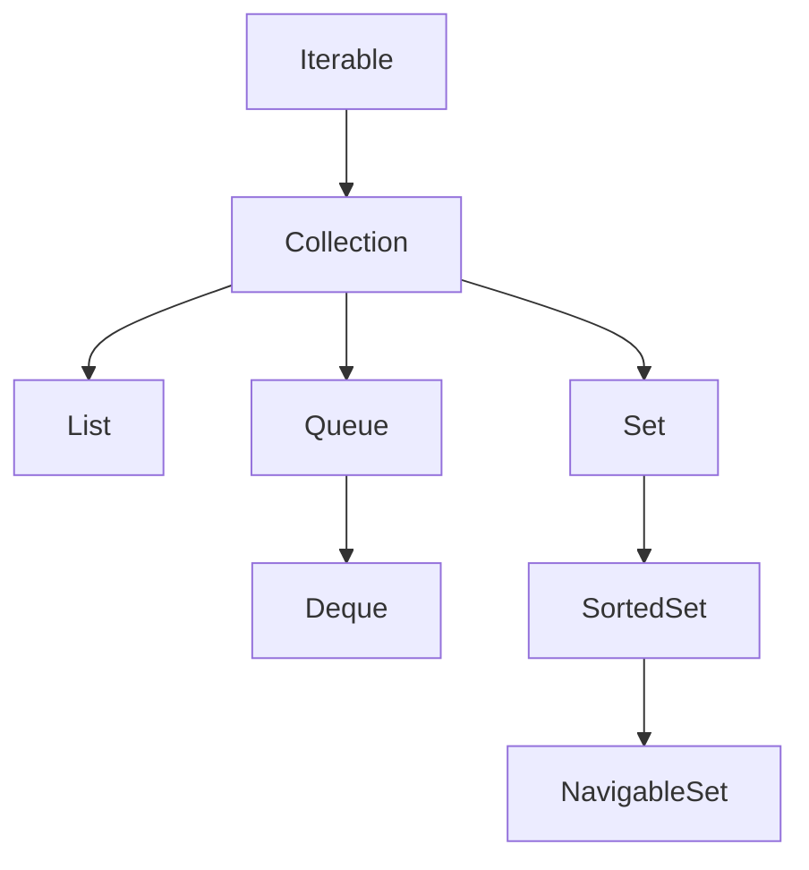

# Cấu Trúc Tập Hợp (Collections Framework) - Tổng Quan & Kiến Trúc Core

## Kiến Trúc & Động Cơ Thiết Kế (Architectural Motivation)

Trước khi Java 1.2 ra đời, việc quản lý các tập hợp dữ liệu trong Java phụ thuộc vào các cấu trúc mảng thô (raw arrays) và các lớp tiện ích rời rạc như `Vector`, `Hashtable` hoặc `Dictionary`. Các cấu trúc cũ này có nhiều hạn chế nghiêm trọng:
- **Thiếu tính nhất quán**: Mỗi lớp lưu trữ có giao diện API và cách duyệt dữ liệu hoàn toàn khác nhau (`Vector` dùng `Enumeration`, mảng dùng chỉ số `array[i]`).
- **Khả năng tái sử dụng thấp**: Không thể truyền một `Vector` vào một phương thức đang kỳ vọng nhận một mảng hoặc danh sách bất kỳ mà không cần viết mã chuyển đổi phức tạp.
- **Tính an toàn đa luồng bị ép buộc**: `Vector` và `Hashtable` đồng bộ hóa (`synchronized`) tất cả các phương thức công khai, gây ra chi phí sụt giảm hiệu năng cực lớn trong các ứng dụng đơn luồng hoặc ứng dụng đa luồng hiện đại.

Để giải quyết vấn đề này, Java 1.2 đã giới thiệu **Java Collections Framework (JCF)** — một kiến trúc thống nhất đại diện và thao tác trên các tập hợp dữ liệu độc lập với chi tiết triển khai bên dưới. JCF được xây dựng dựa trên 3 trụ cột chính:
1. **Các Giao Diện trừu tượng (Core Interfaces)**: Định nghĩa các hợp đồng hành vi (behavioral contracts) như `Collection`, `List`, `Set`, `Queue`, `Map`.
2. **Các Triển Khai cụ thể (Implementations)**: Cung cấp các cấu trúc dữ liệu thực tế như `ArrayList`, `LinkedList`, `HashSet`, `HashMap`, `TreeMap`.
3. **Các Thuật Toán tiện ích (Polymorphic Algorithms)**: Cung cấp các phương thức tĩnh xử lý đa hình như sắp xếp (`Collections.sort`), tìm kiếm (`Collections.binarySearch`), và xáo trộn (`Collections.shuffle`).

---

## Phân Cấp Các Giao Diện Cốt Lõi (Core Interface Hierarchy)

Sơ đồ phân cấp dưới đây mô tả mối quan hệ giữa các giao diện cốt lõi trong Java Collections Framework:



> [!NOTE]
> Giao diện `Map<K, V>` nằm ngoài phân cấp `Collection` vì `Map` quản lý các cặp Khóa - Giá trị (Key-Value pairs), trong khi `Collection` quản lý các phần tử đơn lẻ. Tuy nhiên, `Map` vẫn là một thành phần trung tâm của Collections Framework.

---

## Hợp Đồng & Cơ Chế Hoạt Động Của Các Giao Diện

### 1. Giao Diện `Iterable<T>`
`Iterable<T>` là giao diện gốc (root interface) của tất cả các tập hợp trừ `Map`. Bất kỳ lớp nào triển khai `Iterable<T>` đều cam kết cung cấp một đối tượng `Iterator<T>` để duyệt qua các phần tử.

- **Cơ chế biên dịch**: Khi bạn sử dụng vòng lặp `for-each` nâng cao (Enhanced for-loop), trình biên dịch Java (`javac`) tự động chuyển đổi cú pháp đó thành lời gọi `Iterator` tương đương:
  ```java
  // Cú pháp người dùng viết:
  for (String item : collection) {
      System.out.println(item);
  }

  // Trình biên dịch tự động mã hóa thành:
  Iterator<String> iterator = collection.iterator();
  while (iterator.hasNext()) {
      String item = iterator.next();
      System.out.println(item);
  }
  ```

### 2. Giao Diện `Collection<T>`
`Collection<T>` mở rộng từ `Iterable<T>` và định nghĩa các hành vi chung cho việc chứa và thao tác trên danh sách phần tử:
- Thêm phần tử: `add(E e)`, `addAll(Collection<? extends E> c)`
- Xóa phần tử: `remove(Object o)`, `removeIf(Predicate<? super E> filter)`
- Kiểm tra trạng thái: `size()`, `isEmpty()`, `contains(Object o)`
- Chuyển đổi: `toArray()`, `stream()`

### 3. Giao Diện `List<E>`
`List` đại diện cho một tập hợp **có thứ tự duy trì theo thời gian chèn** (ordered sequence) và **cho phép chứa các phần tử trùng lặp** (`duplicates allowed`).
- **Đặc trưng**: Hỗ trợ truy cập vị trí ngẫu nhiên thông qua chỉ số (index-based positional access) với các phương thức `get(int index)`, `set(int index, E element)`, `remove(int index)`.
- **Triển khai phổ biến**: `ArrayList`, `LinkedList`, `Vector`.

### 4. Giao Diện `Set<E>`
`Set` đại diện cho một tập hợp **không chứa phần tử trùng lặp** (unique elements only), mô phỏng khái niệm tập hợp trong toán học.
- **Hợp đồng độc nhất**: Việc xác định hai phần tử trùng nhau phụ thuộc vào hợp đồng `equals()` và `hashCode()` (đối với `HashSet`, `LinkedHashSet`) hoặc hàm so sánh `compareTo()` / `compare()` (đối với `TreeSet`).
- **Triển khai phổ biến**: `HashSet` (không thứ tự, $O(1)$), `LinkedHashSet` (duy trì thứ tự chèn), `TreeSet` (sắp xếp tăng dần, $O(\log N)$).

### 5. Giao Diện `Queue<E>` & `Deque<E>`
- **`Queue`**: Đại diện cho hàng đợi xử lý phần tử theo thứ tự. Thường tuân theo nguyên tắc FIFO (First-In-First-Out), nhưng cũng có thể sắp xếp theo độ ưu tiên (`PriorityQueue`).
- **Ma trận phương thức của Queue**:

| Thao Tác | Ném Ngoại Lệ khi Thất Bại | Trả Về Giá Trị Đặc Biệt (null/false) |
| :--- | :--- | :--- |
| **Chèn (Insert)** | `add(e)` | `offer(e)` |
| **Xóa (Remove)** | `remove()` | `poll()` |
| **Kiểm tra (Examine)** | `element()` | `peek()` |

- **`Deque` (Double-Ended Queue)**: Hàng đợi hai đầu hỗ trợ thêm/xóa phần tử hiệu quả ở cả đầu (Head) và đuôi (Tail). Có thể hoạt động như một Queue (FIFO) hoặc Stack (LIFO).

### 6. Giao Diện `Map<K, V>`
`Map` ánh xạ các khóa (Keys) tới các giá trị (Values). 
- **Quy tắc**: Mỗi khóa trong `Map` là duy nhất và chỉ ánh xạ tới tối đa một giá trị.
- **Góc nhìn tập hợp (Collection Views)**: Dù không triển khai `Collection`, `Map` cung cấp 3 góc nhìn tập hợp:
  1. `keySet()`: Trả về tập hợp các khóa `Set<K>`.
  2. `values()`: Trả về bộ sưu tập các giá trị `Collection<V>`.
  3. `entrySet()`: Trả về tập hợp các cặp ánh xạ `Set<Map.Entry<K, V>>`.

---

## Minh Họa Mã Nguồn Chạy Được (Executable Code Examples)

### 1. Duyệt Tập Hợp Qua Iterable & Iterator
```java
import java.util.ArrayList;
import java.util.Iterator;
import java.util.List;

public class IterableArchitectureDemo {
    public static void main(String[] args) {
        List<String> frameworks = new ArrayList<>(List.of("Spring", "Hibernate", "Quarkus"));

        // 1. Duyệt bằng Iterator tường minh và xóa an toàn
        Iterator<String> iterator = frameworks.iterator();
        while (iterator.hasNext()) {
            String item = iterator.next();
            if (item.startsWith("H")) {
                iterator.remove(); // Xóa an toàn không gây ConcurrentModificationException
            }
        }
        System.out.println("Sau khi lọc Iterator: " + frameworks);

        // 2. Duyệt bằng removeIf (Java 8+ Predicate)
        frameworks.removeIf(name -> name.endsWith("us"));
        System.out.println("Sau khi removeIf: " + frameworks);
    }
}
```

### 2. Thao Tác Trực Tiếp Trên Map Collection Views
```java
import java.util.HashMap;
import java.util.Map;

public class MapCollectionViewDemo {
    public static void main(String[] args) {
        Map<String, Integer> inventory = new HashMap<>();
        inventory.put("Laptop", 15);
        inventory.put("Monitor", 8);
        inventory.put("Keyboard", 25);

        // Duyệt từng entry thông qua entrySet()
        for (Map.Entry<String, Integer> entry : inventory.entrySet()) {
            System.out.println("Sản phẩm: " + entry.getKey() + " | Số lượng: " + entry.getValue());
        }

        // Xóa một key thông qua keySet() view sẽ làm thay đổi trực tiếp Map bên dưới
        inventory.keySet().removeIf(key -> key.equals("Keyboard"));
        System.out.println("Map sau khi xóa qua KeySet view: " + inventory);
    }
}
```

---

## Các Sai Lầm Thường Gặp & Bẫy Phỏng Vấn (Common Pitfalls)

1. **Coi `Map` Là Một `Collection`**:
   - *Bẫy*: Trả lời phỏng vấn rằng `Map` kế thừa `Collection`.
   - *Thực tế*: `Map` không kế thừa `Collection`. Không thể gọi `map.add()` hay `map.iterator()` trực tiếp. Phải thông qua `entrySet()`, `keySet()` hoặc `values()`.

2. **Dùng Sai Phương Thức Của Queue**:
   - *Bẫy*: Sử dụng `add()` hoặc `remove()` trên hàng đợi có giới hạn sức chứa (capacity-restricted queue).
   - *Thực tế*: Khi hàng đợi đầy, `add()` sẽ ném `IllegalStateException`. Trong môi trường sản xuất hoặc đa luồng, luôn ưu tiên `offer()`, `poll()`, và `peek()` để xử lý lỗi êm dịu bằng `null` hoặc `false`.

3. **Thay Đổi Cấu Trúc Tập Hợp Trong Vòng Lặp For-Each Thường**:
   - *Bẫy*: Gọi `list.remove(item)` trực tiếp trong vòng lặp `for (String item : list)`.
   - *Thực tế*: Hành vi này vi phạm hợp đồng sửa đổi và ngay lập tức ném ra ngoại lệ `ConcurrentModificationException`. Cần dùng `Iterator.remove()` hoặc `removeIf()`.
