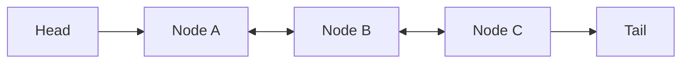

# ArrayList, LinkedList & Các Triển Khai List Cốt Lõi

## Tổng Quan Về Interface List & Các Triển Khai

Giao diện `List<E>` trong Java Collections Framework đại diện cho một danh sách phần tử **có thứ tự (ordered sequence)** và **cho phép phần tử trùng lặp**. Mặc dù tất cả các lớp triển khai `List` đều tuân thủ chung một hợp đồng API, cấu trúc dữ liệu và cơ chế quản lý bộ nhớ bên dưới của chúng tạo ra sự khác biệt rất lớn về hiệu năng thời gian thực thi (runtime execution) và mức độ sử dụng bộ nhớ.

---

## Phân Tích Chuyên Sâu Cấu Trúc Nội Tại

### 1. Cơ Chế Hoạt Động Của `ArrayList`
`ArrayList` được nâng đỡ bởi một mảng động Java tiêu chuẩn (`Object[] elementData`).

- **Cơ chế tăng kích thước (Resizing Mechanism)**:
  - Khi một phần tử được thêm vào một `ArrayList` đã đầy dung lượng (`size == capacity`), `ArrayList` sẽ tự động cấp phát một mảng mới có kích thước lớn hơn:
    $$\text{New Capacity} = \text{Old Capacity} + (\text{Old Capacity} \gg 1) = 1.5 \times \text{Old Capacity}$$
  - Sau đó, toàn bộ phần tử từ mảng cũ được sao chép sang mảng mới bằng phương thức tối ưu cấp hệ thống `System.arraycopy()`.
- **Độ phức tạp thuật toán**:
  - Truy cập theo chỉ số `get(index)` / `set(index)`: Độ phức tạp $O(1)$ nhờ tính toán dịch chuyển địa chỉ con trỏ trực tiếp trên bộ nhớ:
    $$\text{Address}(i) = \text{Base Address} + i \times \text{Element Size}$$
  - Thêm phần tử ở cuối `add(element)`: Độ phức tạp **Phân bổ $O(1)$ (Amortized O(1))**. Chi phí mở rộng mảng $O(N)$ được chia đều cho $N$ lần thêm thành công.
  - Thêm/Xóa phần tử ở đầu hoặc giữa: Độ phức tạp $O(N)$ do bắt buộc phải dịch chuyển mảng (array shift).

- **Tính Thân Thiện Với Bộ Đệm CPU (CPU Cache Locality)**:
  `ArrayList` lưu trữ các phần tử liên tục trong bộ nhớ. Khi CPU nạp một phần tử vào Cache L1/L2/L3, các phần tử liền kề cũng tự động được nạp theo (Spatial Locality). Điều này giúp giảm thiểu hiện tượng trượt bộ đệm (Cache Misses) và đạt tốc độ duyệt vượt trội so với các danh sách liên kết.

---

### 2. Cơ Chế Hoạt Động Của `LinkedList`
`LinkedList` là một triển khai danh sách liên kết đôi (Doubly-Linked List), trong đó mỗi phần tử được bọc bởi một đối tượng `Node<E>` riêng biệt.



- **Cấu trúc Nút (Node Overhead)**:
  Mỗi nút `Node<E>` chứa 3 trường dữ liệu: `E item`, `Node<E> next`, và `Node<E> prev`. Trên máy ảo JVM 64-bit có bật Compressed OOPs, chi phí bộ nhớ cho một nút đối tượng là khoảng **24 - 32 bytes** bổ sung chỉ để lưu trữ các liên kết con trỏ.
- **Độ phức tạp thuật toán**:
  - Truy cập theo chỉ số `get(index)`: Độ phức tạp $O(N)$. `LinkedList` kiểm tra nếu `index < (size >> 1)` thì duyệt từ `head` tiến sang phải, ngược lại duyệt từ `tail` lùi sang trái.
  - Thêm/Xóa ở đầu hoặc cuối (`addFirst`, `removeFirst`, `addLast`, `removeLast`): Độ phức tạp $O(1)$ do chỉ cần cập nhật con trỏ.
  - Thêm/Xóa ở vị trí bất kỳ khi đã có Iterator: Độ phức tạp $O(1)$.

---

### 3. Lớp Legacy: `Vector` và `Stack`

- **`Vector`**:
  - Tương tự `ArrayList` nhưng tất cả các phương thức đều được đánh dấu `synchronized`.
  - Tăng kích thước gấp đôi ($2\times$) khi đầy.
  - *Đánh giá*: Đã bị coi là lỗi thời. Chi phí đồng bộ hóa thô làm sụt giảm hiệu năng mạnh mẽ. Nếu cần danh sách an toàn đa luồng, ưu tiên `Collections.synchronizedList()` hoặc `CopyOnWriteArrayList`.

- **`Stack`**:
  - Kế thừa từ `Vector` để tạo ngăn xếp LIFO (Last-In-First-Out).
  - *Sai lầm thiết kế*: Việc `Stack` mở rộng từ `Vector` cho phép người dùng gọi các phương thức chèn/xóa chỉ số bất kỳ (`add(index, element)`), làm hỏng tính toàn vẹn trừu tượng của LIFO.
  - *Thay thế*: Luôn ưu tiên dùng `ArrayDeque` khi làm ngăn xếp hoặc hàng đợi.

---

### 4. Triển Khai Set Liên Quan: `HashSet` & `LinkedHashSet`

- **`HashSet`**:
  - Sử dụng một `HashMap` bên trong làm bộ lưu trữ. Phần tử của `HashSet` chính là Khóa (Key) của `HashMap`, với Giá trị (Value) là một đối tượng hằng số giả `PRESENT`.
  - Độ phức tạp $O(1)$ cho `add`, `remove`, `contains`. Không bảo toàn thứ tự chèn.
- **`LinkedHashSet`**:
  - Kế thừa `HashSet` nhưng bổ sung một danh sách liên kết đôi chạy xuyên qua tất cả các phần tử.
  - Duy trì chính xác **thứ tự chèn phần tử (insertion order)** khi duyệt.

---

## Bảng So Sánh Hiệu Năng & Tiêu Chí Lựa Chọn

| Tiêu Chí | `ArrayList` | `LinkedList` | `Vector` | `ArrayDeque` (LIFO/FIFO) |
| :--- | :--- | :--- | :--- | :--- |
| **Cấu trúc dữ liệu** | Mảng động (`Object[]`) | Danh sách liên kết đôi | Mảng động đồng bộ | Mảng vòng (Circular Array) |
| **Random Access `get(i)`** | $O(1)$ | $O(N)$ | $O(1)$ | $O(1)$ (ở 2 đầu) |
| **Thêm/Xóa ở Cuối** | $O(1)$ (Amortized) | $O(1)$ | $O(1)$ (Amortized) | $O(1)$ |
| **Thêm/Xóa ở Đầu** | $O(N)$ | $O(1)$ | $O(N)$ | $O(1)$ |
| **Bộ đệm CPU (Locality)** | Rất cao | Rất thấp (Cache Misses) | Cao | Cao |
| **Chi phí bộ nhớ/phần tử** | Rất thấp | Rất cao (Node Object) | Thấp | Thấp |
| **An toàn đa luồng** | Không | Không | Có (`synchronized`) | Không |

---

## Minh Họa Mã Nguồn Chạy Được

```java
import java.util.ArrayDeque;
import java.util.ArrayList;
import java.util.Deque;
import java.util.HashSet;
import java.util.LinkedHashSet;
import java.util.LinkedList;
import java.util.List;
import java.util.Set;

public class ListImplementationsDemo {
    public static void main(String[] args) {
        // 1.ArrayList: Truy cập chỉ số cực nhanh
        List<String> arrayList = new ArrayList<>();
        arrayList.add("Java");
        arrayList.add("Kotlin");
        System.out.println("ArrayList element at index 1: " + arrayList.get(1));

        // 2. ArrayDeque: Thay thế hoàn hảo cho Stack/LinkedList
        Deque<String> stack = new ArrayDeque<>();
        stack.push("Layer 1");
        stack.push("Layer 2");
        System.out.println("Stack Pop (LIFO): " + stack.pop());

        // 3. So sánh thứ tự giữa HashSet và LinkedHashSet
        Set<String> hashSet = new HashSet<>(List.of("C", "A", "B"));
        Set<String> linkedHashSet = new LinkedHashSet<>(List.of("C", "A", "B"));

        System.out.println("HashSet (Thứ tự băm ngẫu nhiên): " + hashSet);
        System.out.println("LinkedHashSet (Bảo toàn thứ tự chèn C->A->B): " + linkedHashSet);
    }
}
```

---

## Bẫy Phỏng Vấn & Lưu Ý Thực Tế

1. **Lầm Tưởng `LinkedList` Luôn Nhanh Hơn `ArrayList` Khi Thêm/Xóa**:
   - *Thực tế*: Để thêm/xóa phần tử vào giữa `LinkedList`, trước tiên bạn phải duyệt $O(N)$ để tìm nút đó. Chi phí duyệt nút rải rác trên Heap khiến `LinkedList` chậm hơn `ArrayList` trong hầu hết các ứng dụng thực tế.

2. **Không Khởi Tạo Dung Lượng Cho `ArrayList`**:
   - *Thực tế*: Khi biết trước số lượng phần tử (ví dụ $100.000$ phần tử), luôn khởi tạo `new ArrayList<>(100000)` để tránh kích hoạt cơ chế tăng kích thước và sao chép mảng nhiều lần.
