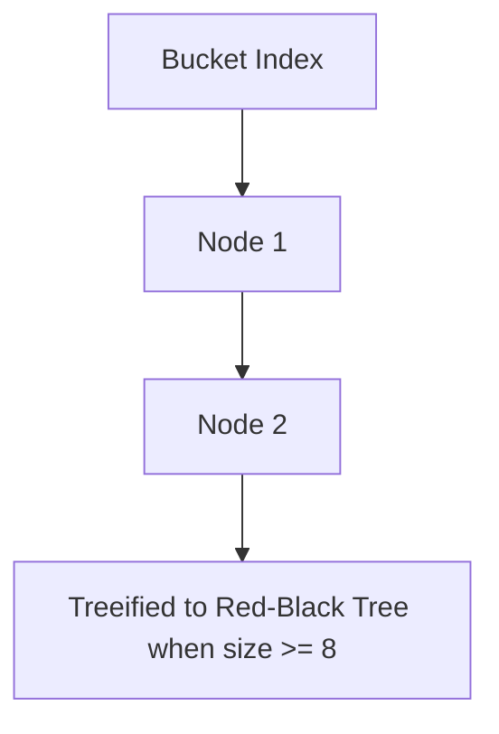

# Triển Khai Map Cốt Lõi: HashMap, LinkedHashMap, TreeMap & Hashtable

## Phân Loại Cấu Trúc Các Triển Khai Map

Giao diện `Map<K, V>` đại diện cho một cấu trúc dữ liệu ánh xạ các Khóa (Keys) duy nhất sang các Giá trị (Values). Mặc dù không kế thừa từ `Collection`, `Map` là thành phần thiết yếu của Java Collections Framework. Việc chọn đúng triển khai `Map` quyết định trực tiếp tới tốc độ truy vấn dữ liệu ($O(1)$ vs $O(\log N)$) và thứ tự của dữ liệu trong bộ nhớ.

---

## Phân Tích Chuyên Sâu Cấu Trúc Nội Tại `HashMap`

`HashMap` là triển khai Map được sử dụng phổ biến nhất trong Java, hoạt động dựa trên cơ chế **Bảng Băm (Hash Table)**.

### 1. Hàm Băm & Trải Rộng Mã Băm (Hash Spreading)
Khi một cặp `(key, value)` được chèn vào `HashMap`:
1. `HashMap` tính toán mã băm của khóa bằng phương thức `key.hashCode()`.
2. Để hạn chế xung đột khi số lượng thùng băm (buckets) nhỏ, `HashMap` áp dụng hàm xáo trộn (hash spreading function) để trộn các bit cao xuống bit thấp:
   ```java
   static final int hash(Object key) {
       int h;
       return (key == null) ? 0 : (h = key.hashCode()) ^ (h >>> 16);
   }
   ```
3. Vị trí thùng băm được xác định bằng phép toán bit thay cho phép chia lấy dư:
   $$\text{Bucket Index} = (n - 1) \ \& \ \text{hash}$$
   *(với $n$ là dung lượng bảng băm, luôn bắt buộc là một số mũ của 2).*

### 2. Xử Lý Xung Đột Băm (Collision Resolution & Treeification)
Nếu hai khóa có cùng chỉ số thùng băm (`Bucket Index` trùng nhau):
- **Trước Java 8**: `HashMap` dùng danh sách liên kết đơn (Singly-Linked List). Trong trường hợp xấu nhất (xung đột băm hàng loạt), độ phức tạp tìm kiếm bị suy hao từ $O(1)$ xuống $O(N)$.
- **Từ Java 8 trở đi (Cây hóa - Treeification)**:
  - Ban đầu, các phần tử xung đột được lưu trong danh sách liên kết đơn.
  - Khi số phần tử trong một thùng băm đạt đến **ngưỡng `TREEIFY_THRESHOLD = 8`** VÀ tổng dung lượng bảng băm tối thiểu đạt **`MIN_TREEIFY_CAPACITY = 64`**, thùng băm đó sẽ tự động được chuyển đổi từ danh sách liên kết đơn thành **Cây Đỏ-Đen (Red-Black Tree)**.
  - Nhờ cơ chế này, độ phức tạp truy vấn trong trường hợp xấu nhất được cải thiện từ $O(N)$ xuống **$O(\log N)$**.
  - Khi số phần tử trong thùng băm giảm xuống còn **`UNTREEIFY_THRESHOLD = 6`**, nó sẽ chuyển đổi lại thành danh sách liên kết đơn để tiết kiệm bộ nhớ.



### 3. Tải Trọng (Load Factor) & Cơ Chế Tái Băm (Rehashing)
- **Tải trọng mặc định (`DEFAULT_LOAD_FACTOR = 0.75`)**: Cân bằng giữa chi phí bộ nhớ và tỉ lệ xung đột băm.
- **Ngưỡng tái băm (`Threshold`)**:
  $$\text{Threshold} = \text{Capacity} \times \text{Load Factor}$$
- Khi số lượng entry vượt quá `Threshold`, `HashMap` sẽ tăng gấp đôi dung lượng ($n \to 2n$) và thực hiện tái băm (rehashing) toàn bộ các phần tử sang mảng mới.

---

## Các Triển Khai Map Khác

### 1. `LinkedHashMap`
- Extends từ `HashMap` nhưng bổ sung một **danh sách liên kết đôi** chạy xuyên qua tất cả các entry.
- Bảo toàn **thứ tự chèn phần tử (Insertion Order)** hoặc **thứ tự truy cập (Access Order)**.
- **Ứng dụng xây dựng LRU Cache**: Khi khởi tạo với `accessOrder = true`, mỗi khi gọi `get(key)`, entry đó sẽ được đẩy xuống cuối danh sách. Bằng cách ghi đè phương thức `removeEldestEntry()`, `LinkedHashMap` trở thành một **LRU (Least Recently Used) Cache** hoàn chỉnh chỉ với vài dòng mã.

### 2. `TreeMap`
- Triển khai `NavigableMap` dựa trên Cây Đỏ-Đen.
- Tự động sắp xếp các Khóa theo thứ tự tự nhiên (`Comparable`) hoặc theo `Comparator`.
- Độ phức tạp $O(\log N)$ cho `get`, `put`, `remove`. **Cấm Khóa `null`**.

### 3. `Hashtable` (Legacy Class)
- Đồng bộ hóa tất cả phương thức (`synchronized`).
- **Cấm hoàn toàn khóa `null` và giá trị `null`** (ném `NullPointerException`).
- *Lỗi thời*: Bị thay thế bởi `ConcurrentHashMap`.

---

## Bảng So Sánh Chi Tiết Các Triển Khai Map

| Tiêu Chí | `HashMap` | `LinkedHashMap` | `TreeMap` | `Hashtable` |
| :--- | :--- | :--- | :--- | :--- |
| **Cấu trúc dữ liệu** | Bảng băm + Cây Đỏ-Đen | Bảng băm + Danh sách liên kết | Cây Đỏ-Đen | Bảng băm đồng bộ |
| **Độ phức tạp `get/put`** | $O(1)$ | $O(1)$ | $O(\log N)$ | $O(1)$ |
| **Thứ tự của Khóa** | Ngẫu nhiên | Thứ tự chèn / Thứ tự truy cập | Thứ tự đã sắp xếp | Ngẫu nhiên |
| **Khóa `null` / Giá trị `null`** | Cho phép 1 key `null`, nhiều val `null` | Cho phép 1 key `null`, nhiều val `null` | **Cấm Key `null`** | **Cấm cả Key & Value `null`** |
| **An toàn đa luồng** | Không | Không | Không | Có (`synchronized`) |

---

## Minh Họa Mã Nguồn Chạy Được: Xây Dựng LRU Cache Bằng LinkedHashMap

```java
import java.util.LinkedHashMap;
import java.util.Map;

// Đơn giản hóa một LRU Cache giữ tối đa 3 phần tử
class LRUCache<K, V> extends LinkedHashMap<K, V> {
    private final int maxCapacity;

    public LRUCache(int maxCapacity) {
        // initialCapacity, loadFactor, accessOrder=true (Sắp xếp theo thứ tự truy cập)
        super(maxCapacity, 0.75f, true);
        this.maxCapacity = maxCapacity;
    }

    @Override
    protected boolean removeEldestEntry(Map.Entry<K, V> eldest) {
        // Tự động xóa phần tử cũ nhất khi kích thước vượt quá maxCapacity
        return size() > maxCapacity;
    }
}

public class MapImplementationsDemo {
    public static void main(String[] args) {
        LRUCache<String, Integer> cache = new LRUCache<>(3);
        cache.put("UserA", 101);
        cache.put("UserB", 102);
        cache.put("UserC", 103);

        // Truy cập UserA làm nó trở thành phần tử được dùng gần đây nhất
        cache.get("UserA");

        // Thêm phần tử thứ 4 -> UserB (ít được dùng nhất) sẽ tự động bị xóa!
        cache.put("UserD", 104);

        System.out.println("Nội dung LRU Cache: " + cache);
        // In ra: {UserC=103, UserA=101, UserD=104}
    }
}
```

---

## Bẫy Phỏng Vấn & Lưu Ý Thực Tế

1. **Thay Đổi Thuộc Tính Của Khóa Sau Khi Đã Cho Vào `HashMap`**:
   - *Bẫy*: Dùng một Mutable Object làm Key (ví dụ `List` hoặc `CustomClass`), sau đó sửa đổi thuộc tính làm thay đổi `hashCode()`.
   - *Thực tế*: Khi gọi `map.get(key)` sau khi sửa đổi, `HashMap` sẽ tính lại `hashCode()` mới và tìm vào sai thùng băm $\implies$ Trả về `null` gây rò rỉ dữ liệu (Memory Leak). **Luôn luôn dùng Immutable Object (như `String`, `Integer`, `Record`) làm Key**.

2. **Khác Biệt Giữa Cấm Null Của `Hashtable` và `HashMap`**:
   - *Thực tế*: `HashMap` cho phép `key == null` (lưu tại bucket 0). `Hashtable` gọi `key.hashCode()` trực tiếp nên nếu truyền `null` sẽ ném ngay `NullPointerException`.
