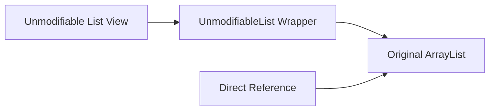

# Collections.unmodifiableList vs List.of() (Unmodifiable vs Immutable Collections)

## Khái Niệm Tập Hợp Không Thể Sửa Đổi (Unmodifiable vs Immutable)

Trong phát triển phần mềm bằng Java, tính bất biến (Immutability) là một nguyên tắc thiết kế quan trọng giúp tạo ra các chương trình an toàn đa luồng, dễ suy luận và ngăn chặn các tác dụng phụ ngoài ý muốn (side-effects). 

Java cung cấp hai cơ chế chính để tạo ra danh sách chỉ đọc:
1. **Giao diện bao bọc không thể sửa đổi (Unmodifiable View Wrappers)**: Thông qua các phương thức tĩnh như `Collections.unmodifiableList()`, `Collections.unmodifiableSet()`, `Collections.unmodifiableMap()`.
2. **Các phương thức khởi tạo tập hợp bất biến (Factory Methods Java 9+)**: Thông qua `List.of()`, `Set.of()`, `Map.of()`, và `List.copyOf()`.

Mặc dù cả hai đều ném ra ngoại lệ `UnsupportedOperationException` khi cố gắng gọi các thao tác sửa đổi (`add`, `remove`, `set`), **cơ chế hoạt động bên trong và tính bất biến thực sự của chúng hoàn toàn khác nhau**.

---

## Phân Tích Chuyên Sâu Cơ Chế Hoạt Động

### 1. Cơ Chế `Collections.unmodifiableList()` (View Wrapper Pattern)
`Collections.unmodifiableList(existingList)` **KHÔNG tạo ra một tập hợp mới**. 



- **Mô hình Wrapper (Decorator Pattern)**: Nó tạo ra một đối tượng bao bọc nhẹ (lightweight wrapper) triển khai giao diện `List`. Đối tượng này chặn tất cả các phương thức ghi (`add`, `remove`, `set`) và ném `UnsupportedOperationException`. Đối với các phương thức đọc (`get`, `size`, `contains`), nó ủy quyền trực tiếp (delegate) cho danh sách gốc bên dưới.
- **Rò rỉ tham chiếu (Reference Leak & Reflection)**:
  - Nếu danh sách gốc bên dưới bị thay đổi bởi một tham chiếu khác, **Unmodifiable View cũng sẽ bị thay đổi theo**!
  - *Kết luận*: `Collections.unmodifiableList()` là một **Góc nhìn chỉ đọc (Read-only view)**, KHÔNG PHẢI là một tập hợp bất biến thực sự (True Immutable Collection).

---

### 2. Cơ Chế Factory Methods Java 9+ (`List.of()` & `List.copyOf()`)
Được giới thiệu từ Java 9, `List.of(...)` và `List.copyOf(...)` tạo ra các tập hợp bất biến thực sự.

- **Tính Bất Biến Thực Sự (True Immutability)**:
  - Dữ liệu được đóng gói hoàn toàn. Không có bất kỳ tham chiếu danh sách nào bên ngoài có thể làm thay đổi nội dung của danh sách bất biến sau khi khởi tạo.
  - `List.copyOf(collection)` sẽ tự động thực hiện **Defensive Copy (Sao chép phòng thủ)** nếu đối tượng truyền vào không phải là một List bất biến Java 9.
- **Tối Ưu Hóa Bộ Nhớ Cực Cao (Compact Internal Implementations)**:
  - Với danh sách có 1 hoặc 2 phần tử, Java tạo ra các lớp tối ưu dung lượng siêu nhỏ: `List12<E>` (chỉ lưu 2 trường dữ liệu trực tiếp trong object, không tạo mảng `Object[]` bên dưới $\implies$ tiết kiệm RAM tuyệt đối).
  - Với danh sách từ 3 phần tử trở lên, Java sử dụng `ListN<E>`.
- **Cấm Hoàn Toàn Phần Tử `null`**:
  - `List.of()` và `Set.of()` ném ngay `NullPointerException` nếu có bất kỳ phần tử nào là `null` (cả khi khởi tạo lẫn khi gọi `contains(null)`).

---

## Bảng So Sánh Chi Tiết

| Tiêu Chí | `Collections.unmodifiableList(list)` | `List.of(e1, e2)` / `List.copyOf(list)` |
| :--- | :--- | :--- |
| **Phiên bản Java** | Từ Java 1.2+ | Từ Java 9+ |
| **Bản chất** | **Read-Only View Wrapper** xung quanh List gốc | **True Immutable Collection** (Bất biến thực sự) |
| **Ảnh hưởng khi List gốc thay đổi** | **Thay đổi theo** (Do chỉ bao bọc tham chiếu) | **Hoàn toàn độc lập** (Do sao chép phòng thủ) |
| **Cho phép phần tử `null`** | Cho phép (Nếu List gốc chứa `null`) | **Cấm hoàn toàn `null`** (Ném `NullPointerException`) |
| **Cấu trúc lưu trữ** | Bọc 1 đối tượng `List` trung gian | Dùng các lớp cực nhẹ `List12` / `ListN` |
| **Thao tác ghi (`add`, `remove`)** | Ném `UnsupportedOperationException` | Ném `UnsupportedOperationException` |

---

## Minh Họa Mã Nguồn Chạy Được

```java
import java.util.ArrayList;
import java.util.Collections;
import java.util.List;

public class UnmodifiableVsImmutableDemo {
    public static void main(String[] args) {
        // 1. Demo Collections.unmodifiableList (Read-only View)
        List<String> originalList = new ArrayList<>();
        originalList.add("Alpha");
        originalList.add("Beta");

        List<String> unmodifiableView = Collections.unmodifiableList(originalList);
        System.out.println("Unmodifiable View ban đầu: " + unmodifiableView);

        // Thay đổi List gốc -> Unmodifiable View bị thay đổi theo!
        originalList.add("Gamma");
        System.out.println("Unmodifiable View sau khi gốc sửa đổi: " + unmodifiableView);

        // 2. Demo List.of() & List.copyOf() (True Immutable)
        List<String> immutableList = List.copyOf(originalList);
        originalList.add("Delta");

        System.out.println("Immutable List (Không bị ảnh hưởng): " + immutableList);

        // Thao tác sửa đổi ném UnsupportedOperationException
        try {
            immutableList.add("Epsilon");
        } catch (UnsupportedOperationException e) {
            System.out.println("Bị chặn! Không thể sửa đổi List.of / List.copyOf");
        }
    }
}
```

---

## Bẫy Phỏng Vấn & Lưu Ý Thực Tế

1. **Lầm Tưởng `Collections.unmodifiableList()` Bảo Vệ Dữ Liệu Tuyệt Đối**:
   - *Bẫy*: Trả về `Collections.unmodifiableList(internalList)` trong một phương thức Getter của DTO/Entity và tin rằng dữ liệu an toàn.
   - *Thực tế*: Nếu mã bên ngoài giữ tham chiếu tới `internalList` hoặc mã nội bộ sửa đổi `internalList`, dữ liệu trả về cho client sẽ bị thay đổi bất ngờ. **Luôn sử dụng `List.copyOf()` nếu muốn bảo đảm tính bất biến tuyệt đối**.

2. **Truyền `null` Vào `List.of()` Hoặc Call `contains(null)`**:
   - *Thực tế*: `List.of("A", null)` sẽ ném `NullPointerException`. Thậm chí gọi `List.of("A", "B").contains(null)` cũng ném `NullPointerException` thay vì trả về `false`.
