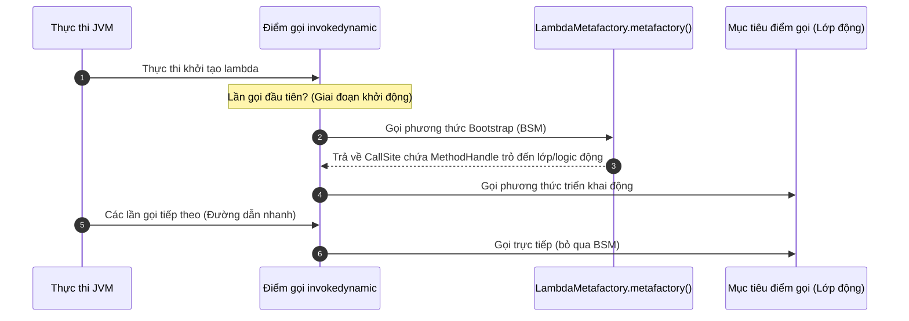
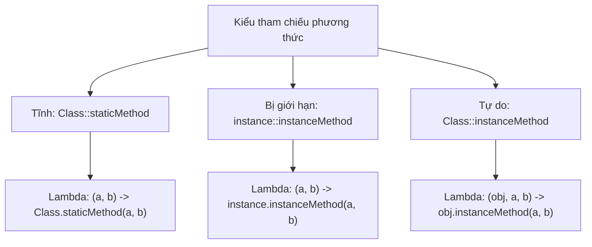

# Biểu Thức Lambda (Lambda Expression) - Phần 1

## Mục Tiêu Học Tập

Tài liệu này trình bày một phần trọng tâm của **Biểu thức Lambda (Lambda Expression)**. Hãy nghiên cứu từng khái niệm dưới dạng một quy tắc Java thực tế, thay vì chỉ học từ vựng riêng lẻ.

## Nội Dung Tổng Quan

- **`What is a lambda?`** — What is a lambda?: Cung cấp các quy tắc và cơ chế hoạt động cụ thể trong Java.
- **`Lambda syntax`** — Lambda syntax: Cung cấp các quy tắc và cơ chế hoạt động cụ thể trong Java.
- **`Functional interface`** — Functional interface: Cung cấp các quy tắc và cơ chế hoạt động cụ thể trong Java.
- **`@FunctionalInterface`** — @FunctionalInterface: Cung cấp các quy tắc và cơ chế hoạt động cụ thể trong Java.
- **`Method reference:`** — Method reference:: Cung cấp các quy tắc và cơ chế hoạt động cụ thể trong Java.
- **`static method reference`** — static method reference: Cung cấp các quy tắc và cơ chế hoạt động cụ thể trong Java.
- **`instance method reference`** — instance method reference: Cung cấp các quy tắc và cơ chế hoạt động cụ thể trong Java.
- **`constructor reference`** — constructor reference: Cung cấp các quy tắc và cơ chế hoạt động cụ thể trong Java.
- **`Variable capture`** — Variable capture: Cung cấp các quy tắc và cơ chế hoạt động cụ thể trong Java.
- **`Effectively final`** — Effectively final: Cung cấp các quy tắc và cơ chế hoạt động cụ thể trong Java.

## Ghi Chú Chi Tiết

### Lambda là gì? (What is a lambda?)

Một biểu thức lambda là một khối dạng hàm nhỏ gọn được sử dụng ở những nơi mong đợi một giao diện chức năng.

Khái niệm này rất quan trọng vì các API Java hiện đại sử dụng rất nhiều các đường ống xử lý dạng hàm (function-style pipeline). Hiểu lầm phổ biến là quên mất thao tác nào là lười biếng (lazy) và thao tác nào thực sự kích hoạt quá trình thực thi.

Kiểm tra thực tế:

- Định nghĩa `What is a lambda?` trong một câu.
- Nhận biết `What is a lambda?` trong mã nguồn, câu lệnh, tài liệu hoặc các câu hỏi phỏng vấn.
- Giải thích một lỗi, hạn chế hoặc đánh đổi liên quan đến `What is a lambda?`.

Ví dụ nhỏ hoặc mô hình tư duy:

- `n -> n > 0` là một lambda được sử dụng làm điều kiện kiểm tra (predicate).

#### Xác Định Kiểu Mục Tiêu Cho Giao Diện Chức Năng
Một lambda không có kiểu dữ liệu rõ ràng của riêng nó. Nó được liên kết với một kiểu dữ liệu tại thời điểm biên dịch bằng cách xem xét ngữ cảnh (gọi là **xác định kiểu mục tiêu - target typing**). Kiểu mục tiêu phải là một giao diện chức năng.
```java
// Target type is Runnable
Runnable runTask = () -> System.out.println("Executing...");

// Target type is Predicate<Integer>
java.util.function.Predicate<Integer> isPositive = n -> n > 0;
```

### Tại Sao Lambda Sử Dụng invokedynamic Và Các Phương Thức Bootstrap (Bootstrap Methods)

Các lớp nội bộ vô danh (anonymous inner class) truyền thống sẽ được biên dịch thành các tệp lớp riêng biệt (ví dụ: `EnclosingClass$1.class`). Việc tạo và tải các tệp lớp này tiêu tốn dung lượng ổ đĩa, tăng kích thước gói JAR và phát sinh chi phí IO của bộ tải lớp (class loader) khi khởi động. Thay vì dịch các biểu thức lambda thành các lớp nội bộ, trình biên dịch Java sử dụng chỉ lệnh `invokedynamic` (Indy) được giới thiệu trong Java 7, cùng với các phương thức khởi động động (bootstrap method). Khi một lambda được biên dịch, trình biên dịch sẽ tạo ra một công thức để xây dựng thể hiện của giao diện chức năng, phát ra một điểm gọi `invokedynamic` (call site) và một phương thức bổ trợ private chứa logic của thân lambda. Ở thời điểm chạy, lần đầu tiên chỉ lệnh này được chạm tới, một phương thức khởi động (cụ thể là `LambdaMetafactory.metafactory`) sẽ được gọi để liên kết động điểm gọi đó với một mục tiêu điểm gọi (ví dụ: một lớp được tạo động hoặc một tay cầm phương thức - method handle trực tiếp). Điều này tránh được việc tạo các tệp `.class` tĩnh riêng biệt trên ổ đĩa, giảm chi phí tải lớp và nhường phần tối ưu hóa cho trình biên dịch JIT của JVM.

#### Mô Hình Tư Duy: Vòng Đời Khởi Động Lambda


#### Ví Dụ Mã Nguồn: Đầu Ra Của Lớp Được Tạo Động
```java
public class LambdaCompilationDemo {
    public static void main(String[] args) {
        Runnable r = () -> System.out.println("Hello from Lambda!");
        r.run();
        // Output:
        // Hello from Lambda!
        
        System.out.println(r.getClass().getName());
        // Output:
        // LambdaCompilationDemo$$Lambda$1/0x0000000801000840 (dynamically generated class name)
    }
}
```

#### Chuỗi Nguyên Nhân - Kết Quả
```
Lambda được viết trong mã nguồn
  │
  ▼
Trình biên dịch biên dịch thân lambda thành một phương thức lớp private và phát ra invokedynamic tại điểm gọi
  │
  ▼
Thời điểm chạy chạm tới điểm gọi lần đầu tiên
  │
  ▼
LambdaMetafactory tạo lớp/vỏ bọc tại thời điểm chạy trong bộ nhớ
  │
  ▼
JVM liên kết MethodHandle với điểm gọi
  │
  ▼
Các lần gọi trong tương lai bỏ qua việc tạo lớp tại thời điểm chạy và thực thi trực tiếp qua đường dẫn nhanh
```

### Cú pháp lambda (Lambda syntax)

Một biểu thức lambda là một khối dạng hàm nhỏ gọn được sử dụng ở những nơi mong đợi một giao diện chức năng.

Khái niệm này rất quan trọng vì các API Java hiện đại sử dụng rất nhiều các đường ống xử lý dạng hàm (function-style pipeline). Hiểu lầm phổ biến là quên mất thao tác nào là lười biếng (lazy) và thao tác nào thực sự kích hoạt quá trình thực thi.

Kiểm tra thực tế:

- Định nghĩa `Lambda syntax` trong một câu.
- Nhận biết `Lambda syntax` trong mã nguồn, câu lệnh, tài liệu hoặc các câu hỏi phỏng vấn.
- Giải thích một lỗi, hạn chế hoặc đánh đổi liên quan đến `Lambda syntax`.

Ví dụ nhỏ hoặc mô hình tư duy:

- `n -> n > 0` là một lambda được sử dụng làm điều kiện kiểm tra (predicate).

#### Ví Dụ Mã Nguồn: Các Biến Thể Cú Pháp
```java
// 1. Zero parameters
Runnable r = () -> System.out.println("Zero params");

// 2. Single parameter (parentheses and types are optional)
java.util.function.Consumer<String> c1 = s -> System.out.println(s);
java.util.function.Consumer<String> c2 = (s) -> System.out.println(s);
java.util.function.Consumer<String> c3 = (String s) -> System.out.println(s);

// 3. Multiple parameters (parentheses required)
java.util.function.BinaryOperator<Integer> add = (a, b) -> a + b;

// 4. Block body (curly braces, statements, semicolons, and return keyword required)
java.util.function.BinaryOperator<Integer> calc = (a, b) -> {
    int sum = a + b;
    return sum;
};
```

#### Sai Lầm Thường Gặp: Dấu Ngoặc Nhọn Và Từ Khóa return Không Chính Xác
- Thân lambda có một biểu thức đơn có thể trả về một giá trị một cách ngầm định mà không cần dấu ngoặc nhọn hoặc từ khóa `return`.
- Nếu sử dụng dấu ngoặc nhọn `{}`, bạn phải viết một khối lệnh, điều này yêu cầu từ khóa `return` nếu phương thức đó trả về một giá trị.
```java
// Compile error: return keyword cannot be used without curly braces
java.util.function.BinaryOperator<Integer> bad1 = (a, b) -> return a + b;

// Compile error: curly braces are used but return keyword is missing
java.util.function.BinaryOperator<Integer> bad2 = (a, b) -> { a + b; };
```

### Giao diện chức năng (Functional interface)

Một giao diện chức năng chỉ có duy nhất một phương thức trừu tượng (abstract method) và có thể được triển khai bởi một lambda.

> Xem thêm: Các interface phổ biến như Predicate, Function, Consumer, được trình bày chi tiết trong [Ch.22 - Functional Interface](../../no22_functional_interface/theory/01-predicate-t-concepts.md).

Khái niệm này rất quan trọng vì các API Java hiện đại sử dụng rất nhiều các đường ống xử lý dạng hàm (function-style pipeline). Hiểu lầm phổ biến là quên mất thao tác nào là lười biếng (lazy) và thao tác nào thực sự kích hoạt quá trình thực thi.

Kiểm tra thực tế:

- Định nghĩa `Functional interface` trong một câu.
- Nhận biết `Functional interface` trong mã nguồn, câu lệnh, tài liệu hoặc các câu hỏi phỏng vấn.
- Giải thích một lỗi, hạn chế hoặc đánh đổi liên quan đến `Functional interface`.

Ví dụ nhỏ hoặc mô hình tư duy:

- Khi đọc mã nguồn, hãy hỏi: `Functional interface` thay đổi, cho phép, từ chối hoặc làm rõ điều gì?

#### Ví Dụ Mã Nguồn: Định Nghĩa Các Giao Dịch Chức Năng Tùy Chỉnh
```java
interface SimpleCalculator {
    int calculate(int x, int y); // exactly one abstract method
}

// Inherited Object methods do not count towards the abstract method limit
interface ObjectOverride {
    void process();
    boolean equals(Object obj); // abstract override of Object method, does not count
}
```

### @FunctionalInterface

**`@FunctionalInterface`** — Bắt buộc interface chỉ có duy nhất một phương thức trừu tượng (SAM).

Khái niệm này rất quan trọng vì các API Java hiện đại sử dụng rất nhiều các đường ống xử lý dạng hàm (function-style pipeline). Hiểu lầm phổ biến là quên mất thao tác nào là lười biếng (lazy) và thao tác nào thực sự kích hoạt quá trình thực thi.

Kiểm tra thực tế:

- Định nghĩa `@FunctionalInterface` trong một câu.
- Nhận biết `@FunctionalInterface` trong mã nguồn, câu lệnh, tài liệu hoặc các câu hỏi phỏng vấn.
- Giải thích một lỗi, hạn chế hoặc đánh đổi liên quan đến `@FunctionalInterface`.

Ví dụ nhỏ hoặc mô hình tư duy:

- Khi đọc mã nguồn, hãy hỏi: `@FunctionalInterface` thay đổi, cho phép, từ chối hoặc làm rõ điều gì?

#### Ví Dụ Mã Nguồn: Kiểm Tra Tại Thời Điểm Biên Dịch
```java
@FunctionalInterface
interface Valid {
    void execute();
}

// Compile Error: InvalidFunctionalInterfaceException (multiple non-overriding abstract methods)
@FunctionalInterface
interface Invalid {
    void execute();
    void clean();
}
```

### Tại Sao Lambda Không Thể Ném Ngoại Lệ Được Kiểm Tra (Checked Exception) Và Cách Bỏ Qua Nó

Hệ thống kiểu dữ liệu của Java yêu cầu các ngoại lệ được kiểm tra (checked exception) phải được xử lý trong khối `try-catch` hoặc được khai báo trong chữ ký phương thức bằng mệnh đề `throws`. Khi viết các biểu thức lambda, phương thức trừu tượng của giao diện chức năng mục tiêu sẽ định nghĩa chữ ký kiểu dữ liệu, bao gồm cả các ngoại lệ mà nó được phép ném ra. Các giao diện chức năng tiêu chuẩn trong `java.util.function` (như `Function`, `Consumer`, `Predicate`) không khai báo bất kỳ ngoại lệ được kiểm tra nào trong chữ ký phương thức của chúng. Do đó, một lambda triển khai các giao diện này bị cấm ném các ngoại lệ được kiểm tra, vì làm như vậy sẽ vi phạm hợp đồng của giao diện và gây ra lỗi biên dịch. Để bỏ qua điều này, các lập trình viên phải bọc lượt gọi ném ngoại lệ trong một khối try-catch bên trong lambda, thiết kế các giao diện chức năng tùy chỉnh có khai báo `throws Exception`, hoặc sử dụng các kỹ thuật ném ngoại lệ lén lút (sneaky throw) để đánh lừa trình biên dịch.

#### Mô Hình Tư Duy: Xác Minh Chữ Ký Ngoại Lệ Được Kiểm Tra
```
[Biểu thức Lambda] ──(Cố gắng ném checked Exception)──► [Xác minh của Trình biên dịch]
                                                                   │
                                               Nó có được khai báo trong Giao diện Chức năng không?
                                                /                         \
                                              (Không)                       (Có)
                                              /                             \
                                    [Lỗi Biên Dịch]                 [Biên Dịch Thành Công]
```

#### Ví Dụ Mã Nguồn: Bắt so với Lan truyền Ngoại lệ Được Kiểm Tra
```java
import java.io.IOException;
import java.util.function.Consumer;

public class LambdaExceptionHandling {
    @FunctionalInterface
    interface ThrowingConsumer<T> {
        void accept(T t) throws Exception;
    }

    public static void main(String[] args) {
        // Standard Consumer: Compile error if we throw checked exception directly
        // Consumer<String> bad = s -> { throw new IOException(); }; 

        // Fix 1: Try-catch block inside lambda
        Consumer<String> consumerWithCatch = s -> {
            try {
                throwChecked(s);
            } catch (IOException e) {
                System.out.println("Caught inside lambda: " + e.getMessage());
            }
        };
        consumerWithCatch.accept("test");
        // Output:
        // Caught inside lambda: Test Exception

        // Fix 2: Custom functional interface
        ThrowingConsumer<String> customConsumer = s -> throwChecked(s);
        try {
            customConsumer.accept("test");
        } catch (Exception e) {
            System.out.println("Caught from custom interface: " + e.getMessage());
        }
        // Output:
        // Caught from custom interface: Test Exception
    }

    private static void throwChecked(String s) throws IOException {
        throw new IOException("Test Exception");
    }
}
```

#### Chuỗi Nguyên Nhân - Kết Quả
```
Lambda ném ngoại lệ được kiểm tra (checked exception)
  │
  ▼
Trình biên dịch kiểm tra chữ ký của phương thức Giao diện Chức năng mục tiêu
  │
  ▼
Phương thức thiếu khai báo throws cho ngoại lệ đó
  │
  ▼
Trình biên dịch từ chối mã nguồn và báo lỗi biên dịch
  │
  ▼
Khối try-catch bao bọc hoặc giao diện chức năng tùy chỉnh có throws giải quyết sự không khớp chữ ký
```

### Tham chiếu phương thức (Method reference):

Tham chiếu phương thức (Method reference) là một nhóm các quy tắc liên quan đến Biểu thức Lambda dùng để gom nhóm một số chi tiết liên quan.

Kiểm tra thực tế:

- Định nghĩa `Method reference:` trong một câu.
- Nhận biết `Method reference:` trong mã nguồn, câu lệnh, tài liệu hoặc các câu hỏi phỏng vấn.
- Giải thích một lỗi, hạn chế hoặc đánh đổi liên quan đến `Method reference:`.

Ví dụ nhỏ hoặc mô hình tư duy:

- Khi đọc mã nguồn, hãy hỏi: `Method reference:` thay đổi, cho phép, từ chối hoặc làm rõ điều gì?

#### Phân Loại Các Tham Chiếu Phương Thức
Có 4 loại tham chiếu phương thức chính:
1. Tham chiếu phương thức tĩnh (Static method reference): `ContainingClass::staticMethodName`
2. Tham chiếu phương thức thể hiện bị giới hạn (Bound instance method reference): `containingObject::instanceMethodName`
3. Tham chiếu phương thức thể hiện tự do (Unbound instance method reference): `ContainingClass::instanceMethodName`
4. Tham chiếu hàm khởi tạo (Constructor reference): `ClassName::new`

### Tham chiếu phương thức tĩnh (static method reference)

static có nghĩa là thành viên thuộc về lớp chứ không phải một đối tượng cụ thể nào.

Kiểm tra thực tế:

- Định nghĩa `static method reference` trong một câu.
- Nhận biết `static method reference` trong mã nguồn, câu lệnh, tài liệu hoặc các câu hỏi phỏng vấn.
- Giải thích một lỗi, hạn chế hoặc đánh đổi liên quan đến `static method reference`.

Ví dụ nhỏ hoặc mô hình tư duy:

- `ClassName.member` truy cập một thành viên ở cấp độ lớp.

#### Ví Dụ Mã Nguồn: Các Tham Chiếu Phương Thức Tĩnh
```java
// Lambda form:
java.util.function.Function<String, Integer> parserLambda = s -> Integer.parseInt(s);

// Method reference equivalent:
java.util.function.Function<String, Integer> parserRef = Integer::parseInt;
```

### Tham chiếu phương thức thể hiện (instance method reference)

**`Tham chiếu phương thức thể hiện (instance method reference)`** — Tham chiếu phương thức thể hiện (instance method reference): Cung cấp các quy tắc và cơ chế hoạt động cụ thể trong lập trình Java.

Kiểm tra thực tế:

- Định nghĩa `instance method reference` trong một câu.
- Nhận biết `instance method reference` trong mã nguồn, câu lệnh, tài liệu hoặc các câu hỏi phỏng vấn.
- Giải thích một lỗi, hạn chế hoặc đánh đổi liên quan đến `instance method reference`.

Ví dụ nhỏ hoặc mô hình tư duy:

- Khi đọc mã nguồn, hãy hỏi: `instance method reference` thay đổi, cho phép, từ chối hoặc làm rõ điều gì?

#### Tham Chiếu Phương Thức Thể Hiện Bị Giới Hạn (Bound) so với Tự Do (Unbound)
- **Tham chiếu phương thức bị giới hạn (Bound Method Reference)**: Tham chiếu đến một phương thức thể hiện của một đối tượng hiện có. Đối tượng nhận (receiver) của cuộc gọi phương thức được cố định tại thời điểm biên dịch.
- **Tham chiếu phương thức tự do (Unbound Method Reference)**: Tham chiếu đến một phương thức thể hiện của một đối tượng tùy ý thuộc một kiểu dữ liệu cụ thể. Tham số đầu tiên của lambda được sử dụng làm đối tượng nhận của cuộc gọi.
```java
// 1. Bound instance method reference
String prefix = "DEBUG: ";
java.util.function.Consumer<String> boundPrinter = prefix::concat; 
// Equivalent lambda: msg -> prefix.concat(msg);

// 2. Unbound instance method reference
java.util.function.BiFunction<String, String, String> unboundConcat = String::concat;
// Equivalent lambda: (str, suffix) -> str.concat(suffix);
```

### Tham chiếu hàm khởi tạo (constructor reference)

**`Tham chiếu hàm khởi tạo (constructor reference)`** — Tham chiếu hàm khởi tạo (constructor reference): Cung cấp các quy tắc và cơ chế hoạt động cụ thể trong lập trình Java.

Kiểm tra thực tế:

- Định nghĩa `constructor reference` trong một câu.
- Nhận biết `constructor reference` trong mã nguồn, câu lệnh, tài liệu hoặc các câu hỏi phỏng vấn.
- Giải thích một lỗi, hạn chế hoặc đánh đổi liên quan đến `constructor reference`.

Ví dụ nhỏ hoặc mô hình tư duy:

- Khi đọc mã nguồn, hãy hỏi: `constructor reference` thay đổi, cho phép, từ chối hoặc làm rõ điều gì?

#### Ví Dụ Mã Nguồn: Các Tham Chiếu Hàm Khởi Tạo
```java
// Matches no-arg constructor ArrayList()
java.util.function.Supplier<java.util.List<String>> listSupplier = java.util.ArrayList::new;

// Matches constructor ArrayList(int initialCapacity)
java.util.function.Function<Integer, java.util.List<String>> sizeSupplier = java.util.ArrayList::new;
```

### Cách Thức Phân Giải Đối Tượng Nhận Và Chữ Ký Của Tham Chiếu Phương Thức Dưới Nền Tảng

Các tham chiếu phương thức (`Class::method` hoặc `instance::method`) là cú pháp rút gọn (syntactic sugar) cho lambdas, nhưng chúng ánh xạ tới chữ ký phương thức giao diện chức năng bên dưới theo những cách khác nhau tùy thuộc vào loại của chúng. Trong tham chiếu phương thức tĩnh, tất cả các đối số của phương thức giao diện chức năng được truyền trực tiếp làm tham số cho phương thức tĩnh. Trong tham chiếu phương thức thể hiện bị giới hạn, thể hiện nhận được xác định trước tại thời điểm biên dịch, và tất cả các tham số giao diện được ánh xạ làm tham số cho phương thức thể hiện. Ngược lại, một tham chiếu phương thức thể hiện tự do yêu cầu tham số đầu tiên của phương thức giao diện chức năng đóng vai trò là đối tượng nhận mục tiêu (đối tượng mà phương thức được gọi trên đó), và bất kỳ tham số còn lại nào sẽ được ánh xạ làm đối số.

#### Mô Hình Tư Duy: Ánh Xạ Tham Chiếu Phương Thức


#### Ví Dụ Mã Nguồn: Sự Khác Biệt Trong Ánh Xạ Tham Số
```java
import java.util.function.*;

public class MethodRefResolution {
    public static void main(String[] args) {
        // 1. Static method reference
        Function<String, Integer> parser = Integer::parseInt;
        System.out.println(parser.apply("123")); // Output: 123
        
        // 2. Bound instance method reference
        String prefix = "Java";
        Predicate<String> boundRef = prefix::startsWith;
        System.out.println(boundRef.test("J")); // Output: true (Equivalent to prefix.startsWith("J"))

        // 3. Unbound instance method reference
        BiPredicate<String, String> unboundRef = String::startsWith;
        System.out.println(unboundRef.test("Java", "J")); // Output: true (Equivalent to "Java".startsWith("J"))
    }
}
```

#### Chuỗi Nguyên Nhân - Kết Quả
```
Loại tham chiếu phương thức được xác định tại thời điểm biên dịch
  │
  ▼
Phương thức tĩnh ánh xạ các tham số từ 1..N
  │
  ▼
Phương thức bị giới hạn cố định thể hiện nhận và ánh xạ các tham số từ 1..N
  │
  ▼
Phương thức tự do coi tham số 1 là đối tượng nhận và các tham số từ 2..N là các đối số
  │
  ▼
Phương thức giao diện chức năng khớp chữ ký và thực thi thành công
```

### Sao chụp biến (Variable capture)

**`Sao chụp biến (Variable capture)`** — Sao chụp biến (Variable capture): Cung cấp các quy tắc và cơ chế hoạt động cụ thể trong lập trình Java.

Kiểm tra thực tế:

- Định nghĩa `Variable capture` trong một câu.
- Nhận biết `Variable capture` trong mã nguồn, câu lệnh, tài liệu hoặc các câu hỏi phỏng vấn.
- Giải thích một lỗi, hạn chế hoặc đánh đổi liên quan đến `Variable capture`.

Ví dụ nhỏ hoặc mô hình tư duy:

- Khi đọc mã nguồn, hãy hỏi: `Variable capture` thay đổi, cho phép, từ chối hoặc làm rõ điều gì?

#### Ví Dụ Mã Nguồn: Sao Chụp Các Biến Từ Phạm Vi Bao Quanh
Lambdas có thể đọc các biến tĩnh (static variable), biến thể hiện (instance variable) và biến cục bộ (local variable). Tuy nhiên, các biến cục bộ phải là final hoặc hiệu dụng final.
```java
class VariableCaptureDemo {
    private int instanceVar = 10;
    private static int staticVar = 20;

    public void demo() {
        int localVar = 30; // effectively final local variable

        Runnable r = () -> {
            instanceVar++; // OK: instance variables are not restricted
            staticVar++;   // OK: static variables are not restricted
            System.out.println(localVar); // OK: reading effectively final local variable
        };
        r.run();
    }
}
```

### Hiệu dụng final (Effectively final)

> Xem thêm: Từ khóa final và các đặc điểm của biến final, được trình bày chi tiết trong [Ch.10 - Access Modifiers](../../no10_modifiers/theory/01-access-modifier-concepts.md).

final có nghĩa là biến, phương thức, lớp hoặc tham số bị hạn chế thay đổi sau đó theo một cách cụ thể.

Hãy sử dụng khái niệm này để dự đoán chính xác quy tắc Java, dạng được cho phép, và các trường hợp lỗi xảy ra. Hãy ôn tập bằng một ví dụ nhỏ thay vì chỉ học vẹt nhãn định nghĩa.

Kiểm tra thực tế:

- Định nghĩa `Effectively final` trong một câu.
- Nhận biết `Effectively final` trong mã nguồn, câu lệnh, tài liệu hoặc các câu hỏi phỏng vấn.
- Giải thích một lỗi, hạn chế hoặc đánh đổi liên quan đến `Effectively final`.

Ví dụ nhỏ hoặc mô hình tư duy:

- `final int limit = 10;` không thể bị gán lại giá trị.

#### Ví Dụ Mã Nguồn: Các Lỗi Biên Dịch Liên Quan Đến Hiệu Dụng Final
Nếu một biến cục bộ bị gán lại giá trị ở bất kỳ nơi nào trong phương thức (cho dù bên trong hay bên ngoài lambda), nó sẽ không còn là hiệu dụng final nữa. Việc cố gắng sao chụp nó trong một lambda sẽ gây ra lỗi biên dịch.
```java
public void testEffectivelyFinal() {
    int val = 42; 
    
    // Compile Error: local variables referenced from a lambda expression must be final or effectively final
    Runnable r1 = () -> System.out.println(val); 
    
    val = 100; // reassigning makes it NOT effectively final
}

public void testReassignmentInLambda() {
    int count = 0;
    
    // Compile Error: local variables referenced from a lambda expression must be final or effectively final
    Runnable r2 = () -> {
        count = count + 1; // attempting to modify the variable inside lambda
    };
}
```

### Tại Sao Các Biến Cục Bộ Được Sao Chụp Bởi Lambda Phải Là Final Hoặc Hiệu Dụng Final

Các biến cục bộ nằm trên ngăn xếp thực thi (execution stack) và bị hủy ngay lập tức khi phương thức bao quanh kết thúc. Tuy nhiên, một biểu thức lambda được biểu diễn bởi một đối tượng trên vùng nhớ heap, đối tượng này có thể tồn tại lâu hơn thời gian thực thi phương thức (ví dụ: nếu nó được truyền vào một luồng nền hoặc được lưu trữ trong một biến thể hiện). Để ngăn lambda truy cập vào một biến trên ngăn xếp đã bị giải phóng, Java sử dụng kỹ thuật \"sao chụp biến\" (variable capture), sao chép giá trị của biến vào các trường của thể hiện lambda tại thời điểm tạo. Nếu biến cục bộ ban đầu hoặc bản sao bên trong lambda có thể bị sửa đổi, giá trị của chúng sẽ không đồng bộ với nhau, tạo ra các vấn đề đồng thời khó hiểu và vi phạm các đảm bảo an toàn ngăn xếp của JVM. Bằng cách thực thi ràng buộc final hoặc hiệu dụng final, Java đảm bảo rằng giá trị được sao chép luôn giống hệt với biến ban đầu, duy trì tính nhất quán giữa ranh giới ngăn xếp và heap.

#### Mô Hình Tư Duy: Vòng Đời Ngăn Xếp (Stack) so với Vùng Nhớ Heap của Sao Chụp Biến
```
NGĂN XẾP (STACK - Method Frame)       VUNG NHỚ HEAP (Lambda Instance)
┌────────────────────────┐      ┌──────────────────────────────┐
│ localVar = 42          │      │ LambdaInstance               │
│ (bị hủy khi thoát)     │      │ ┌──────────────────────────┐ │
│                        │      │ │ capturedLocalVarCopy = 42│ │
└───────────┬────────────┘      │ └──────────────────────────┘ │
            │                   │                              │
            │ (Sao chụp: Bản sao)│                              │
            └──────────────────►│ Giá trị không thể thay đổi!  │
                                └──────────────────────────────┘
```

#### Ví Dụ Mã Nguồn: Truy Cập Các Biến Được Sao Chụp
```java
public class VariableCaptureWhy {
    public static void main(String[] args) {
        int nonMutable = 100; // Effectively final local variable
        
        Runnable r = () -> {
            System.out.println(nonMutable);
        };
        r.run();
        // Output:
        // 100
        
        // If we uncommented the next line, compilation would fail:
        // nonMutable = 200; 
        // error: local variables referenced from a lambda expression must be final or effectively final
    }
}
```

#### Chuỗi Nguyên Nhân - Kết Quả
```
Biến cục bộ được lưu trữ trên khung ngăn xếp (stack frame)
  │
  ▼
Phương thức bao quanh thoát và khung ngăn xếp được pop ra
  │
  ▼
Lambda trên heap cố gắng đọc biến đó
  │
  ▼
Biến ngăn xếp không còn tồn tại
  │
  ▼
Khả năng xảy ra lỗi bộ nhớ/không đồng bộ dữ liệu
  │
  ▼
Trình biên dịch bắt buộc sử dụng final/hiệu dụng final để đảm bảo các bản sao đã chụp không bao giờ bị sai lệch
```

## Ví Dụ Thực Tế: Tái Cấu Trúc Mã Nguồn Gọi Lại Lớp Vô Danh Sang Lambda Và Tham Chiếu Phương Thức

Trong mã nguồn Java cũ, các giao diện bất đồng bộ hoặc hướng gọi lại (callback-driven) được triển khai bằng các lớp nội bộ vô danh dài dòng. Việc tái cấu trúc chúng sang biểu thức lambda và tham chiếu phương thức sẽ cải thiện tính dễ đọc, giảm mã mẫu (boilerplate code) và tránh được chi phí tạo tệp lớp riêng biệt.

### Triển Khai Theo Cách Cũ (Lớp Nội Bộ Vô Danh)
```java
import java.util.ArrayList;
import java.util.Collections;
import java.util.Comparator;
import java.util.List;

public class RefactoringDemo {
    public static void main(String[] args) {
        List<String> names = new ArrayList<>();
        names.add("Charles");
        names.add("Alice");
        names.add("Bob");

        // Verbose sorting callback using anonymous class
        Collections.sort(names, new Comparator<String>() {
            @Override
            public int compare(String s1, String s2) {
                return s1.compareTo(s2);
            }
        });
    }
}
```

### Tái Cấu Trúc Sang Biểu Thức Lambda
Vì `Comparator` là một giao diện chức năng có một phương thức trừu tượng duy nhất là `compare`, chúng ta có thể thay thế lớp vô danh bằng một biểu thức lambda:
```java
// Refactoring 1: Standard Lambda
Collections.sort(names, (s1, s2) -> s1.compareTo(s2));
```

### Tái Cấu Trúc Sang Tham Chiếu Phương Thức
Bởi vì lambda chỉ đơn giản là nhận các đối số và chuyển tiếp chúng đến `s1.compareTo(s2)`, chúng ta có thể sử dụng một tham chiếu phương thức thể hiện tự do `String::compareTo`:
```java
// Refactoring 2: Unbound Instance Method Reference
Collections.sort(names, String::compareTo);

// Modern list sort syntax:
names.sort(String::compareTo);
```

### Các Điểm Khác Biệt Và Lưu Ý Quan Trọng
1. **Phạm vi tham chiếu `this`**: Bên trong một lớp vô danh, `this` tham chiếu đến chính thể hiện lớp vô danh đó. Bên trong một lambda, `this` tham chiếu đến thể hiện lớp bao quanh nơi lambda được định nghĩa.
2. **Các Tệp Lớp**: Lớp vô danh tạo ra một tệp `.class` bổ sung tại thời điểm biên dịch (ví dụ: `RefactoringDemo$1.class`). Lambdas được biên dịch thành các phương thức private trong lớp lưu trữ bằng các chỉ lệnh `invokedynamic`, giúp cải thiện dung lượng bộ nhớ chiếm dụng và thời gian khởi động.

### Phạm Vi Và Ngữ Nghĩa Phạm Vi: Lambdas so với Lớp Nội Bộ Vô Danh

Một lớp nội bộ vô danh giới thiệu một phạm vi từ vựng hoàn toàn mới, tạo ra một ngữ cảnh lớp mới nơi `this` tham chiếu đến chính thể hiện lớp nội bộ được tạo ra. Điều này yêu cầu các lập trình viên sử dụng `EnclosingClass.this` nếu họ cần tham chiếu đến thể hiện lớp bên ngoài bao quanh từ bên trong lớp vô danh. Ngược lại, một biểu thức lambda không giới thiệu một mức phạm vi mới và được giới hạn phạm vi từ vựng (lexically scoped) đối với thể hiện lớp bao quanh. Bên trong thân lambda, từ khóa `this` chỉ tham chiếu duy nhất đến thể hiện của lớp bao quanh, giống như cách nó làm ở khối lệnh xung quanh. Thêm vào đó, vì các lambda chia sẻ phạm vi của phương thức, việc khai báo một tham số lambda trùng tên với một biến cục bộ trong phương thức sẽ gây ra xung đột che khuất biến (variable shadowing) tại thời điểm biên dịch.

#### Mô Hình Tư Duy: Ranh Giới Phạm Vi Từ Vựng so với Phạm Vi Lớp
```
Phạm vi từ vựng trong phương thức bao quanh:
┌────────────────────────────────────────────────────────┐
│ Thể hiện lớp ngoài (Outer Class Instance) (this = OuterClassInstance) │
│  ┌──────────────────────────────────────────────────┐  │
│  │ Phương thức bao quanh                            │  │
│  │  ┌────────────────────────────────────────────┐  │  │
│  │  │ Biểu thức Lambda (this = OuterClassInstance)│  │  │
│  │  └────────────────────────────────────────────┘  │  │
│  │  ┌────────────────────────────────────────────┐  │  │
│  │  │ Lớp nội bộ vô danh (this = InnerClass)     │  │  │
│  │  └────────────────────────────────────────────┘  │  │
│  └──────────────────────────────────────────────────┘  │
└────────────────────────────────────────────────────────┘
```

#### Ví Dụ Mã Nguồn: Phạm Vi Từ Vựng Và Phân Giải 'this'
```java
public class ScopingDemo {
    private final String name = "Outer";

    public void run() {
        // 1. Anonymous Inner Class
        Runnable r1 = new Runnable() {
            private final String name = "Inner";
            @Override
            public void run() {
                System.out.println("Anonymous inner class 'this': " + this.name);
                System.out.println("Enclosing class 'this': " + ScopingDemo.this.name);
            }
        };
        r1.run();
        // Output:
        // Anonymous inner class 'this': Inner
        // Enclosing class 'this': Outer

        // 2. Lambda Expression
        Runnable r2 = () -> {
            // 'this' refers to ScopingDemo instance
            System.out.println("Lambda 'this': " + this.name);
        };
        r2.run();
        // Output:
        // Lambda 'this': Outer
    }

    public static void main(String[] args) {
        new ScopingDemo().run();
    }
}
```

#### Chuỗi Nguyên Nhân - Kết Quả
```
Lambda sử dụng phạm vi từ vựng (lexical scoping)
  │
  ▼
Phạm vi được thừa hưởng từ môi trường bao quanh
  │
  ▼
Từ khóa 'this' tham chiếu đến đối tượng bao quanh thay vì bất kỳ lớp con động nào
  │
  ▼
Trình biên dịch ngăn chặn xung đột khai báo biến cục bộ (không cho phép che khuất biến)
```

## Sai Lầm Thường Gặp

### 1. Gán lại giá trị cho các biến bên trong hoặc bên ngoài một lambda (Quy tắc Hiệu dụng Final)
Một sai lầm rất phổ biến là cố gắng cập nhật một biến đếm hoặc cờ boolean bên trong một lambda.
```java
public void badCounter() {
    int count = 0;
    // Compile error: local variables referenced from a lambda expression must be final or effectively final
    java.util.List.of("a", "b").forEach(item -> count++); 
}
```
**Cách khắc phục**: Sử dụng một đối tượng bao bọc (wrapper object), một mảng có duy nhất một phần tử, hoặc các biến nguyên tử an toàn luồng (như `AtomicInteger`) nếu cần đồng bộ hóa.
```java
public void goodCounter() {
    java.util.concurrent.atomic.AtomicInteger count = new java.util.concurrent.atomic.AtomicInteger(0);
    java.util.List.of("a", "b").forEach(item -> count.incrementAndGet()); // OK
}
```

### 2. Xung Đột Che Khuất Biến (Variable Shadowing)
Lambdas không giới thiệu một mức phạm vi mới. Chúng chia sẻ phạm vi của khối bao quanh. Do đó, bạn không thể khai báo một tham số lambda trùng tên với một biến cục bộ trong phương thức bao quanh.
```java
public void shadowingDemo() {
    String message = "Hello";
    
    // Compile error: Variable 'message' is already defined in the scope
    java.util.function.Consumer<String> printer = message -> System.out.println(message);
}
```

### 3. Nhầm Lẫn Số Lượng Tham Số Của Tham Chiếu Phương Thức Bị Giới Hạn (Bound) Và Tự Do (Unbound)
Khi sử dụng `Class::methodName` cho một phương thức thể hiện (tham chiếu phương thức tự do), chữ ký của phương thức giao diện chức năng phải chấp nhận đối tượng nhận làm tham số đầu tiên của nó.
```java
// BiFunction<String, String, Boolean> requires two parameters
// String::startsWith requires one parameter. 
// Since it's unbound, parameter 1 becomes the receiver, parameter 2 is the argument. 
// String::startsWith is equivalent to: (str, prefix) -> str.startsWith(prefix)
java.util.function.BiFunction<String, String, Boolean> checker = String::startsWith; // OK

// Function<String, Boolean> requires only one parameter.
// If unbound (String::startsWith), it resolves to: (str) -> str.startsWith()
// But String has no startsWith() method without arguments, so this fails.
java.util.function.Function<String, Boolean> badChecker = String::startsWith; // Compile Error!
```

## Các Câu Hỏi Ôn Tập Thường Gặp

- Những khái niệm nào ở đây là quy tắc trong thời gian biên dịch (compile-time)?
- Những khái niệm nào ở đây ảnh hưởng đến hành vi khi chạy ứng dụng (runtime)?
- Những khái niệm nào ở đây có khả năng là bẫy phỏng vấn?

## Liên Kết Tham Khảo

- https://docs.oracle.com/javase/specs/jls/se21/html/jls-15.html#jls-15.27 (Lambda Expressions JLS)
- https://docs.oracle.com/javase/8/docs/api/java/lang/invoke/LambdaMetafactory.html (LambdaMetafactory API)
- https://docs.oracle.com/tutorial/java/javaOO/lambdaexpressions.html (Oracle Java Tutorials: Lambda Expressions)
