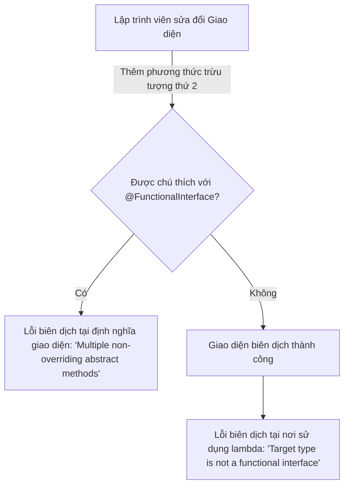
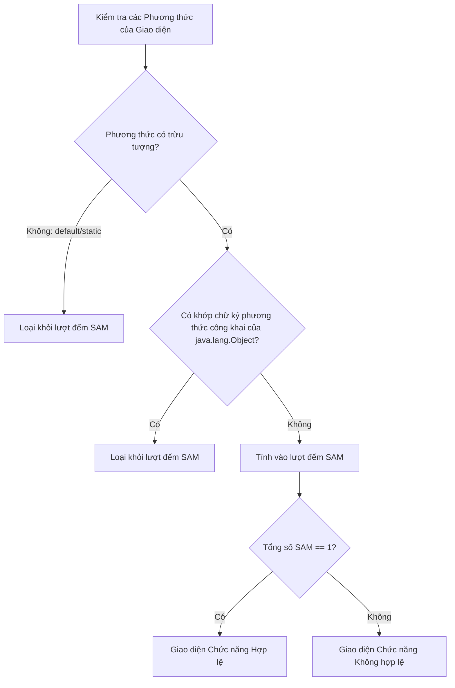

# Giao Diện Chức Năng (Functional Interface) - Phần 1

## Ghi Chú Chi Tiết

### Chú thích @FunctionalInterface

Một giao diện chức năng trong Java là một giao diện chứa **chính xác một phương thức trừu tượng (SAM - Single Abstract Method)**. Nó có thể chứa bất kỳ số lượng phương thức mặc định (`default`) hoặc phương thức tĩnh (`static`) nào.

Chú thích `@FunctionalInterface` là tùy chọn nhưng được khuyến khích mạnh mẽ. Nó thông báo cho trình biên dịch xác thực xem giao diện được chú thích có đúng một phương thức trừu tượng hay không. Nếu không, lỗi biên dịch sẽ xảy ra.

#### Ghi đè các Phương thức của Lớp Object
Một giao diện có thể khai báo các phương thức trừu tượng ghi đè các phương thức công khai của lớp `java.lang.Object` (như `equals`, `hashCode`, hoặc `toString`). Những khai báo này **không** được tính vào số lượng phương thức trừu tượng duy nhất.

```java
@FunctionalInterface
public interface SimpleCalculator {
    int calculate(int a, int b); // Single Abstract Method (SAM)

    // Default methods are allowed
    default int add(int a, int b) {
        return a + b;
    }

    // Static methods are allowed
    static boolean isPositive(int val) {
        return val > 0;
    }

    // Overriding Object methods is allowed and does NOT count as abstract
    @Override
    boolean equals(Object obj);
}
```

## Tại sao nên sử dụng chú thích @FunctionalInterface

Chú thích `@FunctionalInterface` là một chú thích định hướng trình biên dịch, nhằm tài liệu hóa rõ ràng ý định thiết kế của một giao diện. Mặc dù Java cho phép bất kỳ giao diện nào chứa chính xác một phương thức trừu tượng đóng vai trò là kiểu đích (Target type) cho các biểu thức lambda hoặc tham chiếu phương thức, việc bỏ qua chú thích này sẽ khiến mã nguồn dễ gặp lỗi trong tương lai. Nếu một lập trình viên vô tình thêm một phương thức trừu tượng thứ hai vào một giao diện chức năng mà không có chú thích này, lỗi biên dịch sẽ biểu hiện tại nơi sử dụng (nơi viết biểu thức lambda) thay vì tại chính khai báo giao diện, khiến cho việc gỡ lỗi trở nên khó khăn hơn. Sử dụng `@FunctionalInterface` đảm bảo trình biên dịch kiểm tra ràng buộc phương thức trừu tượng duy nhất (SAM) ngay tại nơi khai báo, ngăn chặn việc vô tình thêm vào các phương thức trừu tượng khác.



### Ví dụ Thực Tế: Thực thi Ràng buộc của Chú thích

```java
// Correct usage: compiler checks declaration
@FunctionalInterface
interface StringTransformer {
    String transform(String input);
    
    // If we uncomment the line below, compiler complains immediately:
    // "StringTransformer is not a functional interface"
    // void anotherMethod(); 
}

public class AnnotationDemo {
    public static void main(String[] args) {
        StringTransformer upper = String::toUpperCase;
        System.out.println(upper.transform("hello")); // Output: HELLO
    }
}
```

### Chuỗi Nguyên nhân - Kết quả
- **Được chú thích với `@FunctionalInterface`** $\rightarrow$ Trình biên dịch thực thi ràng buộc phương thức trừu tượng duy nhất tại khai báo &rarr; Ngăn chặn việc vô tình thêm phương thức trừu tượng mới &rarr; Tránh lỗi biên dịch tại các vị trí sử dụng lambda phía hạ nguồn.

---

## Cách JLS Đếm các Phương thức Trừu tượng và Xử lý việc Ghi đè java.lang.Object

Đặc tả Ngôn ngữ Java (Java Language Specification - JLS §9.8) định nghĩa một giao diện chức năng là một giao diện có chính xác một phương thức chức năng, tức là một phương thức trừu tượng duy nhất không bị ghi đè. Khi xác định số lượng phương thức trừu tượng, bất kỳ phương thức trừu tượng nào được khai báo trong giao diện mà ghi đè một phương thức công khai của lớp `java.lang.Object` (như `equals(Object)`, `hashCode()`, hoặc `toString()`) đều được loại trừ khỏi lượt đếm. Việc loại trừ này tồn tại vì bất kỳ lớp nào triển khai giao diện này sẽ tự động kế thừa các triển khai của các phương thức này từ `java.lang.Object` (trực tiếp hoặc qua phân cấp lớp cha), nghĩa là lớp triển khai không cần cung cấp triển khai mới cho chúng. Nếu một phương thức trong giao diện ghi đè một phương thức không công khai của `Object` (chẳng hạn như `clone()`), hoặc nếu nó khai báo một phương thức trừu tượng không có mặt trong `Object`, nó sẽ được tính vào giới hạn phương thức trừu tượng duy nhất.



### Ví dụ Thực Tế: Ghi đè Lớp Object

```java
@FunctionalInterface
interface CustomComparator<T> {
    // 1. Counts as the single abstract method (SAM)
    int compare(T o1, T o2);

    // 2. Overrides public java.lang.Object method: NOT counted
    @Override
    boolean equals(Object obj);

    // 3. Overrides public java.lang.Object method: NOT counted
    @Override
    String toString();
    
    // 4. Overriding protected/non-public Object method is NOT allowed as a non-counted method.
    // Object clone(); // If uncommented, counts as second abstract method and fails compilation!
}

public class JlsChecksDemo {
    public static void main(String[] args) {
        CustomComparator<String> lengthComp = (s1, s2) -> Integer.compare(s1.length(), s2.length());
        System.out.println(lengthComp.compare("apple", "banana")); // Output: -1
        System.out.println(lengthComp.equals(lengthComp));         // Output: true
    }
}
```

### Chuỗi Nguyên nhân - Kết quả
- **Khai báo phương thức public của `Object` dưới dạng abstract** $\rightarrow$ Trình biên dịch nhận biết chữ ký phương thức khớp với phương thức public của `Object` $\rightarrow$ Phương thức được loại trừ khỏi số lượng phương thức trừu tượng của giao diện chức năng $\rightarrow$ Giao diện biên dịch thành công dưới dạng một `@FunctionalInterface` hợp lệ.

---

### Predicate<T>

`Predicate<T>` đại diện cho một hàm nhận vào một đối số và trả về giá trị kiểu `boolean`.
- **Phương thức Chức năng**: `boolean test(T t)`
- **Trường hợp Sử dụng Phổ biến**: Lọc các phần tử từ một Stream hoặc Collection.

#### Giải thích Chi tiết và Ví dụ Code
```java
import java.util.function.Predicate;
import java.util.List;
import java.util.stream.Collectors;

public class PredicateExample {
    public static void main(String[] args) {
        Predicate<String> isLong = s -> s.length() > 3;
        
        List<String> names = List.of("Al", "Bob", "Charlie");
        List<String> filtered = names.stream()
                                     .filter(isLong)
                                     .collect(Collectors.toList());
        System.out.println(filtered); // [Charlie]
        
        // Chaining: and(), or(), negate()
        Predicate<String> startsWithC = s -> s.startsWith("C");
        Predicate<String> combined = isLong.and(startsWithC);
        System.out.println(combined.test("Charlie")); // true
        System.out.println(combined.test("Bob"));     // false
    }
}
```

#### Các Biến thể Kiểu Nguyên thủy
Để tránh chi phí đóng hộp và mở hộp các kiểu nguyên thủy (ví dụ: từ `int` thành `Integer`), Java cung cấp các điều kiện lọc chuyên biệt cho kiểu nguyên thủy:
- `IntPredicate`: `boolean test(int value)`
- `LongPredicate`: `boolean test(long value)`
- `DoublePredicate`: `boolean test(double value)`

```java
import java.util.function.IntPredicate;

public class PrimitivePredicateExample {
    public static void main(String[] args) {
        IntPredicate isEven = value -> value % 2 == 0;
        System.out.println(isEven.test(42)); // true (no autoboxing)
    }
}
```

---

### Function<T, R>

`Function<T, R>` chuyển đổi một đầu vào kiểu `T` thành kết quả kiểu `R`.
- **Phương thức Chức năng**: `R apply(T t)`
- **Trường hợp Sử dụng Phổ biến**: Ánh xạ (map) các đối tượng từ dạng này sang dạng khác.

#### Giải thích Chi tiết và Ví dụ Code
```java
import java.util.function.Function;

public class FunctionExample {
    public static void main(String[] args) {
        Function<String, Integer> stringLength = s -> s.length();
        System.out.println(stringLength.apply("Java")); // 4

        // Chaining: andThen(), compose()
        Function<Integer, Integer> multiplyBy2 = n -> n * 2;
        
        // andThen: apply stringLength first, then multiplyBy2
        Function<String, Integer> lengthDouble = stringLength.andThen(multiplyBy2);
        System.out.println(lengthDouble.apply("Java")); // 8

        // compose: apply multiplyBy2 first, then stringLength (needs to match input type of stringLength)
        Function<Integer, Integer> addThree = n -> n + 3;
        Function<Integer, Integer> pipeline = addThree.compose(multiplyBy2); // multiplyBy2 then addThree
        System.out.println(pipeline.apply(5)); // 5 * 2 + 3 = 13
    }
}
```

#### Các Biến thể Kiểu Nguyên thủy
Sử dụng `Function<T, R>` với các kiểu nguyên thủy đòi hỏi phải đóng hộp. Java cung cấp các Function chuyên biệt cho kiểu nguyên thủy để tránh điều này:
- **Đầu vào Nguyên thủy**: `IntFunction<R>` (`R apply(int)`), `LongFunction<R>`, `DoubleFunction<R>`.
- **Đầu ra Nguyên thủy**: `ToIntFunction<T>` (`int applyAsInt(T)`), `ToLongFunction<T>`, `ToDoubleFunction<T>`.
- **Nguyên thủy sang Nguyên thủy**: `IntToDoubleFunction` (`double applyAsDouble(int)`), `IntToLongFunction`, `LongToIntFunction`, `LongToDoubleFunction`, `DoubleToIntFunction`, `DoubleToLongFunction`.

```java
import java.util.function.IntToDoubleFunction;

public class PrimitiveFunctionExample {
    public static void main(String[] args) {
        IntToDoubleFunction half = val -> val / 2.0;
        System.out.println(half.applyAsDouble(5)); // 2.5 (no boxing)
    }
}
```

---

### Consumer<T>

`Consumer<T>` thực hiện một thao tác trên một đầu vào kiểu `T` và không trả về kết quả (trả về `void`).
- **Phương thức Chức năng**: `void accept(T t)`
- **Trường hợp Sử dụng Phổ biến**: In dữ liệu, ghi vào cơ sở dữ liệu, hoặc sửa đổi trạng thái nội bộ của một đối tượng.

#### Giải thích Chi tiết và Ví dụ Code
```java
import java.util.function.Consumer;

public class ConsumerExample {
    public static void main(String[] args) {
        Consumer<String> printUpper = s -> System.out.println(s.toUpperCase());
        printUpper.accept("hello"); // HELLO

        // Chaining: andThen()
        Consumer<String> printLength = s -> System.out.println(s.length());
        Consumer<String> combined = printUpper.andThen(printLength);
        combined.accept("java"); // JAVA then 4
    }
}
```

#### Các Biến thể Kiểu Nguyên thủy
- `IntConsumer`: `void accept(int value)`
- `LongConsumer`: `void accept(long value)`
- `DoubleConsumer`: `void accept(double value)`

```java
import java.util.function.IntConsumer;

public class PrimitiveConsumerExample {
    public static void main(String[] args) {
        IntConsumer printInt = val -> System.out.println("Value: " + val);
        printInt.accept(100);
    }
}
```

---

### Supplier<T>

`Supplier<T>` không nhận vào tham số nào và trả về một kết quả kiểu `T`.
- **Phương thức Chức năng**: `T get()`
- **Trường hợp Sử dụng Phổ biến**: Tạo giá trị trì hoãn (lazy generation), các nhà máy (factory), hoặc cung cấp các giá trị mặc định.

#### Giải thích Chi tiết và Ví dụ Code
```java
import java.util.function.Supplier;
import java.time.LocalDateTime;

public class SupplierExample {
    public static void main(String[] args) {
        Supplier<LocalDateTime> currentTime = () -> LocalDateTime.now();
        System.out.println(currentTime.get());
    }
}
```

#### Các Biến thể Kiểu Nguyên thủy
- `IntSupplier`: `int getAsInt()`
- `LongSupplier`: `long getAsLong()`
- `DoubleSupplier`: `double getAsDouble()`
- `BooleanSupplier`: `boolean getAsBoolean()`

```java
import java.util.function.IntSupplier;

public class PrimitiveSupplierExample {
    public static void main(String[] args) {
        IntSupplier diceRoller = () -> (int) (Math.random() * 6) + 1;
        System.out.println(diceRoller.getAsInt());
    }
}
```

---

### UnaryOperator<T>

`UnaryOperator<T>` là một `Function<T, T>` chuyên biệt, trong đó kiểu dữ liệu của đầu vào và đầu ra là giống nhau.
- **Phương thức Chức năng**: `T apply(T t)`
- **Trường hợp Sử dụng Phổ biến**: Sửa đổi trực tiếp một giá trị hoặc thay thế các phần tử trong một danh sách.

#### Giải thích Chi tiết và Ví dụ Code
```java
import java.util.function.UnaryOperator;
import java.util.ArrayList;
import java.util.List;

public class UnaryOperatorExample {
    public static void main(String[] args) {
        UnaryOperator<String> sanitize = s -> s.trim().toLowerCase();
        System.out.println(sanitize.apply("  Java21  ")); // "java21"

        List<String> list = new ArrayList<>(List.of("  A ", " B  "));
        list.replaceAll(sanitize);
        System.out.println(list); // [a, b]
    }
}
```

#### Các Biến thể Kiểu Nguyên thủy
- `IntUnaryOperator`: `int applyAsInt(int)`
- `LongUnaryOperator`: `long applyAsLong(long)`
- `DoubleUnaryOperator`: `double applyAsDouble(double)`

```java
import java.util.function.IntUnaryOperator;

public class PrimitiveUnaryOperatorExample {
    public static void main(String[] args) {
        IntUnaryOperator square = val -> val * val;
        System.out.println(square.applyAsInt(5)); // 25
    }
}
```

---

### BinaryOperator<T>

`BinaryOperator<T>` là một `BiFunction<T, T, T>` chuyên biệt, trong đó hai đầu vào và kết quả trả về đều chia sẻ chung một kiểu dữ liệu `T`.
- **Phương thức Chức năng**: `T apply(T t1, T t2)`
- **Trường hợp Sử dụng Phổ biến**: Gom nhóm (reducing) các tập hợp hoặc tính toán gộp từ hai giá trị.

#### Giải thích Chi tiết và Ví dụ Code
```java
import java.util.function.BinaryOperator;

public class BinaryOperatorExample {
    public static void main(String[] args) {
        BinaryOperator<Integer> sum = (a, b) -> a + b;
        System.out.println(sum.apply(10, 20)); // 30

        // Các phương thức trợ giúp tĩnh: minBy, maxBy
        BinaryOperator<Integer> min = BinaryOperator.minBy(Integer::compareTo);
        System.out.println(min.apply(15, 8)); // 8
    }
}
```

#### Các Biến thể Kiểu Nguyên thủy
- `IntBinaryOperator`: `int applyAsInt(int, int)`
- `LongBinaryOperator`: `long applyAsLong(long, long)`
- `DoubleBinaryOperator`: `double applyAsDouble(double, double)`

```java
import java.util.function.IntBinaryOperator;

public class PrimitiveBinaryOperatorExample {
    public static void main(String[] args) {
        IntBinaryOperator product = (a, b) -> a * b;
        System.out.println(product.applyAsInt(6, 7)); // 42
    }
}
```

---

### BiPredicate<T, U>

`BiPredicate<T, U>` nhận vào hai đối số thuộc các kiểu `T` và `U`, sau đó trả về một giá trị kiểu boolean.
- **Phương thức Chức năng**: `boolean test(T t, U u)`
- **Trường hợp Sử dụng Phổ biến**: Kiểm tra mối quan hệ giữa hai đối tượng khác nhau.

#### Giải thích Chi tiết và Ví dụ Code
```java
import java.util.function.BiPredicate;

public class BiPredicateExample {
    public static void main(String[] args) {
        BiPredicate<String, String> containsWord = (text, word) -> text.contains(word);
        System.out.println(containsWord.test("Java Programming", "Prog")); // true
    }
}
```

---

### BiFunction<T, U, R>

`BiFunction<T, U, R>` nhận vào hai đối số thuộc các kiểu `T` và `U`, sau đó tạo ra một kết quả kiểu `R`.
- **Phương thức Chức năng**: `R apply(T t, U u)`
- **Trường hợp Sử dụng Phổ biến**: Kết hợp hai đầu vào riêng biệt thành một biểu diễn thứ ba.

#### Giải thích Chi tiết và Ví dụ Code
```java
import java.util.function.BiFunction;

public class BiFunctionExample {
    public static void main(String[] args) {
        BiFunction<String, Integer, String> repeatString = (s, count) -> s.repeat(count);
        System.out.println(repeatString.apply("Hi", 3)); // "HiHiHi"
    }
}
```

---

### BiConsumer<T, U>

`BiConsumer<T, U>` nhận vào hai đối số thuộc các kiểu `T` và `U` và không trả về kết quả (`void`).
- **Phương thức Chức năng**: `void accept(T t, U u)`
- **Trường hợp Sử dụng Phổ biến**: Duyệt qua các phần tử của một Map bằng cách sử dụng `Map.forEach`.

#### Giải thích Chi tiết và Ví dụ Code
```java
import java.util.function.BiConsumer;
import java.util.HashMap;
import java.util.Map;

public class BiConsumerExample {
    public static void main(String[] args) {
        Map<String, Integer> map = new HashMap<>();
        map.put("Apple", 10);
        map.put("Banana", 20);

        BiConsumer<String, Integer> printer = (key, value) -> System.out.println(key + " has quantity " + value);
        map.forEach(printer);
    }
}
```

---

### Đầu vào là gì? (What is the input?)

Đầu vào là gì? là một câu hỏi cốt lõi để thấu hiểu Giao Diện Chức Năng.

#### Giải thích Chi tiết và Ví dụ Code
Khi thiết kế hoặc lựa chọn một giao diện chức năng, hãy luôn phân tích:
1. **Có bao nhiêu đầu vào?** (Không, Một, hoặc Hai)
2. **Các kiểu đầu vào là gì?** (Các đối tượng kiểu chung `T`, `U`, hoặc các kiểu nguyên thủy như `int`, `double`, `long`).

Ví dụ:
- `Supplier<T>` có **không** đầu vào.
- `Function<T, R>` có **một** đầu vào.
- `BiFunction<T, U, R>` có **hai** đầu vào.
- `IntConsumer` có **một** đầu vào là kiểu nguyên thủy `int`.

---

## Tại sao các Triển khai Chuyên biệt cho Kiểu Nguyên thủy Ngăn ngừa Chi phí Đóng hộp

Các kiểu generic trong Java phải trải qua quá trình xóa kiểu, nghĩa là JVM chỉ hoạt động trên các tham chiếu có kiểu `java.lang.Object` tại thời điểm chạy. Điều này ngăn cản các kiểu nguyên thủy như `int` hoặc `double` được sử dụng trực tiếp dưới dạng đối số kiểu. Khi sử dụng các giao diện chức năng tiêu chuẩn như `Predicate<Integer>`, bất kỳ giá trị nguyên thủy `int` nào được truyền vào làm đối số đều phải được bọc trong một đối tượng `Integer` được phân bổ trên heap thông qua cơ chế tự động đóng hộp. Quá trình đóng hộp này phân bổ bộ nhớ trên heap, làm tăng áp lực lên bộ thu gom rác (GC), và yêu cầu giải tham chiếu (Dereferencing) để lấy lại giá trị nguyên thủy trong quá trình thực thi phương thức. Để giải quyết vấn đề hiệu năng này, Java cung cấp các triển khai chuyên biệt cho kiểu nguyên thủy như `IntPredicate` hoặc `DoubleConsumer`, vốn định nghĩa các phương thức trừu tượng nhận trực tiếp các đối số kiểu nguyên thủy (ví dụ: `test(int value)`). Việc sử dụng các triển khai chuyên biệt này loại bỏ việc phân bổ bộ nhớ trên heap, tránh chi phí bộ nhớ phụ trội và cho phép JVM thực thi các hoạt động với chi phí tối thiểu bên trong các vòng lặp xử lý lượng dữ liệu lớn.

```mermaid
sequenceDiagram
    autonumber
    participant Loop as Vòng lặp / Mã
    participant Generic as Predicate<Integer>
    participant Heap as Bộ nhớ Heap của JVM
    participant Primitive as IntPredicate
    
    Note over Loop, Heap: Sử dụng Predicate Kiểu Chung (Đóng hộp)
    Loop->>Generic: test(42)
    Generic->>Heap: Phân bổ Integer(42) [Chi phí Heap!]
    Heap-->>Generic: Trả về Tham chiếu Integer
    Generic->>Generic: Mở hộp Integer thành int
    Generic-->>Loop: Trả về boolean
    
    Note over Loop, Primitive: Sử dụng Kiểu Nguyên thủy Chuyên biệt
    Loop->>Primitive: test(42)
    Primitive->>Primitive: Thực thi logic trực tiếp trên int 42
    Primitive-->>Loop: Trả về boolean [Không phân bổ Heap]
```

### Ví dụ Thực Tế: Chi phí Đóng hộp so với Các Triển khai Chuyên biệt kiểu Nguyên thủy

```java
import java.util.function.Predicate;
import java.util.function.IntPredicate;

public class BoxingOverheadDemo {
    public static void main(String[] args) {
        int iterations = 10_000_000;
        
        // 1. Generic Predicate (autoboxing overhead)
        Predicate<Integer> isEvenGeneric = x -> x % 2 == 0;
        long startGeneric = System.nanoTime();
        for (int i = 0; i < iterations; i++) {
            isEvenGeneric.test(i); // boxes 'i' into Integer
        }
        long endGeneric = System.nanoTime();
        
        // 2. Primitive Specialization (no autoboxing)
        IntPredicate isEvenPrimitive = x -> x % 2 == 0;
        long startPrimitive = System.nanoTime();
        for (int i = 0; i < iterations; i++) {
            isEvenPrimitive.test(i); // passes primitive int
        }
        long endPrimitive = System.nanoTime();
        
        System.out.println("Generic took: " + (endGeneric - startGeneric) / 1_000_000 + " ms");
        System.out.println("Primitive took: " + (endPrimitive - startPrimitive) / 1_000_000 + " ms");
    }
}
```

### Chuỗi Nguyên nhân - Kết quả
- **Sử dụng tham số kiểu chung** $\rightarrow$ Trình biên dịch bắt buộc sử dụng đối số kiểu tham chiếu &rarr; Các giá trị nguyên thủy phải được đóng hộp vào đối tượng bao bọc &rarr; Phân bổ heap và áp lực lên GC tăng lên &rarr; Hiệu năng suy giảm so với việc sử dụng các triển khai chuyên biệt cho kiểu nguyên thủy.

---

## Các lỗi thường gặp

### 1. Chi phí Tự động Đóng hộp / Mở hộp (Autoboxing/Unboxing)
Sử dụng các giao diện chức năng dựa trên lớp bao bọc như `Function<Integer, Integer>` trong các vòng lặp xử lý tần suất cao thay vì các biến thể kiểu nguyên thủy như `IntUnaryOperator` dẫn đến áp lực thu gom rác lớn và suy giảm hiệu năng.
```java
// Bad: autoboxing happens 1,000,000 times
Function<Integer, Integer> badSquare = x -> x * x; 
for (int i = 0; i < 1_000_000; i++) {
    badSquare.apply(i); 
}

// Good: no autoboxing
IntUnaryOperator goodSquare = x -> x * x;
for (int i = 0; i < 1_000_000; i++) {
    goodSquare.applyAsInt(i);
}
```

### 2. Ngoại lệ NullPointerException với các Biến thể Nguyên thủy
If a lambda returns `null` or a wrapper referencing `null` to a primitive functional interface, a `NullPointerException` will be thrown at runtime due to implicit unboxing.
```java
Integer value = null;
IntSupplier supplier = () -> value; // Compiles fine!
int x = supplier.getAsInt(); // Throws NullPointerException at runtime!
```
Wait, the comment was in English, let's translate the comment as well:
```java
Integer value = null;
IntSupplier supplier = () -> value; // Biên dịch bình thường!
int x = supplier.getAsInt(); // Ném ra NullPointerException tại thời điểm chạy!
```

### 3. Có Nhiều hơn Một Phương thức Trừu tượng
Khai báo nhiều phương thức trừu tượng trong một giao diện được chú thích bằng `@FunctionalInterface` sẽ gây ra lỗi biên dịch.
```java
@FunctionalInterface
public interface InvalidInterface {
    void doSomething();
    void doSomethingElse(); // Lỗi biên dịch: Tìm thấy nhiều phương thức trừu tượng không ghi đè
}
```

### 4. Nhầm lẫn các phương thức mặc định/tĩnh với các phương thức trừu tượng
Các phương thức mặc định (`default`) và phương thức tĩnh (`static`) không phải là phương thức trừu tượng. Một giao diện có thể có nhiều phương thức mặc định và tĩnh nhưng vẫn là một giao diện chức năng, miễn là nó có chính xác một phương thức trừu tượng.

---

## Các Câu Hỏi Ôn Tập Thường Gặp

- Những khái niệm nào ở đây là các quy tắc tại thời điểm biên dịch?
- Những khái niệm nào ở đây ảnh hưởng đến hành vi tại thời điểm chạy?
- Những khái niệm nào ở đây dễ trở thành bẫy khi phỏng vấn?
