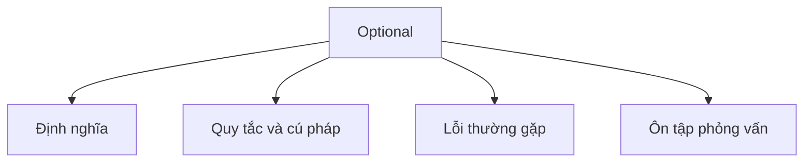

# 24 - Optional

Chủ đề này tuân theo đề cương chính trong [outline.md](../outline.md). Mục tiêu là hiểu sâu từng khái niệm đủ để giải thích, nhận diện trong code, và trả lời các câu hỏi phỏng vấn.

## Thứ Tự Học

- [Khái Niệm Optional T](theory/01-what-is-optional-t-concepts.md)
- [Khái Niệm Map](theory/02-map-concepts.md)
- [Thuật Ngữ Chính](terms/01-key-terms.md)

## Danh Sách Kiểm Tra Theo Đề Cương

- Optional<T> là gì?
- Tránh NullPointerException
- Optional.of
- Optional.ofNullable
- Optional.empty
- isPresent
- ifPresent
- orElse
- orElseGet
- orElseThrow
- map
- flatMap
- filter
- Không lạm dụng Optional
- Optional trong kiểu trả về

## Tự Kiểm Tra

1. Tại sao Optional được thiết kế như một lớp bọc (wrapper) thay vì thay thế hoàn toàn null trong các trường hay tham số?
2. Chi phí hiệu năng khi dùng Optional trong vòng lặp hoặc trường (field) là gì?
3. Sự khác biệt giữa orElse() và orElseGet() về đánh giá tức thì (eager) và trì hoãn (lazy)?
4. Tại sao việc trả về null từ một phương thức khai báo trả về Optional lại vi phạm hợp đồng API của nó?
5. Sự khác biệt cốt lõi giữa map() và flatMap() của Optional về chữ ký và hành vi bao bọc là gì?
6. Tại sao flatMap() có thể ném NullPointerException khi hàm ánh xạ trả về null, còn map() thì không?
7. Tại sao Optional không Serializable, và điều đó có ý nghĩa gì trong thiết kế class Java?

## Thẻ Anki

- [Basic](anki/basic.tsv)
- [Basic Extra](anki/basic-extra.tsv)
- [Cloze](anki/cloze.tsv)
- [Code Question](anki/code-question.tsv)

## Sơ Đồ Tổng Quan (Mermaid)

## Liên Kết Tham Khảo

- https://docs.oracle.com/en/java/javase/21/docs/api/java.base/java/util/Optional.html
