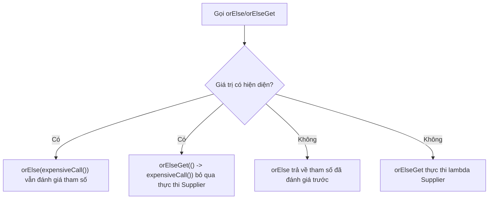

# Optional - Phần 1

File này bao quát một phần tập trung của **Optional** (lớp tùy chọn). Hãy học từng khái niệm như một quy tắc Java thực tế, không phải từ vựng đơn độc.

## Phạm Vi Đề Cương

## Ghi Chú Chi Tiết

### Optional<T> là gì?

Optional là container có thể chứa hoặc không chứa một giá trị khác null.

Dùng nó để dự đoán chính xác quy tắc Java, dạng hợp lệ và chế độ thất bại. Ôn với ví dụ nhỏ thay vì chỉ ghi nhớ nhãn.

Kiểm tra thực tế:

- Định nghĩa `Optional<T>` trong một câu.
- Nhận diện `Optional<T>` trong code, lệnh, tài liệu hoặc câu hỏi phỏng vấn.
- Giải thích một lỗi, hạn chế hoặc đánh đổi liên quan đến `Optional<T>`.

Ví dụ nhỏ hoặc mô hình tư duy:

- `Optional.ofNullable(value)` xử lý giá trị có thể null.

#### Giải Thích Chi Tiết
`Optional<T>` là một class cuối cùng (final) dựa trên giá trị trong gói `java.util`. Nó bọc một tham chiếu kiểu `T` có thể hiện diện (khác null) hoặc rỗng. Bằng cách trả về `Optional<T>` từ một phương thức, bạn đưa sự vắng mặt tiềm năng của giá trị vào chữ ký phương thức, báo hiệu cho API gọi rằng họ phải xử lý rõ ràng trường hợp rỗng.

#### Ví Dụ Code Chạy Được
```java
import java.util.Optional;

public class OptionalIntroduction {
    public static void main(String[] args) {
        // Tạo Optional chứa một giá trị
        Optional<String> optionalValue = Optional.of("Hello, Java!");
        
        // Kiểm tra và dùng giá trị
        if (optionalValue.isPresent()) {
            System.out.println("Giá trị là: " + optionalValue.get()); // In ra: Giá trị là: Hello, Java!
        }
    }
}
```

#### Lỗi Thường Gặp
Coi `Optional` là sự thay thế trực tiếp cho mọi tham chiếu null hoặc dùng nó để bọc biến cục bộ. Điều này tạo ra chi phí cấp phát bộ nhớ wrapper không cần thiết.

### Tránh NullPointerException

Ngoại lệ (exception) biểu diễn điều kiện bất thường mà chương trình có thể bắt hoặc lan truyền.

Điều này quan trọng vì hành vi ngoại lệ quyết định xem lỗi được xử lý cục bộ, lan truyền, hay cho phép dừng chương trình. Một điểm nhầm lẫn thường gặp là xử lý mọi ngoại lệ theo cùng một cách thay vì phân biệt điều kiện có thể phục hồi và lỗi lập trình.

Kiểm tra thực tế:

- Định nghĩa `Tránh NullPointerException` trong một câu.
- Nhận diện `Tránh NullPointerException` trong code, lệnh, tài liệu hoặc câu hỏi phỏng vấn.
- Giải thích một lỗi, hạn chế hoặc đánh đổi liên quan đến `Tránh NullPointerException`.

#### Giải Thích Chi Tiết
Trong Java truyền thống, `null` thường được trả về để biểu diễn sự vắng mặt của giá trị. Nếu người gọi quên kiểm tra null trước khi truy cập, một `NullPointerException` (NPE) bị ném ra lúc chạy. `Optional` giúp tránh NPE bằng cách chuyển việc kiểm tra sự hiện diện từ nguy cơ runtime sang kiểm tra có cấu trúc được trình biên dịch khuyến khích.

#### Ví Dụ Code Chạy Được
```java
import java.util.Optional;

public class AvoidNPEExample {
    // Cách cũ: trả về null
    public static String getLegacyName(boolean exists) {
        return exists ? "Alice" : null;
    }

    // Cách tốt: trả về Optional
    public static Optional<String> getOptionalName(boolean exists) {
        return exists ? Optional.of("Alice") : Optional.empty();
    }

    public static void main(String[] args) {
        // Cũ: Có thể gây NullPointerException nếu không kiểm tra
        String name = getLegacyName(false);
        // System.out.println(name.toUpperCase()); // Ném NPE!

        // Tốt: Người gọi bị buộc phải xử lý khả năng rỗng
        Optional<String> optName = getOptionalName(false);
        String upperName = optName.map(String::toUpperCase).orElse("UNKNOWN");
        System.out.println(upperName); // In ra: UNKNOWN
    }
}
```

#### Lỗi Thường Gặp
Gọi `.get()` ngay lập tức trên `Optional` mà không xác minh sự hiện diện. Nếu `Optional` rỗng, nó ném `NoSuchElementException`, làm mất đi mục đích tránh lỗi runtime.

### Optional.of

Optional là container có thể chứa hoặc không chứa một giá trị khác null.

Dùng nó để dự đoán chính xác quy tắc Java, dạng hợp lệ và chế độ thất bại. Ôn với ví dụ nhỏ thay vì chỉ ghi nhớ nhãn.

Kiểm tra thực tế:

- Định nghĩa `Optional.of` trong một câu.
- Nhận diện `Optional.of` trong code, lệnh, tài liệu hoặc câu hỏi phỏng vấn.
- Giải thích một lỗi, hạn chế hoặc đánh đổi liên quan đến `Optional.of`.

Ví dụ nhỏ hoặc mô hình tư duy:

- `Optional.ofNullable(value)` xử lý giá trị có thể null.

#### Giải Thích Chi Tiết
`Optional.of(T value)` là phương thức factory tĩnh (static factory method) dùng để tạo `Optional` chứa giá trị khác null. Nếu giá trị được truyền vào là null, nó ngay lập tức ném `NullPointerException` tại điểm tạo, ngăn tham chiếu null lan truyền thêm.

#### Ví Dụ Code Chạy Được
```java
import java.util.Optional;

public class OptionalOfExample {
    public static void main(String[] args) {
        // Tạo với giá trị hợp lệ khác null
        Optional<String> valid = Optional.of("Java");
        System.out.println(valid.isPresent()); // true

        // Ném NullPointerException ngay tại dòng tạo
        try {
            Optional<String> invalid = Optional.of(null);
        } catch (NullPointerException e) {
            System.out.println("Bắt NPE: Giá trị không được null!");
        }
    }
}
```

#### Lỗi Thường Gặp
Truyền tham chiếu có thể null vào `Optional.of(value)`. Nếu giá trị có thể null, hãy luôn dùng `Optional.ofNullable(value)` thay thế.

### Optional.ofNullable

Optional là container có thể chứa hoặc không chứa một giá trị khác null.

Dùng nó để dự đoán chính xác quy tắc Java, dạng hợp lệ và chế độ thất bại. Ôn với ví dụ nhỏ thay vì chỉ ghi nhớ nhãn.

Kiểm tra thực tế:

- Định nghĩa `Optional.ofNullable` trong một câu.
- Nhận diện `Optional.ofNullable` trong code, lệnh, tài liệu hoặc câu hỏi phỏng vấn.
- Giải thích một lỗi, hạn chế hoặc đánh đổi liên quan đến `Optional.ofNullable`.

Ví dụ nhỏ hoặc mô hình tư duy:

- `Optional.ofNullable(value)` xử lý giá trị có thể null.

#### Giải Thích Chi Tiết
`Optional.ofNullable(T value)` là phương thức factory tĩnh trả về `Optional` mô tả giá trị nếu khác null, ngược lại trả về `Optional` rỗng (`Optional.empty()`). Đây là cách an toàn nhất để bọc các API cũ hoặc dữ liệu ngoài có thể trả về `null`.

#### Ví Dụ Code Chạy Được
```java
import java.util.Optional;

public class OptionalOfNullableExample {
    public static void main(String[] args) {
        String name1 = "Bob";
        String name2 = null;

        // ofNullable với giá trị khác null thì bọc giá trị
        Optional<String> opt1 = Optional.ofNullable(name1);
        System.out.println(opt1.isPresent()); // true

        // ofNullable với null trả về Optional rỗng an toàn
        Optional<String> opt2 = Optional.ofNullable(name2);
        System.out.println(opt2.isPresent()); // false
        System.out.println(opt2 == Optional.empty()); // true
    }
}
```

#### Lỗi Thường Gặp
Lạm dụng `ofNullable` trên các giá trị đảm bảo không null. Nếu giá trị chắc chắn không null, dùng `Optional.of()` đóng vai trò kiểm tra tự tài liệu hóa (self-documenting validation).

### Optional.empty

Optional là container có thể chứa hoặc không chứa một giá trị khác null.

Dùng nó để dự đoán chính xác quy tắc Java, dạng hợp lệ và chế độ thất bại. Ôn với ví dụ nhỏ thay vì chỉ ghi nhớ nhãn.

Kiểm tra thực tế:

- Định nghĩa `Optional.empty` trong một câu.
- Nhận diện `Optional.empty` trong code, lệnh, tài liệu hoặc câu hỏi phỏng vấn.
- Giải thích một lỗi, hạn chế hoặc đánh đổi liên quan đến `Optional.empty`.

Ví dụ nhỏ hoặc mô hình tư duy:

- `Optional.ofNullable(value)` xử lý giá trị có thể null.

#### Giải Thích Chi Tiết
`Optional.empty()` là phương thức factory tĩnh trả về một instance `Optional` rỗng. Java cache một singleton rỗng duy nhất bên trong, vì vậy nhiều lần gọi `Optional.empty()` trả về cùng một tham chiếu.

#### Ví Dụ Code Chạy Được
```java
import java.util.Optional;

public class OptionalEmptyExample {
    public static void main(String[] args) {
        Optional<Integer> empty1 = Optional.empty();
        Optional<String> empty2 = Optional.empty();

        // Chúng bằng nhau theo tham chiếu vì Optional.empty() được cache
        System.out.println(empty1 == empty2); // true
    }
}
```

#### Lỗi Thường Gặp
Trả về `null` thay vì `Optional.empty()` từ phương thức được thiết kế trả về `Optional`. Điều này buộc người gọi kiểm tra null trên chính container `Optional`, gây ra kiểm tra null lồng nhau và bỏ qua sự an toàn ở cấp kiểu.

### isPresent

`isPresent` là khái niệm cụ thể trong Optional; hãy học quy tắc Java, trường hợp dùng hợp lệ và chế độ thất bại thay vì chỉ nhớ tên.

Dùng nó để dự đoán chính xác quy tắc Java, dạng hợp lệ và chế độ thất bại. Ôn với ví dụ nhỏ thay vì chỉ ghi nhớ nhãn.

Kiểm tra thực tế:

- Định nghĩa `isPresent` trong một câu.
- Nhận diện `isPresent` trong code, lệnh, tài liệu hoặc câu hỏi phỏng vấn.
- Giải thích một lỗi, hạn chế hoặc đánh đổi liên quan đến `isPresent`.

Ví dụ nhỏ hoặc mô hình tư duy:

- Khi đọc code, hỏi: `isPresent` thay đổi, cho phép, từ chối hoặc làm rõ điều gì?

#### Giải Thích Chi Tiết
`isPresent()` trả về `true` nếu có giá trị, ngược lại trả về `false`. Java 11 còn giới thiệu `isEmpty()`, trả về `true` nếu rỗng. Cả hai là phương thức kiểm tra trạng thái.

#### Ví Dụ Code Chạy Được
```java
import java.util.Optional;

public class IsPresentExample {
    public static void main(String[] args) {
        Optional<String> opt = Optional.of("Hello");

        if (opt.isPresent()) {
            System.out.println("Độ dài: " + opt.get().length()); // Độ dài: 5
        }

        Optional<String> emptyOpt = Optional.empty();
        if (emptyOpt.isEmpty()) {
            System.out.println("Optional thực sự rỗng");
        }
    }
}
```

#### Lỗi Thường Gặp
Quay lại kiểm tra mệnh lệnh (imperative) kiểu null bằng cách dùng `if (opt.isPresent()) { ... opt.get() ... }`. Đây gọi là "anti-pattern isPresent/get". Khi có thể, hãy thay bằng các phương thức hàm như `ifPresent`, `orElse`, hoặc `map`.

### ifPresent

`ifPresent` là khái niệm cụ thể trong Optional; hãy học quy tắc Java, trường hợp dùng hợp lệ và chế độ thất bại thay vì chỉ nhớ tên.

Dùng nó để dự đoán chính xác quy tắc Java, dạng hợp lệ và chế độ thất bại. Ôn với ví dụ nhỏ thay vì chỉ ghi nhớ nhãn.

Kiểm tra thực tế:

- Định nghĩa `ifPresent` trong một câu.
- Nhận diện `ifPresent` trong code, lệnh, tài liệu hoặc câu hỏi phỏng vấn.
- Giải thích một lỗi, hạn chế hoặc đánh đổi liên quan đến `ifPresent`.

Ví dụ nhỏ hoặc mô hình tư duy:

- Khi đọc code, hỏi: `ifPresent` thay đổi, cho phép, từ chối hoặc làm rõ điều gì?

#### Giải Thích Chi Tiết
`ifPresent(Consumer<? super T> action)` nhận một lambda consumer và thực thi nó chỉ khi giá trị hiện diện. Nếu Optional rỗng, nó không làm gì. Trong Java 9, `ifPresentOrElse(Consumer<? super T> action, Runnable emptyAction)` được giới thiệu để xử lý cả hai trường hợp có và không có giá trị.

#### Ví Dụ Code Chạy Được
```java
import java.util.Optional;

public class IfPresentExample {
    public static void main(String[] args) {
        Optional<String> opt = Optional.of("Alice");

        // Tiêu thụ an toàn mà không gọi get()
        opt.ifPresent(name -> System.out.println("Xin chào, " + name));

        // Xử lý cả hai nhánh với ifPresentOrElse
        Optional<String> emptyOpt = Optional.empty();
        emptyOpt.ifPresentOrElse(
            name -> System.out.println("Xin chào, " + name),
            () -> System.out.println("Không có tên được cung cấp")
        ); // In ra: Không có tên được cung cấp
    }
}
```

#### Lỗi Thường Gặp
Thực thi các khối có tác dụng phụ (side effect) bên trong `ifPresent` khi cần giá trị trả về. Nếu muốn biến đổi giá trị và lấy kết quả, hãy dùng `map()` hoặc `flatMap()` thay vì thực hiện tác dụng phụ bên trong `ifPresent`.

### orElse

`orElse` là khái niệm cụ thể trong Optional; hãy học quy tắc Java, trường hợp dùng hợp lệ và chế độ thất bại thay vì chỉ nhớ tên.

Dùng nó để dự đoán chính xác quy tắc Java, dạng hợp lệ và chế độ thất bại. Ôn với ví dụ nhỏ thay vì chỉ ghi nhớ nhãn.

Kiểm tra thực tế:

- Định nghĩa `orElse` trong một câu.
- Nhận diện `orElse` trong code, lệnh, tài liệu hoặc câu hỏi phỏng vấn.
- Giải thích một lỗi, hạn chế hoặc đánh đổi liên quan đến `orElse`.

Ví dụ nhỏ hoặc mô hình tư duy:

- Khi đọc code, hỏi: `orElse` thay đổi, cho phép, từ chối hoặc làm rõ điều gì?

#### Giải Thích Chi Tiết
`orElse(T other)` trả về giá trị được bọc nếu có, ngược lại trả về giá trị mặc định `other`.
**Quy tắc hiệu năng quan trọng**: Biểu thức truyền vào `orElse` được đánh giá tức thì (eagerly) tại thời điểm gọi phương thức, bất kể `Optional` có rỗng hay không.

#### Ví Dụ Code Chạy Được
```java
import java.util.Optional;

public class OrElseExample {
    public static String getDefault() {
        System.out.println("getDefault() đã được thực thi!");
        return "DefaultValue";
    }

    public static void main(String[] args) {
        Optional<String> presentOpt = Optional.of("Java");

        // Dù presentOpt có giá trị, getDefault() VẪN được thực thi!
        String value = presentOpt.orElse(getDefault());
        System.out.println("Trả về: " + value);
        // Kết quả:
        // getDefault() đã được thực thi!
        // Trả về: Java
    }
}
```

#### Lỗi Thường Gặp
Dùng `orElse` để gọi constructor, phương thức có tác dụng phụ, hoặc truy vấn cơ sở dữ liệu. Điều này gây giảm hiệu năng và tác dụng phụ ngoài ý muốn vì giá trị dự phòng được đánh giá ngay cả khi không cần. Dùng `orElseGet` để đánh giá lười biếng.

### orElseGet

`orElseGet` là khái niệm cụ thể trong Optional; hãy học quy tắc Java, trường hợp dùng hợp lệ và chế độ thất bại thay vì chỉ nhớ tên.

Dùng nó để dự đoán chính xác quy tắc Java, dạng hợp lệ và chế độ thất bại. Ôn với ví dụ nhỏ thay vì chỉ ghi nhớ nhãn.

Kiểm tra thực tế:

- Định nghĩa `orElseGet` trong một câu.
- Nhận diện `orElseGet` trong code, lệnh, tài liệu hoặc câu hỏi phỏng vấn.
- Giải thích một lỗi, hạn chế hoặc đánh đổi liên quan đến `orElseGet`.

Ví dụ nhỏ hoặc mô hình tư duy:

- Khi đọc code, hỏi: `orElseGet` thay đổi, cho phép, từ chối hoặc làm rõ điều gì?

#### Giải Thích Chi Tiết
`orElseGet(Supplier<? super T> supplier)` nhận một lambda `Supplier`. Nếu giá trị hiện diện, nó trả về trực tiếp. Nếu rỗng, nó gọi supplier và trả về kết quả. Điều này đánh giá giá trị dự phòng theo kiểu lười biếng (lazy), tránh phạt hiệu năng khi giá trị mặc định không cần thiết.

#### Ví Dụ Code Chạy Được
```java
import java.util.Optional;

public class OrElseGetExample {
    public static String getDefault() {
        System.out.println("getDefault() được thực thi lười biếng!");
        return "DefaultValue";
    }

    public static void main(String[] args) {
        Optional<String> presentOpt = Optional.of("Java");

        // getDefault() KHÔNG được thực thi vì presentOpt có giá trị
        String value = presentOpt.orElseGet(() -> getDefault());
        System.out.println("Trả về: " + value);
        
        Optional<String> emptyOpt = Optional.empty();
        // getDefault() ĐƯỢC thực thi vì emptyOpt rỗng
        String value2 = emptyOpt.orElseGet(() -> getDefault());
        System.out.println("Trả về: " + value2);
    }
}
```

#### Lỗi Thường Gặp
Dùng `orElse` khi cần đánh giá lười biếng, hoặc dùng `orElseGet` với lambda trả về hằng số tĩnh được cấp phát trước (tạo ra chi phí wrapper lambda không cần thiết). Với hằng số tĩnh, hãy dùng `orElse`.

## Tại Sao orElse() và orElseGet() Khác Nhau Về Cơ Chế Đánh Giá

Sự khác biệt cơ bản giữa `orElse()` và `orElseGet()` nằm ở chiến lược đánh giá: `orElse()` đánh giá tham số tức thì (eager — tại thời điểm gọi), còn `orElseGet()` đánh giá lambda `Supplier` lười biếng (lazy — chỉ khi `Optional` rỗng). Khi một lời gọi phương thức được truyền trực tiếp vào `orElse(expensiveCall())`, trình biên dịch Java đánh giá `expensiveCall()` trước để lấy giá trị trả về, rồi truyền làm tham số cho `orElse()`. Việc thực thi tức thì này xảy ra dù `Optional` có đầy và giá trị dự phòng bị bỏ đi. Ngược lại, `orElseGet(() -> expensiveCall())` chấp nhận giao diện hàm (`Supplier`), nghĩa là Java chỉ gọi phương thức `get()` bên trong `orElseGet()` nếu giá trị được bọc vắng mặt, tránh tiêu tốn tài nguyên vô ích.

### Mô Hình Tư Duy: Phép Ẩn Dụ Máy Bán Hàng Tự Động

Hãy tưởng tượng một máy bán hàng tự động cung cấp đồ uống:
- **Đánh giá tức thì (`orElse`)**: Mỗi lần bạn yêu cầu đồ uống, máy chủ động rót sẵn một ly nước dự phòng, dù đồ uống chính hoàn toàn có sẵn. Nếu đồ uống chính được phân phối, ly dự phòng đã rót bị đổ đi.
- **Đánh giá lười biếng (`orElseGet`)**: Máy chỉ bắt đầu rót ly dự phòng khi và chỉ khi máy phân phối đồ uống chính hết hoàn toàn.



### Ví Dụ Code Chạy Được

```java
import java.util.Optional;

public class OrElseEvaluationDemo {
    public static String fetchBackupFromDatabase() {
        System.out.println("Truy vấn cơ sở dữ liệu để lấy dự phòng!"); // Tác dụng phụ!
        return "DatabaseBackup";
    }

    public static void main(String[] args) {
        Optional<String> optionalValue = Optional.of("PrimaryValue");

        System.out.println("--- Kiểm tra orElse (Tức Thì) ---");
        // Đánh giá tức thì: phương thức được gọi dù optionalValue có giá trị!
        String res1 = optionalValue.orElse(fetchBackupFromDatabase());
        System.out.println("Kết quả: " + res1);
        // Kết quả:
        // Truy vấn cơ sở dữ liệu để lấy dự phòng!
        // Kết quả: PrimaryValue

        System.out.println("\n--- Kiểm tra orElseGet (Lười Biếng) ---");
        // Đánh giá lười biếng: Supplier không được kích hoạt vì optionalValue có giá trị!
        String res2 = optionalValue.orElseGet(() -> fetchBackupFromDatabase());
        System.out.println("Kết quả: " + res2);
        // Kết quả:
        // Kết quả: PrimaryValue
    }
}
```

### Chuỗi Nguyên Nhân-Kết Quả
Tham số truyền vào `orElse()` → Java Runtime đánh giá biểu thức tham số tức thì trước khi vào phạm vi thực thi `orElse()` → Phương thức thứ cấp thực thi và gây chi phí CPU/IO/Bộ nhớ → Giá trị chính có sẵn → Tham số đã đánh giá bị loại bỏ → Lãng phí hiệu năng và tác dụng phụ ngoài ý muốn xảy ra.

### orElseThrow

`orElseThrow` trả về giá trị được chứa nếu có, hoặc ném ngoại lệ nếu rỗng.

Điều này quan trọng vì nó cho phép lập trình viên mở bọc Optional an toàn trong ngữ cảnh mà giá trị vắng mặt là điều kiện ngoại lệ. Một điểm nhầm lẫn thường gặp là dùng `.get()` có hành vi tương tự nhưng thiếu ý định tự tài liệu hóa và được đánh dấu là ít được ưu tiên hơn.

Kiểm tra thực tế:

- Định nghĩa `orElseThrow` trong một câu.
- Nhận diện `orElseThrow` trong code, lệnh, tài liệu hoặc câu hỏi phỏng vấn.
- Giải thích một lỗi, hạn chế hoặc đánh đổi liên quan đến `orElseThrow`.

Ví dụ nhỏ hoặc mô hình tư duy:

- `opt.orElseThrow(() -> new IllegalArgumentException("Giá trị bắt buộc bị thiếu"))`

#### Giải Thích Chi Tiết
`orElseThrow()` trả về giá trị được chứa nếu có. Nếu rỗng, nó ném `NoSuchElementException`. Trong Java 10, `orElseThrow()` không tham số được thêm vào như lựa chọn ưu tiên thay cho `.get()`.
Bạn cũng có thể dùng `orElseThrow(Supplier<? extends X> exceptionSupplier)` để ném ngoại lệ checked hoặc unchecked tùy chỉnh.

#### Ví Dụ Code Chạy Được
```java
import java.util.Optional;

public class OrElseThrowExample {
    public static void main(String[] args) {
        Optional<String> opt = Optional.empty();

        // Ngoại lệ tùy chỉnh
        try {
            opt.orElseThrow(() -> new IllegalArgumentException("Thiếu tham số"));
        } catch (IllegalArgumentException e) {
            System.out.println("Bắt được: " + e.getMessage()); // Bắt được: Thiếu tham số
        }

        // NoSuchElementException mặc định (ưu tiên hơn get())
        try {
            opt.orElseThrow();
        } catch (java.util.NoSuchElementException e) {
            System.out.println("Bắt được NoSuchElementException mặc định");
        }
    }
}
```

#### Lỗi Thường Gặp
Dùng `.get()` thay vì `.orElseThrow()`. Dù chúng có hành vi giống nhau khi ném `NoSuchElementException` trên optional rỗng, `orElseThrow()` tự tài liệu hóa và báo hiệu rõ ràng rằng việc ném ngoại lệ là hành vi được mong đợi và xử lý.

## Liên Kết Tham Khảo

- https://docs.oracle.com/en/java/javase/21/docs/api/java.base/java/util/Optional.html#orElse(T) (Tài liệu API Optional.orElse)
- https://docs.oracle.com/en/java/javase/21/docs/api/java.base/java/util/Optional.html#orElseGet(java.util.function.Supplier) (Tài liệu API Optional.orElseGet)

## Câu Hỏi Ôn Tập Thường Gặp

- Khái niệm nào ở đây là quy tắc compile-time?
- Khái niệm nào ở đây ảnh hưởng đến hành vi runtime?
- Khái niệm nào ở đây dễ là bẫy trong phỏng vấn?
