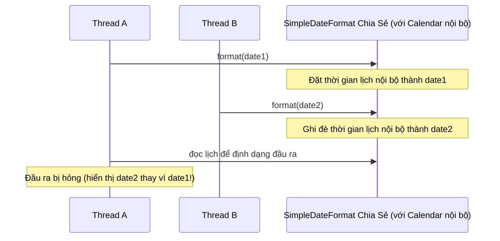
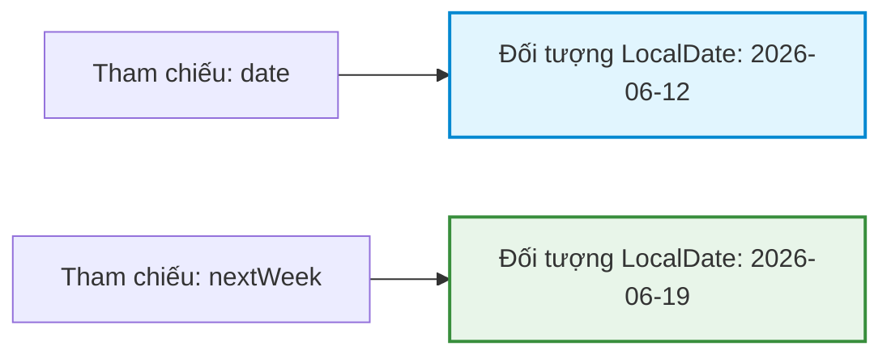
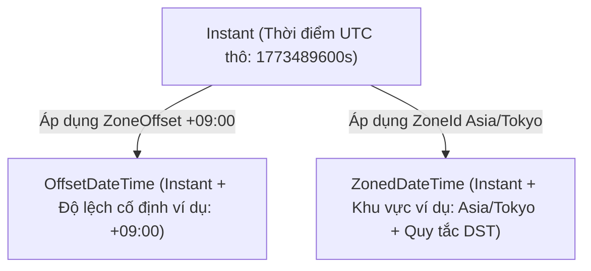

# API Ngày và Giờ (Date and Time API) - Phần 1

## Ghi Chú Chi Tiết

### Date
`java.util.Date` là một lớp cũ đại diện cho một thời điểm cụ thể trong dòng thời gian, với độ chính xác tính bằng mili giây so với thời điểm mốc Epoch (Ngày 1 tháng 1 năm 1970, 00:00:00 GMT). 

#### Các Vấn Đề Của Lớp Cũ & Chế Độ Thất Bại:
* **Tính thay đổi được (Mutability)**: `java.util.Date` có trạng thái thay đổi được. Các phương thức như `setTime(long time)` sửa đổi chính đối tượng đó, có nguy cơ gây hỏng dữ liệu trong ngữ cảnh đa luồng và vi phạm tính đóng gói.
* **Biểu diễn múi giờ gây nhầm lẫn**: Nó lưu trữ thời gian theo giờ UTC nhưng phương thức `toString()` của nó lại định dạng nó bằng múi giờ mặc định của JVM, khiến các nhà phát triển tin rằng nó có chứa thông tin múi giờ một cách sai lầm.
* **Tháng bắt đầu từ chỉ số 0 & Năm bắt đầu từ mốc 1900**: Các giá trị tháng bắt đầu từ chỉ số 0 (Tháng Một là `0`, Tháng Mười Hai là `11`), và các đối số truyền vào hàm khởi tạo năm yêu cầu trừ đi 1900 (ví dụ: `new Date(126, 5, 12)` đại diện cho ngày 12 tháng 6 năm 2026).

```java
// Mutability bug demo
java.util.Date sharedDate = new java.util.Date();
System.out.println("Initial Date: " + sharedDate);

// A caller can mutate this date, affecting any other components sharing the reference
sharedDate.setTime(0L); // Mutated to Jan 1, 1970
System.out.println("Mutated Date: " + sharedDate);
```

### Calendar
`java.util.Calendar` được giới thiệu trong JDK 1.1 để thay thế `Date` trong việc định dạng và thao tác với ngày tháng, nhưng nó cũng thừa hưởng nhiều vấn đề tương tự.

#### Giới Hạn & Những Điều Cần Lưu Ý:
* **Tính thay đổi được (Mutability)**: Nó có trạng thái thay đổi được, cho phép thay đổi trạng thái qua `set(int field, int value)` khiến cho việc đảm bảo an toàn luồng cực kỳ khó khăn.
* **Vấn đề an toàn kiểu dữ liệu**: Nó phụ thuộc vào các hằng số nguyên tùy ý (ví dụ: `Calendar.MONTH`, `Calendar.YEAR`) để truy cập trường, điều mà các trình kiểm tra kiểu tại thời điểm biên dịch không thể xác thực.
* **Chỉ số tháng**: Giống như `Date`, nó vẫn giữ chỉ số tháng bắt đầu từ 0 (`Calendar.JUNE` là `5`).

```java
// Modifying dates with Calendar (Mutable and verbose)
java.util.Calendar cal = java.util.Calendar.getInstance();
cal.set(2026, java.util.Calendar.JUNE, 12); // June is 5
cal.add(java.util.Calendar.DAY_OF_MONTH, 5); // Adds 5 days
System.out.println("Calendar after modification: " + cal.getTime());
```

### SimpleDateFormat
`java.text.SimpleDateFormat` là lớp định dạng và phân tích cú pháp ngày tháng cũ.

#### Chế Độ Thất Bại Nghiêm Trọng:
* **Không an toàn luồng (Not Thread-Safe)**: Bên trong duy trì trạng thái (một thực thể Calendar). Việc định dạng hoặc phân tích cú pháp đồng thời từ nhiều luồng có thể tạo ra đầu ra ngày bị hỏng hoặc ném ra `NumberFormatException`.

```java
// Dangerous concurrent formatting
java.text.SimpleDateFormat sdf = new java.text.SimpleDateFormat("yyyy-MM-dd");
// If sdf is shared across threads:
// Thread 1: sdf.format(date1)
// Thread 2: sdf.format(date2) -> Can result in corrupted/mixed date output!
```

### Tại Sao Các API Cũ Như Date, Calendar, và SimpleDateFormat Lại Đầy Lỗi

Các lớp cũ `java.util.Date` và `java.util.Calendar` biểu diễn ngày tháng và các trường lịch bằng các trạng thái thay đổi được (mutable state), điều này gây ra nguy cơ nghiêm trọng về việc hỏng dữ liệu trong các ứng dụng đồng thời. Vì bất kỳ luồng nào có tham chiếu đến thực thể `Date` hoặc `Calendar` đều có thể gọi các phương thức thay đổi như `setTime()` hoặc `set()`, các nhà phát triển phải viết các bản sao phòng thủ (defensive copy) rất dài dòng để bảo vệ tính đóng gói. Ngoài ra, thiết kế API của chúng rất dễ xảy ra lỗi: chỉ số tháng bắt đầu từ 0 (Tháng Một là `0`), năm bị dịch lệch `1900` trong các hàm khởi tạo cũ, và hành vi múi giờ thì mập mờ và phụ thuộc vào định dạng. Hơn thế nữa, các lớp như `java.text.SimpleDateFormat` không hề an toàn luồng vì chúng duy trì trạng thái lịch thay đổi được ở bên trong; việc chia sẻ một thực thể giữa các luồng mà không có sự đồng bộ hóa bên ngoài sẽ dẫn đến các chuỗi ngày bị hỏng hoặc các lỗi phân tích cú pháp.

#### Mô Hình Tư Duy: Xung Đột Đồng Thời Trong SimpleDateFormat


#### Ví Dụ Mã Nguồn: Các Lỗi Về Tính Thay Đổi Được Và Chỉ Số
```java
// 0-based month (5 = June) and 1900-based year offset (126 = 2026)
java.util.Date legacyDate = new java.util.Date(126, 5, 12); 
System.out.println(legacyDate); // Fri Jun 12 00:00:00 UTC 2026 (formats with JVM timezone)

// Mutability bug
legacyDate.setTime(0L); // Mutated to Epoch (Jan 1, 1970)
System.out.println(legacyDate); // Thu Jan 01 00:00:00 UTC 1970
```

#### Chuỗi Nguyên Nhân - Kết Quả
Chia sẻ SimpleDateFormat có trạng thái thay đổi được &rarr; Nhiều luồng đồng thời phân tích/định dạng &rarr; Trạng thái Calendar nội bộ bị ghi đè giữa chừng &rarr; Đầu ra bị hỏng hoặc các ngoại lệ bất ngờ

### LocalDate
`java.time.LocalDate` đại diện cho một ngày không có giờ hoặc múi giờ trong hệ thống lịch ISO-8601 (ví dụ: `2026-06-12`). Nó bất biến (immutable), an toàn luồng và triển khai giao diện `Temporal`.

```java
// Creating and manipulating LocalDate
LocalDate date = LocalDate.of(2026, 6, 12); // Clear, 1-indexed months!
LocalDate nextWeek = date.plusDays(7); // Returns a new instance

System.out.println("Original: " + date);   // 2026-06-12
System.out.println("Next Week: " + nextWeek); // 2026-06-19
```

### LocalTime
`java.time.LocalTime` đại diện cho thời gian không có ngày hoặc múi giờ (ví dụ: `13:45:00`). Nó bất biến và an toàn luồng.

```java
LocalTime time = LocalTime.of(13, 45, 0); // 1:45 PM
LocalTime halfHourLater = time.plusMinutes(30);

System.out.println("Start Time: " + time);          // 13:45
System.out.println("End Time: " + halfHourLater); // 14:15
```

### LocalDateTime
`java.time.LocalDateTime` kết hợp ngày và giờ vào một lớp duy nhất không có múi giờ (ví dụ: `2026-06-12T13:45:00`). Nó rất lý tưởng cho các sự kiện cục bộ (ví dụ: "Cửa hàng mở cửa hàng ngày lúc 9:00 AM giờ địa phương") nhưng không ánh xạ tới một thời điểm cụ thể trên dòng thời gian toàn cầu nếu không có ngữ cảnh múi giờ.

```java
LocalDate date = LocalDate.of(2026, 6, 12);
LocalTime time = LocalTime.of(13, 45, 0);
LocalDateTime ldt = LocalDateTime.of(date, time);

System.out.println("LocalDateTime: " + ldt); // 2026-06-12T13:45
```

### Tại Sao Các Đối Tượng Ngày Giờ Trong Java 8 Hiện Đại Lại Bất Biến và An Toàn Luồng

Các lớp trong gói `java.time` (như `LocalDate`, `LocalTime`, và `LocalDateTime`) được thiết kế dưới dạng các kiểu giá trị bất biến (immutable value types): chúng được khai báo là `final`, và trạng thái nội bộ của chúng được lưu trữ trong các trường `private final`. Vì trạng thái của một đối tượng bất biến không thể thay đổi sau khi nó được xây dựng, nó vốn dĩ đã an toàn luồng và có thể được chia sẻ tự do giữa nhiều luồng mà không cần khóa hay sao chép phòng thủ. Thay vì sửa đổi thực thể gốc, các phương thức như `plusDays()` hoặc `with()` sử dụng mẫu sao chép để tạo và trả về một thực thể hoàn toàn mới đại diện cho trạng thái mới. Thiết kế này đảm bảo rằng mã nguồn ở những nơi khác trong chương trình của bạn giữ tham chiếu đến đối tượng ngày giờ ban đầu sẽ không bao giờ gặp phải những thay đổi ngoài ý muốn.

#### Mô Hình Tư Duy: Chuyển Đổi Trạng Thái Bất Biến


#### Ví Dụ Mã Nguồn: Sửa Đổi Bất Biến
```java
LocalDate date = LocalDate.of(2026, 6, 12);
LocalDate nextWeek = date.plusDays(7); // Returns new LocalDate instance

System.out.println(date);     // 2026-06-12 (original remains untouched)
System.out.println(nextWeek); // 2026-06-19 (new instance created)
```

#### Chuỗi Nguyên Nhân - Kết Quả
Gọi plusDays() &rarr; Lấy giá trị từ các trường final &rarr; Tính toán giá trị mới &rarr; Khởi tạo và trả về một thực thể hoàn toàn mới &rarr; Thực thể ban đầu không thay đổi

### ZonedDateTime
`java.time.ZonedDateTime` đại diện cho ngày và giờ với ngữ cảnh múi giờ đầy đủ (ví dụ: `2026-06-12T13:45:00+09:00[Asia/Tokyo]`). Nó kết hợp các quy tắc giờ mùa hè (Daylight Saving Time - DST) và chuyển đổi độ lệch múi giờ từ một `ZoneId`.

```java
LocalDateTime ldt = LocalDateTime.of(2026, 6, 12, 13, 45);
ZonedDateTime tokyoTime = ZonedDateTime.of(ldt, ZoneId.of("Asia/Tokyo"));

System.out.println("Tokyo ZonedDateTime: " + tokyoTime);
```

### OffsetDateTime
`java.time.OffsetDateTime` đại diện cho ngày và giờ với khoảng lệch UTC/Greenwich cố định (ví dụ: `2026-06-12T13:45:00+09:00`), nhưng không đi kèm các quy tắc giờ mùa hè hay các điều chỉnh múi giờ lịch sử. Nó thường được sử dụng để tuần tự hóa (serialize) ngày tháng trong cơ sở dữ liệu hoặc các API XML/JSON.

```java
LocalDateTime ldt = LocalDateTime.of(2026, 6, 12, 13, 45);
ZoneOffset offset = ZoneOffset.ofHours(9);
OffsetDateTime odt = OffsetDateTime.of(ldt, offset);

System.out.println("OffsetDateTime: " + odt); // 2026-06-12T13:45:00+09:00
```

### Instant
`java.time.Instant` đại diện cho một thời điểm tức thời trên dòng thời gian UTC (ví dụ: `2026-06-12T04:45:00Z`). Nó đo lường số giây và nano giây từ mốc thời gian mốc epoch `1970-01-01T00:00:00Z` và không chứa các khoảng lệch múi giờ địa phương.

```java
Instant instant = Instant.now();
System.out.println("Current Instant (UTC): " + instant);

// ZonedDateTime can be converted to an Instant
ZonedDateTime zdt = ZonedDateTime.now(ZoneId.of("America/New_York"));
Instant fromZdt = zdt.toInstant();
System.out.println("Instant from ZonedDateTime: " + fromZdt);
```

### Tại Sao Chúng Ta Phân Biệt Instant, OffsetDateTime, và ZonedDateTime

Java phân chia các mô hình thời gian để phản ánh cách các hệ thống khác nhau theo dõi thời gian. Một `Instant` đại diện cho một thời điểm thô, không phụ thuộc vào múi giờ trên dòng thời gian được đo bằng giây và nano giây tính từ Unix epoch, làm cho nó trở thành biểu diễn lý tưởng cho log máy, nhãn thời gian (timestamp) trong cơ sở dữ liệu và giao tiếp máy chủ. Một `OffsetDateTime` thêm một khoảng lệch cố định (như `+09:00`) vào các trường ngày giờ, cho phép biểu diễn thời gian địa phương so với giờ UTC nhưng không có các quy tắc chuyển đổi giờ mùa hè (DST). Một `ZonedDateTime` bao gồm một mã nhận dạng múi giờ địa lý đầy đủ (như `Europe/London`), tự động xử lý các thay đổi lịch sử và điều chỉnh giờ mùa hè cho khu vực cụ thể đó bằng cách tra cứu các quy tắc hoạt động.

#### Mô Hình Tư Duy: Mối Quan Hệ Biểu Diễn Thời Gian


#### Ví Dụ Mã Nguồn: Chuyển Đổi Giữa Các Kiểu
```java
Instant instant = Instant.ofEpochSecond(1773489600L); // 2026-03-12T12:00:00Z

// Conversion to OffsetDateTime
OffsetDateTime odt = instant.atOffset(ZoneOffset.ofHours(9));
System.out.println(odt); // 2026-03-12T21:00:00+09:00

// Conversion to ZonedDateTime (automatically shifts based on local DST/offset rules)
ZonedDateTime zdt = instant.atZone(ZoneId.of("America/New_York"));
System.out.println(zdt); // 2026-03-12T07:00:00-05:00[America/New_York]
```

#### Chuỗi Nguyên Nhân - Kết Quả
Lấy Instant &rarr; Áp dụng ZoneId địa lý (ví dụ: Europe/London) &rarr; Tra cứu các quy tắc DST đang hoạt động cho timestamp đó &rarr; Xác định ZoneOffset chính xác &rarr; Khởi tạo ZonedDateTime chứa Instant, ZoneId, và ZoneOffset đã tính toán

### Duration
`java.time.Duration` đại diện cho một khoảng thời gian dựa trên thời gian (ví dụ: "34.5 giây" hoặc "2 giờ"). Nó được tính toán bằng cách sử dụng giây và nano giây và hoạt động với các kiểu thời gian dựa trên giờ (`Instant`, `LocalTime`, `LocalDateTime`).

```java
Instant start = Instant.now();
// Simulating work
Instant end = start.plusSeconds(120);

Duration duration = Duration.between(start, end);
System.out.println("Duration in seconds: " + duration.getSeconds()); // 120
System.out.println("Duration in minutes: " + duration.toMinutes()); // 2
```

## Các Lỗi Thường Gặp

### 1. Bỏ Qua Đối Tượng Ngày Giờ Bất Biến Đã Được Sửa Đổi

Các đối tượng ngày giờ trong Java 8 có tính **bất biến**. Gọi `.plusDays()`, `.minusHours()`, hoặc `.with()` sẽ trả về một đối tượng *mới*. Các thay đổi sẽ bị mất nếu bạn bỏ qua giá trị trả về.
```java
// BAD: Modifying the object directly and expecting it to mutate
LocalDate date = LocalDate.of(2026, 6, 12);
date.plusDays(5); // This does nothing to 'date'!
System.out.println(date); // Prints 2026-06-12

// GOOD: Reassign the return value
date = date.plusDays(5);
System.out.println(date); // Prints 2026-06-17
```

### 2. Nhầm Lẫn Giữa Period và Duration

* `Period` đại diện cho một lượng thời gian dựa trên ngày tháng (năm, tháng, ngày).
* `Duration` đại diện cho một lượng thời gian dựa trên thời gian (giây, nano giây).
Truyền một `Instant` vào `Period.between()` hoặc một `LocalDate` vào `Duration.between()` sẽ ném ra ngoại lệ runtime `UnsupportedTemporalTypeException`.
```java
// BAD: Duration with LocalDate (throws UnsupportedTemporalTypeException: Unsupported unit: Seconds)
LocalDate d1 = LocalDate.of(2026, 6, 12);
LocalDate d2 = LocalDate.of(2026, 6, 15);
// Duration.between(d1, d2); // Runtime Error!

// GOOD: Period with LocalDate
Period period = Period.between(d1, d2);
System.out.println("Days between: " + period.getDays()); // 3
```

### 3. Chia Sẻ SimpleDateFormat

Việc sử dụng một thực thể SimpleDateFormat ở dạng tĩnh hoặc chia sẻ giữa các luồng gây ra các giá trị định dạng/phân tích cú pháp bị hỏng hoặc lỗi crash. Hãy sử dụng `java.time.format.DateTimeFormatter` để thay thế, lớp này hoàn toàn an toàn luồng.

## Liên Kết Tham Khảo (Reference Links)

- https://docs.oracle.com/datetime/ (Oracle Java Date-Time Trail)
- https://docs.oracle.com/en/java/javase/21/docs/api/java.base/java/time/package-summary.html (Java 21 java.time Package Summary)
- https://docs.oracle.com/en/java/javase/21/docs/api/java.base/java/time/format/DateTimeFormatter.html (DateTimeFormatter JavaDoc)
- https://docs.oracle.com/en/java/javase/21/docs/api/java.base/java/time/ZonedDateTime.html (ZonedDateTime JavaDoc)
- https://docs.oracle.com/en/java/javase/21/docs/api/java.base/java/time/OffsetDateTime.html (OffsetDateTime JavaDoc)
- https://docs.oracle.com/en/java/javase/21/docs/api/java.base/java/time/Instant.html (Instant JavaDoc)
