# Vào/Ra (I/O) trong Java - Phần 1 (IO in Java - Part 1)

## Đề cương chi tiết

## Ghi chú chi tiết

### File
Lớp `java.io.File` đại diện cho một đường dẫn dẫn đến một tệp hoặc thư mục trên hệ thống tệp. Việc tạo một đối tượng `File` **không** tạo ra một tệp trên đĩa hoặc mở bất kỳ luồng hệ thống tệp nào. Nó chỉ đơn giản là một biểu diễn trừu tượng của một đường dẫn.

```java
// This ONLY creates a representation in memory
File file = new File("example.txt");
System.out.println("Exists: " + file.exists()); // Prints false if the file is not on disk
```

### Tạo, Xóa và Kiểm tra Tồn tại (Create, Delete, and Check Existence)
Để thực sự thao tác với các tệp trên đĩa, `File` cung cấp các phương thức tương tác với hệ điều hành bên dưới:
* `createNewFile()`: Tạo một tệp mới, trống nếu nó chưa tồn tại. Nó trả về `true` nếu tệp được tạo, và `false` nếu tệp đã tồn tại.
* `delete()`: Xóa tệp hoặc thư mục. Lưu ý rằng các thư mục chỉ có thể bị xóa nếu chúng hoàn toàn trống.
* `exists()`: Trả về một giá trị boolean cho biết tệp hoặc thư mục có tồn tại hay không.
* `isFile()` / `isDirectory()`: Xác thực kiểu nút trên đĩa.

```java
import java.io.File;
import java.io.IOException;

public class FileBasics {
    public static void main(String[] args) {
        File file = new File("test.txt");
        try {
            if (file.createNewFile()) {
                System.out.println("File created successfully.");
            } else {
                System.out.println("File already exists.");
            }
            
            System.out.println("Is File: " + file.isFile());
            System.out.println("Is Directory: " + file.isDirectory());
            
            if (file.delete()) {
                System.out.println("File deleted successfully.");
            }
        } catch (IOException e) {
            e.printStackTrace();
        }
    }
}
```

### Tạo thư mục và Đọc siêu dữ liệu (Create Directory and Read Metadata)
* `mkdir()`: Tạo thư mục được đặt tên bởi đường dẫn trừu tượng này. Thất bại nếu bất kỳ thư mục cha nào trong đường dẫn không tồn tại.
* `mkdirs()`: Tạo thư mục, bao gồm cả bất kỳ thư mục cha cần thiết nào nhưng chưa tồn tại.
* Các phương thức siêu dữ liệu (metadata):
  * `length()`: Trả về kích thước tệp tính bằng byte. Trả về `0L` nếu tệp không tồn tại.
  * `getName()`: Trả về tên của tệp hoặc thư mục (phần cuối cùng của đường dẫn).
  * `getAbsolutePath()`: Trả về chuỗi đường dẫn tuyệt đối.

```java
File nestedDir = new File("parent/child/grandchild");
boolean dirsCreated = nestedDir.mkdirs(); // Creates parent, child, and grandchild directories
System.out.println("Directories created: " + dirsCreated);
System.out.println("Directory name: " + nestedDir.getName());
System.out.println("Absolute Path: " + nestedDir.getAbsolutePath());
```

### InputStream & OutputStream (Byte Streams)
`InputStream` và `OutputStream` là các lớp trừu tượng đại diện cho các luồng byte tuần tự. Chúng được thiết kế cho dữ liệu nhị phân thô (như hình ảnh, tệp zip, hoặc âm thanh).
* `read()`: Đọc byte tiếp theo của dữ liệu. Trả về `-1` khi đạt đến cuối luồng.
* `write(int b)`: Ghi byte được chỉ định vào luồng.
* **Quan trọng**: Các luồng byte phải được đóng sau khi sử dụng để giải phóng các tài nguyên hệ thống (như tay cầm tệp file handle).

### FileInputStream & FileOutputStream
Đây là các triển khai cụ thể được sử dụng để đọc và ghi các byte từ/vào một tệp trên đĩa.

```java
import java.io.FileInputStream;
import java.io.FileOutputStream;
import java.io.IOException;

public class ByteFileCopy {
    public static void main(String[] args) {
        // Using try-with-resources to guarantee streams are closed
        try (FileInputStream in = new FileInputStream("source.bin");
             FileOutputStream out = new FileOutputStream("dest.bin")) {
             
            int byteData;
            // Read byte-by-byte
            while ((byteData = in.read()) != -1) {
                out.write(byteData);
            }
            System.out.println("Copy completed successfully.");
        } catch (IOException e) {
            System.err.println("File copy failed: " + e.getMessage());
        }
    }
}
```

## Tại sao các luồng ký tự dịch các byte và làm hỏng dữ liệu nhị phân

Các luồng ký tự (character stream) (`Reader` và `Writer`) được thiết kế để xử lý dữ liệu văn bản bằng cách dịch các byte 8-bit thô thành các ký tự Unicode 16-bit. Quá trình dịch này được điều khiển bởi một bảng mã ký tự (chẳng hạn như UTF-8 hoặc UTF-16) ánh xạ các mẫu byte cụ thể thành các điểm mã Unicode (code point). Khi các tệp nhị phân (như hình ảnh, tệp zip, hoặc các lớp đã biên dịch) được đọc bằng các luồng ký tự, các byte bên dưới đại diện cho dữ liệu thô tùy ý, không phải các ký tự được mã hóa. Bộ giải mã của luồng ký tự cố gắng phân tích cú pháp các byte này dưới dạng các ký tự hợp lệ; nếu nó gặp một chuỗi byte không khớp với bảng mã dự kiến, nó sẽ tự động thay thế nó bằng một ký tự thay thế (thường là `\uFFFD` hoặc `?`) hoặc loại bỏ nó hoàn toàn. Khi dữ liệu được ghi ngược trở lại, bộ mã hóa sẽ ghi ra chuỗi byte của ký tự thay thế đó, làm thay đổi vĩnh viễn và phá hỏng cấu trúc tệp gốc.

### Xử lý luồng Nhị phân so với Luồng ký tự

```mermaid
flowchart TD
    subgraph ByteStream [Luồng Byte: An toàn cho dữ liệu nhị phân]
        B1[Byte nhị phân thô: ví dụ 0xFF] -->|FileInputStream| B2[Không dịch] -->|FileOutputStream| B3[Byte giống hệt: 0xFF]
    end
    subgraph CharStream [Luồng ký tự: Làm hỏng dữ liệu nhị phân]
        C1[Byte nhị phân thô: ví dụ 0xFF] -->|FileReader| C2[Bộ giải mã Charset: byte UTF-8 không hợp lệ]
        C2 -->|Được thay thế bằng| C3[Ký tự thay thế Unicode: \uFFFD]
        C3 -->|FileWriter| C4[Bộ mã hóa Charset: ghi chuỗi UTF-8]
        C4 -->|Các byte đầu ra bị hỏng| C5[0xEF 0xBF 0xBD]
    end
```



### Ví dụ mã nguồn: Làm hỏng dữ liệu nhị phân với Reader

Ví dụ sau đây minh họa cách đọc dữ liệu nhị phân tùy ý (cụ thể là byte `0xFF`) bằng luồng ký tự sử dụng mã hóa UTF-8 biến đổi dữ liệu thành một chuỗi đa byte (`0xEF 0xBF 0xBD`), gây ra lỗi hỏng dữ liệu.

```java
import java.io.*;
import java.nio.charset.StandardCharsets;

public class BinaryCorruptionDemo {
    public static void main(String[] args) {
        byte[] binaryData = { (byte) 0xFF }; // Arbitrary raw binary byte
        
        // 1. Attempting to process as character data
        try {
            // Write using character writer
            ByteArrayOutputStream out = new ByteArrayOutputStream();
            OutputStreamWriter writer = new OutputStreamWriter(out, StandardCharsets.UTF_8);
            
            // Reinterprets the byte 0xFF as a character. In UTF-8, 0xFF alone is invalid.
            writer.write(new String(binaryData, StandardCharsets.UTF_8));
            writer.flush();
            
            byte[] corruptedData = out.toByteArray();
            System.out.println("Original size: " + binaryData.length); // 1
            System.out.println("Corrupted size: " + corruptedData.length); // 3
            
            for (byte b : corruptedData) {
                System.out.format("0x%02X ", b);
            }
            // Output: 0xEF 0xBF 0xBD (This is the UTF-8 representation of \uFFFD)
        } catch (IOException e) {
            e.printStackTrace();
        }
    }
}
```

### Chuỗi nguyên nhân - kết quả

```
Byte nhị phân tùy ý (0xFF) được đọc dưới dạng văn bản
  ↳ Bộ giải mã giải thích 0xFF là chuỗi UTF-8 không hợp lệ
    ↳ Bộ giải mã thay thế chuỗi không hợp lệ bằng ký tự thay thế Unicode \uFFFD
      ↳ Bộ ghi mã hóa \uFFFD ngược trở lại biểu diễn byte UTF-8 (0xEF 0xBF 0xBD)
        ↳ Kích thước tệp nhị phân tăng lên và cấu trúc vật lý thay đổi (Tệp bị hỏng)
```

---

## Các lỗi thường gặp

### 1. Quên đóng luồng (Rò rỉ tài nguyên)
Việc không đóng các luồng sẽ giữ cho các khóa tệp (file lock) hoặc tay cầm (handle) mở trong hệ điều hành, điều này có thể dẫn đến lỗi "Too many open files".
* **Tệ**: Đóng luồng thủ công trong khối try (nếu xảy ra ngoại lệ, việc đóng sẽ bị bỏ qua).
* **Tốt**: Sử dụng **try-with-resources** (được giới thiệu từ Java 7). Bất kỳ lớp nào triển khai `AutoCloseable` sẽ tự động được đóng ở cuối khối mã.

### 2. Giả định new File("path") sẽ tạo một tệp trên đĩa
Tạo đối tượng `File` không tác động lên đĩa. Bạn phải gọi `createNewFile()`, `mkdir()`, hoặc khởi tạo một `FileOutputStream` để ghi dữ liệu.

### 3. Xóa một thư mục không trống
Gọi `directory.delete()` trả về `false` nếu thư mục chứa các tệp hoặc các thư mục con khác. Bạn phải xóa đệ quy tất cả các thư mục con trước khi xóa thư mục cha.

```java
// BAD: Expecting folder to be deleted if it has content
File folder = new File("myFolder");
folder.delete(); // Returns false if not empty!
```

## Liên kết tham khảo

- https://docs.oracle.com/javase/tutorial/essential/io/charstreams.html (Character Streams - Oracle Java Tutorials)
- https://docs.oracle.com/en/java/javase/21/docs/api/java.base/java/io/Reader.html (Reader API Documentation)
- https://docs.oracle.com/en/java/javase/21/docs/api/java.base/java/io/InputStreamReader.html (InputStreamReader API Documentation)
