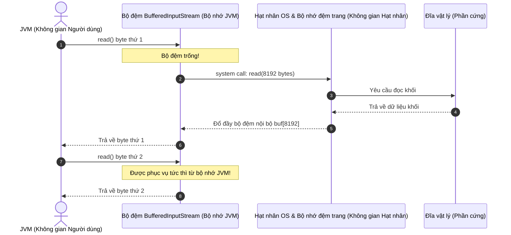

# I/O trong Java - Phần 2

## Ghi Chú Chi Tiết

### Các Luồng Đệm - Byte Buffering (Buffered Streams)

Việc đọc hoặc ghi trực tiếp một tệp theo từng byte thông qua `FileInputStream` hoặc `FileOutputStream` gây ra chi phí rất lớn do các lời gọi hệ thống (system call) đến hệ điều hành diễn ra liên tục.
* `BufferedInputStream` bọc một `InputStream` hiện có và đọc các khối byte (mặc định 8KB) vào một bộ đệm bộ nhớ nội bộ. Các lần đọc tiếp theo sẽ lấy dữ liệu trực tiếp từ bộ đệm này.
* `BufferedOutputStream` tích lũy các byte đã ghi vào một bộ đệm và chỉ đẩy (flush) chúng ra đĩa khi bộ đệm đầy, luồng bị đóng, hoặc phương thức `flush()` được gọi một cách tường minh.

## Tại Sao Các Luồng Đệm Lại Có Hiệu Năng Vượt Trội Hơn Hẳn Luồng Thô

Các hoạt động I/O trực tiếp (như `FileInputStream.read()` hoặc `FileOutputStream.write()`) cực kỳ chậm vì mỗi cuộc gọi đọc/ghi sẽ kích hoạt một quá trình chuyển đổi ngữ cảnh (context switch) từ không gian người dùng (user space) sang không gian hạt nhân (kernel space), yêu cầu một lời gọi hệ thống (`read(2)` hoặc `write(2)`) để tương tác với bộ điều khiển đĩa vật lý hoặc hệ thống tệp. Các lời gọi hệ thống yêu cầu CPU lưu lại các thanh ghi, chuyển đổi bảng trang và thực thi mã xử lý của hạt nhân, điều này tiêu tốn rất nhiều chu kỳ CPU. `BufferedInputStream` bọc một luồng thô và đọc một khối byte lớn (mặc định 8.192 byte hoặc 8KB) chỉ trong một lời gọi hệ thống duy nhất vào một mảng byte nội bộ (`buf`). Các lời gọi `read()` tiếp theo được phục vụ trực tiếp từ bộ đệm bộ nhớ này, loại bỏ 99.9% các lần chuyển đổi ngữ cảnh chế độ từ người dùng sang hạt nhân. Kích thước bộ đệm 8KB được lựa chọn vì nó phù hợp với kích thước trang đĩa (disk page size) của hệ điều hành hiện đại (thường là 4KB hoặc 8KB), đảm bảo rằng một lần đọc bộ đệm của JVM khớp với một yêu cầu khối (block request) duy nhất của hệ điều hành từ ổ lưu trữ vật lý, giúp tối ưu hóa việc sử dụng bộ nhớ đệm trang (page cache) của hệ điều hành.

### Cơ Chế Đệm Giữa Không Gian Người Dùng và Không Gian Hạt Nhân



### Demo Mã Nguồn: Đo Hiệu Năng Giữa Luồng Thô và Luồng Đệm

```java
import java.io.*;

public class BufferingPerformanceDemo {
    public static void main(String[] args) throws IOException {
        File tempFile = File.createTempFile("benchmark", ".bin");
        tempFile.deleteOnExit();
        
        // Generate a 1MB test file
        try (FileOutputStream fos = new FileOutputStream(tempFile)) {
            byte[] data = new byte[1024 * 1024]; // 1MB
            fos.write(data);
        }

        // Test 1: Raw FileInputStream (Byte-by-Byte)
        long start = System.nanoTime();
        try (FileInputStream fis = new FileInputStream(tempFile)) {
            int b;
            while ((b = fis.read()) != -1) {
                // Process byte
            }
        }
        long rawDuration = System.nanoTime() - start;

        // Test 2: BufferedInputStream (Byte-by-Byte out of buffer)
        start = System.nanoTime();
        try (BufferedInputStream bis = new BufferedInputStream(new FileInputStream(tempFile))) {
            int b;
            while ((b = bis.read()) != -1) {
                // Process byte
            }
        }
        long bufferedDuration = System.nanoTime() - start;

        System.out.println("Raw FileInputStream Duration: " + (rawDuration / 1_000_000.0) + " ms");
        System.out.println("BufferedInputStream Duration: " + (bufferedDuration / 1_000_000.0) + " ms");
    }
}
```

### Chuỗi Nguyên Nhân - Kết Quả Về Chuyển Đổi Ngữ Cảnh Và I/O Đĩa

```text
Lời gọi đến fis.read() 
  ↳ CPU lưu trạng thái không gian người dùng & chuyển đổi ngữ cảnh sang không gian hạt nhân
    ↳ OS thực hiện lời gọi hệ thống read(2) & lấy khối vật lý từ đĩa
      ↳ Dữ liệu được nạp vào page cache của OS & sao chép vào bộ nhớ JVM
        ↳ CPU chuyển đổi ngữ cảnh trở lại không gian người dùng (chi phí hiệu năng cực lớn)

Lời gọi đến bis.read()
  ↳ Kiểm tra mảng bộ nhớ nội bộ (buf)
    ↳ Nếu có sẵn, trả về byte ngay lập tức (bỏ qua các lời gọi hệ thống và việc chuyển đổi ngữ cảnh hạt nhân OS)
```

```java
// Wrapping file stream with buffered stream
try (BufferedInputStream bis = new BufferedInputStream(new FileInputStream("input.dat"));
     BufferedOutputStream bos = new BufferedOutputStream(new FileOutputStream("output.dat"))) {
    int data;
    while ((data = bis.read()) != -1) {
        bos.write(data);
    }
} catch (IOException e) {
    e.printStackTrace();
}
```

### Reader & Writer (Luồng Ký Tự - Character Streams)

Trong khi các luồng byte làm việc with các byte thô (`8-bit`), các luồng ký tự được thiết kế riêng cho dữ liệu ký tự (`16-bit` Unicode). Chúng tự động dịch các byte thành ký tự bằng cách sử dụng các bảng mã ký tự (character set) (như UTF-8).
* `Reader` và `Writer` là các lớp cơ sở trừu tượng.
* `FileReader` và `FileWriter` đọc/ghi trực tiếp các ký tự từ/vào tệp.

### BufferedReader & BufferedWriter
* `BufferedReader` đệm một luồng ký tự và cung cấp phương thức `readLine()`, giúp đọc một dòng văn bản được kết thúc bởi ký tự xuống dòng (`\n`) hoặc ký tự về đầu dòng (`\r`).
* `BufferedWriter` đệm đầu ra ký tự và cung cấp phương thức `newLine()`, giúp ghi ký tự xuống dòng phụ thuộc vào hệ thống cụ thể.

```java
import java.io.BufferedReader;
import java.io.BufferedWriter;
import java.io.FileReader;
import java.io.FileWriter;
import java.io.IOException;

public class CharacterFileCopy {
    public static void main(String[] args) {
        try (BufferedReader reader = new BufferedReader(new FileReader("input.txt"));
             BufferedWriter writer = new BufferedWriter(new FileWriter("output.txt"))) {
             
            String line;
            while ((line = reader.readLine()) != -1) {
                writer.write(line);
                writer.newLine(); // Platform-independent line break
            }
            System.out.println("Text file copied.");
        } catch (IOException e) {
            e.printStackTrace();
        }
    }
}
```

---

## Ví Dụ Thực Tế: So Sánh Hiệu Năng Có Đệm Và Không Có Đệm

### Vấn đề
Đọc một tệp lớn (ví dụ: 5MB) theo từng byte bằng cách sử dụng `FileInputStream` thô so với `BufferedInputStream`. Chúng ta muốn quan sát lý do tại sao đệm dữ liệu lại thiết yếu đối với hiệu năng I/O.

### Mô Phỏng Đo Hiệu Năng & Cơ Chế
* **Không có đệm**: Mỗi lời gọi `FileInputStream.read()` sẽ kích hoạt một lời gọi hệ thống (`read(2)`) để yêu cầu 1 byte từ hệ điều hành. Điều này làm cho CPU phải chuyển đổi ngữ cảnh giữa không gian người dùng và không gian hạt nhân 5.000.000 lần.
* **Có đệm**: `BufferedInputStream` yêu cầu 8.192 byte từ hệ điều hành chỉ trong một lời gọi hệ thống duy nhất. 8.191 lần gọi `read()` tiếp theo được phản hồi tức thì từ bộ nhớ, giảm chi phí lời gọi hệ thống đi `99.98%`.

```java
// Performance test simulation code
long startTime = System.currentTimeMillis();
try (FileInputStream fis = new FileInputStream("largeFile.bin")) {
    while (fis.read() != -1) {} // Raw byte read
}
long rawTime = System.currentTimeMillis() - startTime;

startTime = System.currentTimeMillis();
try (BufferedInputStream bis = new BufferedInputStream(new FileInputStream("largeFile.bin"))) {
    while (bis.read() != -1) {} // Buffered read
}
long bufferedTime = System.currentTimeMillis() - startTime;

System.out.println("Raw stream time: " + rawTime + " ms");       // e.g., 4200 ms
System.out.println("Buffered stream time: " + bufferedTime + " ms"); // e.g., 15 ms
```

---

## Các Lỗi Thường Gặp

### 1. Sử Dụng Luồng Ký Tự Cho Các Tệp Nhị Phân (Gây Hỏng Ảnh)

`FileReader` / `FileWriter` được thiết kế cho văn bản mà con người có thể đọc được. Chúng dịch dữ liệu nhị phân thành các ký tự Unicode bằng cách sử dụng bảng mã mặc định hoặc bảng mã được chỉ định. Nếu bạn cố gắng sao chép một tệp `.png` hoặc `.zip` bằng `FileReader`/`FileWriter`, trình ánh xạ ký tự sẽ thay thế các chuỗi byte không hợp lệ bằng các ký tự thay thế (như `?` hoặc `\uFFFD`), làm hỏng dữ liệu đầu ra.
* **Quy tắc**: Luôn sử dụng các luồng byte (`InputStream` / `OutputStream`) cho các tệp nhị phân.

### 2. Quên Không flush() Các Luồng Đệm

Dữ liệu được ghi vào `BufferedOutputStream` hoặc `BufferedWriter` được lưu trữ trong bộ nhớ. Nếu chương trình bị crash hoặc luồng không được đóng đúng cách, dữ liệu được đệm có thể sẽ không bao giờ được ghi xuống đĩa.
* **Cách khắc phục**: Đảm bảo các luồng được đóng (tự động đẩy - auto-flush) bằng cách sử dụng khối try-with-resources, hoặc gọi `flush()` một cách thủ công nếu luồng bắt buộc phải mở tiếp.

## Liên Kết Tham Khảo (Reference Links)

- https://docs.oracle.com/en/java/javase/21/docs/api/java.base/java/io/BufferedInputStream.html (Tài liệu API BufferedInputStream)
- https://docs.oracle.com/en/java/javase/21/docs/api/java.base/java/io/BufferedOutputStream.html (Tài liệu API BufferedOutputStream)
