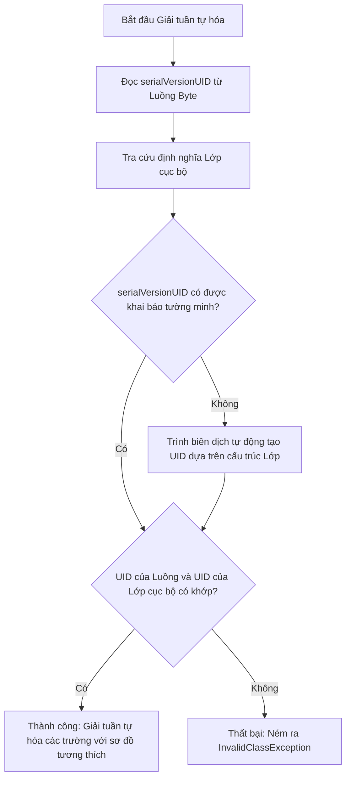
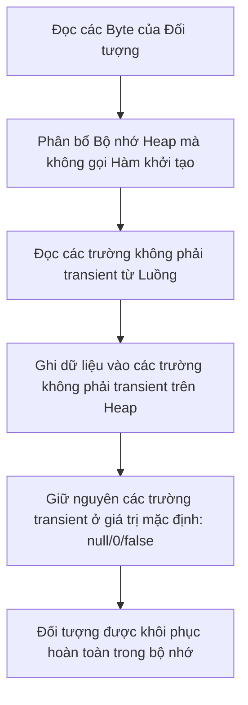
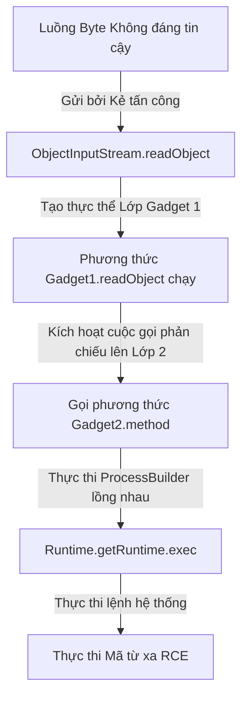

# Vào/Ra (IO) trong Java - Phần 3

## Mục Tiêu Học Tập

Tài liệu này tập trung vào một phần chuyên sâu của **Vào/Ra (IO) trong Java**. Hãy nghiên cứu từng khái niệm dưới dạng quy tắc thực tế trong Java, không chỉ đơn thuần là lý thuyết từ vựng.

## Tóm Tắt Nội Dung (Outline Coverage)

- **`Serialization`** — Quá trình chuyển đổi trạng thái của một đối tượng thành một luồng byte để có thể lưu vào tệp hoặc gửi qua mạng.
- **`Deserialization`** — Quá trình tái cấu trúc một đối tượng từ một luồng byte đã tuần tự hóa.
- **`Serializable`** — Một giao diện đánh dấu (không có phương thức) bắt buộc phải được triển khai bởi một lớp để các thực thể của nó đủ điều kiện tuần tự hóa.
- **`serialVersionUID`** — Một mã nhận diện 64-bit duy nhất được sử dụng trong quá trình giải tuần tự hóa để xác minh rằng bên gửi và bên nhận của đối tượng tuần tự hóa đã tải các lớp tương thích với nó.
- **`transient`** — Một từ khóa sửa đổi trường cho biết rằng biến đó không được tuần tự hóa; giá trị của nó được khôi phục về giá trị mặc định (ví dụ: `null` hoặc `0`) trong quá trình giải tuần tự hóa.
- **`Scanner`** — Một lớp tiện ích quét văn bản dùng để phân tích cú pháp các kiểu dữ liệu nguyên thủy và chuỗi bằng cách sử dụng biểu thức chính quy (regular expression) từ một luồng vào hoặc chuỗi.
- **`System.in`** — Luồng vào tiêu chuẩn (thực thể của `InputStream`), thường được ánh xạ tới đầu vào từ bàn phím.
- **`System.out`** — Luồng ra tiêu chuẩn (thực thể của `PrintStream`), thường được ánh xạ tới đầu ra console.
- **`System.err`** — Luồng lỗi tiêu chuẩn (thực thể của `PrintStream`), được sử dụng để in các thông báo lỗi ra console ngay lập tức.

## Ghi Chú Chi Tiết

### Tuần tự hóa & Giải tuần tự hóa (Serialization & Deserialization)
Cơ chế tuần tự hóa đối tượng trong Java cho phép lập trình viên lưu trạng thái của một đồ thị đối tượng (Object graph) thành một luồng byte và tái cấu trúc lại nó sau đó.
* Để một lớp có thể tuần tự hóa, nó phải triển khai giao diện `java.io.Serializable`.
* Các trường tĩnh (`static`) đại diện cho trạng thái cấp lớp, không phải trạng thái cấp đối tượng, và chúng **không** được tuần tự hóa.
* Nếu một đối tượng tham chiếu đến các đối tượng khác, toàn bộ đồ thị đối tượng sẽ được tuần tự hóa. Tất cả các lớp được tham chiếu cũng phải triển khai `Serializable`, nếu không ngoại lệ `NotSerializableException` sẽ bị ném ra tại thời điểm chạy.

```java
import java.io.Serializable;

public class User implements Serializable {
    private static final long serialVersionUID = 1L; // Recommended explicit definition
    
    private String username;
    private transient String password; // Will not be serialized!
    
    public User(String username, String password) {
        this.username = username;
        this.password = password;
    }
    
    @Override
    public String toString() {
        return "User{username='" + username + "', password='" + password + "'}";
    }
}
```

## Tại sao serialVersionUID là Cực kỳ Quan trọng đối với Sự Tương thích Phiên bản Lớp

Nếu một lớp `Serializable` không khai báo `serialVersionUID` một cách tường minh, trình biên dịch Java sẽ tự động tạo ra một mã băm 64-bit tại thời điểm biên dịch bằng thuật toán SHA-1 dựa trên các mô tả lớp (như tên lớp, giao diện, các trường dữ liệu và chữ ký phương thức). Nếu sau đó lập trình viên thực hiện bất kỳ sửa đổi nhỏ nào đối với lớp đó—chẳng hạn như thêm một phương thức trợ giúp, thay đổi phạm vi truy cập của một trường, hoặc thậm chí là thay đổi phiên bản trình biên dịch—trình biên dịch sẽ tạo ra một giá trị `serialVersionUID` mặc định hoàn toàn khác cho lớp đã cập nhật. Khi JVM cố gắng giải tuần tự hóa một luồng byte đã lưu trữ trước đó, nó sẽ so sánh mã nhận diện lớp của luồng byte với `serialVersionUID` của lớp cục bộ. Nếu chúng không khớp, JVM sẽ lập tức hủy bỏ quá trình và ném ra ngoại lệ `InvalidClassException`, ngay cả khi các thay đổi đó hoàn toàn có khả năng tương thích ngược. Bằng cách khai báo `private static final long serialVersionUID` một cách tường minh, lập trình viên sẽ cố định phiên bản của lớp, báo hiệu cho cơ chế tuần tự hóa của JVM rằng các lớp này tương thích với nhau. Điều này cho phép lớp tiến hóa, chẳng hạn như thêm các trường mới (sẽ được giải tuần tự hóa về giá trị mặc định của chúng) hoặc loại bỏ các trường (sẽ bị bỏ qua ngầm) mà không làm hỏng kho dữ liệu đã tuần tự hóa hiện có.

### Logic So khớp khi Tiến hóa Lớp



### Ví dụ Code: Hành vi khi Không khớp Phiên bản

Ví dụ sau đây mô phỏng sự tiến hóa của lớp khi việc thiếu `serialVersionUID` tường minh sẽ kích hoạt lỗi không khớp phiên bản.

```java
// Phiên bản 1 của Lớp (được lưu vào tệp)
// public class Profile implements Serializable {
//     String name;
// } // UID tự động tạo: ví dụ, 4278198327498L

// Phiên bản 2 của Lớp (cố gắng đọc dữ liệu của Phiên bản 1)
import java.io.*;

public class Profile implements Serializable {
    // Thiếu serialVersionUID tường minh!
    String name;
    String email; // Việc thêm trường làm thay đổi cấu trúc lớp, đổi UID tự động tạo thành 983179237498L
    
    public static void main(String[] args) {
        try (ObjectInputStream ois = new ObjectInputStream(new FileInputStream("profile.ser"))) {
            Profile p = (Profile) ois.readObject(); // Ném ra InvalidClassException do lệch UID
        } catch (Exception e) {
            System.out.println("Exception: " + e.toString());
            // Output: Exception: java.io.InvalidClassException: Profile; local class incompatible: 
            // stream classdesc serialVersionUID = 4278198327498, local class serialVersionUID = 983179237498
        }
    }
}
```

### Chuỗi Nguyên nhân - Kết quả của việc Không khớp Phiên bản

```
Cấu trúc lớp bị sửa đổi (thêm trường) 
  ↳ Trình biên dịch tính toán lại chữ ký SHA-1 của Lớp
    ↳ serialVersionUID của lớp cục bộ thay đổi so với serialVersionUID trong luồng byte
      ↳ ObjectInputStream so sánh UID của Luồng và UID của Lớp cục bộ
        ↳ Phát hiện không khớp -> Hủy bỏ giải tuần tự hóa -> Ném ra InvalidClassException
```

## Tại sao các Trường transient bị Loại trừ khỏi Tuần tự hóa và Cách Giải tuần tự hóa Khôi phục Chúng

Từ khóa `transient` là một từ khóa bổ trợ trường dữ liệu dùng để báo cho cơ chế tuần tự hóa biết cần bỏ qua trường này khi chuyển đổi một đối tượng thành một luồng byte. Điều này cực kỳ quan trọng để loại trừ các thông tin bảo mật nhạy cảm (như mật khẩu hoặc khóa riêng tư) hoặc các tài nguyên gắn liền với thời điểm chạy (như mô tả tệp đang mở, kết nối cơ sở dữ liệu, hoặc khóa luồng - thread lock) vốn không có ý nghĩa gì bên ngoài phiên chạy hiện tại của JVM. Trong quá trình giải tuần tự hóa, JVM **không** gọi hàm khởi tạo tiêu chuẩn của lớp để tạo thực thể đối tượng. Thay vào đó, nó phân bổ bộ nhớ thô cho đối tượng trên Heap và trực tiếp đổ dữ liệu vào các trường không phải transient bằng các giá trị tìm thấy trong luồng byte đã tuần tự hóa. Vì luồng byte không chứa dữ liệu hay mục nhập nào cho các trường `transient`, JVM sẽ bỏ qua them, để mặc chúng được khởi tạo về các giá trị mặc định của kiểu dữ liệu (chẳng hạn như `null` cho các tham chiếu đối tượng, `0` cho các kiểu nguyên thủy số, và `false` cho kiểu boolean). Điều quan trọng là, các bộ khởi tạo trường nội tuyến (Inline field initializer) và các khối khởi tạo thực thể (Instance initializer block) đều bị bỏ qua trong giai đoạn phân bổ bộ nhớ này, nghĩa là ngay cả khi một trường transient được khai báo với một giá trị nội tuyến (ví dụ: `private transient int age = 21;`), giá trị của nó sau khi giải tuần tự hóa vẫn sẽ quay về `0` hoặc `null`.

### Luồng Khởi tạo Bộ nhớ trong quá trình Giải tuần tự hóa



### Ví dụ Code: Bỏ qua Hàm khởi tạo và Bộ khởi tạo

```java
import java.io.*;

public class TransientDemo implements Serializable {
    private static final long serialVersionUID = 1L;
    
    private String name;
    private transient int age = 21; // Bộ khởi tạo nội tuyến
    private transient String status;
    
    public TransientDemo(String name) {
        System.out.println("Constructor called!");
        this.name = name;
        this.status = "Active";
    }

    public static void main(String[] args) throws Exception {
        ByteArrayOutputStream baos = new ByteArrayOutputStream();
        try (ObjectOutputStream oos = new ObjectOutputStream(baos)) {
            TransientDemo demo = new TransientDemo("Alice"); // Output: Constructor called!
            oos.writeObject(demo);
        }
        
        try (ObjectInputStream ois = new ObjectInputStream(new ByteArrayInputStream(baos.toByteArray()))) {
            TransientDemo restored = (TransientDemo) ois.readObject();
            // Hàm khởi tạo KHÔNG được gọi trong quá trình readObject()!
            System.out.println("Restored Name: " + restored.name);     // Alice
            System.out.println("Restored Age: " + restored.age);       // 0 (Bộ khởi tạo nội tuyến bị bỏ qua!)
            System.out.println("Restored Status: " + restored.status); // null (Phép gán trong hàm khởi tạo bị bỏ qua!)
        }
    }
}
```

### Chuỗi Nguyên nhân - Kết quả của việc Khôi phục Trường transient

```
Đối tượng được giải tuần tự hóa từ luồng
  ↳ JVM tạo thực thể lớp trực tiếp trên heap (bỏ qua hàm khởi tạo, bộ khởi tạo nội tuyến và các khối khởi tạo thực thể)
    ↳ JVM đọc và ghi các trường không phải transient từ luồng byte
      ↳ Các trường transient không tồn tại trong luồng byte
        ↳ Các trường transient giữ nguyên các giá trị mặc định của JVM (null đối với đối tượng, 0 đối với số nguyên)

> Xem thêm: Các đặc điểm của từ khóa transient và các non-access modifier khác, được trình bày chi tiết trong [Ch.10 - Access Modifiers](../../no10_modifiers/theory/02-abstract-concepts.md).
```

## Tại sao Tuần tự hóa trong Java là một Lỗ hổng Bảo mật và Cách các Giải pháp Thay thế Hiện đại Giảm thiểu Nó

Cơ chế tuần tự hóa gốc của Java là một lỗ hổng bảo mật lớn vì phương thức `ObjectInputStream.readObject()` là một bộ giải tuần tự hóa kiểu "xem trước (Look-ahead)" tạo ra các đồ thị đối tượng tùy ý trước khi ứng dụng xác minh các kiểu dữ liệu đang được tạo thực thể. Khi một ứng dụng chấp nhận và giải tuần tự hóa các luồng byte không đáng tin cậy từ các nguồn bên ngoài, kẻ tấn công có thể xây dựng một gói tin chứa một "chuỗi gadget (Gadget chain)"—a sequence of nested objects that exploit existing library classes (gadgets) on the classpath. Trong quá trình giải tuần tự hóa, JVM sẽ tự động gọi các phương thức vòng đời như `readObject()`, `readResolve()`, hoặc `finalize()` trên các đối tượng này. Bằng cách lồng ghép các lớp này, kẻ tấn công có thể kích hoạt các thao tác phản chiếu dẫn đến việc thực thi các lệnh shell trên hệ thống máy chủ, gây ra lỗi Thực thi Mã từ xa (Remote Code Execution - RCE). Để giảm thiểu lỗ hổng này, Java 9 đã giới thiệu các bộ lọc tuần tự hóa (`ObjectInputFilter`) để giới hạn những lớp nào được phép giải tuần tự hóa. Tuy nhiên, các thiết kế ứng dụng hiện đại ưa chuộng các định dạng tuần tự hóa chỉ chứa dữ liệu như JSON, Protocol Buffers, hoặc FlatBuffers, vốn không tuần tự hóa siêu dữ liệu thực thi hoặc các lớp động, giúp tách biệt việc phân tích cú pháp dữ liệu khỏi việc thực thi mã.

### Khai thác RCE qua Chuỗi Gadget khi Giải tuần tự hóa



### Ví dụ Code: Giải pháp Thay thế An toàn (Tuần tự hóa Chỉ Dữ liệu JSON)

Sử dụng Jackson hoặc các bộ phân tích cú pháp chỉ chứa dữ liệu tương tự giúp loại bỏ việc thực thi gadget vì chúng chỉ đọc các trường trạng thái, không bao giờ tự động tạo thực thể cho các cấu hình lớp tùy ý từ luồng dữ liệu.

```java
// Biểu diễn dữ liệu an toàn
public class UserDTO {
    public String username;
    public String role;
    
    // Custom JSON serialization does not contain dynamic class loaders or executable metadata
    // Input format: {"username":"alice", "role":"admin"}
}
```

### Chuỗi Nguyên nhân - Kết quả của Lỗ hổng Giải tuần tự hóa

```
Nhận luồng byte không đáng tin cậy
  ↳ ObjectInputStream.readObject() tạo thực thể các lớp bằng phản chiếu trước khi xác thực kiểu dữ liệu
    ↳ Phương thức vòng đời (ví dụ: readObject) được gọi tự động trên lớp thuộc classpath
      ↳ Các thuộc tính lồng nhau kích hoạt một chuỗi các cuộc gọi (Chuỗi Gadget)
        ↳ Thực thi phương thức phản chiếu -> Tạo ProcessBuilder -> Hệ thống bị tấn công RCE
```

### Ví dụ Code Tuần tự hóa và Giải tuần tự hóa
Chúng ta ghi đối tượng bằng `ObjectOutputStream` và đọc lại bằng `ObjectInputStream`.

```java
import java.io.*;

public class SerializationDemo {
    public static void main(String[] args) {
        User user = new User("alice", "secret123");
        File file = new File("user.ser");
        
        // 1. Serialize
        try (ObjectOutputStream oos = new ObjectOutputStream(new FileOutputStream(file))) {
            oos.writeObject(user);
            System.out.println("Object serialized: " + user);
        } catch (IOException e) {
            e.printStackTrace();
        }
        
        // 2. Deserialize
        try (ObjectInputStream ois = new ObjectInputStream(new FileInputStream(file))) {
            User deserializedUser = (User) ois.readObject();
            System.out.println("Object deserialized: " + deserializedUser);
            // Prints: User{username='alice', password='null'} (password was transient!)
        } catch (IOException | ClassNotFoundException e) {
            e.printStackTrace();
        }
    }
}
```

### Scanner & Hệ thống Vào/Ra (System I/O)
* `System.in`, `System.out`, và `System.err` được mở bởi JVM khi ứng dụng khởi động.
* `Scanner` có thể bao bọc `System.in` để đọc dữ liệu nhập vào từ console của người dùng.
* **Quan trọng**: Việc đóng một `Scanner` đang bao bọc `System.in` sẽ đóng luôn luồng `System.in` bên dưới. Một khi đã đóng, bạn không thể đọc dữ liệu từ `System.in` được nữa trong suốt thời gian chạy còn lại của JVM.

```java
import java.util.Scanner;

public class ConsoleInput {
    public static void main(String[] args) {
        Scanner scanner = new Scanner(System.in);
        System.out.print("Enter your name: ");
        if (scanner.hasNextLine()) {
            String name = scanner.nextLine();
            System.out.println("Hello, " + name);
        }
        // Avoid closing scanner if you need System.in elsewhere in the app!
    }
}
```

---

## Ví Dụ Thực Tế: Tùy chỉnh Tuần tự hóa

### Bài toán
Chúng ta muốn mã hóa một trường nhạy cảm (như `password`) khi tuần tự hóa, và giải mã nó khi giải tuần tự hóa, để nó không bị lưu trữ dưới dạng văn bản thuần túy (plaintext) bên trong tệp `.ser`.

### Triển khai
Chúng ta có thể định nghĩa các phương thức riêng tư `writeObject` và `readObject` bên trong lớp `Serializable`. Cơ chế tuần tự hóa của Java tìm kiếm các phương thức này qua phản chiếu và gọi chúng thay vì sử dụng cơ chế mặc định.

```java
import java.io.IOException;
import java.io.ObjectInputStream;
import java.io.ObjectOutputStream;
import java.io.Serializable;
import java.util.Base64;

public class SecureUser implements Serializable {
    private static final long serialVersionUID = 2L;
    
    private String username;
    private String password; // Sẽ được tuần tự hóa, nhưng được mã hóa!

    public SecureUser(String username, String password) {
        this.username = username;
        this.password = password;
    }

    private void writeObject(ObjectOutputStream oos) throws IOException {
        // Run default serialization for non-custom fields
        oos.defaultWriteObject();
        // Encrypt the password using simple Base64 for demo (use real cipher in production)
        String encryptedPassword = Base64.getEncoder().encodeToString(password.getBytes());
        oos.writeObject(encryptedPassword);
    }

    private void readObject(ObjectInputStream ois) throws IOException, ClassNotFoundException {
        // Run default deserialization
        ois.defaultReadObject();
        // Read the encrypted password and decrypt it
        String encryptedPassword = (String) ois.readObject();
        this.password = new String(Base64.getDecoder().decode(encryptedPassword));
    }
}
```

---

## Các lỗi thường gặp

### 1. Thiếu `serialVersionUID` Tường Minh
Nếu bạn không chỉ định `serialVersionUID` một cách tường minh, trình biên dịch Java sẽ tự động tính toán một giá trị tại thời điểm biên dịch dựa trên chi tiết của lớp (trường, phương thức). Nếu bạn sửa đổi lớp (ví dụ: thêm một phương thức nhỏ), giá trị được tính toán này sẽ thay đổi. Khi giải tuần tự hóa dữ liệu cũ hơn, Java sẽ ném ra ngoại lệ `InvalidClassException`.
* **Khắc phục**: Luôn định nghĩa `private static final long serialVersionUID = 1L;` một cách tường minh.

### 2. Cạm bẫy Hàm khởi tạo Lớp cha không có tính năng Tuần tự hóa
Nếu một lớp con triển khai `Serializable` nhưng lớp cha của nó thì **không**, trạng thái của lớp cha sẽ không được tuần tự hóa. Trong quá trình giải tuần tự hóa, Java bắt buộc phải khởi tạo trạng thái của lớp cha bằng cách gọi **hàm khởi tạo không có tham số** của nó. Nếu lớp cha không định nghĩa hàm khởi tạo không tham số, quá trình giải tuần tự hóa sẽ thất bại tại thời điểm chạy với ngoại lệ `InvalidClassException`.

### 3. Đóng Scanner đang bao bọc `System.in`
Việc đóng scanner này sẽ đóng luôn `System.in`.
```java
Scanner s1 = new Scanner(System.in);
s1.close(); // Đóng System.in!

Scanner s2 = new Scanner(System.in);
// s2.nextLine(); // Ném ra NoSuchElementException vì System.in đã bị đóng!
```

## Liên kết Tham khảo

- https://docs.oracle.com/en/java/javase/21/docs/api/java.base/java/io/Serializable.html (Tài liệu Serializable API)
- https://docs.oracle.com/en/java/javase/21/docs/api/java.base/java/io/ObjectInputStream.html (Tài liệu ObjectInputStream API)
- https://docs.oracle.com/javase/specs/jls/se21/html/jls-14.html#jls-14.21 (JLS Các câu lệnh không thể tiếp cận)
