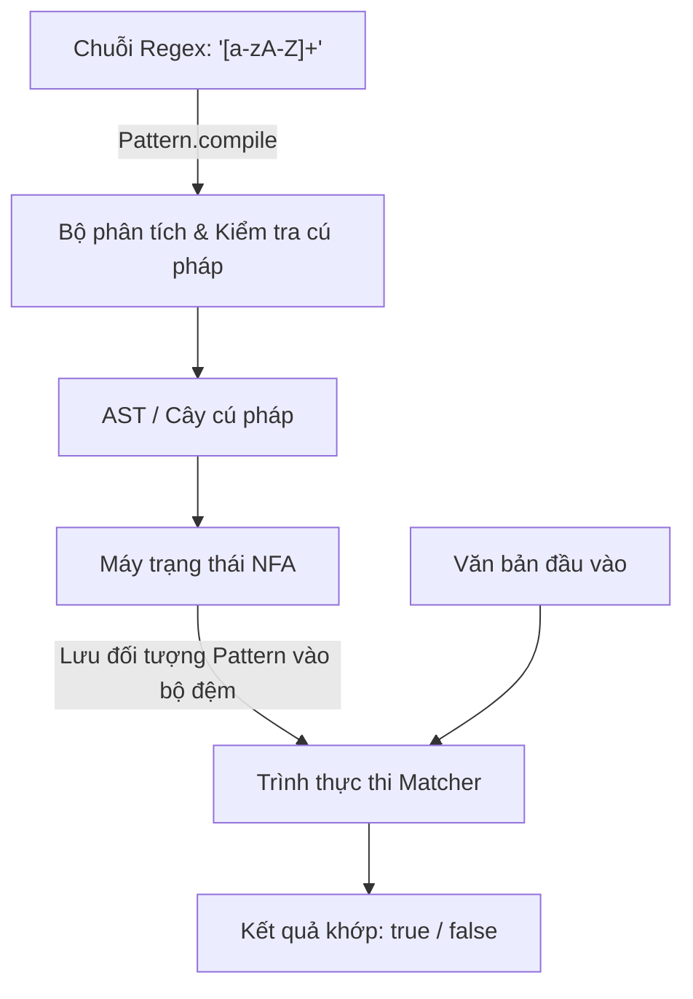

# Biểu Thức Chính Quy - Phần 1 (Regular Expression - Part 1)

## Khung Nội Dung (Outline Coverage)

---

## Ghi Chú Chi Tiết (Detailed Notes)

### Biểu thức chính quy (Regex) là gì?

Biểu thức chính quy (regular expression - regex) là một ngôn ngữ mẫu dùng để so khớp, tìm kiếm và xử lý văn bản. Trong Java, các biểu thức chính quy được hỗ trợ sẵn thông qua gói `java.util.regex`, chủ yếu qua hai lớp `Pattern` và `Matcher`, cũng như qua các phương thức tiện ích trong lớp `java.lang.String` (như `matches`, `replaceAll`, và `split`).

#### Ví Dụ Mã Nguồn: Xác minh Regex cơ bản
```java
public class RegexIntro {
    public static void main(String[] args) {
        String input = "Java17";
        // Kiểm tra xem chuỗi đầu vào có bắt đầu bằng các chữ cái và kết thúc bằng các chữ số hay không
        boolean isMatch = input.matches("[a-zA-Z]+\\d+");
        System.out.println("Matches: " + isMatch); // In ra: true
    }
}
```

---

### Pattern (Đối tượng Mẫu)

`java.util.regex.Pattern` là biểu diễn đã được biên dịch của một biểu thức chính quy. Việc biên dịch một biểu thức chính quy là một thao tác tốn kém hiệu năng vì hệ thống phải phân tích cú pháp chuỗi regex thành một cây cú pháp và xây dựng một máy trạng thái.

- **Tính Bất Biến và An Toàn Đa Luồng**: Các thực thể `Pattern` hoàn toàn bất biến (immutable) và an toàn luồng (thread-safe). Bạn nên biên dịch mẫu một lần duy nhất và lưu trữ nó trong một trường `static final` để tái sử dụng trên nhiều luồng khác nhau.
- **Cờ Biên Dịch (Compilation Flags)**: Bạn có thể truyền các cờ cấu hình vào phương thức `Pattern.compile(regex, flags)`, ví dụ như `Pattern.CASE_INSENSITIVE` (không phân biệt hoa thường), `Pattern.MULTILINE` (nhiều dòng), hoặc `Pattern.DOTALL`.

#### Ví Dụ Mã Nguồn: Mẫu Pattern được lưu vào Bộ nhớ đệm (Cache)
```java
import java.util.regex.Pattern;

public class UserValidator {
    // Biên dịch một lần và tái sử dụng để tránh chi phí hiệu năng trong các vòng lặp hoặc các luồng đồng thời
    private static final Pattern USERNAME_PATTERN = 
        Pattern.compile("^[a-z0-9_-]{3,16}$", Pattern.CASE_INSENSITIVE);

    public static boolean isValidUsername(String username) {
        if (username == null) return false;
        return USERNAME_PATTERN.matcher(username).matches();
    }
}
```

#### Sai lầm thường gặp
Biên dịch lại `Pattern` bên trong một phương thức được gọi thường xuyên (ví dụ: bên trong vòng lặp hoặc trình xử lý dịch vụ). Điều này làm giảm nghiêm trọng hiệu năng hệ thống vì JVM phải phân tích lại biểu thức chính quy trong mỗi lần gọi phương thức.
```java
// SAI: Biên dịch lại mẫu trong mỗi lần gọi phương thức!
public boolean badValidate(String email) {
    return Pattern.compile("^[A-Z0-9._%+-]+@[A-Z0-9.-]+\\.[A-Z]{2,6}$", Pattern.CASE_INSENSITIVE)
                  .matcher(email)
                  .matches();
}
```

## Tại Sao Việc Biên Dịch Pattern Lại Tốn Kém Hiệu Năng

Biên dịch một biểu thức chính quy không đơn giản là kiểm tra từng ký tự một. Bên dưới lớp vỏ, khi `Pattern.compile(regex)` được gọi, công cụ regex sẽ phân tích chuỗi regex thành một cây cú pháp trừu tượng (Abstract Syntax Tree - AST) để kiểm tra tính hợp lệ của cú pháp. Tiếp theo, nó biên dịch cây này thành một máy trạng thái hữu hạn không đơn định (Non-deterministic Finite Automaton - NFA). Quá trình biên dịch này tiêu tốn nhiều năng lượng CPU và bộ nhớ do phải cấp phát vô số đối tượng nút (node objects), xây dựng các bước chuyển đổi trạng thái và tối ưu hóa cấu trúc máy trạng thái kết quả. Do chi phí biên dịch cao này, việc biên dịch lại một mẫu bên trong một vòng lặp hoạt động liên tục hoặc một phương thức được gọi thường xuyên sẽ làm giảm đáng kể băng thông xử lý; mẫu nên được biên dịch một lần duy nhất và lưu trữ dưới dạng một trường `static final`.

### Mô hình Tư duy: Biên dịch Regex vs. Thực thi



### Ví Dụ Mã Nguồn: Lưu trữ mẫu so với biên dịch tức thời

```java
import java.util.regex.*;

public class PatternCompilationCost {
    // ĐÚNG: Pattern được biên dịch một lần duy nhất khi nạp lớp và được tái sử dụng
    private static final Pattern CACHED_PATTERN = Pattern.compile("^[a-zA-Z]+$");

    // SAI: Biên dịch lại mẫu trong mỗi lần gọi phương thức
    public static boolean badValidate(String text) {
        return Pattern.compile("^[a-zA-Z]+$").matcher(text).matches();
    }

    public static boolean goodValidate(String text) {
        return CACHED_PATTERN.matcher(text).matches(); // Tái sử dụng máy trạng thái NFA
    }

    public static void main(String[] args) {
        System.out.println("Good result: " + goodValidate("Java")); // true
        System.out.println("Bad result: " + badValidate("Java"));   // true
    }
}
```

### Chuỗi Nguyên Nhân - Kết Quả (Cause-Effect Chain)
Gọi `String.matches("regex")` hoặc gọi `Pattern.compile("regex")` trong vòng lặp $\rightarrow$ Công cụ phải phân tích chuỗi mẫu và cấp phát các nút AST $\rightarrow$ JVM biên dịch AST thành máy trạng thái NFA trên heap $\rightarrow$ Quá trình so khớp chạy trên dữ liệu đầu vào $\rightarrow$ Máy trạng thái đã biên dịch bị loại bỏ và thu gom rác $\rightarrow$ Thực thi lặp đi lặp lại gây ra mức sử dụng CPU cao và hiện tượng GC quá tải (GC thrashing).

---

### Matcher (Đối tượng Khớp)

`java.util.regex.Matcher` là công cụ lưu trữ trạng thái thực hiện các thao tác so khớp trên một chuỗi ký tự bằng cách diễn dịch đối tượng `Pattern` đã được biên dịch.

- **Tính Lưu Trạng Thái (Statefulness)**: Khác với `Pattern`, `Matcher` lưu trữ trạng thái rất cao (theo dõi ranh giới vùng khớp, chỉ mục tìm kiếm và các nhóm bắt giữ).
- **An Toàn Đa Luồng**: Các thực thể `Matcher` **không an toàn đa luồng**. Không chia sẻ một thực thể `Matcher` giữa các luồng khác nhau.

#### Ví Dụ Mã Nguồn: Khởi tạo một Matcher
```java
import java.util.regex.Pattern;
import java.util.regex.Matcher;

public class MatcherUsage {
    public static void main(String[] args) {
        Pattern pattern = Pattern.compile("id=\\d+");
        Matcher matcher = pattern.matcher("user: id=4082, role=admin");
        
        if (matcher.find()) {
            System.out.println("Found match: " + matcher.group()); // In ra: "id=4082"
        }
    }
}
```

---

### matches

Phương thức `Matcher.matches()` cố gắng so khớp **toàn bộ** chuỗi đầu vào với mẫu regex.

- **So Khớp Toàn Bộ Nghiêm Ngặt**: Nó chỉ trả về `true` khi và chỉ khi toàn bộ chuỗi khớp hoàn toàn với regex.
- **So sánh với String.matches()**: Lệnh gọi `String.matches(regex)` thực chất gọi `Pattern.matches(regex, input)` bên dưới, tự động biên dịch mẫu và thực hiện thao tác `matches()` toàn phần.
- **So sánh với lookingAt()**: Phương thức `Matcher.lookingAt()` chỉ kiểm tra xem mẫu có khớp tính từ **bắt đầu** của đầu vào hay không, trong khi `Matcher.find()` tìm kiếm mẫu ở **bất kỳ vị trí nào** trong đầu vào.

#### Ví Dụ Mã Nguồn: so sánh matches vs lookingAt vs find
```java
import java.util.regex.Pattern;
import java.util.regex.Matcher;

public class MatchTypes {
    public static void main(String[] args) {
        Pattern p = Pattern.compile("\\d+"); // Khớp với các chữ số
        String text = "123abc456";
        
        Matcher m1 = p.matcher(text);
        System.out.println("matches: " + m1.matches()); // false (toàn bộ chuỗi không chỉ chứa chữ số)
        
        Matcher m2 = p.matcher(text);
        System.out.println("lookingAt: " + m2.lookingAt()); // true (bắt đầu bằng các chữ số "123")
        
        Matcher m3 = p.matcher(text);
        System.out.println("find: " + m3.find()); // true (tìm thấy "123")
        System.out.println("find again: " + m3.find()); // true (tìm thấy "456")
    }
}
```

---

### find

Phương thức `Matcher.find()` quét chuỗi đầu vào để tìm kiếm chuỗi con tiếp theo khớp với mẫu.

- **Lặp lại**: Nó trả về `true` nếu tìm thấy một kết quả khớp và di chuyển con trỏ tìm kiếm đến ngay sau văn bản vừa khớp. Bạn có thể sử dụng nó trong vòng lặp `while (matcher.find())` để trích xuất tất cả các kết quả xuất hiện.
- **Đặt lại**: Gọi `matcher.reset()` sẽ đưa con trỏ tìm kiếm quay lại vị trí bắt đầu của chuỗi đầu vào.
- **Phương thức find có tham số**: Gọi `matcher.find(int start)` sẽ đặt lại matcher và bắt đầu tìm kiếm từ chỉ mục ký tự được chỉ định.

#### Ví Dụ Mã Nguồn: Tìm kiếm tất cả các kết quả xuất hiện
```java
import java.util.regex.Pattern;
import java.util.regex.Matcher;

public class FindAll {
    public static void main(String[] args) {
        Pattern pattern = Pattern.compile("0x[0-9a-fA-F]+"); // Mã thập lục phân (Hex codes)
        Matcher matcher = pattern.matcher("Values: 0x1A, 0xFF, and invalid 0xG1");
        
        while (matcher.find()) {
            System.out.println("Hex found: " + matcher.group() + " at [" + matcher.start() + ", " + matcher.end() + ")");
        }
        // Kết quả in ra:
        // Hex found: 0x1A at [8, 12)
        // Hex found: 0xFF at [14, 18)
    }
}
```

---

### group (Nhóm)

Phương thức `Matcher.group()` trả về chuỗi con đầu vào đã khớp bởi thao tác so khớp trước đó.

- **Chỉ mục 0**: Gọi `matcher.group(0)` hoặc `matcher.group()` trả về toàn bộ đoạn văn bản đã khớp.
- **Nhóm con**: Gọi `matcher.group(i)` trả về văn bản được bắt giữ bởi nhóm bắt giữ thứ $i$ (được đánh số bằng cách đếm các dấu ngoặc đơn mở từ trái sang phải).
- **Tổng số nhóm**: Gọi `matcher.groupCount()` trả về số lượng nhóm bắt giữ được định nghĩa trong mẫu (không bao gồm nhóm toàn bộ 0).

#### Ví Dụ Mã Nguồn: Trích xuất các nhóm bắt giữ
```java
import java.util.regex.Pattern;
import java.util.regex.Matcher;

public class ExtractGroups {
    public static void main(String[] args) {
        Pattern pattern = Pattern.compile("(\\w+):(\\d+)");
        Matcher matcher = pattern.matcher("port:8080 host:9000");
        
        while (matcher.find()) {
            System.out.println("Full match: " + matcher.group(0));
            System.out.println("  Name: " + matcher.group(1));
            System.out.println("  Port: " + matcher.group(2));
        }
    }
}
```

#### Sai lầm thường gặp
Gọi phương thức `matcher.group()` trước khi gọi `find()`, `matches()`, hoặc `lookingAt()`, hoặc sau khi một trong các phương thức này trả về `false`. Hành vi này sẽ ném ra ngoại lệ `IllegalStateException` vì matcher chưa có trạng thái khớp hoạt động.
```java
// SAI: Kích hoạt ngoại lệ IllegalStateException!
Matcher matcher = Pattern.compile("\\d+").matcher("abc 123");
String val = matcher.group(); // Lỗi! Bắt buộc phải gọi matcher.find() trước.
```

---

### Lớp ký tự (Character classes)

Các lớp ký tự chỉ định tập hợp các ký tự có thể khớp tại một vị trí duy nhất trong chuỗi đầu vào.

- **Các lớp ký tự tùy chỉnh**: `[abc]` khớp với `a`, `b`, hoặc `c`. `[^abc]` khớp với bất kỳ ký tự nào ngoại trừ `a`, `b`, hoặc `c`. `[a-z]` khớp với các ký tự chữ cái từ `a` đến `z`.
- **Các lớp ký tự được định nghĩa sẵn**:
  - `.` khớp với bất kỳ ký tự nào (ngoại trừ ký tự xuống dòng, trừ khi cờ `Pattern.DOTALL` được kích hoạt).
  - `\d` khớp với một chữ số `[0-9]`.
  - `\w` khớp với một ký tự chữ-số-gạch-dưới `[a-zA-Z_0-9]`.
  - `\s` khớp với một ký tự khoảng trắng `[ \t\n\x0B\f\r]`.
  - `\D`, `\W`, `\S` là các phủ định tương ứng của `\d`, `\w`, `\s`.
- **Thoát chuỗi kép (Double Escaping)**: Vì ký tự dấu gạch chéo ngược (`\`) có ý nghĩa đặc biệt trong các chuỗi ký tự Java, chúng bắt buộc phải được nhân đôi khi viết mẫu regex dưới dạng chuỗi (ví dụ: `"\\d"` biểu diễn cho lớp ký tự `\d` trong regex đã biên dịch).

#### Ví Dụ Mã Nguồn: Lớp ký tự tùy chỉnh
```java
public class CharacterClasses {
    public static void main(String[] args) {
        // Khớp một nguyên âm, theo sau bởi bất kỳ ký tự nào không phải chữ số
        String regex = "[aeiouAEIOU]\\D"; 
        System.out.println("aX".matches(regex)); // true
        System.out.println("a9".matches(regex)); // false
    }
}
```

---

### Bộ định lượng (Quantifiers)

Các bộ định lượng xác định số lần phần tử phía trước nó được phép so khớp.

- **Các kiểu bộ định lượng**:
  - `?`: Xuất hiện 0 hoặc 1 lần.
  - `*`: Xuất hiện 0 hoặc nhiều lần.
  - `+`: Xuất hiện 1 hoặc nhiều lần.
  - `{n}`: Xuất hiện chính xác $n$ lần.
  - `{n,}`: Xuất hiện ít nhất $n$ lần.
  - `{n,m}`: Xuất hiện từ $n$ đến $m$ lần.
- **Chiến lược so khớp**:
  - **Tham lam (Greedy - mặc định)**: Thử so khớp nhiều ký tự nhất có thể trước, sau đó lùi lại (backtrack) từng ký tự một nếu quá trình so khớp phía sau bị thất bại (ví dụ: `.*A`).
  - **Trì hoãn/Lười (Reluctant/Lazy - thêm ký tự `?`)**: Thử so khớp ít ký tự nhất có thể trước, kiểm tra phần còn lại của mẫu tại mỗi bước chuyển tiếp (ví dụ: `.*?A`).
  - **Chiếm hữu (Possessive - thêm ký tự `+`)**: Khớp nhiều ký tự nhất có thể và **không bao giờ** thực hiện quay lui (ví dụ: `.*+A`).

#### Ví Dụ Mã Nguồn: Hành vi của các bộ định lượng
```java
import java.util.regex.Pattern;
import java.util.regex.Matcher;

public class QuantifierComparison {
    public static void main(String[] args) {
        String text = "abcXdefXghi";
        
        // Tham lam (Greedy): khớp cho đến chữ 'X' CUỐI CÙNG
        Matcher m1 = Pattern.compile("a.*X").matcher(text);
        if (m1.find()) System.out.println("Greedy: " + m1.group()); // "abcXdefX"
        
        // Trì hoãn (Reluctant): khớp cho đến chữ 'X' ĐẦU TIÊN
        Matcher m2 = Pattern.compile("a.*?X").matcher(text);
        if (m2.find()) System.out.println("Reluctant: " + m2.group()); // "abcX"
        
        // Chiếm hữu (Possessive): nuốt trọn toàn bộ chuỗi, không nhường lại ký tự 'X' nào cho ký tự 'X' ở cuối mẫu
        Matcher m3 = Pattern.compile("a.*+X").matcher(text);
        System.out.println("Possessive match found: " + m3.find()); // false
    }
}
```

---

### Nhóm bắt giữ (Capturing group)

Một nhóm bắt giữ được tạo ra bằng cách đặt một biểu thức con bên trong dấu ngoặc đơn `(...)`. Nó yêu cầu công cụ regex lưu trữ chuỗi con khớp được vào bộ nhớ để bạn có thể tham chiếu lại sau này.

- **Gom nhóm**: Cho phép các bộ định lượng áp dụng lên toàn bộ một mẫu con (ví dụ: `(abc)+`).
- **Trích xuất**: Cho phép trích xuất các phần của chuỗi khớp thông qua phương thức `matcher.group(index)`.
- **Tham chiếu ngược (Backreferences)**: Bạn có thể tham chiếu ngược lại một nhóm đã khớp trước đó ngay bên trong cùng một mẫu regex bằng cú pháp `\chỉ_mục` (ví dụ: `(\\w)\\1` khớp với các ký tự lặp kép như `aa` hoặc `bb`).

#### Ví Dụ Mã Nguồn: Tham chiếu ngược
```java
import java.util.regex.Pattern;
import java.util.regex.Matcher;

public class BackreferenceExample {
    public static void main(String[] args) {
        // Khớp thẻ HTML nơi tên thẻ mở trùng khớp với tên thẻ đóng
        Pattern pattern = Pattern.compile("<(\\w+)>.*?</\\1>");
        
        System.out.println(pattern.matcher("<b>Bold</b>").matches()); // true
        System.out.println(pattern.matcher("<b>Wrong Tag</i>").matches()); // false
    }
}
```

---

### Nhóm không bắt giữ (Non-capturing group)

Một nhóm không bắt giữ được định nghĩa bằng cú pháp `(?:pattern)`. Nó gom nhóm các biểu thức con lại với nhau (ví dụ: để áp dụng bộ định lượng hoặc phép tuyển chọn) nhưng **không** lưu trữ chuỗi văn bản khớp được vào bộ nhớ.

- **Hiệu năng**: Tiết kiệm bộ nhớ và thời gian xử lý bằng cách tránh lưu trữ các chuỗi con khớp được.
- **Giữ nguyên chỉ mục nhóm**: Tránh làm xáo trộn việc đánh số chỉ mục của các nhóm bắt giữ thực tế khác.

#### Ví Dụ Mã Nguồn: Nhóm không bắt giữ
```java
import java.util.regex.Pattern;
import java.util.regex.Matcher;

public class NonCapturingGroup {
    public static void main(String[] args) {
        // Chúng ta muốn gom nhóm các tùy chọn tiền tố "http" hoặc "https" hoặc "ftp"
        // nhưng chỉ muốn bắt giữ tên miền thực tế phía sau.
        Pattern pattern = Pattern.compile("(?:https?|ftp)://([a-zA-Z0-9.-]+)");
        Matcher matcher = pattern.matcher("https://google.com");
        
        if (matcher.find()) {
            System.out.println("Total groups: " + matcher.groupCount()); // 1 (tiền tố bị bỏ qua)
            System.out.println("Domain: " + matcher.group(1)); // "google.com"
        }
    }
}
```

## Tại Sao Nhóm Không Bắt Giữ Giúp Tiết Kiệm Cấp Phát Bộ Nhớ Heap

Trong biểu thức chính quy, nhóm bắt giữ `(group)` thực hiện hai nhiệm vụ song song: gom nhóm các mã thông báo cho bộ định lượng hoặc phép tuyển, và bắt giữ chuỗi con khớp để tham chiếu ngược hoặc truy xuất sau đó. Để lưu trữ các chuỗi con này, công cụ regex phải cấp phát và duy trì các bộ đệm bắt giữ nội bộ (mảng hoặc các cấu trúc giống danh sách) để theo dõi chỉ mục bắt đầu và kết thúc của mỗi nhóm. Ngược lại, nhóm không bắt giữ `(?:group)` chỉ thực hiện gom nhóm logic và yêu cầu công cụ bỏ qua việc theo dõi chỉ mục. Bằng cách loại bỏ việc ghi nhận chỉ mục chuỗi con này, nhóm không bắt giữ loại bỏ hoàn toàn các cấp phát heap cho việc theo dõi trạng thái khớp và tránh chạm tới giới hạn tham chiếu ngược của matcher.

### Mô hình Tư duy: Bộ đệm bắt giữ vs. Gom nhóm logic

```
Nhóm bắt giữ (Capturing Group): (\\d+)
[Đầu vào: "123"] ---> [Regex Engine] ---> [Cấp phát Heap: Bộ đệm bắt giữ #1 (start=0, end=3)]

Nhóm không bắt giữ (Non-capturing Group): (?:\\d+)
[Đầu vào: "123"] ---> [Regex Engine] ---> [Không cấp phát Heap cho các chỉ mục (chỉ xử lý logic)]
```

### Ví Dụ Mã Nguồn: Sự khác biệt hiệu năng của các nhóm

```java
import java.util.regex.*;

public class GroupAllocationExample {
    public static void main(String[] args) {
        // Bắt giữ từng nhóm, cấp phát bộ đệm bắt giữ trên heap
        Pattern capturing = Pattern.compile("(\\w+)-(\\d+)");
        Matcher m1 = capturing.matcher("item-4082");
        if (m1.find()) {
            System.out.println(m1.group(1)); // "item"
            System.out.println(m1.group(2)); // "4082"
        }

        // Không bắt giữ: gom nhóm không theo dõi trạng thái chỉ mục
        Pattern nonCapturing = Pattern.compile("(?:\\w+)-(?:\\d+)");
        Matcher m2 = nonCapturing.matcher("item-4082");
        if (m2.find()) {
            System.out.println(m2.groupCount()); // 0 (tiết kiệm bộ đệm heap)
        }
    }
}
```

### Chuỗi Nguyên Nhân - Kết Quả (Cause-Effect Chain)
Sử dụng `(pattern)` $\rightarrow$ Công cụ dự phòng khe bắt giữ $\rightarrow$ Ghi lại chỉ mục bắt đầu/kết thúc khi khớp $\rightarrow$ Cấp phát vùng nhớ heap cho trạng thái nhóm $\rightarrow$ Trích xuất chuỗi con khi có yêu cầu.

Sử dụng `(?:pattern)` $\rightarrow$ Công cụ gộp nhóm logic không dự phòng khe $\rightarrow$ Bỏ qua bước ghi nhận chỉ mục $\rightarrow$ Tiết kiệm cấp phát heap và giảm tải áp lực dọn rác (GC pressure).

---

## Ví Dụ Thực Tế: Quay Lui Regex và Phòng Tránh Tấn Công ReDoS (Regex Backtracking and ReDoS Prevention)

Tấn công từ chối dịch vụ bằng biểu thức chính quy (Regular Expression Denial of Service - ReDoS) xảy ra khi một biểu thức chính quy chứa các bộ định lượng lồng nhau hoặc các nhóm so khớp chồng chéo khiến công cụ regex phải thực hiện các lượt quay lui (backtracking) theo hàm lũy thừa khi gặp phải một chuỗi đầu vào *gần như* khớp nhưng lại bị sai lệch ở ký tự cuối cùng.

### Mẫu Regex Dễ Bị Tấn Công (The Vulnerable Pattern)
Hãy xem xét mẫu: `(a+)+b`
Khi so khớp với chuỗi đầu vào `aaaaaaaaaaaaaaaaaaaaaaaaaaaX` (nhiều chữ `a` và kết thúc bằng ký tự không khớp `X`), công cụ sẽ thử mọi cách kết hợp có thể để gom các chữ `a` thành các nhóm lồng nhau trước khi quyết định thất bại. Điều này tốn $2^n$ lượt thử nghiệm, làm nghẽn luồng thực thi và chiếm dụng 100% tài nguyên CPU.

```java
import java.util.regex.Pattern;

public class RedosDemo {
    public static void main(String[] args) {
        // Cảnh báo: Mẫu này có thể làm treo luồng thực thi của chương trình!
        Pattern pattern = Pattern.compile("(a+)+b");
        String longString = "aaaaaaaaaaaaaaaaaaaaaaaaaaaaaaaX"; // 31 chữ 'a'
        
        long start = System.currentTimeMillis();
        boolean matched = pattern.matcher(longString).matches();
        long duration = System.currentTimeMillis() - start;
        
        System.out.println("Match result: " + matched + " in " + duration + "ms");
    }
}
```

### Các Chiến Lược Giảm Thiểu (Mitigation Strategies)
1. **Tránh các bộ định lượng lồng nhau chồng chéo**: Không lồng các bộ định lượng khi cả mẫu bên trong và bên ngoài đều có thể khớp với cùng một ký tự (ví dụ: thay vì `(a+)+` hãy viết `a+`).
2. **Sử dụng bộ định lượng chiếm hữu**: Sử dụng các bộ định lượng chiếm hữu (possessive quantifiers) như `(a+)++b` hoặc `a++b` để tắt tính năng quay lui. Vì công cụ sẽ không bao giờ nhường lại các ký tự đã khớp, nó sẽ báo thất bại ngay lập tức khi phát hiện ký tự không khớp.
3. **Sử dụng các phương thức String hoặc Quét ký tự**: Nếu biểu thức chính quy trở nên quá phức tạp, hãy thay thế nó bằng các thao tác quét ký tự đơn giản (ví dụ: `indexOf` hoặc kiểm tra ký tự thủ công).

## Tại Sao Quá Trình Quay Lui Xảy Ra và Cách Các Bộ Định Lượng Ngăn Chặn ReDoS

Quá trình quay lui xảy ra khi công cụ regex sử dụng mô hình Máy trạng thái hữu hạn không đơn định (NFA) gặp phải một sự không khớp cục bộ và phải quay lại điểm quyết định trước đó để thử một lộ trình thực thi khác. Các bộ định lượng tham lam (`*`, `+`) ưu tiên nuốt nhiều ký tự nhất có thể trước, và lùi lại từng ký tự một khi các mã thông báo phía sau thất bại. Các bộ định lượng trì hoãn (`*?`, `+?`) nuốt ít ký tự nhất có thể trước, tiến lên chỉ khi các mã thông báo phía sau không khớp. Các bộ định lượng chiếm hữu (`*+`, `++`) nuốt nhiều nhất có thể và báo thất bại ngay lập tức nếu các mã thông báo phía sau không khớp, loại bỏ hoàn toàn tính năng quay lui. Nếu không lựa chọn cẩn thận các bộ định lượng, các mẫu lồng nhau hoặc chồng chéo có thể dẫn đến hiện tượng quay lui thảm họa (catastrophic backtracking - ReDoS), làm treo các luồng thực thi của ứng dụng.

### Mô hình Tư duy: Luồng thực thi quay lui (Backtracking)

```
Mẫu: a+b
Đầu vào: aac

Bước 1: a+ khớp với "aa" (Nuốt tham lam)
Bước 2: Công cụ cố gắng khớp chữ 'b' với chữ 'c' -> Thất bại
Bước 3: Công cụ quay lui: a+ nhường lại chữ 'a' cuối cùng, chỉ khớp với "a" đầu tiên
Bước 4: Công cụ cố gắng khớp chữ 'b' với chữ 'a' (ở chỉ mục 1) -> Thất bại
Bước 5: Công cụ tiếp tục quay lui, nhưng không còn tùy chọn nào khác -> Thất bại toàn cục (thất bại nhanh)
```

### Ví Dụ Mã Nguồn: Hành vi quay lui của các bộ định lượng

```java
import java.util.regex.*;

public class BacktrackDemo {
    public static void main(String[] args) {
        // Tham lam (Greedy): Quay lui khi việc khớp chữ 'b' bị thất bại
        Pattern greedy = Pattern.compile("a+b");
        System.out.println(greedy.matcher("aab").matches()); // true

        // Chiếm hữu (Possessive): Nuốt trọn các chữ 'a', khóa chúng lại, không bao giờ quay lui để khớp chữ 'b'
        Pattern possessive = Pattern.compile("a++b");
        System.out.println(possessive.matcher("aab").matches()); // true
        
        // Phòng tránh ReDoS: mẫu chiếm hữu báo thất bại ngay lập tức thay vì treo luồng khi không khớp
        Pattern redosVulnerable = Pattern.compile("(a+)+b");
        Pattern redosSafe = Pattern.compile("(a+)++b");
        
        long start = System.currentTimeMillis();
        boolean matched = redosSafe.matcher("aaaaaaaaaaaaaaaaaX").matches(); // false (báo lỗi ngay tức khắc)
        System.out.println("Possessive matched: " + matched + " in " + (System.currentTimeMillis() - start) + "ms");
    }
}
```

### Chuỗi Nguyên Nhân - Kết Quả (Cause-Effect Chain)
Bộ định lượng lồng nhau/chồng chéo $\rightarrow$ Chuỗi đầu vào chứa chuỗi gần khớp theo sau bởi ký tự sai lệch $\rightarrow$ Công cụ thử các tổ hợp độ dài nhóm theo hàm lũy thừa $\rightarrow$ Luồng bị chặn ở mức 100% CPU (ReDoS) $\rightarrow$ Được khắc phục bằng các bộ định lượng chiếm hữu giúp khóa chuỗi khớp và cấm quay lui.

## Liên Kết Tham Khảo (Reference Links)

- https://docs.oracle.com/en/java/javase/21/docs/api/java.base/java/util/regex/Pattern.html (Tài liệu Javadoc cho Pattern)
- https://docs.oracle.com/javase/tutorial/essential/regex/ (Hướng dẫn Regex của Oracle Java)

---

## Các Câu Hỏi Ôn Tập Thường Gặp (Common Review Prompts)

- **Những khái niệm nào ở đây là quy tắc tại thời điểm biên dịch?**
  Việc kiểm tra cú pháp biên dịch của Pattern (ví dụ: các dấu ngoặc đơn không khớp nhau sẽ ném ra ngoại lệ `PatternSyntaxException` tại thời điểm biên dịch khi gọi `Pattern.compile()`).
- **Những khái niệm nào ở đây ảnh hưởng đến hành vi tại thời điểm chạy?**
  Các trạng thái của Matcher, hành vi quay lui tham lam vs. trì hoãn, hiện tượng treo luồng ReDoS và ranh giới phân tách của các nhóm bắt giữ.
- **Những khái niệm nào ở đây dễ là cạm bẫy phỏng vấn?**
  - Nhầm lẫn giữa `Matcher.matches()` (khớp toàn bộ chuỗi) và `Matcher.find()` (khớp chuỗi con).
  - Chi phí biên dịch lại mẫu liên tục trong các vòng lặp.
  - An toàn đa luồng: chia sẻ đối tượng `Matcher` có trạng thái giữa nhiều luồng.
  - Ném lỗi `IllegalStateException` khi truy vấn các nhóm trước khi gọi `find()`.
