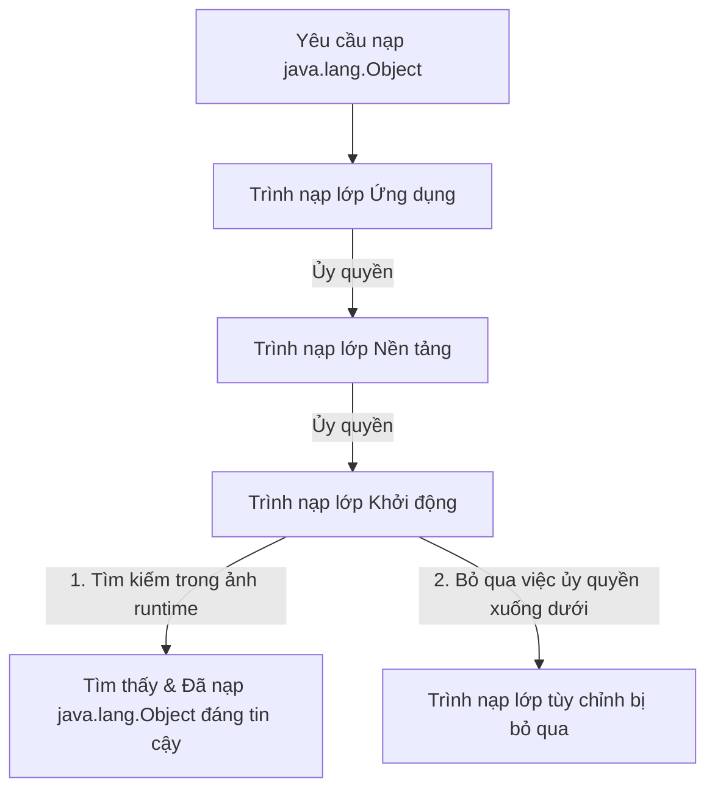

# Trình nạp lớp (ClassLoader) - Phần 1

## Mục Tiêu Học Tập (Learning Goal)

Tài liệu này đề cập đến một phần trọng tâm của trình nạp lớp (ClassLoader). Hãy nghiên cứu từng khái niệm như một quy tắc Java thực tế, thay vì các từ vựng rời rạc.

## Nội Dung Khái Quát (Outline Coverage)

- **`Class loading process`** — Vòng đời gồm nhiều giai đoạn của việc nạp (Loading), liên kết (Linking), và khởi tạo (Initializing) các định nghĩa lớp vào bộ nhớ JVM (JVM memory).
- **`Bootstrap ClassLoader`** — Trình nạp lớp gốc bằng mã máy (native-code) chịu trách nhiệm nạp các lớp thời gian chạy cốt lõi (ví dụ: `java.lang.Object`).
- **`Platform/Extension ClassLoader`** — Trình nạp lớp nạp các mô-đun nền tảng không cốt lõi hoặc các API mở rộng.
- **`Application ClassLoader`** — Trình nạp lớp (trình nạp lớp hệ thống) nạp các lớp từ đường dẫn lớp (Classpath) của ứng dụng.
- **`Parent delegation model`** — Cơ chế trong đó các trình nạp lớp ủy quyền việc nạp cho trình nạp lớp cha trước khi tự mình thử nạp.
- **`Dynamic class loading`** — Nạp các lớp vào bộ nhớ JVM tại thời điểm chạy (runtime) theo yêu cầu thay vì lúc khởi động.
- **`Class.forName`** — Phương thức API phản chiếu (Reflection API) được dùng để nạp và có thể tùy chọn khởi tạo các lớp một cách động.
- **`Classpath`** — Tham số cấu hình chỉ định cho JVM nơi tìm kiếm các lớp và gói do người dùng định nghĩa.
- **`Basic JAR loading`** — Cách JVM phân giải các tệp lớp được đóng gói bên trong các tệp lưu trữ nén ZIP (JAR).

## Ghi Chú Chi Tiết (Detailed Notes)

### Quy trình nạp lớp (Class loading process)

Quy trình nạp lớp là cơ chế của JVM để đưa mã byte (bytecode) nhị phân đã biên dịch (được lưu trữ trong các tệp `.class` hoặc lấy từ một luồng mạng) vào bộ nhớ và chuyển đổi nó thành một đối tượng `java.lang.Class` có thể sử dụng được. Quy trình này diễn ra một cách động, theo yêu cầu, thay vì nạp tất cả các lớp khi ứng dụng khởi động.

## Tại Sao Ba Giai Đoạn Của Việc Nạp Lớp Kiểm Soát Việc Thực Thi Tĩnh (Static Execution)

Nạp lớp không phải là một bước đơn nguyên duy nhất mà là một quy trình có cấu trúc gồm ba giai đoạn riêng biệt: Nạp, Liên kết, và Khởi tạo. Trong giai đoạn **Nạp**, trình nạp lớp đọc biểu diễn nhị phân của lớp (mảng byte từ tệp `.class` hoặc luồng mạng) và xây dựng cấu trúc siêu dữ liệu (metadata) `java.lang.Class` tương ứng trong vùng nhớ Metaspace (Metaspace). Giai đoạn **Liên kết** được chia nhỏ thành *Xác thực* (Verification - đảm bảo mã byte là hợp lệ và an toàn), *Chuẩn bị* (Preparation - cấp phát bộ nhớ cho các trường tĩnh và khởi tạo chúng về các giá trị mặc định như `0` hoặc `null`), và *Phân giải* (Resolution - phân giải các tham chiếu tượng trưng (symbolic references) trong vùng chứa hằng số (constant pool) thành các tham chiếu bộ nhớ trực tiếp thực tế). Cuối cùng, giai đoạn **Khởi tạo** chạy các bộ khởi tạo tĩnh (static initializers) (phương thức `<clinit>`) và gán các giá trị thực tế do lập trình viên định nghĩa cho các biến tĩnh. JVM đảm bảo rằng quá trình khởi tạo tĩnh diễn ra theo cơ chế trì hoãn (lazily), chỉ khi lớp được sử dụng chủ động (active use) lần đầu tiên—chẳng hạn như khi một thực thể (instance) mới được tạo, một phương thức tĩnh được gọi, hoặc một trường tĩnh được truy cập.

### Mô Hình Tư Duy: Các Giai Đoạn Nạp Lớp (Class Loading Phases)
```
+------------------------------------------------------------------------+
| 1. LOADING: Read bytecode -> Create Class<?> metadata in Metaspace      |
+------------------------------------------------------------------------+
                                   |
                                   v
+------------------------------------------------------------------------+
| 2. LINKING:                                                            |
|    - Verification: Validate bytecode format and safety rules           |
|    - Preparation: Allocate static memory & write defaults (e.g. 0/null)|
|    - Resolution: Map symbolic references to direct memory addresses    |
+------------------------------------------------------------------------+
                                   |
                                   v
+------------------------------------------------------------------------+
| 3. INITIALIZATION: Run static initializers (<clinit>) & field values    |
+------------------------------------------------------------------------+
```

### Ví Dụ Mã Nguồn (Code Example)
```java
public class ClassLoadingPhasesDemo {
    static class Target {
        // Preparation phase: value is initialized to 0
        // Initialization phase: value is assigned 42
        public static int value = 42;
        
        static {
            System.out.println("Target class initialized!");
        }
    }

    public static void main(String[] args) throws Exception {
        System.out.println("Main started");
        
        // Dynamic loading using Class.forName without initializing
        Class<?> clazz = Class.forName("ClassLoadingPhasesDemo$Target", false, ClassLoadingPhasesDemo.class.getClassLoader());
        System.out.println("Target class loaded but not initialized yet.");
        
        // Triggering active use
        int val = Target.value;
        System.out.println("Static value accessed: " + val);
        
        // Output:
        // Main started
        // Target class loaded but not initialized yet.
        // Target class initialized!
        // Static value accessed: 42
    }
}
```

### Chuỗi Nguyên Nhân - Kết Quả (Cause-Effect Chain)
Kích hoạt lớp chủ động xảy ra (ví dụ: truy cập tĩnh) → Lớp được nạp nếu chưa được nạp → Liên kết thực hiện xác thực và chuẩn bị (giá trị mặc định bằng không) → Khởi tạo thực hiện các khối tĩnh và gán giá trị thực tế → Lớp hoàn toàn sẵn sàng cho việc thực thi thời gian chạy.

---

### Trình nạp lớp Khởi động (Bootstrap ClassLoader)

Trình nạp lớp Khởi động (Bootstrap ClassLoader) là cha của tất cả các trình nạp lớp. Nó được viết bằng mã máy (C/C++) và được nhúng trực tiếp bên trong chính JVM. Nó chịu trách nhiệm nạp các lớp nền tảng Java cốt lõi, chẳng hạn như các lớp trong gói `java.lang`, `java.util`, và các gói cơ bản khác (từ mô-đun `java.base` trong Java 9 trở lên). Vì được viết bằng mã máy, nó không có đối tượng Java `java.lang.ClassLoader` tương ứng; việc gọi `getClassLoader()` trên các lớp cốt lõi như `java.lang.String` hoặc `java.lang.Object` sẽ trả về `null`.

### Trình nạp lớp Nền tảng/Mở rộng (Platform/Extension ClassLoader)

Trình nạp lớp Nền tảng (Platform ClassLoader) (được gọi là Trình nạp lớp Mở rộng (Extension ClassLoader) trước phiên bản Java 9) nạp các lớp từ các thư mục nền tảng/mở rộng. Trong Java 9 và các phiên bản mới hơn, mục đích của nó là nạp các lớp nền tảng và các API không thuộc thời gian chạy cốt lõi (ví dụ: các gói xử lý SQL, XML) nhưng là một phần của đặc tả Java SE tiêu chuẩn.

### Trình nạp lớp Ứng dụng (Application ClassLoader)

Còn được gọi là Trình nạp lớp Hệ thống (System ClassLoader), Trình nạp lớp Ứng dụng chịu trách nhiệm nạp các lớp từ đường dẫn lớp của ứng dụng (được chỉ định bởi biến môi trường `CLASSPATH`, hoặc các tùy chọn dòng lệnh `-classpath` / `-cp`). Nó là trình nạp mặc định cho các lớp do người dùng định nghĩa và được viết bằng Java (là một lớp con của `java.lang.ClassLoader`).

### Mô hình ủy quyền cha (Parent delegation model)

Mô hình ủy quyền cha là khung phân cấp điều hướng cách các trình nạp lớp tìm kiếm các lớp. Khi một trình nạp lớp nhận được yêu cầu nạp một lớp, trước tiên nó không cố gắng tự tìm kiếm lớp đó. Thay vào đó, nó ủy quyền việc tìm kiếm cho trình nạp lớp cha của nó. Việc ủy quyền này truyền ngược lên cho đến tận Trình nạp lớp Khởi động. Chỉ khi tất cả các trình nạp lớp tổ tiên không tìm thấy lớp đó thì trình nạp lớp con mới tự mình cố gắng nạp lớp đó.

## Tại Sao Mô Hình Ủy Quyền Cha Bảo Vệ Các API Cốt Lõi

Mô hình ủy quyền cha là một cơ chế bảo mật cốt lõi trong Máy ảo Java (Java Virtual Machine - JVM). Khi một trình nạp lớp được yêu cầu nạp một lớp, nó luôn ủy quyền yêu cầu đó cho trình nạp lớp cha trước tiên, đi ngược lên tận Trình nạp lớp Khởi động, trước khi tự mình thử nạp lớp đó. Phân cấp này đảm bảo rằng các lớp thời gian chạy cốt lõi, chẳng hạn như `java.lang.Object` hoặc `java.lang.String`, luôn được nạp bởi Trình nạp lớp Khởi động từ ảnh thời gian chạy (runtime image) đáng tin cậy, thay vì bởi một ứng dụng không đáng tin cậy hoặc trình nạp lớp tùy chỉnh. Ngay cả khi một nhà phát triển độc hại đóng gói một lớp `java.lang.Object` giả mạo trong một tệp JAR, mô hình ủy quyền cha đảm bảo rằng yêu cầu sẽ bị chặn lại ở đỉnh của cây phân cấp, và lớp JVM chính thức sẽ được nạp thay thế. Hơn nữa, JVM thực thi các kiểm tra thời gian chạy (chẳng hạn như kiểm tra các tên gói bắt đầu bằng `java.`) và ném ra một ngoại lệ `SecurityException` nếu một trình nạp lớp không đáng tin cậy cố gắng định nghĩa một lớp bên trong một gói bị hạn chế.

### Mô Hình Tư Duy: Mô Hình Ủy Quyền Cha (Parent Delegation Model)


### Ví Dụ Mã Nguồn (Code Example)
```java
// Conceptual demonstration of package containment checks
public class ClassProtectionDemo {
    public static void main(String[] args) {
        try {
            ClassLoader customLoader = new ClassLoader() {
                @Override
                protected Class<?> findClass(String name) throws ClassNotFoundException {
                    // Try to hijack java.lang by defining a fake class within it
                    byte[] dummyBytes = new byte[0];
                    return defineClass(name, dummyBytes, 0, 0);
                }
            };
            customLoader.loadClass("java.lang.FakeCoreClass");
        } catch (SecurityException e) {
            System.out.println("SecurityException caught: " + e.getMessage());
            // Output: SecurityException caught: Prohibited package name: java.lang
        } catch (ClassNotFoundException e) {
            System.out.println("Class not found");
        }
    }
}
```

### Chuỗi Nguyên Nhân - Kết Quả (Cause-Effect Chain)
Yêu cầu lớp tùy chỉnh → Được ủy quyền ngược lên Trình nạp lớp Khởi động → Trả về lớp API cốt lõi đáng tin cậy → Kiểm tra gói thời gian chạy thất bại khi cố gắng định nghĩa trực tiếp `java.*` → JVM ném ra `java.lang.SecurityException` để ngăn chặn việc chiếm quyền điều khiển API.

---

### Nạp lớp động (Dynamic class loading)

Nạp lớp động đề cập đến khả năng của JVM trong việc nạp các lớp vào thời gian chạy theo yêu cầu, thay vì biên dịch tĩnh tất cả chúng hoặc nạp chúng trong quá trình khởi động (bootstrap) JVM. Điều này cho phép các chương trình nạp các tiện ích mở rộng (plugin), trình điều khiển (driver) hoặc các mô-đun một cách động mà không cần khởi động lại ứng dụng.

## Tại Sao Không Gian Tên (Namespace) Của Trình Nạp Lớp Quyết Định Tính Duy Nhất Của Định Danh Kiểu (Type Identity Uniqueness)

Trong Máy ảo Java, định danh của một lớp không chỉ được xác định bằng tên đầy đủ (fully qualified name) của nó (ví dụ: `com.example.Service`). Thay vào đó, định danh thời gian chạy của một lớp là sự kết hợp giữa tên đầy đủ của nó và thực thể (instance) `ClassLoader` cụ thể đã định nghĩa nó. Điều này có nghĩa là nếu hai thực thể `ClassLoader` khác nhau nạp cùng một tệp byte lớp từ đĩa, JVM sẽ coi chúng là hai kiểu hoàn toàn riêng biệt. JVM phân chia các kiểu bằng cách sử dụng các gói thời gian chạy liên kết với các trình nạp lớp định nghĩa chúng, đảm bảo sự cô lập không gian tên của lớp. Do đó, bạn không thể ép kiểu một thực thể của một lớp được nạp bởi `ClassLoader A` sang định nghĩa lớp được nạp bởi `ClassLoader B`, và việc cố gắng làm như vậy sẽ dẫn đến ngoại lệ `ClassCastException` tại thời điểm chạy.

### Mô Hình Tư Duy: Sự Phân Tách Kiểu Của Trình Nạp Lớp (ClassLoader Type Separation)
```
+-------------------------------------------------------------------+
|                           JVM Memory                              |
|  +---------------------------+     +---------------------------+  |
|  |       ClassLoader A       |     |       ClassLoader B       |  |
|  |  [com.example.Service]    |     |  [com.example.Service]    |  |
|  |     (Type ID: Class@1)    |     |     (Type ID: Class@2)    |  |
|  +-------------+-------------+     +-------------+-------------+  |
|                |                                 |                |
|         Instantiated as:                  Instantiated as:        |
|            serviceObj1                       serviceObj2          |
+-------------------------------------------------------------------+
Attempting: (com.example.Service) serviceObj2 (using Class@1 context)
Result: java.lang.ClassCastException
```

### Ví Dụ Mã Nguồn (Code Example)
```java
// Conceptual example of namespace type mismatch
public class NamespaceTypeMismatchDemo {
    public static void main(String[] args) throws Exception {
        // Supposing CustomClassLoader loads class bytes from a specific folder
        ClassLoader loader1 = new CustomClassLoader();
        ClassLoader loader2 = new CustomClassLoader();
        
        Class<?> clazz1 = loader1.loadClass("com.example.Service");
        Class<?> clazz2 = loader2.loadClass("com.example.Service");
        
        System.out.println("clazz1 == clazz2: " + (clazz1 == clazz2));
        // Output: clazz1 == clazz2: false
        
        Object instance2 = clazz2.getDeclaredConstructor().newInstance();
        System.out.println("Is instance2 instance of clazz1? " + clazz1.isInstance(instance2));
        // Output: Is instance2 instance of clazz1? false
    }
}
```

### Chuỗi Nguyên Nhân - Kết Quả (Cause-Effect Chain)
Nhiều thực thể trình nạp lớp nạp cùng một lớp → Các đối tượng `java.lang.Class` riêng biệt được tạo trong bộ nhớ → Các không gian tên phân chia định danh kiểu → Bộ thực thi JVM phát hiện các trình nạp lớp định nghĩa không khớp trong quá trình kiểm tra ép kiểu → Ngoại lệ `ClassCastException` bị ném ra bất kể tên lớp giống nhau.

---

### Class.forName

`Class.forName` là một phương thức API phản chiếu được sử dụng để nạp một lớp một cách động bằng tên đầy đủ của nó. Theo mặc định, việc gọi `Class.forName(name)` không chỉ nạp lớp mà còn liên kết và khởi tạo lớp đó (chạy các khối tĩnh). Nếu không muốn khởi tạo ngay lập tức, phương thức nạp chồng ba tham số `Class.forName(name, initialize, classloader)` có thể được sử dụng thay thế.

## Tại Sao SPI Và Các Khung Tiện Ích Mở Rộng (Plugin Frameworks) Phải Phá Vỡ Cơ Chế Ủy Quyền Cha

Mô hình ủy quyền cha nghiêm ngặt hoạt động theo cách tiếp cận từ trên xuống (top-down), trong đó các trình nạp lớp ủy quyền ngược lên trên để nạp các lớp nền tảng cốt lõi. Tuy nhiên, mô hình này bị phá vỡ khi các API nền tảng cốt lõi (được nạp bởi Trình nạp lớp Khởi động) cần phát hiện và nạp các triển khai nhà cung cấp dịch vụ (service provider) bên thứ ba (vốn nằm trong đường dẫn lớp và được nạp bởi Trình nạp lớp Ứng dụng). Ví dụ, API Kết nối Cơ sở dữ liệu Java (Java Database Connectivity - JDBC) tồn tại dưới dạng các lớp nền tảng cốt lõi, nhưng nó cần nạp các trình điều khiển cơ sở dữ liệu (như trình điều khiển PostgreSQL hoặc MySQL) do ứng dụng cung cấp. Để giải quyết vấn đề này, Java đã giới thiệu Trình nạp lớp theo ngữ cảnh luồng (Thread Context ClassLoader - TCCL), cho phép một luồng chỉ định một trình nạp lớp bổ trợ (thường là Trình nạp lớp Ứng dụng) để các lớp cốt lõi có thể lấy ra và nạp các lớp ứng dụng. Tương tự, OSGi và các máy chủ ứng dụng web triển khai các mạng lưới ủy quyền tùy chỉnh (chẳng hạn như nạp ưu tiên lớp con (parent-last), hoặc nạp ngang hàng (peer-to-peer)) để cô lập các tiện ích mở rộng hoặc cho phép các ứng dụng web ghi đè lên các thư viện dùng chung ở cấp độ máy chủ.

### Mô Hình Tư Duy: Phá Vỡ Cơ Chế Ủy Quyền Cha Cho SPI (Breaking Parent Delegation for SPI)
```
+-----------------------------------------------------------------------+
|  Bootstrap ClassLoader (Loads java.sql.DriverManager)                  |
+-----------------------------------------------------------------------+
                                  |
            Need to load database driver (e.g. org.postgresql.Driver)
            If parent-delegation only: Bootstrap cannot see Application
            loader classes (downwards visibility is prohibited).
                                  |
                                  v
+-----------------------------------------------------------------------+
|  TCCL Hook (Thread.currentThread().getContextClassLoader())           |
|  Allows DriverManager to query the Application ClassLoader           |
+-----------------------------------------------------------------------+
                                  |
                                  v
+-----------------------------------------------------------------------+
|  Application ClassLoader (Loads org.postgresql.Driver)                |
+-----------------------------------------------------------------------+
```

### Ví Dụ Mã Nguồn (Code Example)
```java
import java.sql.Driver;
import java.util.ServiceLoader;

public class TCCLDemo {
    public static void main(String[] args) {
        // TCCL is set to the Application ClassLoader by default
        ClassLoader originalTCCL = Thread.currentThread().getContextClassLoader();
        
        // Temporarily nullify the TCCL to mimic a clean bootstrap environment
        Thread.currentThread().setContextClassLoader(null);
        
        try {
            // ServiceLoader uses Thread Context ClassLoader by default to find SPIs
            ServiceLoader<Driver> loader = ServiceLoader.load(Driver.class);
            // This fails to find application classpath drivers if TCCL is null
            boolean found = loader.iterator().hasNext();
            System.out.println("Drivers found without TCCL: " + found);
            // Output: Drivers found without TCCL: false
        } finally {
            // Restore TCCL
            Thread.currentThread().setContextClassLoader(originalTCCL);
        }
    }
}
```

### Chuỗi Nguyên Nhân - Kết Quả (Cause-Effect Chain)
Thư viện cốt lõi được nạp bởi Trình nạp lớp Khởi động → Cần khởi tạo lớp triển khai trong Trình nạp lớp Ứng dụng → Việc ủy quyền xuống dưới bị cấm bởi mô hình mặc định → Trình nạp lớp theo ngữ cảnh luồng được lấy từ môi trường thực thi luồng hiện tại → Việc ủy quyền bị bỏ qua bằng cách truy vấn rõ ràng trình nạp lớp ứng dụng → SPI được nạp thành công.

---

### Đường dẫn lớp (Classpath)

Đường dẫn lớp là một tham số cấu hình (tùy chọn dòng lệnh hoặc biến môi trường) chỉ định các thư mục và các tệp lưu trữ ZIP/JAR nơi tìm kiếm các lớp để biên dịch và thực thi.

## Tại Sao Các Trình Nạp Lớp Tùy Chỉnh Gây Ra Rò Rỉ Bộ Nhớ Metaspace (Metaspace Memory Leaks)

Các container ứng dụng web (web application containers) như Tomcat sử dụng các trình nạp lớp tùy chỉnh để cô lập nhiều bản triển khai chạy trên cùng một thực thể JVM. Mỗi ứng dụng web được triển khai được phân bổ thực thể `WebappClassLoader` riêng của nó, thực thể này xử lý việc nạp các lớp đặc thù của ứng dụng mà không gây ảnh hưởng đến các ứng dụng khác. Tuy nhiên, thiết lập này rất dễ bị rò rỉ bộ nhớ Metaspace (Metaspace memory leaks) do các quy tắc giữ tham chiếu nghiêm ngặt của Bộ thu gom rác Java (Java Garbage Collector). Mỗi đối tượng lớp được nạp sẽ giữ một tham chiếu mạnh (strong reference) đến `ClassLoader` đã định nghĩa nó thông qua phương thức `getClassLoader()`, và ngược lại, trình nạp lớp duy trì một tham chiếu đến tất cả các lớp mà nó đã nạp. Nếu một luồng, trường tĩnh, biến cục bộ luồng (thread-local), hoặc đăng ký toàn hệ thống (như trình điều khiển JDBC hoặc khung ghi nhật ký (logging framework)) giữ lại dù chỉ một tham chiếu đến bất kỳ lớp ứng dụng nào sau khi gỡ bỏ triển khai (undeployment), toàn bộ trình nạp lớp và tất cả các lớp được nạp của nó đều không thể được thu gom rác. Vì siêu dữ liệu lớp được lưu trữ trong Metaspace, việc tái triển khai (redeployment) ứng dụng liên tục sẽ làm rò rỉ siêu dữ liệu lớp, cuối cùng làm cạn kiệt bộ nhớ heap của JVM hoặc Metaspace và ném ra ngoại lệ `OutOfMemoryError: Metaspace`.

> Xem thêm: Chi tiết về cấu trúc bộ nhớ JVM, Metaspace và Garbage Collector, được trình bày chi tiết trong [Ch.37 - JVM Architecture](../../no37_jvm_advanced/theory/01-jvm-architecture-concepts.md).

### Mô Hình Tư Duy: Chu Kỳ Tham Chiếu Trình Nạp Lớp (ClassLoader Reference Cycle)
```
System Registry (e.g., ThreadLocal or JDBC)
      | (Leaks reference)
      v
[Application Class (e.g. MyLeakedClass)]
      | (getClassLoader())
      v
[WebappClassLoader]
      | (Holds references to all loaded classes)
      v
[Class Metadata in Metaspace (Hundreds of classes)] ---> Memory cannot be reclaimed!
```

### Ví Dụ Mã Nguồn (Code Example)
```java
public class MetaspaceLeakSample {
    private static final ThreadLocal<Object> context = new ThreadLocal<>();

    public static void runLeak(ClassLoader webappLoader) throws Exception {
        // Load an application class using our custom webapp loader
        Class<?> leakedClass = webappLoader.loadClass("com.example.LeakedContext");
        Object instance = leakedClass.getDeclaredConstructor().newInstance();
        
        // Storing the instance in a ThreadLocal that is never cleaned up
        context.set(instance);
        
        // Web application is now "undeployed" (webappLoader reference set to null)
        webappLoader = null;
        
        // System.gc() cannot reclaim webappLoader because context thread-local
        // still references the class instance, which references the class,
        // which references the webappLoader.
        System.gc();
        System.out.println("Undeployed webapp but leak remains.");
        // Output: Undeployed webapp but leak remains.
    }
}
```

### Chuỗi Nguyên Nhân - Kết Quả (Cause-Effect Chain)
Gỡ bỏ triển khai ứng dụng web → Các tham chiếu đến trình nạp lớp tùy chỉnh bị container loại bỏ → Tham chiếu tĩnh hoặc ThreadLocal giữ tham chiếu đến lớp ứng dụng web → Lớp giữ tham chiếu đến trình nạp lớp đã định nghĩa nó → Trình nạp lớp giữ các tham chiếu đến tất cả các lớp đã nạp của nó → GC không thể thu gom trình nạp lớp hoặc bất kỳ lớp đã nạp nào → Dung lượng sử dụng Metaspace tăng liên tục qua các lần tái triển khai → Lỗi OutOfMemoryError: Metaspace xảy ra.

---

### Nạp file JAR cơ bản (Basic JAR loading)

Nạp file JAR (Java Archive) cho phép tích hợp nhiều tệp `.class` đã biên dịch, tệp cấu hình tài nguyên và siêu dữ liệu vào một tệp lưu trữ nén ZIP duy nhất. JVM nạp các lớp trực tiếp từ bên trong các tệp JAR bằng cách đọc các mục ZIP của chúng, sử dụng các cấu hình tìm kiếm đường dẫn lớp để phân giải các thư viện phụ thuộc bên ngoài.

## Liên Kết Tham Khảo (Reference Links)

- https://docs.oracle.com/en/java/javase/21/docs/api/java.base/java/lang/ClassLoader.html (Tài liệu ClassLoader API chính thức)
- https://docs.oracle.com/javase/specs/jvms/se21/html/jvms-5.html (Đặc tả JVM: Nạp, Liên kết, và Khởi tạo)
- https://tomcat.apache.org/tomcat-11.0-doc/class-loader-howto.html (Hướng dẫn ClassLoader của Tomcat)

---