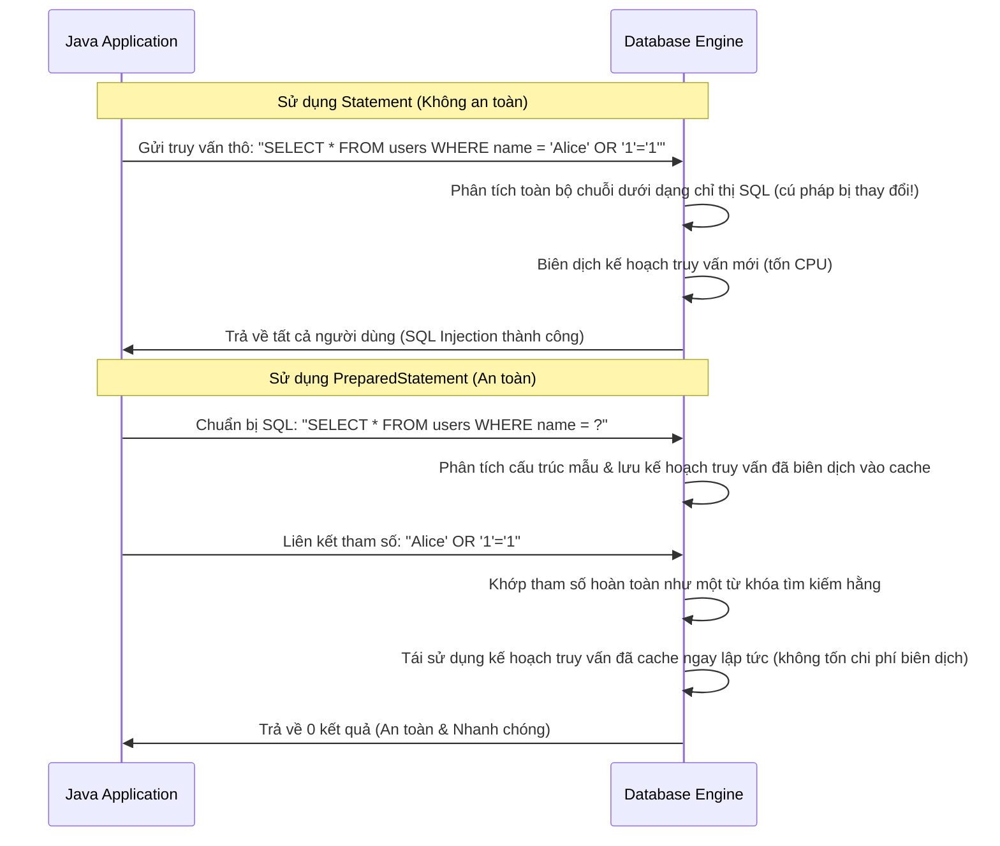

# JDBC - Phần 1 (JDBC - Part 1)

## Mục tiêu học tập

Tài liệu này giải thích kiến trúc JDBC và các thành phần cốt lõi: từ cách Java tìm đúng Driver, mở Connection, gửi truy vấn qua Statement/PreparedStatement, đọc kết quả từ ResultSet, đến cách quản lý Transaction. Mỗi khái niệm được trình bày kèm cơ chế hoạt động bên trong, lỗi thường gặp, và ví dụ mã nguồn cụ thể.

## Đề cương chi tiết

- **`What is JDBC?`** — API chuẩn trong `java.sql` và `javax.sql`, trừu tượng hóa sự khác biệt giữa các hệ cơ sở dữ liệu phía sau một tập interface thống nhất.
- **`Driver`** — Triển khai cụ thể của `java.sql.Driver` do nhà cung cấp DBMS viết; từ JDBC 4.0+ tự đăng ký qua `ServiceLoader`.
- **`DriverManager`** — Factory tĩnh khớp JDBC URL với Driver đã đăng ký để tạo Connection.
- **`Connection`** — Đại diện cho phiên TCP tới database server; nắm giữ trạng thái giao dịch và tạo ra Statement.
- **`Statement`** — Thực thi SQL tĩnh không có tham số; KHÔNG được dùng với đầu vào từ người dùng vì dễ bị SQL injection.
- **`PreparedStatement`** — Biên dịch trước SQL với placeholder `?`, tách biệt cấu trúc truy vấn và dữ liệu tham số ở cấp giao thức.
- **`CallableStatement`** — Gọi stored procedure trên database qua cú pháp `{call proc(?, ?)}` với tham số IN/OUT/INOUT.
- **`ResultSet`** — Con trỏ (cursor) duyệt tuần tự qua các hàng kết quả; vị trí ban đầu nằm **trước** hàng đầu tiên.
- **`Transaction`** — Nhóm các câu lệnh SQL thực thi nguyên tử, tuân thủ ACID (Atomicity, Consistency, Isolation, Durability).
- **`commit`** — Ghi vĩnh viễn tất cả thay đổi kể từ lần commit cuối vào database; ở chế độ auto-commit, mỗi statement tự động commit.

## Ghi chú chi tiết

### What is JDBC?

JDBC (Java Database Connectivity) là API chuẩn nằm trong hai package `java.sql` (core) và `javax.sql` (extension cho DataSource, connection pooling, distributed transactions). Thay vì viết mã riêng cho MySQL, PostgreSQL, Oracle, ứng dụng Java chỉ giao tiếp với các interface JDBC — còn mã cụ thể cho từng hệ cơ sở dữ liệu được đóng gói trong Driver.

Kiến trúc phân tầng:

```text
Java Application
      ↓
  JDBC API (java.sql.*)
      ↓
  DriverManager / DataSource
      ↓
  Driver (mysql-connector-j.jar, postgresql.jar, ...)
      ↓
  Database Server (MySQL, PostgreSQL, Oracle, ...)
```

Lợi ích cốt lõi: khi chuyển từ MySQL sang PostgreSQL, ứng dụng chỉ cần đổi Driver JAR và JDBC URL — toàn bộ mã `Connection`, `PreparedStatement`, `ResultSet` giữ nguyên.

### Trình điều khiển (Driver)

Driver là lớp triển khai interface `java.sql.Driver` do nhà cung cấp cơ sở dữ liệu viết. Nó chịu trách nhiệm dịch các lời gọi JDBC thành giao thức mạng cụ thể của database (ví dụ: MySQL protocol, PostgreSQL wire protocol).

**Cơ chế tự đăng ký (JDBC 4.0+, Java 6 trở lên):** Khi bạn thêm file JAR của driver vào classpath (ví dụ: `mysql-connector-j-8.x.jar`), JVM sử dụng `ServiceLoader` để quét file `META-INF/services/java.sql.Driver` bên trong JAR đó. File này chứa tên fully-qualified class của Driver (ví dụ: `com.mysql.cj.jdbc.Driver`). `DriverManager` tự động gọi `Class.forName()` để load và đăng ký Driver — bạn không cần viết `Class.forName("com.mysql.cj.jdbc.Driver")` nữa.

**Bẫy thường gặp:** Nếu JAR driver không nằm trên classpath, `DriverManager.getConnection()` ném `SQLException: No suitable driver found for jdbc:mysql://...`. Cách sửa: kiểm tra dependency trong `pom.xml` hoặc `build.gradle`.

### Trình quản lý trình điều khiển (DriverManager)

`DriverManager` là lớp tiện ích tĩnh hoạt động như một factory tạo `Connection`. Khi bạn gọi `DriverManager.getConnection(url, user, password)`, nó lặp qua danh sách các Driver đã đăng ký và gọi `driver.connect(url, props)` trên từng Driver cho đến khi có một Driver trả về kết nối thành công.

**Định dạng JDBC URL:** `jdbc:<subprotocol>:<subname>`
- MySQL: `jdbc:mysql://localhost:3306/mydb`
- PostgreSQL: `jdbc:postgresql://localhost:5432/mydb`
- H2 in-memory: `jdbc:h2:mem:testdb`

```java
// Ví dụ kết nối cơ bản
Connection conn = DriverManager.getConnection(
    "jdbc:mysql://localhost:3306/mydb",
    "root",
    "password123"
);
```

**Hạn chế:** `DriverManager` tạo kết nối vật lý mới mỗi lần gọi — không có connection pooling. Trong production, nên dùng `DataSource` (xem Phần 2).

### Kết nối (Connection)

`Connection` đại diện cho một phiên TCP đang hoạt động tới database server. Nó nắm giữ trạng thái giao dịch hiện tại, tạo ra các đối tượng `Statement` / `PreparedStatement`, và phải được đóng khi không còn sử dụng để giải phóng tài nguyên phía server (bộ nhớ, socket, cursor).

**Các quy tắc quan trọng:**
- `Connection` **KHÔNG** thread-safe — không nên chia sẻ một Connection giữa nhiều thread.
- Mặc định, `Connection` ở chế độ auto-commit (`setAutoCommit(true)`): mỗi câu lệnh SQL tự động commit ngay sau khi thực thi.
- Nếu không đóng Connection, socket TCP và bộ nhớ phía server sẽ bị rò rỉ. Luôn dùng try-with-resources.

```java
// Connection tự đóng khi ra khỏi khối try
try (Connection conn = DriverManager.getConnection(url, user, pass)) {
    // sử dụng conn
} // conn.close() được gọi tự động
```

### Câu lệnh (Statement)

`Statement` thực thi các câu lệnh SQL tĩnh — tức SQL không chứa tham số động. Nó cung cấp ba phương thức thực thi chính:

- **`executeQuery(sql)`** — Dành cho `SELECT`. Trả về `ResultSet`.
- **`executeUpdate(sql)`** — Dành cho `INSERT`, `UPDATE`, `DELETE`, DDL. Trả về số hàng bị ảnh hưởng (`int`).
- **`execute(sql)`** — Dành cho mọi loại SQL. Trả về `true` nếu kết quả là `ResultSet`, `false` nếu là update count.

**CẢNH BÁO NGHIÊM TRỌNG:** Tuyệt đối KHÔNG ghép chuỗi (string concatenation) đầu vào từ người dùng vào câu SQL khi dùng `Statement` — đây là cửa ngõ chính cho SQL Injection. Luôn dùng `PreparedStatement` thay thế.

```java
// ❌ NGUY HIỂM — SQL Injection
String sql = "SELECT * FROM users WHERE name = '" + userInput + "'";
Statement stmt = conn.createStatement();
ResultSet rs = stmt.executeQuery(sql);

// ✅ AN TOÀN — Dùng PreparedStatement (xem phần tiếp theo)
```

### Câu lệnh chuẩn bị trước (PreparedStatement)

`PreparedStatement` biên dịch trước câu lệnh SQL với các placeholder `?`. Các giá trị tham số được gửi tách biệt qua giao thức nhị phân tới database, không bao giờ trở thành một phần của cú pháp SQL. Điều này mang lại hai lợi ích đồng thời: **ngăn chặn SQL Injection** (vì tham số không thể thay đổi cấu trúc truy vấn) và **tận dụng query plan caching** (vì cấu trúc SQL luôn giống nhau giữa các lần gọi).

Các phương thức setter đặt giá trị theo thứ tự tham số (1-indexed):
- `setString(1, "Alice")` — đặt tham số thứ nhất là chuỗi
- `setInt(2, 42)` — đặt tham số thứ hai là số nguyên
- `setNull(3, Types.VARCHAR)` — đặt tham số thứ ba là NULL

**Bẫy thường gặp:** Gọi `executeQuery()` mà quên gọi `setXxx()` cho mọi placeholder `?` sẽ ném `SQLException`. Số lượng tham số phải khớp chính xác.

## Tại sao PreparedStatement ngăn chặn SQL Injection và tận dụng bộ nhớ đệm kế hoạch truy vấn (Query Plan Caching)

Khi một cơ sở dữ liệu nhận được một câu lệnh SQL, nó sẽ phân tích cú pháp truy vấn, kiểm tra cú pháp, phân giải tên và biên dịch một kế hoạch thực thi (kế hoạch truy vấn - query plan). Quá trình phân tích và lên kế hoạch này rất tốn tài nguyên CPU, do đó các cơ sở dữ liệu hiện đại lưu trữ các kế hoạch truy vấn đã biên dịch vào bộ đệm cache. Nếu một `Statement` thô được sử dụng với phép cộng chuỗi (ví dụ: `SELECT * FROM users WHERE name = '` + name + `'`), cấu trúc truy vấn sẽ thay đổi với mỗi tên đầu vào khác nhau, khiến bộ nhớ đệm kế hoạch truy vấn trở nên vô dụng và buộc cơ sở dữ liệu phải biên dịch lại truy vấn mỗi lần thực thi. Nguy hiểm hơn, phép cộng chuỗi cho phép đầu vào độc hại chứa các lệnh SQL (ví dụ: `' OR '1'='1`) thao túng cây cú pháp của chính câu lệnh SQL, dẫn đến chèn mã độc SQL (SQL injection). Nguy kịch hơn, `PreparedStatement` biên dịch trước mẫu truy vấn với các tham số giữ chỗ (`?`) ngay khi khởi tạo. Các tham số đầu vào được gửi riêng biệt với câu lệnh SQL trong quá trình thực thi. Công cụ cơ sở dữ liệu đối xử với các giá trị tham số hoàn toàn như các giá trị hằng (literal value) thay vì các lệnh SQL có thể thực thi, vô hiệu hóa mọi nỗ lực chèn mã độc trong khi đảm bảo cấu trúc truy vấn đã biên dịch vẫn giống hệt nhau, cho phép các công cụ cơ sở dữ liệu tái sử dụng các kế hoạch truy vấn đã lưu đệm một cách hiệu quả.

### Mô hình tư duy: Khe nhận thư truy vấn so với tập lệnh Shell có thể thực thi
Hãy tưởng tượng bạn gửi một yêu cầu tới phòng xử lý thư:
- **Statement (Không an toàn)**: Bạn gửi một bức thư hoàn chỉnh có nội dung "Chạy script: xóa tệp X". Trình thông dịch đọc toàn bộ trang giấy và thực thi bất cứ điều gì được viết trên đó. Nếu ai đó viết thêm "và xóa tệp Y", phòng xử lý thư vẫn thực hiện vì họ phân tích toàn bộ văn bản dưới dạng các chỉ thị.
- **PreparedStatement (An toàn)**: Bạn gửi trước một mẫu (template): "Chạy script: xóa tệp [FILE_NAME]". Phòng xử lý thư phân tích và tối ưu hóa mẫu này một lần duy nhất. Sau đó, bạn chỉ gửi tham số "X" qua một khe chuyên dụng. Ngay cả khi bạn gửi tham số "X; xóa tệp Y", phòng xử lý thư vẫn đối xử với toàn bộ đầu vào đó hoàn toàn như một tên tệp, cố gắng xóa một tệp duy nhất có tên chính xác là `X; xóa tệp Y`, ngăn chặn hoàn toàn việc thực thi bất kỳ lệnh mới nào.



### Ví dụ mã nguồn
```java
String sql = "SELECT * FROM users WHERE username = ? AND password = ?";
try (Connection conn = dataSource.getConnection();
     PreparedStatement pstmt = conn.prepareStatement(sql)) {
     
    // Malicious input trying to bypass authentication
    String inputUser = "admin";
    String inputPass = "' OR '1'='1";
    
    pstmt.setString(1, inputUser);
    pstmt.setString(2, inputPass);
    
    try (ResultSet rs = pstmt.executeQuery()) {
        if (rs.next()) {
            System.out.println("Login success");
        } else {
            System.out.println("Login failed"); // Expected output: Login failed
        }
    }
}
```

### Chuỗi nguyên nhân - kết quả
1. **Đầu vào tham số độc hại** (`' OR '1'='1`) ➔ 
2. **Biên dịch trước mẫu truy vấn** (`username = ?`) ➔ 
3. **Tách biệt cú pháp truy vấn và dữ liệu tham số** ➔ 
4. **Tham số được đối xử hoàn toàn như một giá trị hằng** ➔ 
5. **Cây cú pháp cơ sở dữ liệu không bị thay đổi** ➔ 
6. **Không thể chèn mã độc VÀ Đạt tỉ lệ trúng cache kế hoạch truy vấn** ➔ 
7. **Thực thi an toàn và tối ưu**.

### Câu lệnh gọi hàm (CallableStatement)

`CallableStatement` dùng để gọi stored procedure (thủ tục lưu trữ) hoặc function đã được định nghĩa sẵn trên database server. Nó kế thừa từ `PreparedStatement`, nên cũng hỗ trợ placeholder `?` và ngăn SQL Injection.

**Cú pháp gọi:**
- Stored procedure: `{call procedure_name(?, ?)}`
- Function: `{? = call function_name(?)}`

**Ba loại tham số:**
- **IN** — Tham số đầu vào, đặt giá trị bằng `setXxx()`. Đây là mặc định.
- **OUT** — Tham số đầu ra, phải đăng ký kiểu trước bằng `registerOutParameter(index, Types.XXX)`, sau đó đọc giá trị bằng `getXxx()` sau khi `execute()`.
- **INOUT** — Vừa là đầu vào vừa là đầu ra. Phải gọi cả `setXxx()` và `registerOutParameter()`.

**Bẫy thường gặp:** Quên gọi `registerOutParameter()` cho tham số OUT trước khi `execute()` sẽ ném `SQLException`. Ngoài ra, không phải mọi database đều hỗ trợ stored procedure — H2 và SQLite có hỗ trợ hạn chế.

### Tập kết quả (ResultSet)

`ResultSet` là một con trỏ (cursor) duyệt qua các hàng kết quả trả về từ câu lệnh `SELECT`. Vị trí ban đầu của con trỏ nằm **trước hàng đầu tiên** — bạn bắt buộc phải gọi `next()` ít nhất một lần trước khi đọc dữ liệu.

**Cách đọc dữ liệu:**
- `rs.next()` — Di chuyển con trỏ đến hàng kế tiếp. Trả về `true` nếu có hàng, `false` nếu hết.
- `rs.getInt("id")` hoặc `rs.getInt(1)` — Đọc cột theo tên hoặc theo chỉ số (1-indexed).
- `rs.getString("name")`, `rs.getDouble("price")`, `rs.getTimestamp("created_at")` — Mỗi kiểu dữ liệu SQL có getter tương ứng.

**Ba loại ResultSet (type):**
- `TYPE_FORWARD_ONLY` (mặc định) — Chỉ duyệt tiến, hiệu suất tốt nhất.
- `TYPE_SCROLL_INSENSITIVE` — Có thể cuộn qua lại (`previous()`, `absolute(n)`), không phản ánh thay đổi DB trong khi đang đọc.
- `TYPE_SCROLL_SENSITIVE` — Cuộn qua lại và phản ánh thay đổi DB (ít database hỗ trợ, hiệu suất kém).

**Bẫy kinh điển:** Gọi `rs.getString(1)` mà không gọi `rs.next()` trước → ném `SQLException` vì con trỏ chưa trỏ đến hàng nào.

### Giao dịch (Transaction)

Giao dịch (Transaction) trong JDBC là một nhóm các câu lệnh SQL được thực thi như một đơn vị nguyên tử — hoặc tất cả thành công (commit), hoặc tất cả bị hủy (rollback). Transaction đảm bảo bốn thuộc tính ACID:

- **Atomicity (Tính nguyên tử):** Tất cả hoặc không gì cả. Nếu một câu lệnh trong nhóm thất bại, toàn bộ nhóm bị hủy.
- **Consistency (Tính nhất quán):** Database chuyển từ trạng thái hợp lệ này sang trạng thái hợp lệ khác, không bao giờ ở trạng thái "nửa vời".
- **Isolation (Tính cô lập):** Các giao dịch đồng thời không nhìn thấy dữ liệu chưa commit của nhau (mức độ cô lập phụ thuộc vào cấu hình database).
- **Durability (Tính bền vững):** Sau khi commit thành công, dữ liệu được ghi vĩnh viễn ngay cả khi server crash ngay lập tức sau đó.

Mặc định, JDBC ở chế độ auto-commit — mỗi câu lệnh SQL là một transaction riêng. Để nhóm nhiều câu lệnh vào một transaction, phải gọi `conn.setAutoCommit(false)`, thực thi các câu lệnh, rồi gọi `conn.commit()` hoặc `conn.rollback()`.

### commit

`conn.commit()` ra lệnh cho database ghi vĩnh viễn tất cả thay đổi đã thực hiện kể từ lần `setAutoCommit(false)` hoặc lần `commit()` gần nhất. Sau khi commit, các thay đổi trở nên nhìn thấy được bởi các phiên làm việc khác và không thể rollback.

Ở chế độ auto-commit (mặc định), mỗi `executeUpdate()` tự động gọi commit ngầm — bạn không cần gọi thủ công. Chỉ khi `setAutoCommit(false)` thì mới cần gọi `commit()` tường minh.

**Bẫy thường gặp:** Quên gọi `commit()` sau `setAutoCommit(false)` → khi `Connection` đóng, database sẽ **rollback** tất cả thay đổi chưa commit (hành vi chuẩn JDBC, mặc dù một số driver có thể auto-commit — đừng dựa vào điều này).

## Tại sao các tài nguyên JDBC phải được đóng theo thứ tự ngược lại một cách nghiêm ngặt

Các thao tác JDBC phụ thuộc vào ba tài nguyên chính: `Connection` (đại diện cho phiên kết nối cơ sở dữ liệu vật lý), `Statement` hoặc `PreparedStatement` (đại diện cho ngữ cảnh thực thi truy vấn SQL đã biên dịch), và `ResultSet` (đại diện cho con trỏ đọc các hàng trong bảng cơ sở dữ liệu). Các tài nguyên này được cấu trúc theo phân cấp: một `Connection` tạo ra một `Statement`, và một `Statement` tạo ra một `ResultSet`. Trong cơ sở dữ liệu, mỗi tài nguyên này nắm giữ các khối bộ nhớ phía máy chủ (server-side memory block), bảng tạm thời, và các con trỏ cursor tương ứng. Nếu chúng không được đóng đúng cách, các tài nguyên phía máy chủ này vẫn mở, gây ra rò rỉ kết nối (connection leak) hoặc lỗi cạn kiệt con trỏ (chẳng hạn như lỗi của Oracle `ORA-01000: maximum open cursors exceeded`). Chúng phải được đóng theo thứ tự ngược lại một cách nghiêm ngặt so với thứ tự tạo ra (`ResultSet` -> `Statement` -> `Connection`). Việc đóng một tài nguyên cha (ví dụ: `Connection`) *trước* tài nguyên con của nó (ví dụ: `ResultSet`) sẽ khiến công cụ cơ sở dữ liệu còn lại các con trỏ cursor mồ côi hoặc kích hoạt trạng thái ổ cắm socket lơ lửng, có thể khiến các truy vấn tiếp theo bị treo hoặc ném ra các `SQLException` không mong muốn. Việc sử dụng câu lệnh try-with-resources của Java 7 đảm bảo việc đóng tài nguyên diễn ra đúng cách, tự động và an toàn. Try-with-resources tự động dịch thành một khối `finally` lồng nhau để gọi `.close()` trên tất cả các biến tài nguyên được khai báo bên trong dấu ngoặc đơn theo đúng thứ tự ngược lại của khai báo, ngay cả khi có ngoại lệ xảy ra trong quá trình thực thi truy vấn.

### Mô hình tư duy: Hộp búp bê Nga Matryoshka lồng nhau
Hãy tưởng tượng ba chiếc hộp lồng vào nhau: một chiếc hộp lớn (`Connection`), một chiếc hộp trung bình (`Statement`) bên trong nó, và một chiếc hộp nhỏ (`ResultSet`) bên trong chiếc hộp đó. Nếu bạn cố gắng đóng chiếc hộp lớn lại trong khi chiếc hộp nhỏ vẫn đang mở và nhô ra ngoài, bạn sẽ làm hỏng bản lề (tài nguyên bị treo). Để đóng cả bộ một cách sạch sẽ mà không làm hỏng hóc, bạn phải đóng chiếc hộp nhỏ trước, sau đó là chiếc hộp trung bình, và cuối cùng là chiếc hộp lớn.

```mermaid
graph TD
    subgraph Creation Order [Thứ tự tạo]
        A[1. Connection] --> B[2. Statement / PreparedStatement]
        B --> C[3. ResultSet]
    end
    subgraph Close Order (Strict Reverse) [Thứ tự đóng (Ngược lại nghiêm ngặt)]
        C1[1. ResultSet.close] --> B1[2. Statement.close]
        B1 --> A1[3. Connection.close]
    end
    A -.->|Cha của| B
    B -.->|Cha của| C
    C1 -.->|Con của| B1
    B1 -.->|Con của| A1
```

### Ví dụ mã nguồn
```java
// Correct closure using try-with-resources (Automatic reverse-order closing)
String sql = "SELECT id, email FROM users WHERE role = ?";
try (Connection conn = dataSource.getConnection();                       // 1st created, last closed
     PreparedStatement stmt = conn.prepareStatement(sql)) {               // 2nd created, 2nd closed
     
    stmt.setString(1, "ADMIN");
    
    try (ResultSet rs = stmt.executeQuery()) {                            // 3rd created, 1st closed
        while (rs.next()) {
            System.out.println("Admin ID: " + rs.getInt("id"));
        }
    } // rs.close() is called automatically here
} // stmt.close() is called automatically, then conn.close() is called automatically
```

### Chuỗi nguyên nhân - kết quả
1. **Khối try-with-resources kết thúc** -> 
2. **Các khối finally lồng nhau do trình biên dịch tạo ra được thực thi** -> 
3. **`ResultSet.close()` được gọi trước tiên, giải phóng con trỏ cơ sở dữ liệu** -> 
4. **`Statement.close()` được gọi thứ hai, giải phóng phiên biên dịch cơ sở dữ liệu** -> 
5. **`Connection.close()` được gọi cuối cùng, trả kết nối vật lý về lại bể chứa (pool)** -> 
6. **Không xảy ra rò rỉ tài nguyên trên cả client JVM lẫn máy chủ cơ sở dữ liệu**.

## Câu hỏi ôn tập

- Tại sao `PreparedStatement` an toàn hơn `Statement` khi xử lý input từ người dùng? Cơ chế ngăn chặn SQL Injection hoạt động ở tầng nào (ứng dụng hay giao thức database)?
- Điều gì xảy ra nếu bạn gọi `rs.getString("name")` mà không gọi `rs.next()` trước?
- Tại sao phải đóng `ResultSet` trước `Statement`, và `Statement` trước `Connection`? Nếu đóng ngược lại, hậu quả cụ thể là gì?
- Từ JDBC 4.0, tại sao không cần viết `Class.forName("com.mysql.cj.jdbc.Driver")` nữa?
- `executeQuery()`, `executeUpdate()`, và `execute()` khác nhau như thế nào? Mỗi phương thức dùng cho loại SQL nào?
- Sự khác biệt giữa tham số IN, OUT, và INOUT trong `CallableStatement` là gì?

## Các ví dụ mã nguồn

### Truy vấn với PreparedStatement và ResultSet
```java
String sql = "SELECT id, name, email FROM users WHERE status = ?";
try (Connection conn = dataSource.getConnection();
     PreparedStatement stmt = conn.prepareStatement(sql)) {
     
    stmt.setString(1, "ACTIVE");
    try (ResultSet rs = stmt.executeQuery()) {
        while (rs.next()) {
            int id = rs.getInt("id");
            String name = rs.getString("name");
            System.out.println("User: " + id + " - " + name);
        }
    }
}
```

### Gọi thủ tục lưu trữ với CallableStatement
```java
try (Connection conn = dataSource.getConnection();
     CallableStatement stmt = conn.prepareCall("{call get_user_salary(?, ?)}")) {
     
    stmt.setInt(1, 101); // Input parameter
    stmt.registerOutParameter(2, java.sql.Types.DOUBLE); // Output parameter
    stmt.execute();
    double salary = stmt.getDouble(2);
    System.out.println("Salary: " + salary);
}
```

## Các lỗi thường gặp

- **Quên đóng tài nguyên**: Nếu Connection, Statement, hoặc ResultSet không được đóng (ví dụ: không sử dụng try-with-resources), nó có thể nhanh chóng làm cạn kiệt bể chứa kết nối cơ sở dữ liệu (connection pool) hoặc giới hạn con trỏ.
- **SQL Injection với Statement**: Cộng các chuỗi để xây dựng các câu lệnh SQL (ví dụ: `"SELECT * FROM users WHERE name = '" + name + "'"`) thay vì sử dụng các tham số giữ chỗ (`?`) trong một `PreparedStatement`.
- **Đọc ResultSet trước khi gọi next()**: Con trỏ ban đầu được định vị trước hàng đầu tiên, do đó gọi `rs.getString(1)` mà không gọi `rs.next()` trước sẽ ném ra ngoại lệ `SQLException`.

## Liên kết tham khảo

- https://docs.oracle.com/javase/tutorial/jdbc/basics/prepared.html (PreparedStatement Basics)
- https://docs.oracle.com/en/java/javase/21/docs/api/java.sql/java/sql/PreparedStatement.html (Java SE 21 PreparedStatement API)
- https://docs.oracle.com/javase/tutorial/jdbc/basics/processingsqlstatements.html (Processing SQL Statements)
