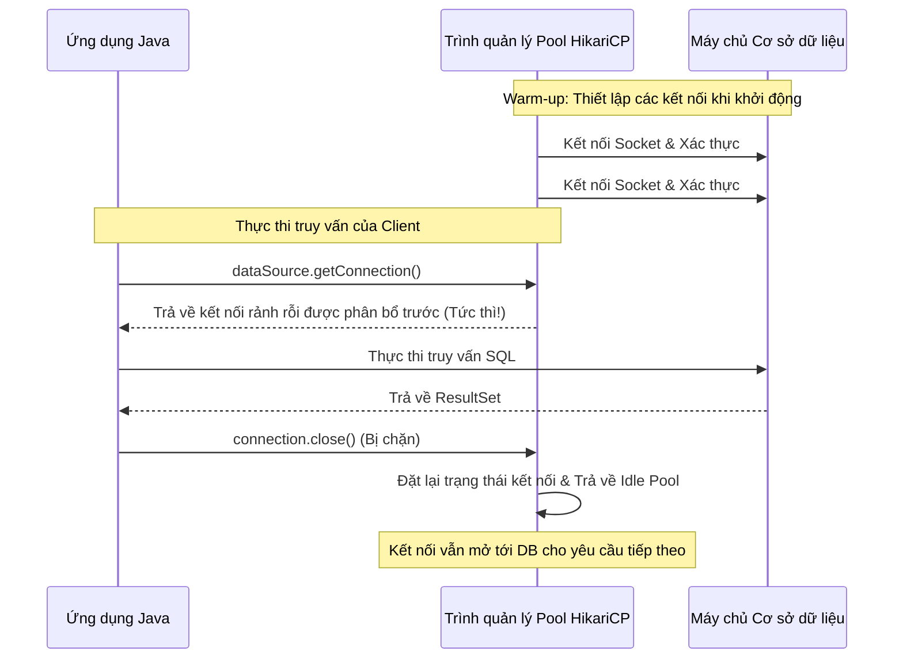

# JDBC - Phần 2

## Mục Tiêu Học Tập

File này đề cập đến một phần trọng tâm của **JDBC**. Hãy nghiên cứu từng khái niệm như một quy tắc Java thực tế, chứ không phải là những từ vựng rời rạc.

## Đề Cương Khái Niệm

- **`rollback`** — rollback hủy bỏ các thay đổi của giao dịch (transaction) hiện tại kể từ lần commit gần nhất.
- **`setAutoCommit`** — setAutoCommit cấu hình xem các câu lệnh SQL được tự động commit hay được nhóm vào các giao dịch.
- **`Xử lý theo lô (Batch processing)`** — Xử lý theo lô (batch processing) là một khái niệm cụ thể trong JDBC; hãy học quy tắc Java, các trường hợp sử dụng hợp lệ và chế độ thất bại (failure mode) của nó thay vì chỉ nhớ mỗi tên gọi.
- **`Tấn công chèn mã SQL (SQL Injection)`** — Tấn công chèn mã SQL xảy ra khi đầu vào không đáng tin cậy làm thay đổi ý nghĩa của một lệnh SQL.
- **`Nhóm kết nối cơ bản (Basic Connection Pool)`** — Nhóm kết nối cơ bản (basic connection pool) là một khái niệm cụ thể trong JDBC; hãy học quy tắc Java, các trường hợp sử dụng hợp lệ và chế độ thất bại của nó thay vì chỉ nhớ mỗi tên gọi.
- **`DataSource`** — DataSource là một factory có thể cấu hình cho các kết nối cơ sở dữ liệu, thường được hỗ trợ bởi một nhóm kết nối.
- **`CRUD sử dụng JDBC`** — JDBC là API Java để kết nối với các cơ sở dữ liệu quan hệ.

## Ghi Chú Chi Tiết

### rollback

rollback hủy bỏ các thay đổi của giao dịch hiện tại kể từ lần commit gần nhất.

Hãy sử dụng nó để dự đoán quy tắc Java chính xác, dạng được phép và chế độ thất bại. Hãy ôn tập lại với một ví dụ nhỏ thay vì chỉ ghi nhớ nhãn của nó.

Kiểm tra thực tế:

- Định nghĩa `rollback` trong một câu.
- Nhận diện `rollback` trong mã nguồn, lệnh, tài liệu hoặc câu hỏi phỏng vấn.
- Giải thích một lỗi (bug), giới hạn hoặc sự đánh đổi liên quan đến `rollback`.

Ví dụ nhỏ hoặc mô hình tư duy:

- Khi đọc mã nguồn, hãy tự hỏi: `rollback` thay đổi, cho phép, từ chối hay làm rõ điều gì?

### setAutoCommit

setAutoCommit xác định xem các câu lệnh được thực thi ở chế độ tự động commit (tự động commit mỗi câu lệnh SQL ngay lập tức) hay chế độ commit thủ công (nhóm các câu lệnh vào các giao dịch).

Nó quan trọng vì đối với các hoạt động giao dịch nhiều bước (ví dụ: chuyển khoản ngân hàng), chế độ tự động commit phải được vô hiệu hóa (`setAutoCommit(false)`) để đảm bảo việc thực thi nguyên tử.

Kiểm tra thực tế:

- Định nghĩa `setAutoCommit` trong một câu.
- Nhận diện `setAutoCommit` trong mã nguồn, lệnh, tài liệu hoặc câu hỏi phỏng vấn.
- Giải thích một lỗi, giới hạn hoặc sự đánh đổi liên quan đến `setAutoCommit`.

Ví dụ nhỏ hoặc mô hình tư duy:

- Khi đọc mã nguồn, hãy tự hỏi: `setAutoCommit` thay đổi, cho phép, từ chối hay làm rõ điều gì?

## Tại Sao Việc Vô Hiệu Hóa Tự Động Commit Thiết Lập Các Ranh Giới Giao Dịch ACID

Theo mặc định, các kết nối JDBC mới hoạt động ở chế độ tự động commit, nơi mỗi câu lệnh SQL riêng lẻ được coi là một giao dịch riêng biệt và được commit ngay lập tức vào cơ sở dữ liệu sau khi thực thi. Mặc dù tiện lợi, mô hình này vi phạm các thuộc tính Tính nguyên tử (Atomicity) và Tính nhất quán (Consistency) của các giao dịch ACID đối với các hoạt động yêu cầu nhiều cập nhật liên quan (chẳng hạn như chuyển tiền giữa hai tài khoản). Nếu một cập nhật thành công và cập nhật tiếp theo thất bại (ví dụ: do gián đoạn mạng hoặc vi phạm quy tắc nghiệp vụ), cơ sở dữ liệu sẽ bị rơi vào trạng thái hỏng, chỉ được cập nhật một phần. Việc vô hiệu hóa tự động commit (`conn.setAutoCommit(false)`) hướng dẫn công cụ cơ sở dữ liệu nhóm tất cả các lệnh SQL tiếp theo vào một khối giao dịch logic duy nhất. Việc kiểm soát thủ công này đảm bảo rằng tất cả các sửa đổi sẽ được hoàn thành cùng nhau thông qua `conn.commit()`, hoặc tất cả các thay đổi sẽ bị loại bỏ hoàn toàn thông qua `conn.rollback()` trong trường hợp xảy ra lỗi, giúp bảo toàn tính nhất quán của cơ sở dữ liệu.

### Tự động Commit hoạt động so với Ranh giới Giao dịch (Mental Model)
```mermaid
flowchart TD
    subgraph Auto-Commit Active [Tự động Commit hoạt động (Mặc định)]
        A[withdraw.executeUpdate()] --> B[Được commit ngay lập tức vào DB]
        B --> C[Sự cố mạng / Thất bại]
        C --> D[deposit.executeUpdate() thất bại]
        D --> E[Trạng thái DB: Tiền đã bị rút nhưng không bao giờ được gửi vào - Không nhất quán!]
    end
    subgraph Auto-Commit Disabled [Tự động Commit bị vô hiệu hóa (Giao dịch)]
        F[withdraw.executeUpdate()] --> G[Trạng thái chờ trong nhật ký giao dịch DB]
        G --> H[Sự cố mạng / Thất bại]
        H --> I[Khối Catch bắt được lỗi]
        I --> J[conn.rollback() được gọi]
        J --> K[Trạng thái DB: Mọi thay đổi bị loại bỏ - Nhất quán!]
    end
```

### Ví Dụ Mã Nguồn: Quản Lý Giao Dịch Khi Vô Hiệu Hóa Tự Động Commit
```java
public void transferMoney(Connection conn, int fromId, int toId, double amount) throws SQLException {
    try {
        // Disable auto-commit to establish transaction boundary
        conn.setAutoCommit(false); 
        
        try (PreparedStatement withdraw = conn.prepareStatement("UPDATE accounts SET balance = balance - ? WHERE id = ?");
             PreparedStatement deposit = conn.prepareStatement("UPDATE accounts SET balance = balance + ? WHERE id = ?")) {
            
            withdraw.setDouble(1, amount);
            withdraw.setInt(2, fromId);
            withdraw.executeUpdate();
            
            // Simulating a runtime error to trigger rollback
            if (true) { throw new SQLException("Simulated network outage"); }
            
            deposit.setDouble(1, amount);
            deposit.setInt(2, toId);
            deposit.executeUpdate();
            
            conn.commit(); // Never reached in this example
        }
    } catch (SQLException e) {
        conn.rollback(); // Discards the withdraw update, maintaining consistency
        System.out.println("Transaction rolled back: " + e.getMessage()); // Prints "Transaction rolled back: Simulated network outage"
    } finally {
        conn.setAutoCommit(true); // Restore default
    }
}
```

### Chuỗi Nguyên Nhân - Kết Quả
`conn.setAutoCommit(false)` được gọi &rarr; Cơ sở dữ liệu ngừng commit các câu lệnh riêng lẻ &rarr; Tất cả các cập nhật được ghi vào nhật ký undo/redo như một khối logic duy nhất &rarr; Ngoại lệ runtime được ném ra &rarr; `conn.rollback()` được gọi trong khối catch &rarr; Cơ sở dữ liệu hủy bỏ các nhật ký giao dịch đang chờ xử lý &rarr; Trạng thái cơ sở dữ liệu được khôi phục về ban đầu, duy trì tính nhất quán ACID.

---

## Tại Sao Savepoint Cho Phép Quay Lui Một Phần Và Cơ Chế Cô Lập Của Chúng

Một `Savepoint` (điểm lưu trữ) cho phép một giao dịch được chia thành các bước logic, cho phép ứng dụng quay lui (roll back) một tập hợp con các cập nhật mà không cần hủy bỏ toàn bộ giao dịch. Điều này cực kỳ hữu ích trong các quy trình phức tạp nơi các tác vụ phụ tùy chọn có thể thất bại nhưng giao dịch chính vẫn phải commit (ví dụ: in nhãn vận chuyển có thể thất bại, nhưng việc thanh toán đơn hàng vẫn phải được ghi nhận). Khi một `Savepoint` được thiết lập, cơ sở dữ liệu sẽ đánh dấu một trạng thái cụ thể trong nhật ký undo/redo của giao dịch. Nếu một hoạt động quay lui một phần được thực thi (`conn.rollback(savepoint)`), cơ sở dữ liệu chỉ hoàn tác các sửa đổi được thực hiện *sau* điểm lưu trữ đó, trong khi vẫn giữ nguyên các khóa và sửa đổi được thực hiện *trước* điểm lưu trữ. Giao dịch vẫn duy trì trạng thái hoạt động, và cơ sở dữ liệu duy trì mức độ cô lập giao dịch hiện tại (ví dụ: Read Committed hoặc Repeatable Read), đảm bảo các thay đổi chưa được commit trước điểm lưu trữ vẫn vô hình đối với các phiên làm việc cơ sở dữ liệu đồng thời khác.

### Quay lui một phần qua Savepoint (Mental Model)
```text
Bắt đầu Giao dịch (setAutoCommit(false))
      |
[Cập nhật số dư tài khoản]
      |
Tạo Savepoint: conn.setSavepoint("PostBalanceUpdate")
      |
[Cố gắng gửi thông báo SMS (tác vụ phụ thất bại)]
      | (Thất bại)
Quay lui về Savepoint: conn.rollback(savepoint)
      | (Chỉ hoàn tác cập nhật SMS, cập nhật số dư tài khoản vẫn ở trạng thái chờ)
Commit Giao dịch: conn.commit()
      |
DB chỉ hoàn thành việc thay đổi số dư tài khoản.
```

### Ví Dụ Mã Nguồn: Quay Lui Một Phần Sử Dụng Savepoint
```java
import java.sql.*;

public class SavepointDemo {
    public void processOrder(Connection conn) throws SQLException {
        Savepoint savepoint = null;
        try {
            conn.setAutoCommit(false);
            
            // 1. Critical Action: Charge Customer
            try (PreparedStatement charge = conn.prepareStatement("UPDATE accounts SET balance = balance - 50.0 WHERE id = 1")) {
                charge.executeUpdate();
            }
            
            // Set savepoint after critical action
            savepoint = conn.setSavepoint("PaymentMade");
            
            // 2. Non-critical action: Log audit entry (simulating failure)
            try (PreparedStatement log = conn.prepareStatement("INSERT INTO invalid_table (msg) VALUES ('paid')")) {
                log.executeUpdate(); // Will fail due to missing table
            }
            
            conn.commit();
        } catch (SQLException e) {
            if (savepoint != null) {
                // Roll back only the non-critical log insert, keeping the payment update
                conn.rollback(savepoint); 
                conn.commit(); // Finalize payment
                System.out.println("Partial rollback executed: payment charged, audit logged failed.");
            } else {
                conn.rollback(); // Full rollback if payment itself failed
            }
        }
    }
}
```

### Chuỗi Nguyên Nhân - Kết Quả
`Savepoint` được tạo qua `conn.setSavepoint()` &rarr; Cơ sở dữ liệu đánh dấu điểm kiểm tra (checkpoint) trong nhật ký undo của giao dịch &rarr; Câu lệnh phụ thất bại &rarr; `conn.rollback(savepoint)` được gọi &rarr; Cơ sở dữ liệu chỉ hoàn tác các mục nhật ký undo được ghi nhận sau điểm kiểm tra &rarr; Các khóa và thay đổi cơ sở dữ liệu trước điểm kiểm tra vẫn hoạt động &rarr; Giao dịch commit thành công chỉ với các thay đổi chính.

---

### Xử lý theo lô (Batch Processing)

Xử lý theo lô (batch processing) là một khái niệm cụ thể trong JDBC; hãy học quy tắc Java, các trường hợp sử dụng hợp lệ và chế độ thất bại (failure mode) của nó thay vì chỉ nhớ mỗi tên gọi.

Hãy sử dụng nó để dự đoán quy tắc Java chính xác, dạng được phép và chế độ thất bại. Hãy ôn tập lại với một ví dụ nhỏ thay vì chỉ ghi nhớ nhãn của nó.

Kiểm tra thực tế:

- Định nghĩa `Xử lý theo lô` trong một câu.
- Nhận diện `Xử lý theo lô` trong mã nguồn, lệnh, tài liệu hoặc câu hỏi phỏng vấn.
- Giải thích một lỗi, giới hạn hoặc sự đánh đổi liên quan đến `Xử lý theo lô`.

Ví dụ nhỏ hoặc mô hình tư duy:

- Khi đọc mã nguồn, hãy tự hỏi: `Xử lý theo lô` thay đổi, cho phép, từ chối hay làm rõ điều gì?

### Tấn Công Chèn Mã SQL (SQL Injection)

Tấn công chèn mã SQL xảy ra khi đầu vào không đáng tin cậy làm thay đổi ý nghĩa của một lệnh SQL.

Hãy sử dụng nó để dự đoán quy tắc Java chính xác, dạng được phép và chế độ thất bại. Hãy ôn tập lại với một ví dụ nhỏ thay vì chỉ ghi nhớ nhãn của nó.

Kiểm tra thực tế:

- Định nghĩa `SQL Injection` trong một câu.
- Nhận diện `SQL Injection` trong mã nguồn, lệnh, tài liệu hoặc câu hỏi phỏng vấn.
- Giải thích một lỗi, giới hạn hoặc sự đánh đổi liên quan đến `SQL Injection`.

Ví dụ nhỏ hoặc mô hình tư duy:

- Khi đọc mã nguồn, hãy tự hỏi: `SQL Injection` thay đổi, cho phép, từ chối hay làm rõ điều gì?

### Nhóm Kết Nối Cơ Bản (Basic Connection Pool)

Nhóm kết nối cơ bản (basic connection pool) là một khái niệm cụ thể trong JDBC; hãy học quy tắc Java, các trường hợp sử dụng hợp lệ và chế độ thất bại của nó thay vì chỉ nhớ mỗi tên gọi.

Hãy sử dụng nó để dự đoán quy tắc Java chính xác, dạng được phép và chế độ thất bại. Hãy ôn tập lại với một ví dụ nhỏ thay vì chỉ ghi nhớ nhãn của nó.

Kiểm tra thực tế:

- Định nghĩa `Nhóm kết nối cơ bản` trong một câu.
- Nhận diện `Nhóm kết nối cơ bản` trong mã nguồn, lệnh, tài liệu hoặc câu hỏi phỏng vấn.
- Giải thích một lỗi, giới hạn hoặc sự đánh đổi liên quan đến `Nhóm kết nối cơ bản`.

Ví dụ nhỏ hoặc mô hình tư duy:

- Khi đọc mã nguồn, hãy tự hỏi: `Nhóm kết nối cơ bản` thay đổi, cho phép, từ chối hay làm rõ điều gì?

### DataSource

DataSource là một factory có thể cấu hình cho các kết nối cơ sở dữ liệu, thường được hỗ trợ bởi một nhóm kết nối.

Hãy sử dụng nó để dự đoán quy tắc Java chính xác, dạng được phép và chế độ thất bại. Hãy ôn tập lại với một ví dụ nhỏ thay vì chỉ ghi nhớ nhãn của nó.

Kiểm tra thực tế:

- Định nghĩa `DataSource` trong một câu.
- Nhận diện `DataSource` trong mã nguồn, lệnh, tài liệu hoặc câu hỏi phỏng vấn.
- Giải thích một lỗi, giới hạn hoặc sự đánh đổi liên quan đến `DataSource`.

Ví dụ nhỏ hoặc mô hình tư duy:

- Khi đọc mã nguồn, hãy tự hỏi: `DataSource` thay đổi, cho phép, từ chối hay làm rõ điều gì?

## Tại Sao Nhóm Kết Nối Cơ Sở Dữ Liệu Lại Mang Lại Hiệu Năng Vượt Trội

Thiết lập một kết nối vật lý mới tới cơ sở dữ liệu là một hoạt động cực kỳ tốn kém vì nó yêu cầu thực hiện bắt tay ba bước TCP (TCP three-way handshake), trao đổi thông tin xác thực và ủy quyền cơ sở dữ liệu, cũng như cấp phát bộ nhớ và tài nguyên tiến trình phía máy chủ. Trong các ứng dụng web có lưu lượng truy cập cao, việc khởi tạo một kết nối mới cho mỗi yêu cầu HTTP đến sẽ tạo ra một nút thắt hiệu năng khổng lồ và nhanh chóng làm cạn kiệt tài nguyên cơ sở dữ liệu. Các framework nhóm kết nối (chẳng hạn như HikariCP hoặc Apache Commons DBCP) giải quyết vấn đề này bằng cách thiết lập một nhóm (pool) các kết nối cơ sở dữ liệu vật lý đang hoạt động khi khởi động ứng dụng. Khi ứng dụng yêu cầu một kết nối thông qua `dataSource.getConnection()`, trình quản lý pool sẽ ngay lập tức bàn giao một kết nối rảnh rỗi (idle) đã được thiết lập sẵn từ pool. Khi gọi `connection.close()`, kết nối không thực sự bị đóng vật lý; thay vào đó, trình quản lý pool chặn cuộc gọi đóng đó, đặt lại trạng thái kết nối (xóa các bảng tạm và giao dịch), và trả nó về pool để tái sử dụng, bỏ qua hoàn toàn việc bắt tay socket và chi phí xác thực.

### Pre-allocated Connections vs. Manual Handshakes (Mental Model)


### Ví Dụ Mã Nguồn: Tái Sử Dụng Kết Nối Với HikariCP
```java
import com.zaxxer.hikari.HikariConfig;
import com.zaxxer.hikari.HikariDataSource;
import java.sql.Connection;
import java.sql.ResultSet;
import java.sql.Statement;

public class ConnectionPoolDemo {
    private static HikariDataSource dataSource;

    static {
        HikariConfig config = new HikariConfig();
        config.setJdbcUrl("jdbc:h2:mem:test;DB_CLOSE_DELAY=-1");
        config.setUsername("sa");
        config.setPassword("");
        config.setMaximumPoolSize(10); // Hold up to 10 reusable connections
        dataSource = new HikariDataSource(config);
    }

    public static void runQuery() throws Exception {
        // getConnection returns a pooled connection in milliseconds
        try (Connection conn = dataSource.getConnection(); 
             Statement stmt = conn.createStatement();
             ResultSet rs = stmt.executeQuery("SELECT 1")) {
            if (rs.next()) {
                System.out.println("Result: " + rs.getInt(1)); // Outputs "Result: 1"
            }
        } // conn.close() returns connection to pool, does not close socket
    }
}
```

### Chuỗi Nguyên Nhân - Kết Quả
Pool được thiết lập khi khởi động &rarr; Các socket vật lý đang hoạt động được tạo và xác thực &rarr; `getConnection()` truy vấn trình quản lý pool &rarr; Socket rảnh rỗi được lấy ra và trả về trong thời gian dưới mili giây &rarr; `close()` đặt lại trạng thái phiên và giải phóng socket trả lại trình quản lý pool &rarr; Không cần ngắt socket hay xác thực lại &rarr; Độ trễ giảm và mức sử dụng CPU của máy chủ cơ sở dữ liệu được hạ thấp.

---

### CRUD sử dụng JDBC

JDBC là API Java để kết nối với các cơ sở dữ liệu quan hệ.

Hãy sử dụng nó để dự đoán quy tắc Java chính xác, dạng được phép và chế độ thất bại. Hãy ôn tập lại với một ví dụ nhỏ thay vì chỉ ghi nhớ nhãn của nó.

Kiểm tra thực tế:

- Định nghĩa `CRUD sử dụng JDBC` trong một câu.
- Nhận diện `CRUD sử dụng JDBC` trong mã nguồn, lệnh, tài liệu hoặc câu hỏi phỏng vấn.
- Giải thích một lỗi, giới hạn hoặc sự đánh đổi liên quan đến `CRUD sử dụng JDBC`.

Ví dụ nhỏ hoặc mô hình tư duy:

- `PreparedStatement` liên kết các giá trị an toàn bằng các trình giữ chỗ (placeholder).

## Các Câu Hỏi Ôn Tập Thường Gặp

- Những khái niệm nào ở đây là quy tắc tại thời điểm biên dịch?
- Những khái niệm nào ở đây ảnh hưởng đến hành vi tại thời điểm chạy?
- Những khái niệm nào ở đây có khả năng là bẫy phỏng vấn?

## Các Ví Dụ Mã Nguồn

### Quản Lý Giao Dịch (commit và rollback)
```java
Connection conn = null;
try {
    conn = dataSource.getConnection();
    conn.setAutoCommit(false); // Enable manual transaction control
    
    try (PreparedStatement withdraw = conn.prepareStatement("UPDATE accounts SET balance = balance - ? WHERE id = ?");
         PreparedStatement deposit = conn.prepareStatement("UPDATE accounts SET balance = balance + ? WHERE id = ?")) {
         
        withdraw.setDouble(1, 100.0);
        withdraw.setInt(2, 1);
        withdraw.executeUpdate();
        
        deposit.setDouble(1, 100.0);
        deposit.setInt(2, 2);
        deposit.executeUpdate();
        
        conn.commit(); // Commit if both succeed
    }
} catch (Exception e) {
    if (conn != null) {
        try {
            conn.rollback(); // Rollback on error
        } catch (SQLException ex) {
            ex.printStackTrace();
        }
    }
} finally {
    if (conn != null) {
        try {
            conn.close();
        } catch (SQLException ex) {
            ex.printStackTrace();
        }
    }
}
```

### Xử Lý Theo Lô
```java
String sql = "INSERT INTO logs (message, created_at) VALUES (?, ?)";
try (Connection conn = dataSource.getConnection();
     PreparedStatement stmt = conn.prepareStatement(sql)) {
     
    conn.setAutoCommit(false);
    
    for (int i = 0; i < 1000; i++) {
        stmt.setString(1, "Log message " + i);
        stmt.setTimestamp(2, new java.sql.Timestamp(System.currentTimeMillis()));
        stmt.addBatch();
        
        if (i % 100 == 0) {
            stmt.executeBatch(); // Execute every 100 items
        }
    }
    stmt.executeBatch(); // Execute remaining items
    conn.commit();
}
```

## Các Lỗi Thường Gặp

- **Giả định tự động Commit mặc định tắt**: Theo mặc định, các kết nối cơ sở dữ liệu mới ở chế độ tự động commit. Bạn phải gọi `conn.setAutoCommit(false)` một cách tường minh để bắt đầu một giao dịch.
- **Quên không Commit**: Nếu tự động commit bị vô hiệu hóa và bạn thực thi các câu lệnh insert/update, bạn phải gọi `conn.commit()`. Nếu không gọi nó, cơ sở dữ liệu sẽ loại bỏ các thay đổi khi kết nối bị đóng hoặc bị thu gom rác.
- **Không xử lý ngoại lệ khi Rollback**: Nếu xảy ra lỗi trong quá trình thực thi giao dịch, việc gọi `conn.rollback()` cũng có thể ném ra một `SQLException`. Điều này nên được xử lý đúng cách trong một khối try-catch lồng nhau bên trong khối catch chính.

> Xem thêm: Cấu trúc phân cấp ngoại lệ và cách xử lý Checked Exception trong Java, được trình bày chi tiết trong [Ch.12 - Exception Handling](../../no12_exception_handling/README.md).

## Liên Kết Tham Khảo (Reference Links)

- https://docs.oracle.com/javase/tutorial/jdbc/basics/transactions.html (Sử dụng Giao dịch trong JDBC)
- https://docs.oracle.com/en/java/javase/21/docs/api/java.sql/java/sql/Connection.html#setAutoCommit(boolean) (Tài liệu Connection setAutoCommit JavaDoc)
- https://docs.oracle.com/en/java/javase/21/docs/api/java.sql/java/sql/Savepoint.html (Tài liệu Savepoint JavaDoc)
- https://github.com/brettwooldridge/HikariCP (Tham khảo dự án HikariCP trên GitHub)
