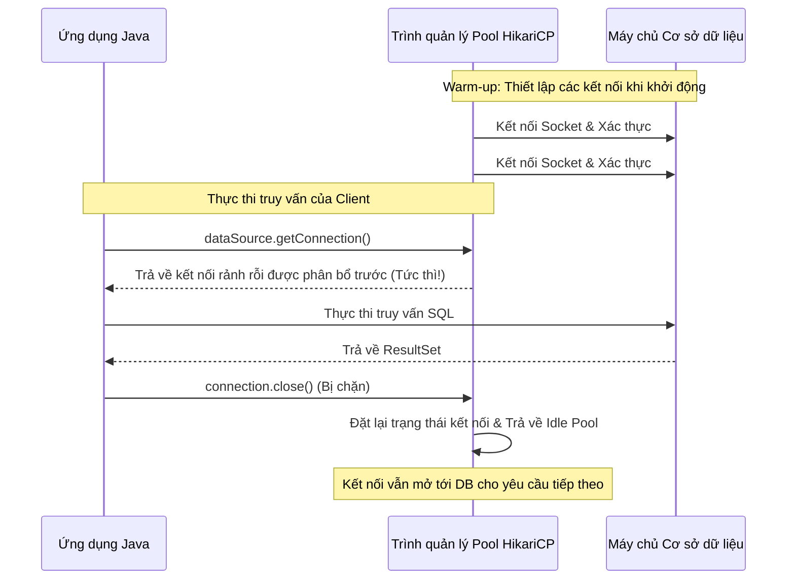

# JDBC - Phần 2

## Mục Tiêu Học Tập

Tài liệu này giải thích các khái niệm JDBC nâng cao: quản lý giao dịch với rollback và savepoint, tối ưu hiệu suất qua batch processing và connection pooling, phòng chống SQL Injection, và các thao tác CRUD cơ bản. Mỗi khái niệm được trình bày kèm cơ chế hoạt động bên trong, lỗi thường gặp, và ví dụ mã nguồn cụ thể.

## Đề Cương Khái Niệm

- **`rollback`** — Hủy bỏ tất cả thay đổi kể từ lần `commit()` gần nhất, giải phóng các database lock mà giao dịch đang nắm giữ.
- **`setAutoCommit`** — Chuyển đổi giữa chế độ tự động commit (mỗi SQL tự commit ngay) và chế độ giao dịch thủ công (nhóm nhiều SQL vào một transaction).
- **`Xử lý theo lô (Batch processing)`** — Gom nhiều câu lệnh SQL vào một lần gửi qua `addBatch()`/`executeBatch()`, giảm số lần round-trip mạng.
- **`Tấn công chèn mã SQL (SQL Injection)`** — Lỗ hổng bảo mật khi đầu vào người dùng thoát khỏi ngữ cảnh string literal và trở thành cú pháp SQL thực thi được.
- **`Nhóm kết nối cơ bản (Basic Connection Pool)`** — Tái sử dụng các kết nối TCP đã thiết lập sẵn thay vì tạo mới mỗi lần, tránh chi phí TCP handshake + xác thực.
- **`DataSource`** — Interface trong `javax.sql` thay thế `DriverManager`, hỗ trợ connection pooling và distributed transactions trong production.
- **`CRUD sử dụng JDBC`** — Bốn thao tác cơ bản: CREATE (INSERT), READ (SELECT), UPDATE, DELETE — thực hiện qua `executeUpdate()` và `executeQuery()`.

## Ghi Chú Chi Tiết

### rollback

`conn.rollback()` ra lệnh cho database **hủy bỏ tất cả thay đổi** đã thực hiện kể từ lần `setAutoCommit(false)` hoặc lần `commit()` gần nhất. Cơ sở dữ liệu sử dụng nhật ký undo (undo log) để khôi phục các hàng đã bị thay đổi về trạng thái trước đó.

**Các quy tắc quan trọng:**
- Rollback chỉ có ý nghĩa khi auto-commit đã bị tắt. Ở chế độ auto-commit (mặc định), mỗi câu lệnh tự commit ngay — không có gì để rollback.
- Sau khi rollback, tất cả database lock (row lock, table lock) mà giao dịch đang nắm giữ sẽ được **giải phóng**, cho phép các phiên làm việc khác truy cập các hàng bị khóa.
- `rollback()` bản thân nó có thể ném `SQLException` nếu Connection đã bị đóng hoặc gặp lỗi mạng. Phải bọc trong try-catch riêng.
- Rollback **không hoàn tác** các thay đổi DDL (`CREATE TABLE`, `ALTER TABLE`) trên hầu hết database (MySQL, Oracle tự động commit DDL).

```java
try {
    conn.setAutoCommit(false);
    // ... thực thi SQL ...
    conn.commit();
} catch (SQLException e) {
    try {
        conn.rollback(); // rollback() cũng có thể ném exception
    } catch (SQLException rollbackEx) {
        rollbackEx.printStackTrace(); // Log lỗi rollback riêng
    }
}
```

### setAutoCommit

`conn.setAutoCommit(boolean)` chuyển đổi Connection giữa hai chế độ:

- **`setAutoCommit(true)`** (mặc định khi mới tạo Connection): Mỗi câu lệnh SQL được coi là một giao dịch riêng và commit ngay lập tức sau khi thực thi. Tiện lợi cho các truy vấn đơn lẻ, nhưng **không thể đảm bảo tính nguyên tử** cho nhiều cập nhật liên quan.
- **`setAutoCommit(false)`**: Tất cả các câu lệnh SQL tiếp theo được nhóm vào một giao dịch duy nhất. Bạn phải gọi `commit()` để lưu hoặc `rollback()` để hủy.

**Quy tắc thực hành:** Luôn khôi phục `setAutoCommit(true)` trong khối `finally` sau khi hoàn tất giao dịch, đặc biệt khi dùng connection pool — nếu không, connection trả về pool vẫn ở chế độ manual commit, gây lỗi cho lần sử dụng tiếp theo.

## Tại Sao Việc Vô Hiệu Hóa Tự Động Commit Thiết Lập Các Ranh Giới Giao Dịch ACID

Theo mặc định, các kết nối JDBC mới hoạt động ở chế độ tự động commit, nơi mỗi câu lệnh SQL riêng lẻ được coi là một giao dịch riêng biệt và được commit ngay lập tức vào cơ sở dữ liệu sau khi thực thi. Mặc dù tiện lợi, mô hình này vi phạm các thuộc tính Tính nguyên tử (Atomicity) và Tính nhất quán (Consistency) của các giao dịch ACID đối với các hoạt động yêu cầu nhiều cập nhật liên quan (chẳng hạn như chuyển tiền giữa hai tài khoản). Nếu một cập nhật thành công và cập nhật tiếp theo thất bại (ví dụ: do gián đoạn mạng hoặc vi phạm quy tắc nghiệp vụ), cơ sở dữ liệu sẽ bị rơi vào trạng thái hỏng, chỉ được cập nhật một phần. Việc vô hiệu hóa tự động commit (`conn.setAutoCommit(false)`) hướng dẫn công cụ cơ sở dữ liệu nhóm tất cả các lệnh SQL tiếp theo vào một khối giao dịch logic duy nhất. Việc kiểm soát thủ công này đảm bảo rằng tất cả các sửa đổi sẽ được hoàn thành cùng nhau thông qua `conn.commit()`, hoặc tất cả các thay đổi sẽ bị loại bỏ hoàn toàn thông qua `conn.rollback()` trong trường hợp xảy ra lỗi, giúp bảo toàn tính nhất quán của cơ sở dữ liệu.

### Tự động Commit hoạt động so với Ranh giới Giao dịch (Mental Model)
```mermaid
flowchart TD
    subgraph Auto-Commit Active [Tự động Commit hoạt động (Mặc định)]
        A[withdraw.executeUpdate()] --> B[Được commit ngay lập tức vào DB]
        B --> C[Sự cố mạng / Thất bại]
        C --> D[deposit.executeUpdate() thất bại]
        D --> E[Trạng thái DB: Tiền đã bị rút nhưng không bao giờ được gửi vào - Không nhất quán!]
    end
    subgraph Auto-Commit Disabled [Tự động Commit bị vô hiệu hóa (Giao dịch)]
        F[withdraw.executeUpdate()] --> G[Trạng thái chờ trong nhật ký giao dịch DB]
        G --> H[Sự cố mạng / Thất bại]
        H --> I[Khối Catch bắt được lỗi]
        I --> J[conn.rollback() được gọi]
        J --> K[Trạng thái DB: Mọi thay đổi bị loại bỏ - Nhất quán!]
    end
```

### Ví Dụ Mã Nguồn: Quản Lý Giao Dịch Khi Vô Hiệu Hóa Tự Động Commit
```java
public void transferMoney(Connection conn, int fromId, int toId, double amount) throws SQLException {
    try {
        // Disable auto-commit to establish transaction boundary
        conn.setAutoCommit(false); 
        
        try (PreparedStatement withdraw = conn.prepareStatement("UPDATE accounts SET balance = balance - ? WHERE id = ?");
             PreparedStatement deposit = conn.prepareStatement("UPDATE accounts SET balance = balance + ? WHERE id = ?")) {
            
            withdraw.setDouble(1, amount);
            withdraw.setInt(2, fromId);
            withdraw.executeUpdate();
            
            // Simulating a runtime error to trigger rollback
            if (true) { throw new SQLException("Simulated network outage"); }
            
            deposit.setDouble(1, amount);
            deposit.setInt(2, toId);
            deposit.executeUpdate();
            
            conn.commit(); // Never reached in this example
        }
    } catch (SQLException e) {
        conn.rollback(); // Discards the withdraw update, maintaining consistency
        System.out.println("Transaction rolled back: " + e.getMessage()); // Prints "Transaction rolled back: Simulated network outage"
    } finally {
        conn.setAutoCommit(true); // Restore default
    }
}
```

### Chuỗi Nguyên Nhân - Kết Quả
`conn.setAutoCommit(false)` được gọi &rarr; Cơ sở dữ liệu ngừng commit các câu lệnh riêng lẻ &rarr; Tất cả các cập nhật được ghi vào nhật ký undo/redo như một khối logic duy nhất &rarr; Ngoại lệ runtime được ném ra &rarr; `conn.rollback()` được gọi trong khối catch &rarr; Cơ sở dữ liệu hủy bỏ các nhật ký giao dịch đang chờ xử lý &rarr; Trạng thái cơ sở dữ liệu được khôi phục về ban đầu, duy trì tính nhất quán ACID.

---

## Tại Sao Savepoint Cho Phép Quay Lui Một Phần Và Cơ Chế Cô Lập Của Chúng

Một `Savepoint` (điểm lưu trữ) cho phép một giao dịch được chia thành các bước logic, cho phép ứng dụng quay lui (roll back) một tập hợp con các cập nhật mà không cần hủy bỏ toàn bộ giao dịch. Điều này cực kỳ hữu ích trong các quy trình phức tạp nơi các tác vụ phụ tùy chọn có thể thất bại nhưng giao dịch chính vẫn phải commit (ví dụ: in nhãn vận chuyển có thể thất bại, nhưng việc thanh toán đơn hàng vẫn phải được ghi nhận).

Khi một `Savepoint` được thiết lập, cơ sở dữ liệu sẽ đánh dấu một trạng thái cụ thể trong nhật ký undo/redo của giao dịch. Nếu một hoạt động quay lui một phần được thực thi (`conn.rollback(savepoint)`), cơ sở dữ liệu chỉ hoàn tác các sửa đổi được thực hiện *sau* điểm lưu trữ đó, trong khi vẫn giữ nguyên các khóa và sửa đổi được thực hiện *trước* điểm lưu trữ. Giao dịch vẫn duy trì trạng thái hoạt động, đảm bảo các thay đổi chưa được commit trước điểm lưu trữ vẫn an toàn.

### Quay lui một phần qua Savepoint (Mental Model)
```text
Bắt đầu Giao dịch (setAutoCommit(false))
      |
[Cập nhật số dư tài khoản]
      |
Tạo Savepoint: conn.setSavepoint("PostBalanceUpdate")
      |
[Cố gắng gửi thông báo SMS (tác vụ phụ thất bại)]
      | (Thất bại)
Quay lui về Savepoint: conn.rollback(savepoint)
      | (Chỉ hoàn tác cập nhật SMS, cập nhật số dư tài khoản vẫn ở trạng thái chờ)
Commit Giao dịch: conn.commit()
      |
DB chỉ hoàn thành việc thay đổi số dư tài khoản.
```

### Ví Dụ Mã Nguồn: Quay Lui Một Phần Sử Dụng Savepoint
```java
import java.sql.*;

public class SavepointDemo {
    public void processOrder(Connection conn) throws SQLException {
        Savepoint savepoint = null;
        try {
            conn.setAutoCommit(false);
            
            // 1. Critical Action: Charge Customer
            try (PreparedStatement charge = conn.prepareStatement("UPDATE accounts SET balance = balance - 50.0 WHERE id = 1")) {
                charge.executeUpdate();
            }
            
            // Set savepoint after critical action
            savepoint = conn.setSavepoint("PaymentMade");
            
            // 2. Non-critical action: Log audit entry (simulating failure)
            try (PreparedStatement log = conn.prepareStatement("INSERT INTO invalid_table (msg) VALUES ('paid')")) {
                log.executeUpdate(); // Will fail due to missing table
            }
            
            conn.commit();
        } catch (SQLException e) {
            if (savepoint != null) {
                // Roll back only the non-critical log insert, keeping the payment update
                conn.rollback(savepoint); 
                conn.commit(); // Finalize payment
                System.out.println("Partial rollback executed: payment charged, audit logged failed.");
            } else {
                conn.rollback(); // Full rollback if payment itself failed
            }
        }
    }
}
```

### Chuỗi Nguyên Nhân - Kết Quả
`Savepoint` được tạo qua `conn.setSavepoint()` &rarr; Cơ sở dữ liệu đánh dấu điểm kiểm tra (checkpoint) trong nhật ký undo của giao dịch &rarr; Câu lệnh phụ thất bại &rarr; `conn.rollback(savepoint)` được gọi &rarr; Cơ sở dữ liệu chỉ hoàn tác các mục nhật ký undo được ghi nhận sau điểm kiểm tra &rarr; Các khóa và thay đổi cơ sở dữ liệu trước điểm kiểm tra vẫn hoạt động &rarr; Giao dịch commit thành công chỉ với các thay đổi chính.

---

### Xử lý theo lô (Batch Processing)

Batch processing gom nhiều câu lệnh SQL vào **một lần gửi** tới database, thay vì gửi từng câu riêng lẻ. Điều này giảm đáng kể số lần round-trip mạng giữa JVM và database server.

**Cơ chế hoạt động:**
1. Gọi `stmt.addBatch()` để thêm câu lệnh hiện tại (với các tham số đã set) vào hàng đợi nội bộ.
2. Khi hàng đợi đủ lớn, gọi `stmt.executeBatch()` để gửi toàn bộ batch trong một lần network call.
3. `executeBatch()` trả về `int[]` — mỗi phần tử là số hàng bị ảnh hưởng bởi câu lệnh tương ứng trong batch.

**Quy tắc thực hành:**
- Gọi `executeBatch()` sau mỗi 500–1000 hàng để tránh `OutOfMemoryError` (hàng đợi giữ tất cả tham số trong bộ nhớ JVM).
- Luôn kết hợp batch processing với `setAutoCommit(false)` — nếu để auto-commit, mỗi câu lệnh trong batch vẫn commit riêng lẻ, mất tính nguyên tử.
- Gọi `executeBatch()` lần cuối **sau** vòng lặp để xử lý các phần tử còn lại không đủ batch size.

**Lỗi thường gặp:** Nếu một câu lệnh trong batch thất bại, driver ném `BatchUpdateException`. Mảng `getUpdateCounts()` của exception này cho biết câu nào đã thực thi thành công và câu nào thất bại. Các câu lệnh **đã thực thi trước đó** không tự động rollback trừ khi bạn tường minh gọi `conn.rollback()`.

### Tấn Công Chèn Mã SQL (SQL Injection)

SQL Injection xảy ra khi đầu vào từ người dùng **thoát ra khỏi ngữ cảnh string literal** trong câu SQL và trở thành cú pháp SQL thực thi được. Cơ chế cụ thể:

1. Ứng dụng ghép chuỗi: `"SELECT * FROM users WHERE name = '" + userInput + "'"`
2. Người dùng nhập: `' OR '1'='1`
3. SQL hoàn chỉnh trở thành: `SELECT * FROM users WHERE name = '' OR '1'='1'`
4. Điều kiện `'1'='1'` luôn đúng → trả về **toàn bộ bảng**.

Kẻ tấn công có thể leo thang: `'; DROP TABLE users; --` để xóa bảng, hoặc `' UNION SELECT credit_card FROM payments --` để đánh cắp dữ liệu.

**Cách phòng chống trong JDBC:** Dùng `PreparedStatement` với placeholder `?`. `PreparedStatement` không ngăn injection bằng cách escape ký tự — nó **tách biệt hoàn toàn cấu trúc SQL và dữ liệu tham số ở cấp giao thức binary**. Database nhận cấu trúc SQL và dữ liệu trong hai gói riêng biệt, nên dữ liệu không bao giờ có thể trở thành cú pháp SQL.

> Xem thêm: Phần "Tại sao PreparedStatement ngăn chặn SQL Injection" trong [01-what-is-jdbc-concepts.md](./01-what-is-jdbc-concepts.md) với sơ đồ mermaid chi tiết.

### Nhóm Kết Nối Cơ Bản (Basic Connection Pool)

Tạo một kết nối vật lý mới tới database là hoạt động **rất tốn kém**: TCP three-way handshake (~1 RTT), trao đổi xác thực và ủy quyền (~1-2 RTT), cấp phát bộ nhớ và tiến trình phía server. Một kết nối MySQL mới mất khoảng 20-50ms — trong ứng dụng web xử lý 1000 request/giây, điều này là thảm họa.

**Cơ chế Connection Pool:**
1. **Khởi động ứng dụng:** Pool tạo sẵn N kết nối vật lý (ví dụ: `minimumIdle=5`) và giữ chúng mở.
2. **Khi cần kết nối:** `dataSource.getConnection()` trả về một kết nối rảnh rỗi từ pool — tức thì, không có TCP handshake.
3. **Khi trả kết nối:** `connection.close()` **KHÔNG đóng socket TCP**. Thay vào đó, pool chặn lời gọi close, reset trạng thái kết nối (xóa transaction, bảng tạm), và trả nó về pool.
4. **Health check:** Pool định kỳ kiểm tra kết nối còn sống không (ví dụ: gửi `SELECT 1`) và thay thế kết nối đã chết.

**Framework phổ biến:** HikariCP (mặc định trong Spring Boot) — nhẹ, nhanh, cấu hình tối thiểu. Cấu hình quan trọng nhất: `maximumPoolSize` (giới hạn số kết nối đồng thời).

### DataSource

`DataSource` là interface trong package `javax.sql`, được thiết kế để thay thế `DriverManager` trong production. Thay vì gọi `DriverManager.getConnection(url, user, pass)` trực tiếp, bạn cấu hình một đối tượng `DataSource` (thường thông qua HikariCP, Tomcat JDBC Pool, hoặc container JNDI) và gọi `dataSource.getConnection()`.

**Tại sao DataSource ưu việt hơn DriverManager:**
- **Connection Pooling:** `DataSource` hỗ trợ pool tích hợp — `DriverManager` luôn tạo kết nối mới.
- **Cấu hình tập trung:** URL, user, password, pool size được cấu hình ở một chỗ, không rải rác trong code.
- **Distributed Transactions:** `XADataSource` (mở rộng của `DataSource`) hỗ trợ giao dịch phân tán qua nhiều database.
- **JNDI Lookup:** Trong application server (Tomcat, WildFly), `DataSource` được đăng ký qua JNDI và tra cứu bằng tên logic.

```java
// Cấu hình DataSource với HikariCP
HikariConfig config = new HikariConfig();
config.setJdbcUrl("jdbc:mysql://localhost:3306/mydb");
config.setUsername("root");
config.setPassword("secret");
config.setMaximumPoolSize(10);
DataSource dataSource = new HikariDataSource(config);

// Sử dụng — giống hệt DriverManager nhưng có pool
try (Connection conn = dataSource.getConnection()) {
    // ...
}
```

## Tại Sao Nhóm Kết Nối Cơ Sở Dữ Liệu Lại Mang Lại Hiệu Năng Vượt Trội

Thiết lập một kết nối vật lý mới tới cơ sở dữ liệu là một hoạt động cực kỳ tốn kém vì nó yêu cầu thực hiện bắt tay ba bước TCP (TCP three-way handshake), trao đổi thông tin xác thực và ủy quyền cơ sở dữ liệu, cũng như cấp phát bộ nhớ và tài nguyên tiến trình phía máy chủ. Trong các ứng dụng web có lưu lượng truy cập cao, việc khởi tạo một kết nối mới cho mỗi yêu cầu HTTP đến sẽ tạo ra một nút thắt hiệu năng khổng lồ và nhanh chóng làm cạn kiệt tài nguyên cơ sở dữ liệu.

Các framework nhóm kết nối (chẳng hạn như HikariCP hoặc Apache Commons DBCP) giải quyết vấn đề này bằng cách thiết lập một nhóm (pool) các kết nối cơ sở dữ liệu vật lý đang hoạt động khi khởi động ứng dụng. Khi ứng dụng yêu cầu một kết nối thông qua `dataSource.getConnection()`, trình quản lý pool sẽ ngay lập tức bàn giao một kết nối rảnh rỗi (idle) đã được thiết lập sẵn từ pool. Khi gọi `connection.close()`, kết nối không thực sự bị đóng vật lý; thay vào đó, trình quản lý pool chặn cuộc gọi đóng đó, đặt lại trạng thái kết nối và trả nó về pool để tái sử dụng.

### Pre-allocated Connections vs. Manual Handshakes (Mental Model)


### Ví Dụ Mã Nguồn: Tái Sử Dụng Kết Nối Với HikariCP
```java
import com.zaxxer.hikari.HikariConfig;
import com.zaxxer.hikari.HikariDataSource;
import java.sql.Connection;
import java.sql.ResultSet;
import java.sql.Statement;

public class ConnectionPoolDemo {
    private static HikariDataSource dataSource;

    static {
        HikariConfig config = new HikariConfig();
        config.setJdbcUrl("jdbc:h2:mem:test;DB_CLOSE_DELAY=-1");
        config.setUsername("sa");
        config.setPassword("");
        config.setMaximumPoolSize(10); // Hold up to 10 reusable connections
        dataSource = new HikariDataSource(config);
    }

    public static void runQuery() throws Exception {
        // getConnection returns a pooled connection in milliseconds
        try (Connection conn = dataSource.getConnection(); 
             Statement stmt = conn.createStatement();
             ResultSet rs = stmt.executeQuery("SELECT 1")) {
            if (rs.next()) {
                System.out.println("Result: " + rs.getInt(1)); // Outputs "Result: 1"
            }
        } // conn.close() returns connection to pool, does not close socket
    }
}
```

### Chuỗi Nguyên Nhân - Kết Quả
Pool được thiết lập khi khởi động &rarr; Các socket vật lý đang hoạt động được tạo và xác thực &rarr; `getConnection()` truy vấn trình quản lý pool &rarr; Socket rảnh rỗi được lấy ra và trả về trong thời gian dưới mili giây &rarr; `close()` đặt lại trạng thái phiên và giải phóng socket trả lại trình quản lý pool &rarr; Không cần ngắt socket hay xác thực lại &rarr; Độ trễ giảm và mức sử dụng CPU của máy chủ cơ sở dữ liệu được hạ thấp.

---

### CRUD sử dụng JDBC

CRUD là bốn thao tác cơ bản khi làm việc với cơ sở dữ liệu qua JDBC:

- **CREATE** → `INSERT INTO table (...) VALUES (...)` → dùng `executeUpdate()`, trả về số hàng được thêm (thường là 1).
- **READ** → `SELECT ... FROM table WHERE ...` → dùng `executeQuery()`, trả về `ResultSet` chứa các hàng kết quả.
- **UPDATE** → `UPDATE table SET ... WHERE ...` → dùng `executeUpdate()`, trả về số hàng bị thay đổi.
- **DELETE** → `DELETE FROM table WHERE ...` → dùng `executeUpdate()`, trả về số hàng bị xóa.

**Quy tắc quan trọng:**
- Luôn dùng `PreparedStatement` với placeholder `?` cho mọi thao tác CRUD — không bao giờ ghép chuỗi.
- Kiểm tra giá trị trả về của `executeUpdate()`: nếu trả về 0, có nghĩa là không có hàng nào bị ảnh hưởng (ví dụ: WHERE clause không khớp hàng nào).
- Để lấy auto-generated key sau INSERT: dùng `conn.prepareStatement(sql, Statement.RETURN_GENERATED_KEYS)` rồi `stmt.getGeneratedKeys()`.

```java
// INSERT và lấy auto-generated ID
String sql = "INSERT INTO users (name, email) VALUES (?, ?)";
try (PreparedStatement stmt = conn.prepareStatement(sql, Statement.RETURN_GENERATED_KEYS)) {
    stmt.setString(1, "Alice");
    stmt.setString(2, "alice@example.com");
    int rowsInserted = stmt.executeUpdate(); // returns 1
    
    try (ResultSet keys = stmt.getGeneratedKeys()) {
        if (keys.next()) {
            long newId = keys.getLong(1);
            System.out.println("New user ID: " + newId);
        }
    }
}
```

## Câu Hỏi Ôn Tập

- Nếu quên gọi `conn.commit()` sau khi `setAutoCommit(false)`, điều gì xảy ra với dữ liệu khi connection bị đóng?
- Savepoint hữu ích trong tình huống nào? Cho một ví dụ thực tế ngoài ví dụ chuyển khoản.
- Tại sao `connection.close()` trong connection pool không thực sự đóng kết nối TCP? Điều gì xảy ra nếu pool không reset trạng thái connection trước khi tái sử dụng?
- Khi `executeBatch()` thất bại ở giữa batch, các câu lệnh đã thực thi trước đó có bị rollback không? Cần làm gì để đảm bảo tính nguyên tử?
- `DataSource` khác `DriverManager` ở những điểm nào? Tại sao production code nên dùng `DataSource`?
- `executeUpdate()` trả về `0` có nghĩa là lỗi không? Khi nào trả về `0` là hành vi bình thường?

## Các Ví Dụ Mã Nguồn

### Quản Lý Giao Dịch (commit và rollback)
```java
Connection conn = null;
try {
    conn = dataSource.getConnection();
    conn.setAutoCommit(false); // Enable manual transaction control
    
    try (PreparedStatement withdraw = conn.prepareStatement("UPDATE accounts SET balance = balance - ? WHERE id = ?");
         PreparedStatement deposit = conn.prepareStatement("UPDATE accounts SET balance = balance + ? WHERE id = ?")) {
         
        withdraw.setDouble(1, 100.0);
        withdraw.setInt(2, 1);
        withdraw.executeUpdate();
        
        deposit.setDouble(1, 100.0);
        deposit.setInt(2, 2);
        deposit.executeUpdate();
        
        conn.commit(); // Commit if both succeed
    }
} catch (Exception e) {
    if (conn != null) {
        try {
            conn.rollback(); // Rollback on error
        } catch (SQLException ex) {
            ex.printStackTrace();
        }
    }
} finally {
    if (conn != null) {
        try {
            conn.close();
        } catch (SQLException ex) {
            ex.printStackTrace();
        }
    }
}
```

### Xử Lý Theo Lô
```java
String sql = "INSERT INTO logs (message, created_at) VALUES (?, ?)";
try (Connection conn = dataSource.getConnection();
     PreparedStatement stmt = conn.prepareStatement(sql)) {
     
    conn.setAutoCommit(false);
    
    for (int i = 0; i < 1000; i++) {
        stmt.setString(1, "Log message " + i);
        stmt.setTimestamp(2, new java.sql.Timestamp(System.currentTimeMillis()));
        stmt.addBatch();
        
        if (i % 100 == 0) {
            stmt.executeBatch(); // Execute every 100 items
        }
    }
    stmt.executeBatch(); // Execute remaining items
    conn.commit();
}
```

## Các Lỗi Thường Gặp

- **Giả định tự động Commit mặc định tắt**: Theo mặc định, các kết nối cơ sở dữ liệu mới ở chế độ tự động commit. Bạn phải gọi `conn.setAutoCommit(false)` một cách tường minh để bắt đầu một giao dịch.
- **Quên không Commit**: Nếu tự động commit bị vô hiệu hóa và bạn thực thi các câu lệnh insert/update, bạn phải gọi `conn.commit()`. Nếu không gọi nó, cơ sở dữ liệu sẽ loại bỏ các thay đổi khi kết nối bị đóng hoặc bị thu gom rác.
- **Không xử lý ngoại lệ khi Rollback**: Nếu xảy ra lỗi trong quá trình thực thi giao dịch, việc gọi `conn.rollback()` cũng có thể ném ra một `SQLException`. Điều này nên được xử lý đúng cách trong một khối try-catch lồng nhau bên trong khối catch chính.

> Xem thêm: Cấu trúc phân cấp ngoại lệ và cách xử lý Checked Exception trong Java, được trình bày chi tiết trong [Ch.12 - Exception Handling](../../no12_exception_handling/README.md).

## Liên Kết Tham Khảo (Reference Links)

- https://docs.oracle.com/javase/tutorial/jdbc/basics/transactions.html (Sử dụng Giao dịch trong JDBC)
- https://docs.oracle.com/en/java/javase/21/docs/api/java.sql/java/sql/Connection.html#setAutoCommit(boolean) (Tài liệu Connection setAutoCommit JavaDoc)
- https://docs.oracle.com/en/java/javase/21/docs/api/java.sql/java/sql/Savepoint.html (Tài liệu Savepoint JavaDoc)
- https://github.com/brettwooldridge/HikariCP (Tham khảo dự án HikariCP trên GitHub)
