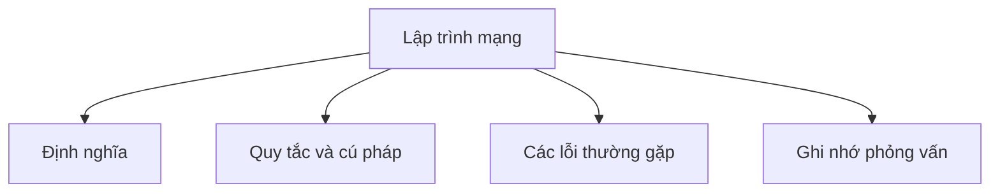

# 35 - Lập trình mạng (Networking)

Chủ đề này bám sát đề cương chính trong [outline.md](../outline.md). Mục tiêu là hiểu sâu sắc từng khái niệm để có thể giải thích, nhận biết trong mã nguồn và trả lời các câu hỏi phỏng vấn.

## Thứ tự học tập (Study Order)

- [Các khái niệm lập trình socket (Socket Programming Concepts)](theory/01-socket-programming-concepts.md)
- [Các khái niệm về HttpURLConnection (HttpURLConnection Concepts)](theory/02-httpurlconnection-concepts.md)
- [Thuật ngữ khóa (Key Terms)](terms/01-key-terms.md)

## Danh sách kiểm tra đề cương (Outline Checklist)

- Lập trình socket
- Socket TCP (TCP Socket)
- Socket UDP (UDP Socket)
- Socket
- ServerSocket
- DatagramSocket
- InetAddress
- đường dẫn URL (URL)
- định danh tài nguyên thống nhất (URI)
- Yêu cầu HTTP cơ bản (Basic HTTP Request)
- HttpURLConnection
- Java 11 HttpClient
- Mô hình khách-chủ (Client-Server Model)

## Tự kiểm tra (Self-Check)

Trước khi chuyển sang chủ đề tiếp theo, hãy đảm bảo rằng bạn có thể trả lời các câu hỏi sau:
1. Tại sao giao thức TCP (TCP) yêu cầu giai đoạn thiết lập kết nối (bắt tay) (Connection Establishment Phase (Handshake)) sử dụng `Socket` và `ServerSocket`, trong khi giao thức UDP (UDP) lại thực hiện truyền gói tin không hướng kết nối (Connectionless Packet Transfer) sử dụng `DatagramSocket`?
   &rarr; Xem [Tại sao quá trình bắt tay TCP khác với UDP không hướng kết nối](theory/01-socket-programming-concepts.md#why-tcp-handshakes-differ-from-connectionless-udp)
2. Tại sao việc chạy các thao tác vào/ra socket chặn (Blocking Socket I/O Operation) (như `accept()` hoặc `read()`) trực tiếp trên luồng chính (Main Thread) của ứng dụng lại là một lỗi nghiêm trọng, và đa luồng (Multithreading) giải quyết vấn đề này như thế nào?
   &rarr; Xem [Tại sao các thao tác socket chặn không được chạy trên luồng chính](theory/01-socket-programming-concepts.md#why-blocking-socket-operations-must-not-run-on-the-main-thread)
3. Tại sao Java 20 lại đánh dấu lỗi thời (Deprecate) các hàm khởi tạo URL (URL Constructor) (như `new URL(string)`), và tại sao việc khởi tạo (Instantiate) URI trước rồi chuyển đổi bằng `uri.toURL()` lại được ưu tiên hơn?
   &rarr; Xem [Tại sao Java 20 đánh dấu lỗi thời các hàm khởi tạo URL để ưu tiên URI](theory/01-socket-programming-concepts.md#why-java-20-deprecated-url-constructors-in-favor-of-uri)
4. Tại sao `HttpURLConnection` gặp phải các giới hạn hiệu năng (Performance Limitation) (ví dụ: API chặn (Blocking API), quản lý tài nguyên (Resource Management) phức tạp), và làm thế nào `HttpClient` hiện đại của Java 11 có thể cải thiện hiệu năng và hỗ trợ thực thi bất đồng bộ (Asynchronous Execution)?
   &rarr; Xem [Tại sao HttpClient của Java 11 thay thế HttpURLConnection](theory/02-httpurlconnection-concepts.md#why-java-11-httpclient-supersedes-httpurlconnection)
5. Tại sao các luồng socket (Socket Stream) và socket phải được đóng đúng cách, và những hậu quả ở cấp độ hệ điều hành (OS-Level Consequence) (ví dụ: ngoại lệ liên kết cổng (Port Binding Exception), rò rỉ bộ mô tả tệp (File Descriptor Leak)) nếu không làm như vậy là gì?
   &rarr; Xem [Tại sao socket và luồng phải được đóng đúng cách](theory/01-socket-programming-concepts.md#why-sockets-and-streams-must-be-closed-properly)

## Thẻ Anki (Anki Cards)

- [Cơ bản (Basic)](anki/basic.tsv)
- [Cơ bản bổ sung (Basic Extra)](anki/basic-extra.tsv)
- [Điền vào chỗ trống (Cloze)](anki/cloze.tsv)
- [Câu hỏi lập trình (Code Question)](anki/code-question.tsv)

## Sơ đồ tổng quan Mermaid (Mermaid Overview)

## Liên kết tham khảo (Reference Links)

- https://docs.oracle.com/javase/tutorial/networking/
- https://docs.oracle.com/en/java/javase/21/docs/api/java.base/java/net/package-summary.html
