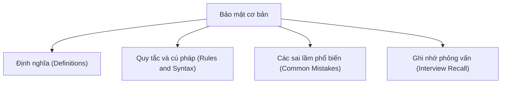

# 36 - Bảo mật cơ bản (Basic Security)

Chủ đề này tuân theo đề cương chính trong [outline.md](../outline.md). Mục tiêu là hiểu sâu sắc từng khái niệm để có thể giải thích, nhận diện trong mã nguồn và trả lời các câu hỏi phỏng vấn.

## Thứ tự học tập (Study Order)

- [Các khái niệm lập trình bảo mật cơ bản (Basic Secure Coding Concepts)](theory/01-basic-secure-coding-concepts.md)
- [Các khái niệm tránh giải tuần tự hóa không an toàn (Avoid Insecure Deserialization Concepts)](theory/02-avoid-insecure-deserialization-concepts.md)
- [Các thuật ngữ chính (Key Terms)](terms/01-key-terms.md)

## Danh sách kiểm tra đề cương (Outline Checklist)

- Lập trình bảo mật cơ bản
- Băm (Hashing)
- MessageDigest
- SHA-256
- Base64
- Mã hóa (Encryption)/giải mã (Decryption) cơ bản
- KeyStore
- SSL/TLS cơ bản
- Kiểm chứng dữ liệu đầu vào (Input Validation)
- Tránh tấn công chèn mã SQL (SQL Injection)
- Tránh giải tuần tự hóa không an toàn

## Thẻ Anki (Anki Cards)

- [Cơ bản](anki/basic.tsv)
- [Cơ bản bổ sung](anki/basic-extra.tsv)
- [Điền vào chỗ trống (Cloze)](anki/cloze.tsv)
- [Câu hỏi mã nguồn (Code Question)](anki/code-question.tsv)

## Tự kiểm tra (Self-Check)

Trước khi chuyển sang chủ đề tiếp theo, hãy đảm bảo rằng bạn có thể trả lời các câu hỏi sau:
1. Tại sao SHA-256 lại là một hàm một chiều (One-way function), và đặc tính nào (kháng va chạm (Collision Resistance)) khiến băm mật mã (Cryptographic Hashing) phù hợp cho việc lưu trữ mật khẩu (Password Storage) và xác minh tính toàn vẹn dữ liệu (Data Integrity Verification)?
   &rarr; Xem [Tại sao băm mật mã lại là hàm một chiều và kháng va chạm](theory/01-basic-secure-coding-concepts.md#why-cryptographic-hashing-is-one-way-and-collision-resistant)
2. Tại sao mã hóa Base64 (Base64 Encoding) KHÔNG phải là mã hóa, và nguy cơ bảo mật nào phát sinh khi các lập trình viên nhầm lẫn giữa việc mã hóa dữ liệu với tính bảo mật (Confidentiality)?
   &rarr; Xem [Tại sao Base64 là mã hóa dữ liệu chứ không phải mã hóa](theory/01-basic-secure-coding-concepts.md#why-base64-is-encoding-not-encryption)
3. Tại sao phải sử dụng `SecureRandom` thay vì `Random` để tạo khóa mật mã (Cryptographic Key) và vector khởi tạo (Initialization Vector - IV), và việc hạt giống (Seed) của bộ tạo số giả ngẫu nhiên (Pseudo-Random Number Generator - PRNG) có thể dự đoán được sẽ phá vỡ tính bảo mật của mã hóa như thế nào?
   &rarr; Xem [Tại sao SecureRandom lại cần thiết cho các giá trị mật mã](theory/01-basic-secure-coding-concepts.md#why-securerandom-is-required-for-cryptographic-values)
4. Tại sao quá trình giải tuần tự hóa đối tượng mặc định của Java lại thực thi các hàm khởi dựng (Constructor) và mã nguồn tùy ý của lớp, và `ObjectInputFilter` giảm thiểu nguy cơ thực thi mã từ xa (Remote Code Execution - RCE) như thế nào?
   &rarr; Xem [Tại sao giải tuần tự hóa không an toàn lại cho phép thực thi mã từ xa](theory/02-avoid-insecure-deserialization-concepts.md#why-insecure-deserialization-enables-remote-code-execution)
5. Tại sao dữ liệu nhạy cảm (như mật khẩu) nên được lưu trữ trong `char[]` thay vì `String`, và cơ chế bộ nhớ JVM nào khiến việc lưu giữ chuỗi (String retention) trở thành một nguy cơ bảo mật (Security Liability)?
   &rarr; Xem [Tại sao mật khẩu không được lưu trữ trong String](theory/01-basic-secure-coding-concepts.md#why-passwords-must-not-be-stored-in-strings)

## Liên kết tham khảo (Reference Links)

- https://docs.oracle.com/javase/tutorial/security/
- https://docs.oracle.com/en/java/javase/21/security/
