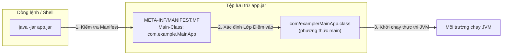
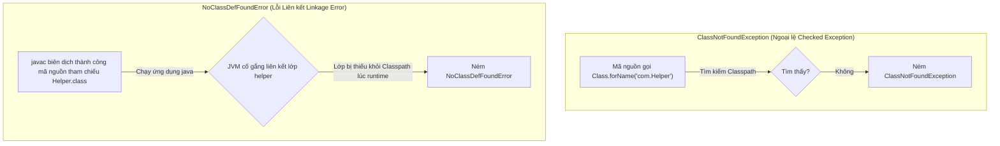
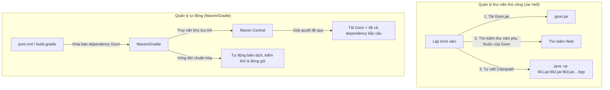

# Biên Dịch, Đóng Gói, Thực Thi - Phần 1 (Build, Compile, Run - Part 1)

## Mục Tiêu Học Tập (Learning Goal)

Tài liệu này trình bày một phần trọng tâm của **Biên Dịch, Đóng Gói, Thực Thi (Build, Compile, Run)**. Hãy nghiên cứu từng khái niệm dưới dạng một quy tắc thực hành trong Java, thay vì chỉ ghi nhớ các thuật ngữ riêng lẻ.

## Khung Nội Dung (Outline Coverage)

- **`javac`** — javac: Cung cấp các quy tắc và cơ chế hoạt động cụ thể trong Java.
- **`java`** — java: Cung cấp các quy tắc và cơ chế hoạt động cụ thể trong Java.
- **`jar`** — jar: Cung cấp các quy tắc và cơ chế hoạt động cụ thể trong Java.
- **`Create JAR file`** — Create JAR file: Cung cấp các quy tắc và cơ chế hoạt động cụ thể trong Java.
- **`Executable JAR`** — Executable JAR: Cung cấp các quy tắc và cơ chế hoạt động cụ thể trong Java.
- **`Classpath`** — Classpath: Cung cấp các quy tắc và cơ chế hoạt động cụ thể trong Java.
- **`Manifest file`** — Manifest file: Cung cấp các quy tắc và cơ chế hoạt động cụ thể trong Java.
- **`Basic Maven`** — Basic Maven: Cung cấp các quy tắc và cơ chế hoạt động cụ thể trong Java.
- **`Basic Gradle`** — Basic Gradle: Cung cấp các quy tắc và cơ chế hoạt động cụ thể trong Java.
- **`Dependency management`** — Dependency management: Cung cấp các quy tắc và cơ chế hoạt động cụ thể trong Java.

## Ghi Chú Chi Tiết (Detailed Notes)

### javac

Trình biên dịch Java (`javac`) đọc các tệp mã nguồn `.java` và dịch chúng thành các tệp mã byte (`.class`) độc lập với nền tảng phần cứng.

- **Cú pháp & Cờ cấu hình (Syntax & Flags)**:
  - `javac [options] [sourcefiles]`
  - Cờ phổ biến: `-d <directory>` chỉ định thư mục đích để lưu trữ các tệp `.class` sau khi biên dịch.
- **Ví dụ Thực tế (Runnable Example)**:
  ```bash
  # Biên dịch một tệp Java đơn lẻ, đặt tệp .class kết quả ở thư mục hiện tại
  javac HelloWorld.java

  # Biên dịch chỉ định thư mục đích (tự động tạo các thư mục con tương ứng với package nếu cần)
  javac -d bin src/com/example/HelloWorld.java
  ```

- **Sai Lầm Phổ Biến / Chế Độ Lỗi (Common Mistake / Failure Mode)**:
  - Truyền tên lớp đã biên dịch hoặc tệp class thay vì tệp mã nguồn, hoặc bỏ quên đuôi `.java`:
    ```bash
    javac HelloWorld     # LỖI: Tên lớp 'HelloWorld' chỉ được chấp nhận nếu yêu cầu xử lý annotation rõ ràng
    javac HelloWorld.class # SAI: Không thể biên dịch một tệp class đã biên dịch!
    ```
  - Lỗi biên dịch xảy ra nếu các lớp phụ thuộc bị thiếu trong classpath. Sử dụng cờ `-cp` để cung cấp chúng:
    ```bash
    javac -cp libs/gson.jar -d bin src/com/example/MyParser.java
    ```

---

### java

Công cụ khởi chạy ứng dụng Java (`java`) sẽ khởi động Máy ảo Java (JVM), tải lớp được chỉ định và thực thi phương thức `public static void main(String[] args)` của lớp đó.

- **Cú pháp & Cờ cấu hình (Syntax & Flags)**:
  - `java [options] mainclass [args]`
  - `java -cp <classpath> com.example.MainApp`
- **Ví dụ Thực tế (Runnable Example)**:
  ```bash
  # Chạy lớp HelloWorld (được tải từ thư mục hiện tại)
  java HelloWorld

  # Chạy lớp có tên đầy đủ (fully qualified name) bằng cách sử dụng classpath được chỉ định
  java -cp bin com.example.MainApp

  # Thực thi tệp nguồn đơn lẻ (Java 11+): biên dịch trực tiếp và chạy trong bộ nhớ mà không tạo ra tệp .class vật lý
  java HelloWorld.java
  ```

- **Sai Lầm Phổ Biến / Chế Độ Lỗi (Common Mistake / Failure Mode)**:
  - Chỉ định đuôi `.class` khi chạy câu lệnh:
    ```bash
    java HelloWorld.class
    # LỖI: Could not find or load main class HelloWorld.class
    ```
  - Chỉ định đường dẫn thư mục thay vì tên lớp đầy đủ ngăn cách bằng dấu chấm:
    ```bash
    java com/example/MainApp
    # LỖI: Could not find or load main class com/example/MainApp
    # Dạng đúng: java -cp bin com.example.MainApp
    ```

---

### jar

Công cụ lưu trữ Java (`jar`) được sử dụng để đóng gói nhiều tệp class, tài nguyên (như biểu tượng, thuộc tính cấu hình, hình ảnh) và siêu dữ liệu thành một tệp nén duy nhất (dựa trên định dạng ZIP).

- **Mô hình Tư duy (Mental Model)**: Một tệp `.jar` thực chất là một tệp ZIP có chứa một thư mục/tệp đặc biệt `META-INF/MANIFEST.MF` bên trong. Nó giúp đơn giản hóa việc triển khai và phân phối ứng dụng.
- **Ví dụ Thực tế (Runnable Example)**:
  ```bash
  # Liệt kê nội dung của một tệp JAR hiện có (t: danh sách, f: tệp)
  jar -tf app.jar

  # Giải nén nội dung của một tệp JAR (x: giải nén, f: tệp)
  jar -xf app.jar
  ```

- **Sai Lầm Phổ Biến / Chế Độ Lỗi (Common Mistake / Failure Mode)**:
  - Lầm tưởng rằng các tệp `.jar` là các tệp nhị phân đã biên dịch an toàn tuyệt đối. Vì chúng chỉ là các tệp ZIP, chúng có thể dễ dàng bị giải nén hoặc dịch ngược (decompile) bằng các công cụ như CFR hoặc JD-GUI. Do đó, không bao giờ được mã hóa cứng các thông tin nhạy cảm (như thông tin xác thực) bên trong chúng.

---

### Tạo tệp JAR (Create JAR file)

Đóng gói các tệp đã biên dịch và tài nguyên thành một gói `.jar` bằng lệnh CLI `jar`.

- **Các Cờ Quan Trọng (Key Flags)**:
  - `-c` (create): Tạo một tệp lưu trữ mới.
  - `-f` (file): Chỉ định tên tệp lưu trữ kết quả.
  - `-v` (verbose): Xuất thông tin chi tiết của các tệp đang được nén.
  - `-C <dir>` (change directory): Tạm thời chuyển thư mục làm việc để lấy các tệp, giúp giữ nguyên đường dẫn tương đối của chúng trong JAR.
- **Ví dụ Thực tế (Runnable Example)**:
  ```bash
  # Đóng gói tất cả các lớp trong thư mục hiện tại
  jar -cvf myapp.jar *.class

  # Đóng gói các lớp từ thư mục 'bin' và loại bỏ tiền tố 'bin/' ra khỏi đường dẫn đóng gói
  jar -cvf myapp.jar -C bin/ .
  ```

- **Sai Lầm Phổ Biến / Chế Độ Lỗi (Common Mistake / Failure Mode)**:
  - Không khớp đường dẫn đóng gói với khai báo gói (package):
    Nếu lớp của bạn được định nghĩa là `package com.example;`, tệp class của nó phải được đóng gói đúng cấu trúc thư mục `com/example/MyClass.class` bên trong tệp JAR. Nếu bạn đóng gói từ *bên trong* thư mục `com/example` trực tiếp (khiến `MyClass.class` nằm ở gốc của tệp JAR), JVM sẽ thất bại khi chạy ứng dụng và ném ra lỗi `NoClassDefFoundError` hoặc `ClassNotFoundException`.

---

### Tệp JAR có thể thực thi (Executable JAR)

Một tệp JAR có thể thực thi được đóng gói kèm theo tệp siêu dữ liệu `META-INF/MANIFEST.MF` khai báo lớp điểm vào (entry-point class) thông qua thuộc tính `Main-Class`. Nó có thể chạy trực tiếp bằng cú pháp `java -jar`.

- **Ví dụ Thực tế (Runnable Example)**:
  ```bash
  # Chạy trực tiếp một tệp JAR có thể thực thi
  java -jar myapp.jar

  # Tạo một tệp JAR có thể thực thi và chỉ định trực tiếp lớp điểm vào bằng cờ 'e'
  jar -cfe myapp.jar com.example.MainApp -C bin/ .
  ```

- **Sai Lầm Phổ Biến / Chế Độ Lỗi (Common Mistake / Failure Mode)**:
  - Cố gắng chạy một tệp JAR không thể thực thi (không định nghĩa `Main-Class` trong manifest):
    ```bash
    java -jar library.jar
    # LỖI: no main manifest attribute, in library.jar
    ```
    Để khắc phục, hãy chạy nó bằng cách thêm tệp JAR vào classpath và chỉ định rõ lớp cần chạy:
    ```bash
    java -cp library.jar com.example.MainApp
    ```

### Tại Sao Các Tệp JAR Có Thể Thực Thi Cần MANIFEST.MF (Why Executable JARs Need MANIFEST.MF)

Khi bạn chạy một tệp JAR bằng lệnh `java -jar app.jar`, Máy ảo Java cần biết lớp nào chứa điểm vào của ứng dụng (phương thức `public static void main`) để bắt đầu thực thi. Không giống như việc thực thi lớp thông thường khi bạn truyền trực tiếp tên lớp, lệnh `java -jar` giao phó việc tìm kiếm này hoàn toàn cho siêu dữ liệu bên trong tệp JAR. Siêu dữ liệu này được lưu trữ trong tệp `META-INF/MANIFEST.MF`, cụ thể là dưới thuộc tính `Main-Class`. Nếu thuộc tính này bị thiếu, JVM không thể xác định điểm bắt đầu và sẽ dừng chạy lập tức. Ngoài ra, thuộc tính `Class-Path` trong manifest chỉ cho JVM biết nơi tìm các thư viện phụ thuộc bên ngoài tương đối so với tệp JAR, giúp loại bỏ việc phải chỉ định các câu lệnh `-cp` dài dòng khi chạy.

#### Mô hình Tư duy: Điểm Vào Tệp JAR Có Thể Thực Thi (Mental Model: Executable JAR Entry Point)


#### Ví Dụ Thực Tế (Runnable Example)
Giả sử bạn có tệp manifest tên là `custom-manifest.txt` với một dòng trống ở cuối:
```text
Manifest-Version: 1.0
Main-Class: com.example.MainApp
Class-Path: libs/gson-2.10.1.jar

```
Nếu bạn build JAR mà không có manifest này hoặc thiếu dòng trống ở cuối:
```bash
# Thử chạy khi không có manifest hoặc cấu trúc manifest bị lỗi:
java -jar myapp.jar
# Kết quả: no main manifest attribute, in myapp.jar
```

#### Chuỗi Nhân Quả (Cause-Effect Chain)
Lệnh `java -jar app.jar` được thực thi &rarr; JVM kiểm tra tệp `META-INF/MANIFEST.MF` bên trong tệp JAR &rarr; JVM không tìm thấy thuộc tính `Main-Class` (do thiếu thuộc tính hoặc thiếu dòng trống ở cuối tệp manifest) &rarr; JVM không biết phương thức `main` của lớp nào để chạy &rarr; Quá trình khởi động bị hủy bỏ với lỗi `no main manifest attribute`.

---

### Đường dẫn lớp (Classpath)

Đường dẫn lớp định nghĩa danh sách các thư mục hoặc tệp JAR mà trình biên dịch (`javac`) và JVM (`java`) sử dụng để tìm kiếm các lớp tự định nghĩa, các package và các thư viện của bên thứ ba.

- **Ví dụ Thực tế (Runnable Example)**:
  ```bash
  # Trên hệ điều hành Linux/macOS (dấu phân cách classpath là dấu hai chấm ':')
  java -cp bin:libs/mysql-connector.jar com.example.MainApp

  # Trên hệ điều hành Windows (dấu phân cách classpath là dấu chấm phẩy ';')
  java -cp bin;libs\mysql-connector.jar com.example.MainApp
  ```

- **Sai Lầm Phổ Biến / Chế Độ Lỗi (Common Mistake / Failure Mode)**:
  - **Sử dụng sai dấu phân cách**: Sử dụng `;` trên Linux/macOS hoặc `:` trên Windows sẽ làm hỏng quá trình phân tích đường dẫn.
  - **Ghi đè thư mục hiện tại ngầm định**: Khi bạn chỉ định `-cp` hoặc `-classpath`, đường dẫn tìm kiếm mặc định `.` (thư mục hiện tại) sẽ tự động bị tắt bỏ. Nếu chương trình của bạn dựa vào các lớp trong thư mục hiện tại, bạn phải thêm dấu `.` vào classpath một cách rõ ràng (ví dụ: `-cp .:libs/helper.jar`).

### Tại Sao Tìm Kiếm Đường Dẫn Lớp Thất Bại: NoClassDefFoundError vs ClassNotFoundException (Why Classpath Resolution Fails)

JVM thực hiện phân tích và nạp các lớp một cách động trong thời gian chạy khi chúng được tham chiếu bởi mã đang thực thi. Khi JVM cố gắng tải một lớp và thất bại, nó sẽ ném ra một trong hai lỗi: `ClassNotFoundException` hoặc `NoClassDefFoundError`. `ClassNotFoundException` là một ngoại lệ được kiểm tra (checked exception) xảy ra khi ứng dụng cố gắng tải một lớp một cách động bằng tên chuỗi của nó (ví dụ: sử dụng `Class.forName()`, `ClassLoader.loadClass()`, hoặc `ClassLoader.findSystemClass()`) nhưng lớp đó không thể tìm thấy trên classpath. Mặt khác, `NoClassDefFoundError` là một lỗi thời gian chạy (runtime error - lớp con của `LinkageError`) xảy ra khi trình biên dịch đã biên dịch thành công một tham chiếu lớp, nhưng tại thời điểm chạy, JVM không thể tìm thấy định nghĩa của lớp đó trên classpath khi nó được khởi tạo hoặc truy cập lần đầu tiên. Điều này thường xảy ra do một thư viện có mặt trong quá trình biên dịch nhưng bị thiếu trong classpath khi thực thi ứng dụng, hoặc do quá trình khởi tạo static của lớp đó bị thất bại.

#### Mô hình Tư duy: Cuốn Sách Trên Kệ vs Tìm Kiếm Catalog (Mental Model: Book on Shelf vs. Catalog Search)
* **`ClassNotFoundException`**: Bạn đến gặp thủ thư (tìm kiếm động) và hỏi: "Làm ơn tìm cho tôi cuốn sách tên là 'SecretRecipes' theo tên." Thủ thư kiểm tra mục lục và nói: "Tôi không thấy cuốn sách nào được đăng ký với tên đó." (Checked exception: mã nguồn của bạn phải xử lý khả năng cuốn sách đó không tồn tại).
* **`NoClassDefFoundError`**: Bạn đang đọc một cuốn sách công thức nấu ăn (mã đã biên dịch) ghi là: "Bây giờ hãy thêm 2 thìa nước sốt bí mật từ lọ màu vàng." Bạn nhìn lên chiếc kệ nơi lọ màu vàng đáng lẽ phải có, nhưng nó bị thiếu! Công thức nấu ăn được viết với giả định rằng chiếc lọ tồn tại, nhưng nó không có mặt vật lý lúc thực hiện. (Fatal error: liên kết liên kết đã thất bại).



#### Ví Dụ Thực Tế (Runnable Example)
```java
// Ví dụ gây ra ClassNotFoundException
try {
    Class<?> clazz = Class.forName("com.nonexistent.Helper");
} catch (ClassNotFoundException e) {
    e.printStackTrace();
    // Kết quả: java.lang.ClassNotFoundException: com.nonexistent.Helper
}

// Ví dụ gây ra NoClassDefFoundError
// Biên dịch thành công khi LibClass có mặt:
public class Main {
    public static void main(String[] args) {
        LibClass lib = new LibClass(); // Ném ra NoClassDefFoundError nếu tệp LibClass.class bị xóa/thiếu lúc chạy
    }
}
// Kết quả tại thời điểm chạy:
// Exception in thread "main" java.lang.NoClassDefFoundError: LibClass
```

#### Chuỗi Nhân Quả (Cause-Effect Chain)
Trình biên dịch xây dựng thành công tham chiếu lớp &rarr; Định nghĩa lớp bị bỏ sót khỏi cấu hình đường dẫn lớp lúc thực thi (`-cp`) &rarr; JVM thực thi chỉ thị gọi hàm khởi tạo lớp &rarr; Bộ nạp lớp (Class loader) tìm kiếm classpath và trả về null &rarr; Bộ liên kết của JVM ném ra lỗi `NoClassDefFoundError`.

---

### Tệp cấu trúc Manifest (Manifest file)

Tệp Manifest (`META-INF/MANIFEST.MF`) là một tệp văn bản đặc biệt chứa các cặp khóa-giá trị cấu hình cho tệp JAR.

- **Ví dụ Nội Dung (Example Content)**:
  ```manifest
  Manifest-Version: 1.0
  Created-By: 21.0.1 (Oracle Corporation)
  Main-Class: com.example.MainApp
  Class-Path: libs/gson-2.10.1.jar libs/utils.jar
  
  ```
- **Sai Lầm Phổ Biến / Chế Độ Lỗi (Common Mistake / Failure Mode)**:
  - **Thiếu Dòng Trống Ở Cuối**: Tệp manifest **bắt buộc** phải kết thúc bằng một dòng trống (dòng newline cuối cùng). Nếu không có, bộ phân tích cú pháp sẽ bỏ qua dòng cuối cùng, dẫn đến lỗi khởi động JVM hoặc lỗi không tìm thấy lớp main.
  - **Giới hạn Độ dài Dòng**: Mỗi dòng không được vượt quá 72 byte. Các khai báo dài hơn phải được xuống dòng và bắt đầu dòng mới bằng một khoảng trắng đơn.

---

### Maven Cơ bản (Basic Maven)

Apache Maven là một công cụ quản lý dependency và tự động hóa biên dịch theo kiểu khai báo, tập trung xoay quanh tệp cấu hình `pom.xml` (Project Object Model).

- **Các Pha Trong Vòng Đời Biên Dịch (Build Lifecycle Phases)**:
  - `clean`: Xóa thư mục đầu ra `target/`.
  - `compile`: Biên dịch mã nguồn và đặt vào `target/classes`.
  - `test`: Chạy các kiểm thử đơn vị (unit test).
  - `package`: Đóng gói mã đã biên dịch thành tệp JAR/WAR trong thư mục `target/`.
- **Ví dụ Thực tế (Runnable Example)**:
  ```bash
  # Biên dịch và đóng gói một dự án Maven
  mvn clean package
  ```

- **Sai Lầm Phổ Biến (Common Mistake)**: Nhầm lẫn giữa các pha biên dịch. Nếu bạn chạy `mvn package`, nó sẽ tự động thực hiện tất cả các pha trước đó trong vòng đời mặc định (như `validate`, `compile`, `test`). Việc chạy `mvn test` sẽ không đóng gói sản phẩm, nhưng sẽ biên dịch mã nguồn của bạn.

---

### Gradle Cơ bản (Basic Gradle)

Gradle là một công cụ tự động hóa biên dịch linh hoạt sử dụng các kịch bản dựa trên ngôn ngữ Groovy hoặc Kotlin DSL (`build.gradle` hoặc `build.gradle.kts`) thay thế cho cấu trúc XML.

- **Ví dụ Thực tế (Runnable Example)**:
  ```groovy
  // Ví dụ build.gradle
  plugins {
      id 'java'
  }
  group = 'com.example'
  version = '1.0.0'
  repositories {
      mavenCentral()
  }
  dependencies {
      testImplementation 'org.junit.jupiter:junit-jupiter:5.10.0'
  }
  ```
  ```bash
  # Thực thi các tác vụ dọn dẹp và đóng gói
  gradle clean build
  ```

- **Sai Lầm Phổ Biến (Common Mistake)**: Bỏ sót khai báo `plugins { id 'java' }`. Nếu không có plugin java, Gradle sẽ không đăng ký các tác vụ tiêu chuẩn như biên dịch, kiểm thử và đóng gói ứng dụng Java.

---

### Quản lý thư viện phụ thuộc (Dependency management)

Quản lý thư viện phụ thuộc là cơ chế giải quyết, tải về và quản lý các thư viện jar bên ngoài. Cả Maven và Gradle đều tự động tải xuống các dependency bắc cầu (transitive dependencies - tức là các thư viện mà các thư viện bạn khai báo cần dùng) từ các kho lưu trữ từ xa (như Maven Central) và lưu vào bộ nhớ cache cục bộ.

- **Ví Dụ Thực Tế: Địa ngục thư viện / Xung đột thư viện (Jar Hell / Dependency Conflicts)**:
  - Nếu thư viện A phụ thuộc vào thư viện C (v1.0), và thư viện B phụ thuộc vào thư viện C (v2.0), xung đột sẽ xảy ra. Classpath của JVM được sắp xếp theo thứ tự ưu tiên xuất hiện trước, nên nó sẽ tải phiên bản lớp nào được tìm thấy đầu tiên. Điều này có thể kích hoạt các lỗi thời gian chạy như `NoSuchMethodError` hoặc `NoClassDefFoundError`.
  - **Cách Giải Quyết**: Cả Maven và Gradle đều cung cấp các cơ chế loại trừ (exclusion).
    ```xml
    <!-- Loại bỏ một dependency bắc cầu trong tệp pom.xml của Maven -->
    <dependency>
        <groupId>com.example</groupId>
        <artifactId>library-a</artifactId>
        <version>1.0.0</version>
        <exclusions>
            <exclusion>
                <groupId>org.conflict</groupId>
                <artifactId>library-c</artifactId>
            </exclusion>
        </exclusions>
    </dependency>
    ```

### Tại Sao Các Công Cụ Biên Dịch (Maven/Gradle) Là Thiết Yếu (Why Build Tools Are Essential)

Khi các dự án Java phát triển về quy mô và độ phức tạp, việc quản lý các thư viện phụ thuộc, biên dịch tệp tin, chạy các bài kiểm thử và đóng gói sản phẩm một cách thủ công bằng các lệnh CLI thô sơ trở nên cực kỳ dễ sai sót và không thể duy trì. Các công cụ tự động hóa biên dịch như Maven và Gradle giải quyết vấn đề này bằng cách điều phối toàn bộ vòng đời của dự án thông qua các cấu hình khai báo hoặc lập trình. Chúng tự động giải quyết các phụ thuộc bắc cầu bằng cách tải chúng xuống từ các kho lưu trữ trung tâm như Maven Central và lưu vào bộ nhớ đệm cục bộ. Nếu không có các công cụ này, bạn sẽ phải tải xuống thủ công từng tệp JAR, tìm kiếm đệ quy các thư viện phụ thuộc của chúng và xây dựng các chuỗi classpath khổng lồ, dễ gãy. Ngoài ra, các công cụ biên dịch cung cấp các vòng đời chuẩn hóa (như `clean`, `compile`, `test`, và `package`) đảm bảo quá trình build ứng dụng diễn ra nhất quán, có khả năng tái tạo trên cả môi trường phát triển và môi trường sản xuất.

#### Mô hình Tư duy: Quản Lý Thư Viện Thủ Công vs Tự Động (Mental Model: Manual vs Automated Dependency Management)


#### Ví Dụ Thực Tế (Runnable Example)
Nhà phát triển chỉ định một dependency duy nhất trong tệp `pom.xml` của Maven:
```xml
<dependency>
    <groupId>org.apache.httpcomponents.client5</groupId>
    <artifactId>httpclient5</artifactId>
    <version>5.2.1</version>
</dependency>
```
Chạy lệnh `mvn dependency:tree` hiển thị Maven tự động giải quyết tất cả các dependency bắc cầu:
```bash
mvn dependency:tree
# Kết quả:
# [INFO] com.example:myapp:jar:1.0.0
# [INFO] \- org.apache.httpcomponents.client5:httpclient5:jar:5.2.1:compile
# [INFO]    +- org.apache.httpcomponents.client5:httpcore5:jar:5.2.1:compile
# [INFO]    \- org.slf4j:slf4j-api:jar:2.0.0:compile
```

#### Chuỗi Nhân Quả (Cause-Effect Chain)
Khai báo trực tiếp dependency trong `pom.xml`/`build.gradle` &rarr; Công cụ biên dịch đọc tệp cấu hình &rarr; Công cụ biên dịch truy vấn kho lưu trữ từ xa để lấy siêu dữ liệu POM của dependency &rarr; Công cụ biên dịch phát hiện các dependency bắc cầu (ví dụ: `httpcore5`, `slf4j-api`) &rarr; Công cụ biên dịch giải quyết xung đột và tự động xây dựng classpath chính xác cho việc biên dịch và thực thi.

---

## Các Câu Hỏi Ôn Tập Thường Gặp (Common Review Prompts)

- Khái niệm nào ở đây là các quy tắc tại thời điểm biên dịch (compile-time)? (lệnh `javac`, cú pháp biên dịch, classpath cho trình biên dịch)
- Khái niệm nào ở đây ảnh hưởng đến hành vi tại thời điểm chạy (runtime)? (lệnh `java`, classpath cho JVM, các thuộc tính manifest, các thư viện phụ thuộc lúc chạy)
- Khái niệm nào ở đây dễ là "bẫy" trong các buổi phỏng vấn? (Sử dụng sai dấu phân cách classpath trên các hệ điều hành khác nhau, bỏ quên dòng trống cuối cùng trong tệp manifest, chạy lệnh `java ClassName.class` thay vì `java ClassName`).
